# Indian Pairs-Trading Scanner — 2026-07-03

> **What this is:** a market-neutral *pairs mean-reversion* scanner. It flags when two related NSE stocks have drifted apart far enough that their historical relationship signals a possible convergence trade. It does **not** forecast growth, rank "best" stocks, or predict company performance. A signal means the *spread between two stocks* is stretched — nothing about either stock being a good investment. Not investment advice; do your own research.

## Methodology (fixed in advance)

- **Universe:** 16 declared sector-mate pairs. Parameters (3y window, 60/40 train-test, z-entry 2.0, z-exit 0.5, 5 bps costs) are pre-registered; changes are logged in the README changelog *before* looking at results.
- **Multiple testing:** at the 5% level across 16 pairs, **≈0.8 false positives per run are expected by chance alone** even if nothing truly cointegrates. A single-day pass is a candidate, not a discovery.
- **Strict tier:** Bonferroni-corrected threshold p < 0.0031 (marked ✓✓).
- **Evidence = persistence:** the Persistence column counts how often each pair has passed the 5% test across all *real-data* daily runs recorded in `reports/history.csv`. Pairs deserve attention only when they pass persistently.

## Summary

| Pair | p-value | Coint. | Persistence | Current z | Signal | OOS Sharpe |
|---|---|---|---|---|---|---|
| HDFCBANK.NS/ICICIBANK.NS | 0.1478 | ✗ | 0/1 | +1.52 | watch | -0.43 |
| AXISBANK.NS/ICICIBANK.NS | 0.8744 | ✗ | 0/1 | +3.58 | SHORT spread | 0.33 |
| KOTAKBANK.NS/HDFCBANK.NS | 0.1533 | ✗ | 0/1 | +0.85 | watch | -0.24 |
| SBIN.NS/BANKBARODA.NS | 0.2160 | ✗ | 0/1 | -2.08 | LONG spread | 0.83 |
| TCS.NS/INFY.NS | 0.3835 | ✗ | 0/1 | +0.19 | flat / no stretch | 0.98 |
| INFY.NS/WIPRO.NS | 0.1941 | ✗ | 0/1 | -0.45 | flat / no stretch | 1.58 |
| HCLTECH.NS/TECHM.NS | 0.2816 | ✗ | 0/1 | +0.93 | watch | 0.22 |
| ACC.NS/AMBUJACEM.NS | 0.6774 | ✗ | 0/1 | -0.09 | flat / no stretch | 0.44 |
| ULTRACEMCO.NS/SHREECEM.NS | 0.1407 | ✗ | 0/1 | +3.12 | SHORT spread | 0.30 |
| IOC.NS/BPCL.NS | 0.7716 | ✗ | 0/1 | +1.71 | watch | 0.62 |
| BPCL.NS/HINDPETRO.NS | 0.3634 | ✗ | 0/1 | +0.36 | flat / no stretch | 0.21 |
| ONGC.NS/COALINDIA.NS | 0.0606 | ✗ | 0/1 | +1.32 | watch | 0.79 |
| NTPC.NS/POWERGRID.NS | 0.0823 | ✗ | 0/1 | +1.04 | watch | 0.82 |
| BAJAJ-AUTO.NS/HEROMOTOCO.NS | 0.2096 | ✗ | 0/1 | -0.35 | flat / no stretch | -1.41 |
| TATASTEEL.NS/JSWSTEEL.NS | 0.9697 | ✗ | 0/1 | +0.08 | flat / no stretch | 0.57 |
| SUNPHARMA.NS/CIPLA.NS | 0.0074 | ✓ | 1/1 | +0.95 | watch | -0.44 |

_Legend: ✓✓ passes strict Bonferroni tier · ✓ passes 5% only · ✗ fails. Persistence = 5%-passes / real-data runs recorded. \*no real-data history yet._

---

### HDFCBANK.NS / ICICIBANK.NS

- **Latest prices:** HDFCBANK.NS ₹803.85 · ICICIBANK.NS ₹1,412.50
- **Hedge ratio (train-fitted):** 1.6734
- **Cointegration (train):** FAIL at 5% — ADF -2.38, p=0.1478
- **Persistence:** passed 5% in 0 of 1 real-data runs (strict tier: 0/1)
- **Spread half-life:** 30.9 days
- **Current z-score:** +1.52
- **Signal today:** watch (approaching band)
- ⚠️ _Pair did not cointegrate on training data. Any signal here is not statistically justified — observation only._

**Out-of-sample backtest** (beta frozen from train window):

| Metric | Value |
|---|---|
| Sharpe | -0.43 |
| Sortino | -0.43 |
| Annualised return | -2.74% |
| Annualised vol | 5.98% |
| Max drawdown | -8.57% |
| Round-trip trades | 4 |

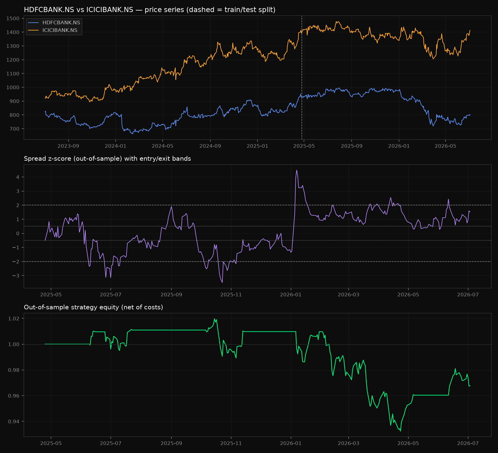

---

### AXISBANK.NS / ICICIBANK.NS

- **Latest prices:** AXISBANK.NS ₹1,355.40 · ICICIBANK.NS ₹1,412.50
- **Hedge ratio (train-fitted):** 0.8644
- **Cointegration (train):** FAIL at 5% — ADF -0.58, p=0.8744
- **Persistence:** passed 5% in 0 of 1 real-data runs (strict tier: 0/1)
- **Spread half-life:** 173.1 days
- **Current z-score:** +3.58
- **Signal today:** SHORT spread (short ICICIBANK.NS, long AXISBANK.NS)
- ⚠️ _Pair did not cointegrate on training data. Any signal here is not statistically justified — observation only._

**Out-of-sample backtest** (beta frozen from train window):

| Metric | Value |
|---|---|
| Sharpe | 0.33 |
| Sortino | 0.34 |
| Annualised return | 2.35% |
| Annualised vol | 8.13% |
| Max drawdown | -7.40% |
| Round-trip trades | 7 |

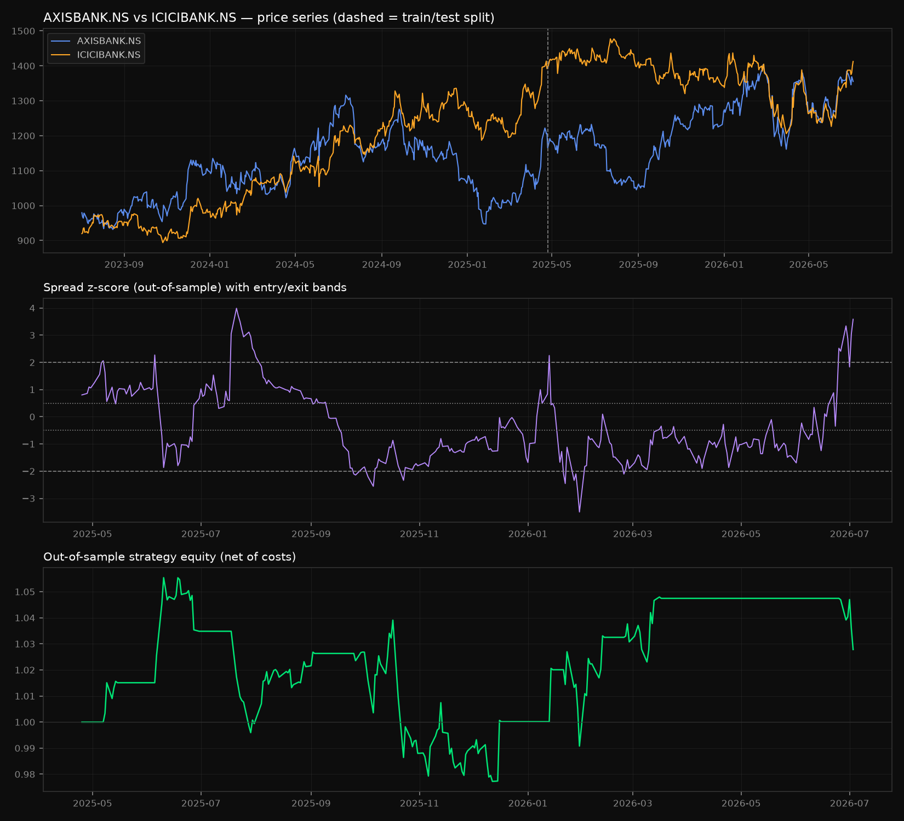

---

### KOTAKBANK.NS / HDFCBANK.NS

- **Latest prices:** KOTAKBANK.NS ₹396.85 · HDFCBANK.NS ₹804.00
- **Hedge ratio (train-fitted):** 1.7128
- **Cointegration (train):** FAIL at 5% — ADF -2.36, p=0.1533
- **Persistence:** passed 5% in 0 of 1 real-data runs (strict tier: 0/1)
- **Spread half-life:** 28.4 days
- **Current z-score:** +0.85
- **Signal today:** watch (approaching band)
- ⚠️ _Pair did not cointegrate on training data. Any signal here is not statistically justified — observation only._

**Out-of-sample backtest** (beta frozen from train window):

| Metric | Value |
|---|---|
| Sharpe | -0.24 |
| Sortino | -0.21 |
| Annualised return | -1.75% |
| Annualised vol | 6.43% |
| Max drawdown | -5.75% |
| Round-trip trades | 4 |

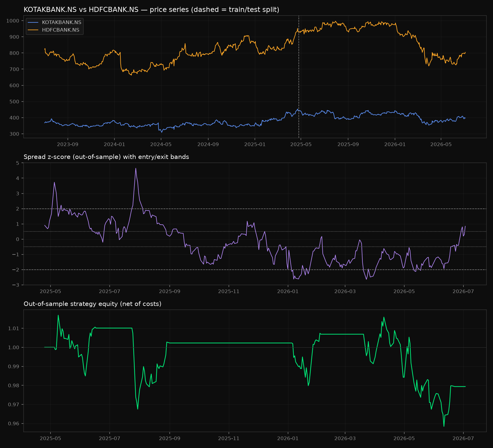

---

### SBIN.NS / BANKBARODA.NS

- **Latest prices:** SBIN.NS ₹1,045.70 · BANKBARODA.NS ₹251.15
- **Hedge ratio (train-fitted):** 0.2124
- **Cointegration (train):** FAIL at 5% — ADF -2.17, p=0.2160
- **Persistence:** passed 5% in 0 of 1 real-data runs (strict tier: 0/1)
- **Spread half-life:** 25.1 days
- **Current z-score:** -2.08
- **Signal today:** LONG spread (long BANKBARODA.NS, short SBIN.NS)
- ⚠️ _Pair did not cointegrate on training data. Any signal here is not statistically justified — observation only._

**Out-of-sample backtest** (beta frozen from train window):

| Metric | Value |
|---|---|
| Sharpe | 0.83 |
| Sortino | 0.62 |
| Annualised return | 7.67% |
| Annualised vol | 9.47% |
| Max drawdown | -9.19% |
| Round-trip trades | 6 |

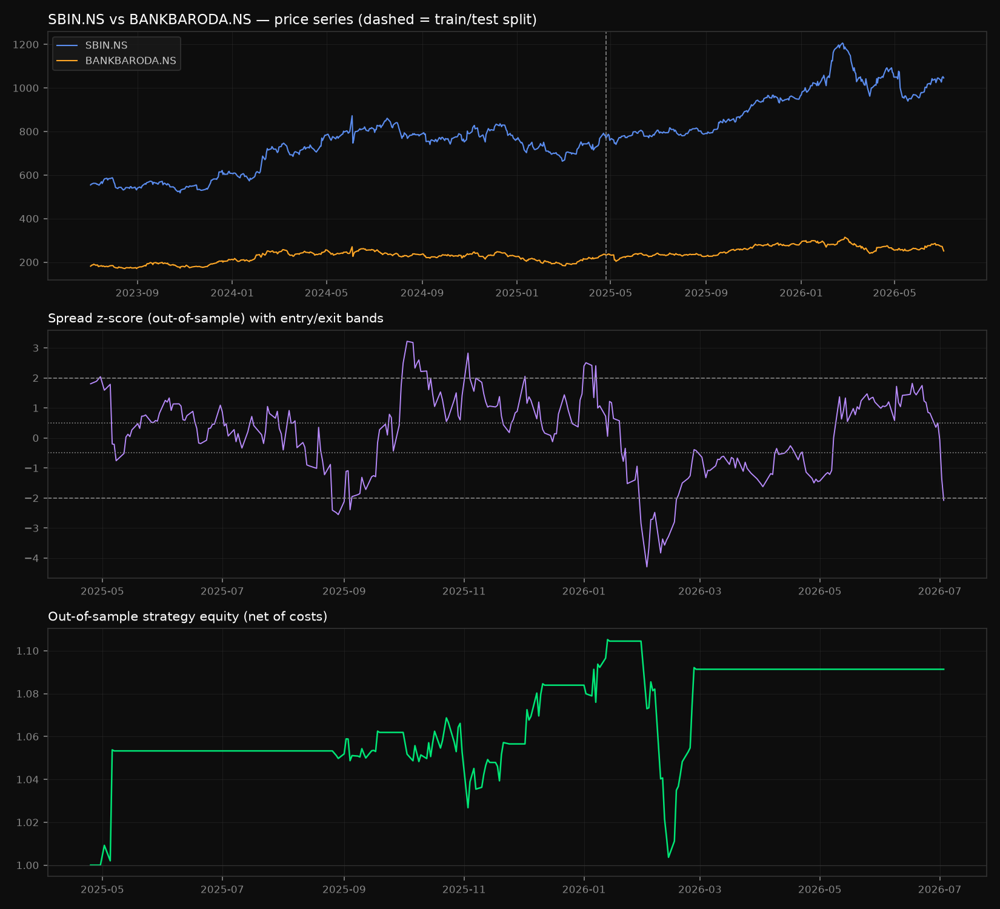

---

### TCS.NS / INFY.NS

- **Latest prices:** TCS.NS ₹2,107.10 · INFY.NS ₹1,056.40
- **Hedge ratio (train-fitted):** 0.5327
- **Cointegration (train):** FAIL at 5% — ADF -1.79, p=0.3835
- **Persistence:** passed 5% in 0 of 1 real-data runs (strict tier: 0/1)
- **Spread half-life:** 38.3 days
- **Current z-score:** +0.19
- **Signal today:** flat / no stretch
- ⚠️ _Pair did not cointegrate on training data. Any signal here is not statistically justified — observation only._

**Out-of-sample backtest** (beta frozen from train window):

| Metric | Value |
|---|---|
| Sharpe | 0.98 |
| Sortino | 0.87 |
| Annualised return | 4.18% |
| Annualised vol | 4.29% |
| Max drawdown | -4.39% |
| Round-trip trades | 6 |

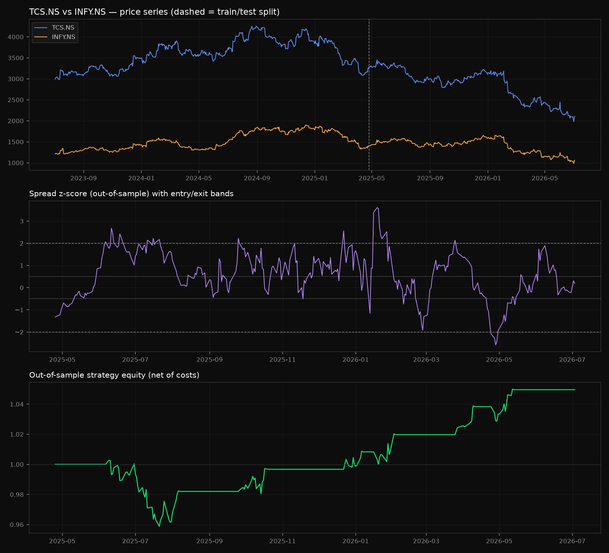

---

### INFY.NS / WIPRO.NS

- **Latest prices:** INFY.NS ₹1,056.20 · WIPRO.NS ₹177.46
- **Hedge ratio (train-fitted):** 0.1418
- **Cointegration (train):** FAIL at 5% — ADF -2.23, p=0.1941
- **Persistence:** passed 5% in 0 of 1 real-data runs (strict tier: 0/1)
- **Spread half-life:** 29.7 days
- **Current z-score:** -0.45
- **Signal today:** flat / no stretch
- ⚠️ _Pair did not cointegrate on training data. Any signal here is not statistically justified — observation only._

**Out-of-sample backtest** (beta frozen from train window):

| Metric | Value |
|---|---|
| Sharpe | 1.58 |
| Sortino | 2.15 |
| Annualised return | 9.46% |
| Annualised vol | 5.84% |
| Max drawdown | -2.68% |
| Round-trip trades | 7 |

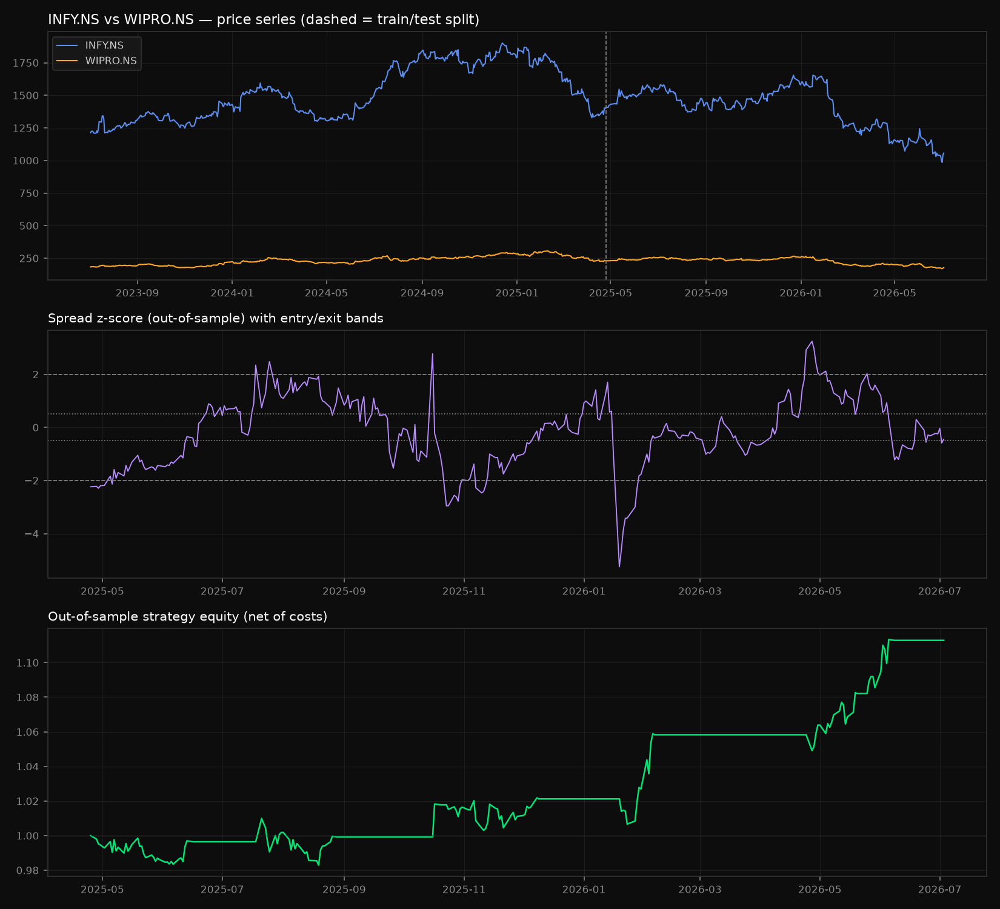

---

### HCLTECH.NS / TECHM.NS

- **Latest prices:** HCLTECH.NS ₹1,143.60 · TECHM.NS ₹1,438.90
- **Hedge ratio (train-fitted):** 0.7839
- **Cointegration (train):** FAIL at 5% — ADF -2.01, p=0.2816
- **Persistence:** passed 5% in 0 of 1 real-data runs (strict tier: 0/1)
- **Spread half-life:** 27.2 days
- **Current z-score:** +0.93
- **Signal today:** watch (approaching band)
- ⚠️ _Pair did not cointegrate on training data. Any signal here is not statistically justified — observation only._

**Out-of-sample backtest** (beta frozen from train window):

| Metric | Value |
|---|---|
| Sharpe | 0.22 |
| Sortino | 0.22 |
| Annualised return | 1.42% |
| Annualised vol | 7.65% |
| Max drawdown | -7.12% |
| Round-trip trades | 5 |

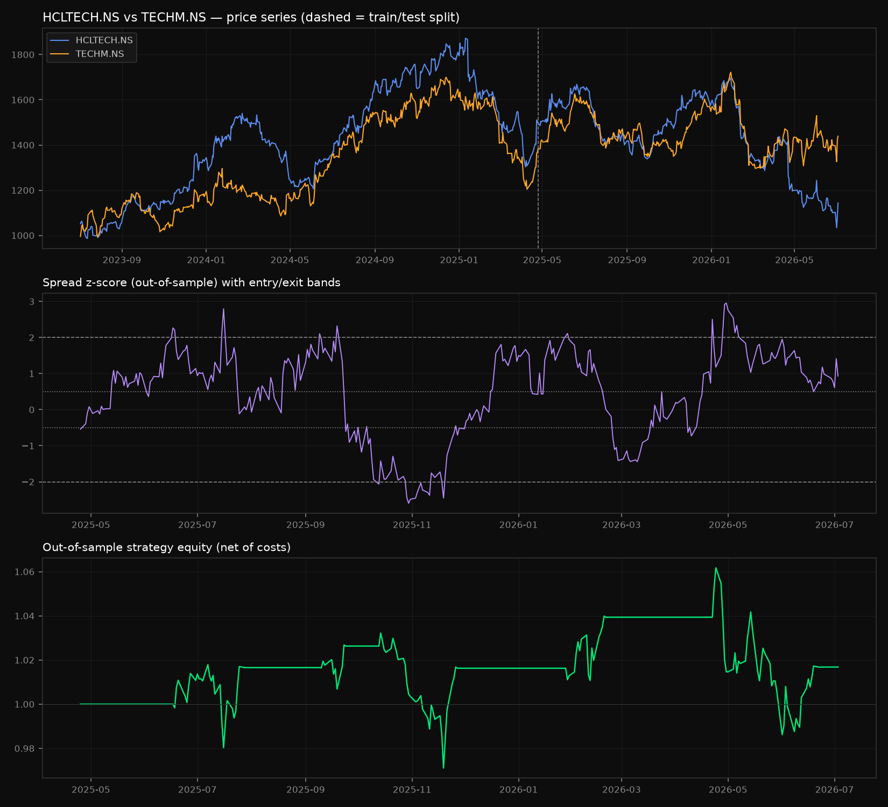

---

### ACC.NS / AMBUJACEM.NS

- **Latest prices:** ACC.NS ₹1,380.00 · AMBUJACEM.NS ₹436.95
- **Hedge ratio (train-fitted):** 0.2545
- **Cointegration (train):** FAIL at 5% — ADF -1.19, p=0.6774
- **Persistence:** passed 5% in 0 of 1 real-data runs (strict tier: 0/1)
- **Spread half-life:** 61.2 days
- **Current z-score:** -0.09
- **Signal today:** flat / no stretch
- ⚠️ _Pair did not cointegrate on training data. Any signal here is not statistically justified — observation only._

**Out-of-sample backtest** (beta frozen from train window):

| Metric | Value |
|---|---|
| Sharpe | 0.44 |
| Sortino | 0.48 |
| Annualised return | 2.52% |
| Annualised vol | 6.03% |
| Max drawdown | -6.76% |
| Round-trip trades | 5 |

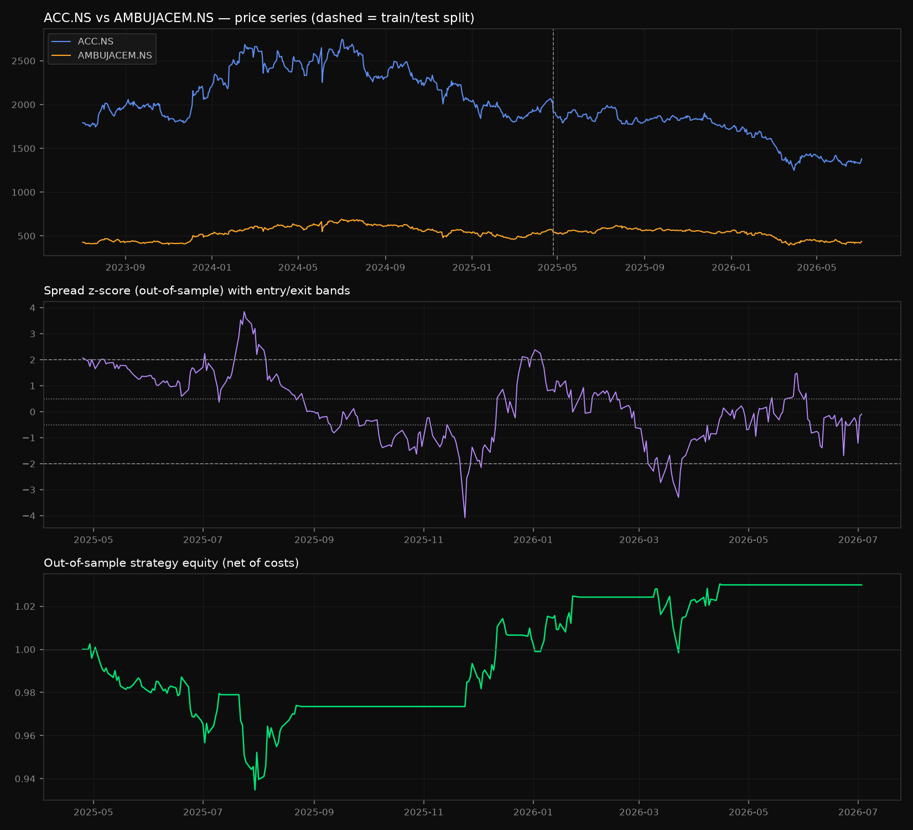

---

### ULTRACEMCO.NS / SHREECEM.NS

- **Latest prices:** ULTRACEMCO.NS ₹11,704.00 · SHREECEM.NS ₹26,760.00
- **Hedge ratio (train-fitted):** 0.5770
- **Cointegration (train):** FAIL at 5% — ADF -2.40, p=0.1407
- **Persistence:** passed 5% in 0 of 1 real-data runs (strict tier: 0/1)
- **Spread half-life:** 29.7 days
- **Current z-score:** +3.12
- **Signal today:** SHORT spread (short SHREECEM.NS, long ULTRACEMCO.NS)
- ⚠️ _Pair did not cointegrate on training data. Any signal here is not statistically justified — observation only._

**Out-of-sample backtest** (beta frozen from train window):

| Metric | Value |
|---|---|
| Sharpe | 0.30 |
| Sortino | 0.28 |
| Annualised return | 1.99% |
| Annualised vol | 7.60% |
| Max drawdown | -9.08% |
| Round-trip trades | 5 |

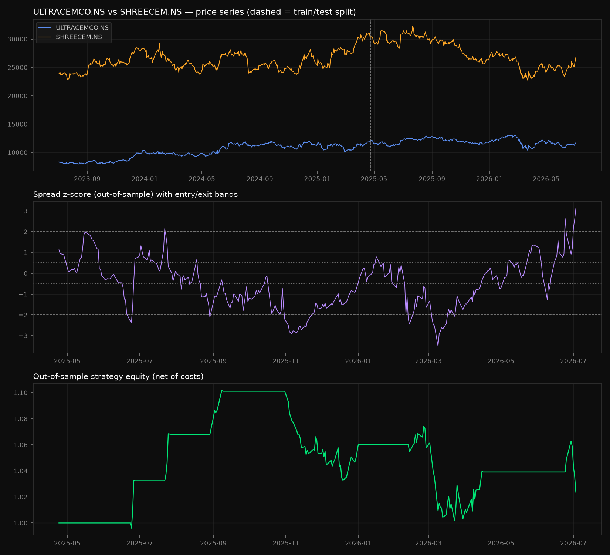

---

### IOC.NS / BPCL.NS

- **Latest prices:** IOC.NS ₹141.41 · BPCL.NS ₹308.75
- **Hedge ratio (train-fitted):** 1.7625
- **Cointegration (train):** FAIL at 5% — ADF -0.95, p=0.7716
- **Persistence:** passed 5% in 0 of 1 real-data runs (strict tier: 0/1)
- **Spread half-life:** 108.2 days
- **Current z-score:** +1.71
- **Signal today:** watch (approaching band)
- ⚠️ _Pair did not cointegrate on training data. Any signal here is not statistically justified — observation only._

**Out-of-sample backtest** (beta frozen from train window):

| Metric | Value |
|---|---|
| Sharpe | 0.62 |
| Sortino | 0.71 |
| Annualised return | 4.47% |
| Annualised vol | 7.56% |
| Max drawdown | -7.19% |
| Round-trip trades | 7 |

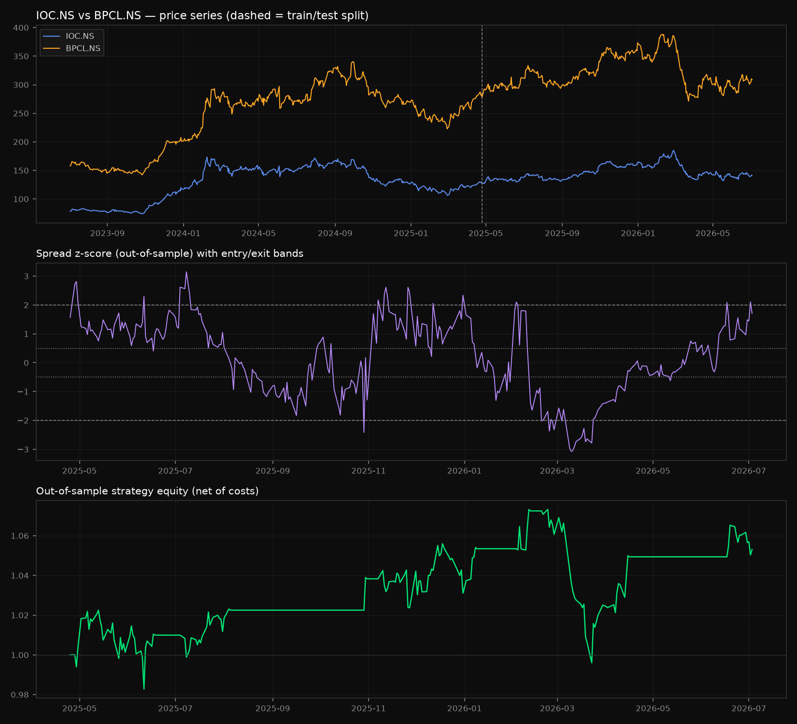

---

### BPCL.NS / HINDPETRO.NS

- **Latest prices:** BPCL.NS ₹308.75 · HINDPETRO.NS ₹398.90
- **Hedge ratio (train-fitted):** 1.4234
- **Cointegration (train):** FAIL at 5% — ADF -1.83, p=0.3634
- **Persistence:** passed 5% in 0 of 1 real-data runs (strict tier: 0/1)
- **Spread half-life:** 43.5 days
- **Current z-score:** +0.36
- **Signal today:** flat / no stretch
- ⚠️ _Pair did not cointegrate on training data. Any signal here is not statistically justified — observation only._

**Out-of-sample backtest** (beta frozen from train window):

| Metric | Value |
|---|---|
| Sharpe | 0.21 |
| Sortino | 0.18 |
| Annualised return | 1.14% |
| Annualised vol | 6.34% |
| Max drawdown | -7.38% |
| Round-trip trades | 5 |

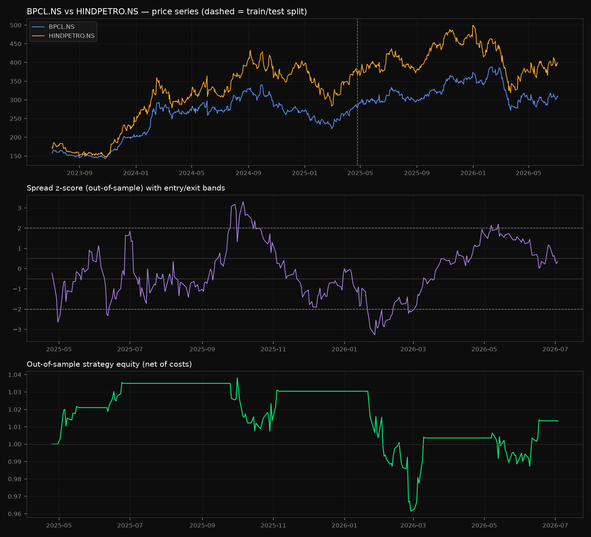

---

### ONGC.NS / COALINDIA.NS

- **Latest prices:** ONGC.NS ₹238.16 · COALINDIA.NS ₹443.00
- **Hedge ratio (train-fitted):** 1.7421
- **Cointegration (train):** FAIL at 5% — ADF -2.78, p=0.0606
- **Persistence:** passed 5% in 0 of 1 real-data runs (strict tier: 0/1)
- **Spread half-life:** 16.9 days
- **Current z-score:** +1.32
- **Signal today:** watch (approaching band)
- ⚠️ _Pair did not cointegrate on training data. Any signal here is not statistically justified — observation only._

**Out-of-sample backtest** (beta frozen from train window):

| Metric | Value |
|---|---|
| Sharpe | 0.79 |
| Sortino | 0.73 |
| Annualised return | 6.38% |
| Annualised vol | 8.24% |
| Max drawdown | -6.00% |
| Round-trip trades | 5 |

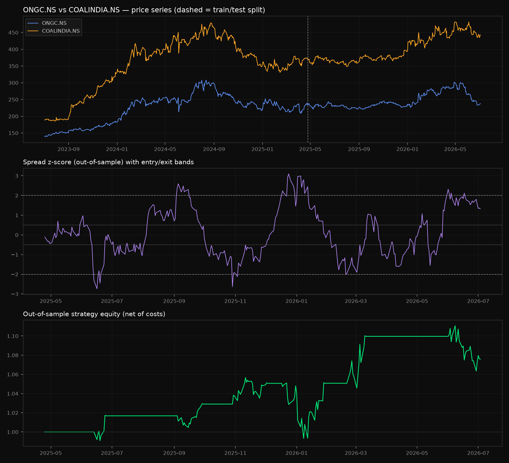

---

### NTPC.NS / POWERGRID.NS

- **Latest prices:** NTPC.NS ₹358.35 · POWERGRID.NS ₹289.65
- **Hedge ratio (train-fitted):** 0.8049
- **Cointegration (train):** FAIL at 5% — ADF -2.65, p=0.0823
- **Persistence:** passed 5% in 0 of 1 real-data runs (strict tier: 0/1)
- **Spread half-life:** 22.6 days
- **Current z-score:** +1.04
- **Signal today:** watch (approaching band)
- ⚠️ _Pair did not cointegrate on training data. Any signal here is not statistically justified — observation only._

**Out-of-sample backtest** (beta frozen from train window):

| Metric | Value |
|---|---|
| Sharpe | 0.82 |
| Sortino | 0.70 |
| Annualised return | 4.48% |
| Annualised vol | 5.50% |
| Max drawdown | -4.98% |
| Round-trip trades | 7 |

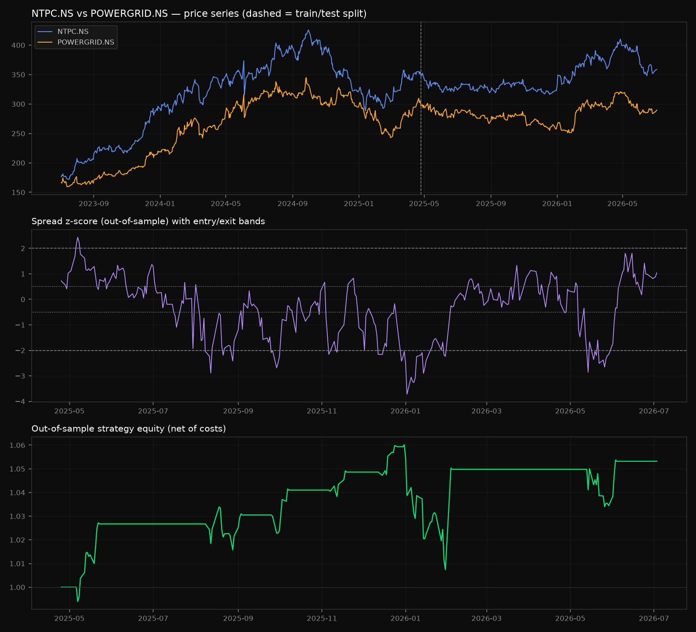

---

### BAJAJ-AUTO.NS / HEROMOTOCO.NS

- **Latest prices:** BAJAJ-AUTO.NS ₹9,835.00 · HEROMOTOCO.NS ₹4,866.80
- **Hedge ratio (train-fitted):** 0.4108
- **Cointegration (train):** FAIL at 5% — ADF -2.19, p=0.2096
- **Persistence:** passed 5% in 0 of 1 real-data runs (strict tier: 0/1)
- **Spread half-life:** 30.9 days
- **Current z-score:** -0.35
- **Signal today:** flat / no stretch
- ⚠️ _Pair did not cointegrate on training data. Any signal here is not statistically justified — observation only._

**Out-of-sample backtest** (beta frozen from train window):

| Metric | Value |
|---|---|
| Sharpe | -1.41 |
| Sortino | -1.46 |
| Annualised return | -15.47% |
| Annualised vol | 11.43% |
| Max drawdown | -22.58% |
| Round-trip trades | 4 |

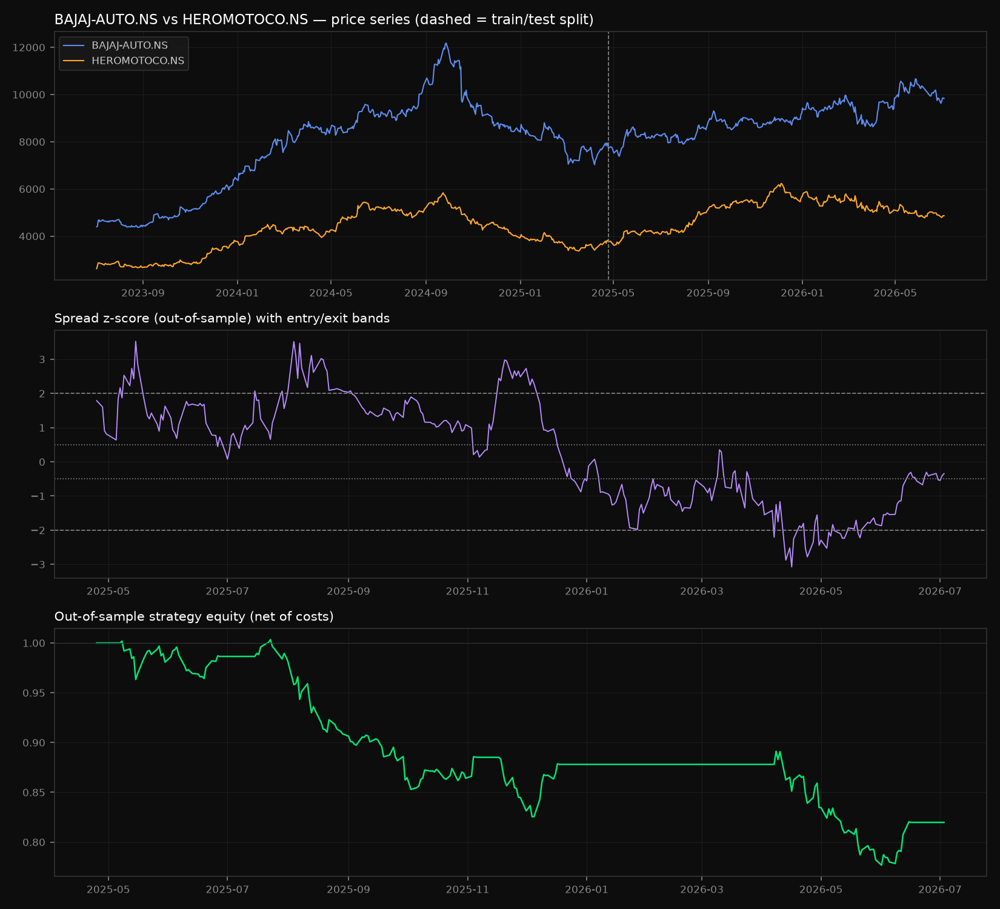

---

### TATASTEEL.NS / JSWSTEEL.NS

- **Latest prices:** TATASTEEL.NS ₹190.87 · JSWSTEEL.NS ₹1,233.60
- **Hedge ratio (train-fitted):** 3.0254
- **Cointegration (train):** FAIL at 5% — ADF 0.16, p=0.9697
- **Persistence:** passed 5% in 0 of 1 real-data runs (strict tier: 0/1)
- **Spread half-life:** 220.9 days
- **Current z-score:** +0.08
- **Signal today:** flat / no stretch
- ⚠️ _Pair did not cointegrate on training data. Any signal here is not statistically justified — observation only._

**Out-of-sample backtest** (beta frozen from train window):

| Metric | Value |
|---|---|
| Sharpe | 0.57 |
| Sortino | 0.51 |
| Annualised return | 5.06% |
| Annualised vol | 9.35% |
| Max drawdown | -6.60% |
| Round-trip trades | 5 |

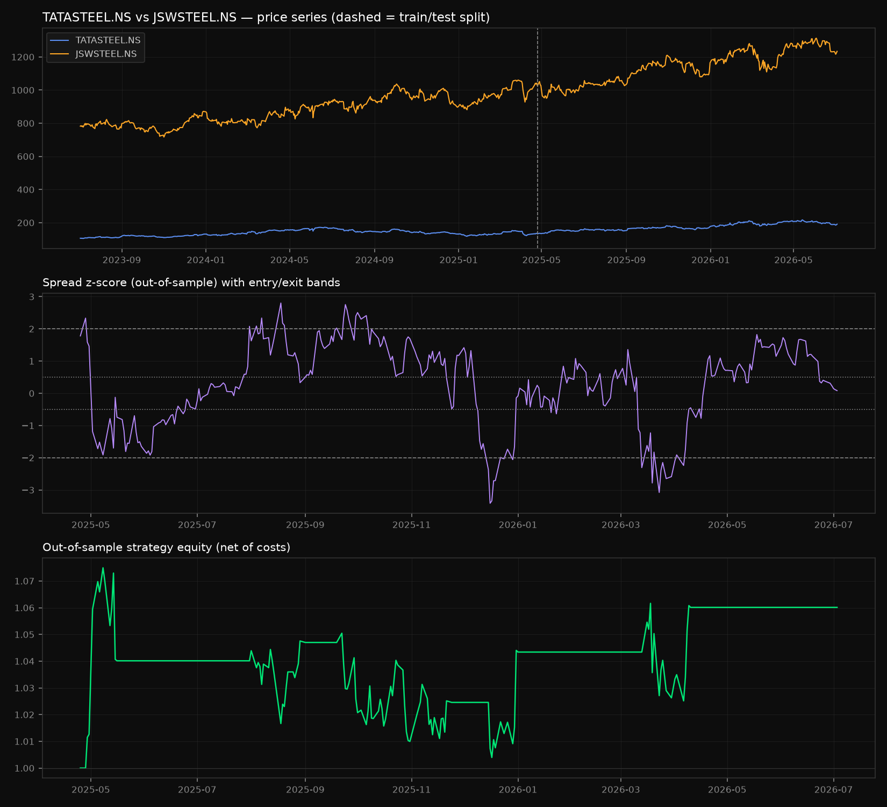

---

### SUNPHARMA.NS / CIPLA.NS

- **Latest prices:** SUNPHARMA.NS ₹1,920.50 · CIPLA.NS ₹1,460.20
- **Hedge ratio (train-fitted):** 0.5317
- **Cointegration (train):** PASS at 5% — ADF -3.52, p=0.0074
- **Persistence:** passed 5% in 1 of 1 real-data runs (strict tier: 0/1)
- **Spread half-life:** 12.1 days
- **Current z-score:** +0.95
- **Signal today:** watch (approaching band)

**Out-of-sample backtest** (beta frozen from train window):

| Metric | Value |
|---|---|
| Sharpe | -0.44 |
| Sortino | -0.45 |
| Annualised return | -3.12% |
| Annualised vol | 6.76% |
| Max drawdown | -9.87% |
| Round-trip trades | 5 |

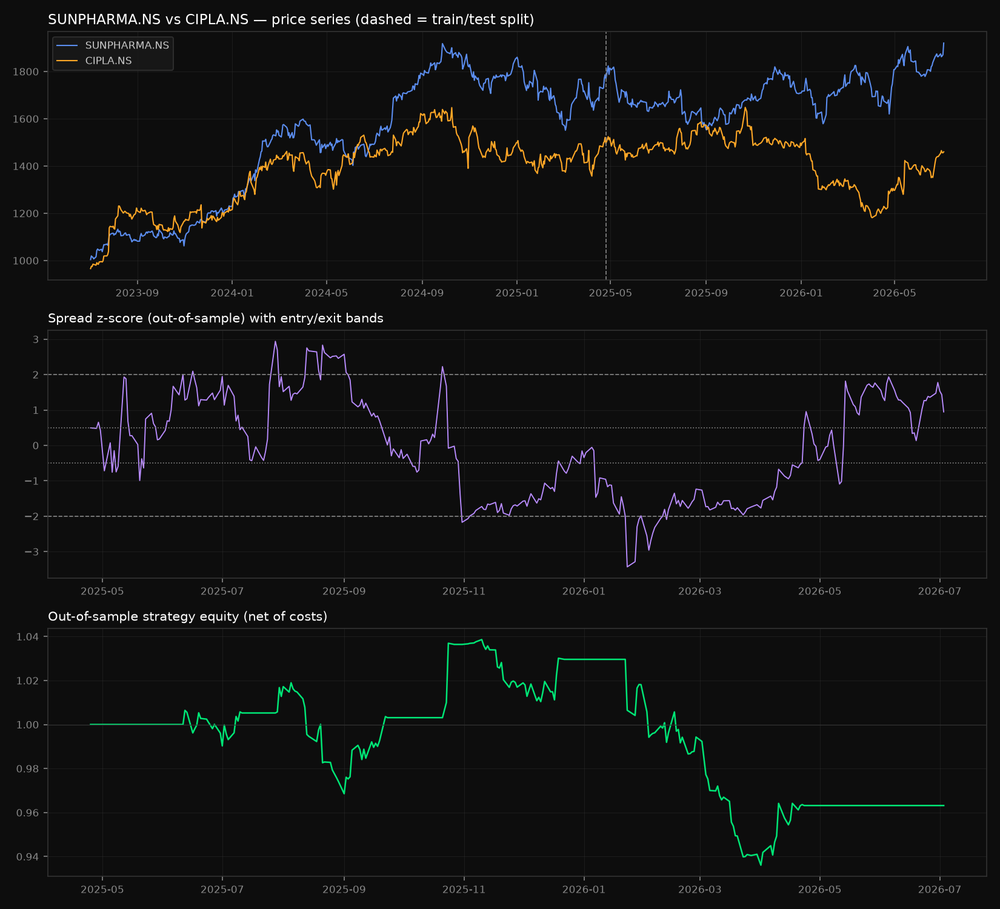

---

_Generated 2026-07-03 · pairs mean-reversion scanner · out-of-sample backtest · multiple-testing-aware · not investment advice._
