# Indian Pairs-Trading Scanner — 2026-07-04

> **What this is:** a market-neutral *pairs mean-reversion* scanner. It flags when two related NSE stocks have drifted apart far enough that their historical relationship signals a possible convergence trade. It does **not** forecast growth, rank "best" stocks, or predict company performance. A signal means the *spread between two stocks* is stretched — nothing about either stock being a good investment. Not investment advice; do your own research.

## Methodology (fixed in advance)

- **Universe:** 16 declared sector-mate pairs. Parameters (3y window, 60/40 train-test, z-entry 2.0, z-exit 0.5, 5 bps costs) are pre-registered; changes are logged in the README changelog *before* looking at results.
- **Multiple testing:** at the 5% level across 16 pairs, **≈0.8 false positives per run are expected by chance alone** even if nothing truly cointegrates. A single-day pass is a candidate, not a discovery.
- **Strict tier:** Bonferroni-corrected threshold p < 0.0031 (marked ✓✓).
- **Evidence = persistence:** the Persistence column counts how often each pair has passed the 5% test across all *real-data* daily runs recorded in `reports/history.csv`. Pairs deserve attention only when they pass persistently.

## Summary

| Pair | p-value | Coint. | Persistence | Current z | Signal | OOS Sharpe |
|---|---|---|---|---|---|---|
| HDFCBANK.NS/ICICIBANK.NS | 0.1478 | ✗ | 0/2 | +1.63 | watch | -0.45 |
| AXISBANK.NS/ICICIBANK.NS | 0.8744 | ✗ | 0/2 | +3.96 | SHORT spread | 0.28 |
| KOTAKBANK.NS/HDFCBANK.NS | 0.1533 | ✗ | 0/2 | +0.73 | watch | -0.24 |
| SBIN.NS/BANKBARODA.NS | 0.2160 | ✗ | 0/2 | -1.86 | watch | 0.83 |
| TCS.NS/INFY.NS | 0.3835 | ✗ | 0/2 | +0.14 | flat / no stretch | 0.98 |
| INFY.NS/WIPRO.NS | 0.1941 | ✗ | 0/2 | -0.46 | flat / no stretch | 1.58 |
| HCLTECH.NS/TECHM.NS | 0.2816 | ✗ | 0/2 | +0.56 | watch | 0.22 |
| ACC.NS/AMBUJACEM.NS | 0.6774 | ✗ | 0/2 | +0.47 | flat / no stretch | 0.44 |
| ULTRACEMCO.NS/SHREECEM.NS | 0.1607 | ✗ | 0/2 | +3.07 | SHORT spread | 0.30 |
| IOC.NS/BPCL.NS | 0.7716 | ✗ | 0/2 | +1.52 | watch | 0.64 |
| BPCL.NS/HINDPETRO.NS | 0.3634 | ✗ | 0/2 | +0.45 | flat / no stretch | 0.21 |
| ONGC.NS/COALINDIA.NS | 0.0606 | ✗ | 0/2 | +1.22 | watch | 0.84 |
| NTPC.NS/POWERGRID.NS | 0.0823 | ✗ | 0/2 | +1.00 | watch | 0.82 |
| BAJAJ-AUTO.NS/HEROMOTOCO.NS | 0.2096 | ✗ | 0/2 | -0.32 | flat / no stretch | -1.41 |
| TATASTEEL.NS/JSWSTEEL.NS | 0.9697 | ✗ | 0/2 | +0.08 | flat / no stretch | 0.57 |
| SUNPHARMA.NS/CIPLA.NS | 0.0074 | ✓ | 2/2 | +1.08 | watch | -0.44 |

_Legend: ✓✓ passes strict Bonferroni tier · ✓ passes 5% only · ✗ fails. Persistence = 5%-passes / real-data runs recorded. \*no real-data history yet._

---

### HDFCBANK.NS / ICICIBANK.NS

- **Latest prices:** HDFCBANK.NS ₹801.05 · ICICIBANK.NS ₹1,411.40
- **Hedge ratio (train-fitted):** 1.6734
- **Cointegration (train):** FAIL at 5% — ADF -2.38, p=0.1478
- **Persistence:** passed 5% in 0 of 2 real-data runs (strict tier: 0/2)
- **Spread half-life:** 30.9 days
- **Current z-score:** +1.63
- **Signal today:** watch (approaching band)
- ⚠️ _Pair did not cointegrate on training data. Any signal here is not statistically justified — observation only._

**Out-of-sample backtest** (beta frozen from train window):

| Metric | Value |
|---|---|
| Sharpe | -0.45 |
| Sortino | -0.45 |
| Annualised return | -2.84% |
| Annualised vol | 5.98% |
| Max drawdown | -8.57% |
| Round-trip trades | 4 |

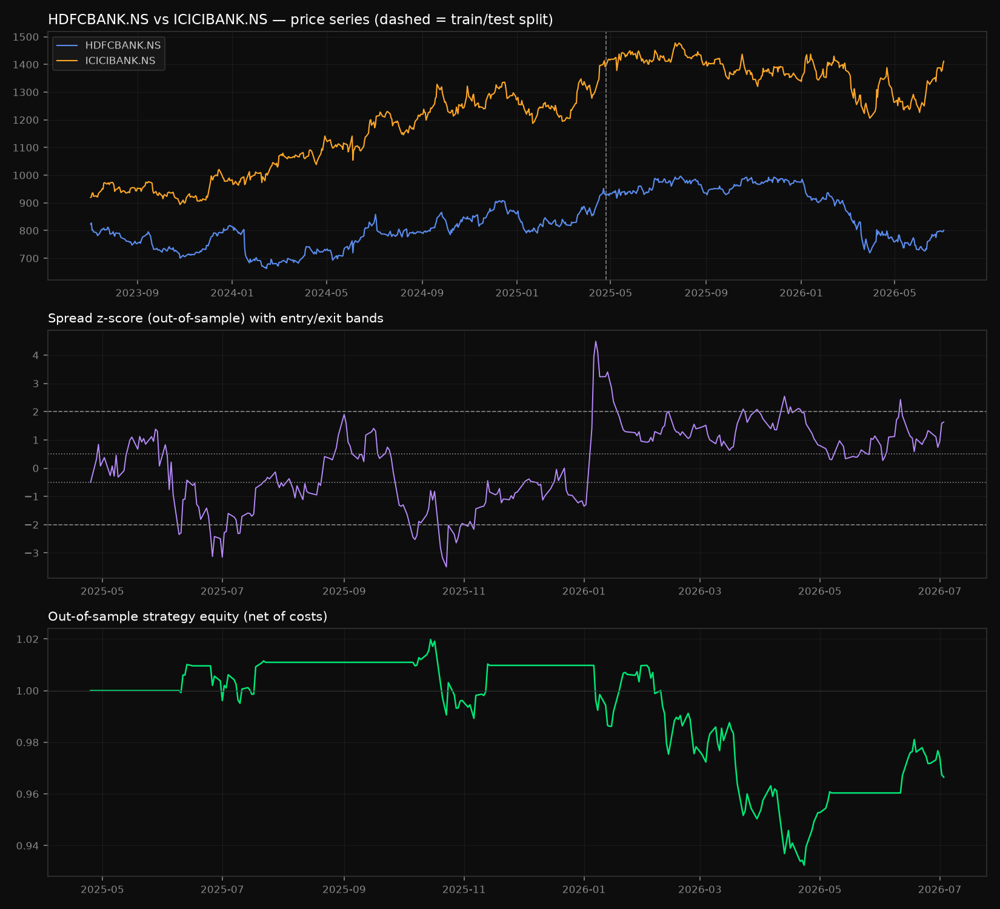

---

### AXISBANK.NS / ICICIBANK.NS

- **Latest prices:** AXISBANK.NS ₹1,342.10 · ICICIBANK.NS ₹1,411.40
- **Hedge ratio (train-fitted):** 0.8644
- **Cointegration (train):** FAIL at 5% — ADF -0.58, p=0.8744
- **Persistence:** passed 5% in 0 of 2 real-data runs (strict tier: 0/2)
- **Spread half-life:** 173.1 days
- **Current z-score:** +3.96
- **Signal today:** SHORT spread (short ICICIBANK.NS, long AXISBANK.NS)
- ⚠️ _Pair did not cointegrate on training data. Any signal here is not statistically justified — observation only._

**Out-of-sample backtest** (beta frozen from train window):

| Metric | Value |
|---|---|
| Sharpe | 0.28 |
| Sortino | 0.29 |
| Annualised return | 1.97% |
| Annualised vol | 8.17% |
| Max drawdown | -7.40% |
| Round-trip trades | 7 |

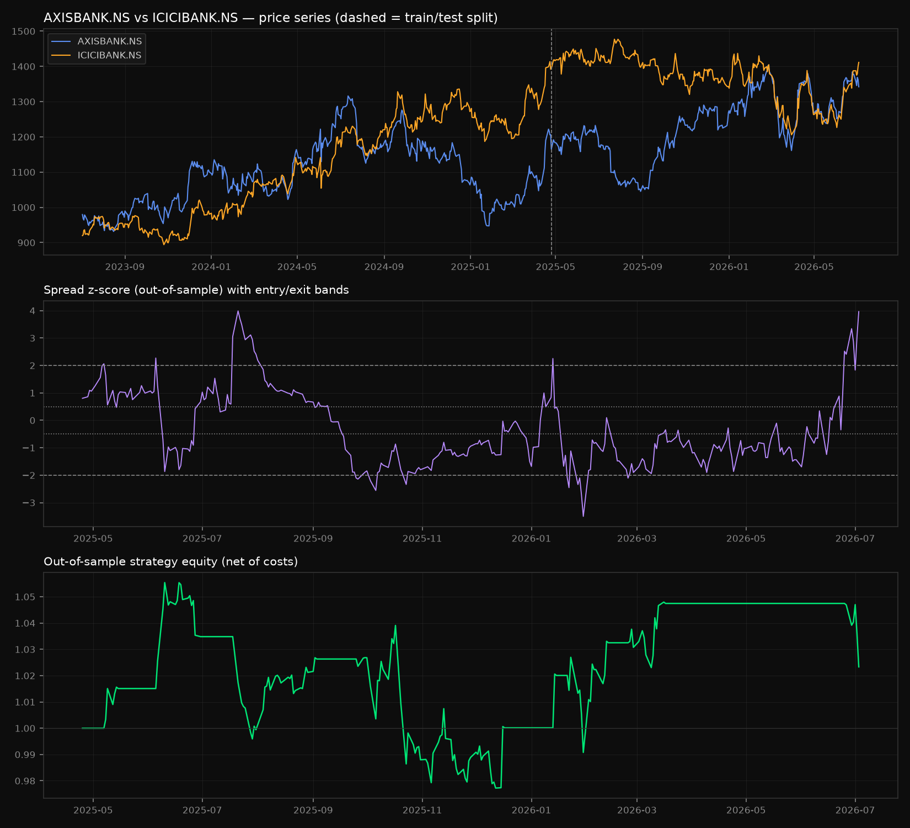

---

### KOTAKBANK.NS / HDFCBANK.NS

- **Latest prices:** KOTAKBANK.NS ₹396.75 · HDFCBANK.NS ₹801.05
- **Hedge ratio (train-fitted):** 1.7128
- **Cointegration (train):** FAIL at 5% — ADF -2.36, p=0.1533
- **Persistence:** passed 5% in 0 of 2 real-data runs (strict tier: 0/2)
- **Spread half-life:** 28.4 days
- **Current z-score:** +0.73
- **Signal today:** watch (approaching band)
- ⚠️ _Pair did not cointegrate on training data. Any signal here is not statistically justified — observation only._

**Out-of-sample backtest** (beta frozen from train window):

| Metric | Value |
|---|---|
| Sharpe | -0.24 |
| Sortino | -0.21 |
| Annualised return | -1.75% |
| Annualised vol | 6.43% |
| Max drawdown | -5.75% |
| Round-trip trades | 4 |

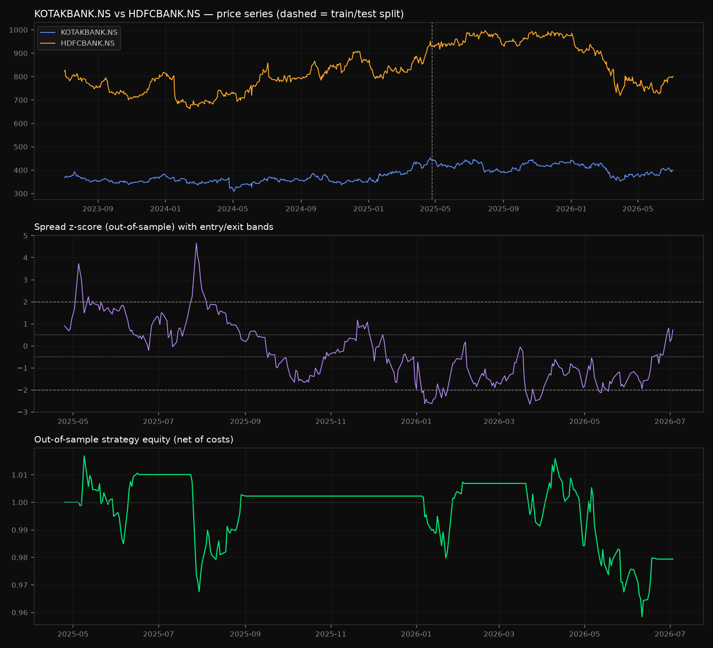

---

### SBIN.NS / BANKBARODA.NS

- **Latest prices:** SBIN.NS ₹1,040.00 · BANKBARODA.NS ₹252.20
- **Hedge ratio (train-fitted):** 0.2124
- **Cointegration (train):** FAIL at 5% — ADF -2.17, p=0.2160
- **Persistence:** passed 5% in 0 of 2 real-data runs (strict tier: 0/2)
- **Spread half-life:** 25.1 days
- **Current z-score:** -1.86
- **Signal today:** watch (approaching band)
- ⚠️ _Pair did not cointegrate on training data. Any signal here is not statistically justified — observation only._

**Out-of-sample backtest** (beta frozen from train window):

| Metric | Value |
|---|---|
| Sharpe | 0.83 |
| Sortino | 0.62 |
| Annualised return | 7.67% |
| Annualised vol | 9.47% |
| Max drawdown | -9.19% |
| Round-trip trades | 6 |

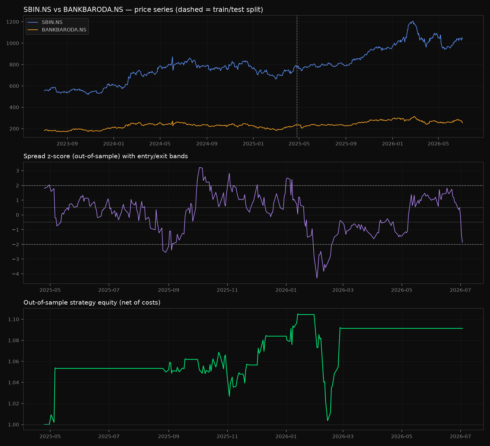

---

### TCS.NS / INFY.NS

- **Latest prices:** TCS.NS ₹2,093.50 · INFY.NS ₹1,047.20
- **Hedge ratio (train-fitted):** 0.5327
- **Cointegration (train):** FAIL at 5% — ADF -1.79, p=0.3835
- **Persistence:** passed 5% in 0 of 2 real-data runs (strict tier: 0/2)
- **Spread half-life:** 38.3 days
- **Current z-score:** +0.14
- **Signal today:** flat / no stretch
- ⚠️ _Pair did not cointegrate on training data. Any signal here is not statistically justified — observation only._

**Out-of-sample backtest** (beta frozen from train window):

| Metric | Value |
|---|---|
| Sharpe | 0.98 |
| Sortino | 0.87 |
| Annualised return | 4.18% |
| Annualised vol | 4.29% |
| Max drawdown | -4.39% |
| Round-trip trades | 6 |

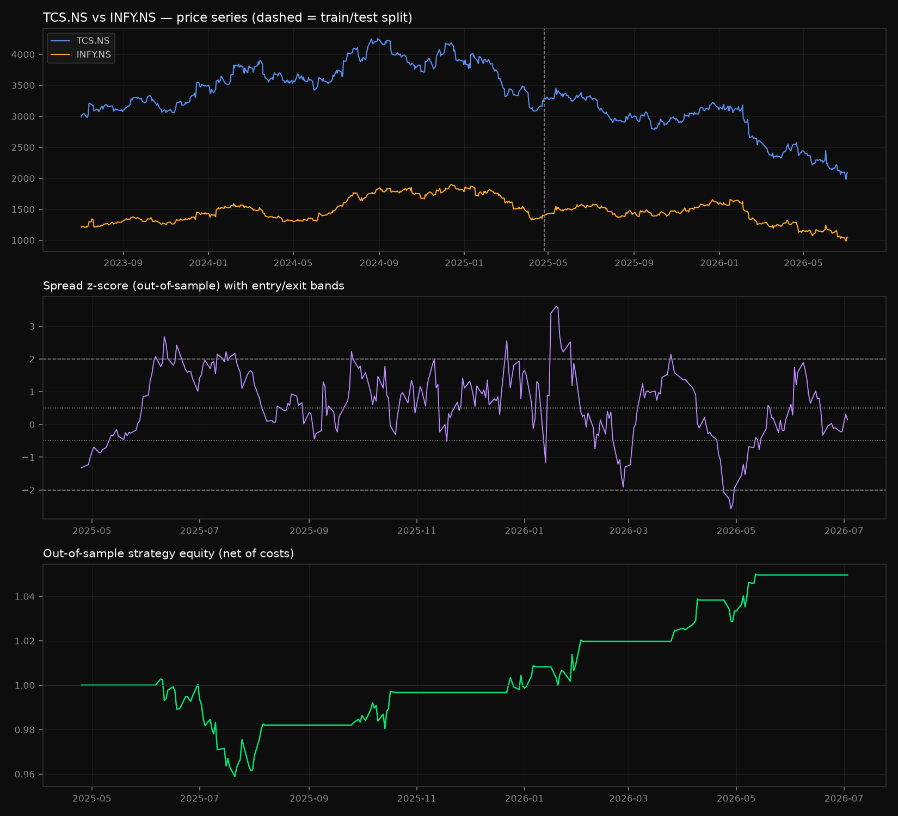

---

### INFY.NS / WIPRO.NS

- **Latest prices:** INFY.NS ₹1,047.20 · WIPRO.NS ₹176.08
- **Hedge ratio (train-fitted):** 0.1418
- **Cointegration (train):** FAIL at 5% — ADF -2.23, p=0.1941
- **Persistence:** passed 5% in 0 of 2 real-data runs (strict tier: 0/2)
- **Spread half-life:** 29.7 days
- **Current z-score:** -0.46
- **Signal today:** flat / no stretch
- ⚠️ _Pair did not cointegrate on training data. Any signal here is not statistically justified — observation only._

**Out-of-sample backtest** (beta frozen from train window):

| Metric | Value |
|---|---|
| Sharpe | 1.58 |
| Sortino | 2.15 |
| Annualised return | 9.46% |
| Annualised vol | 5.84% |
| Max drawdown | -2.68% |
| Round-trip trades | 7 |

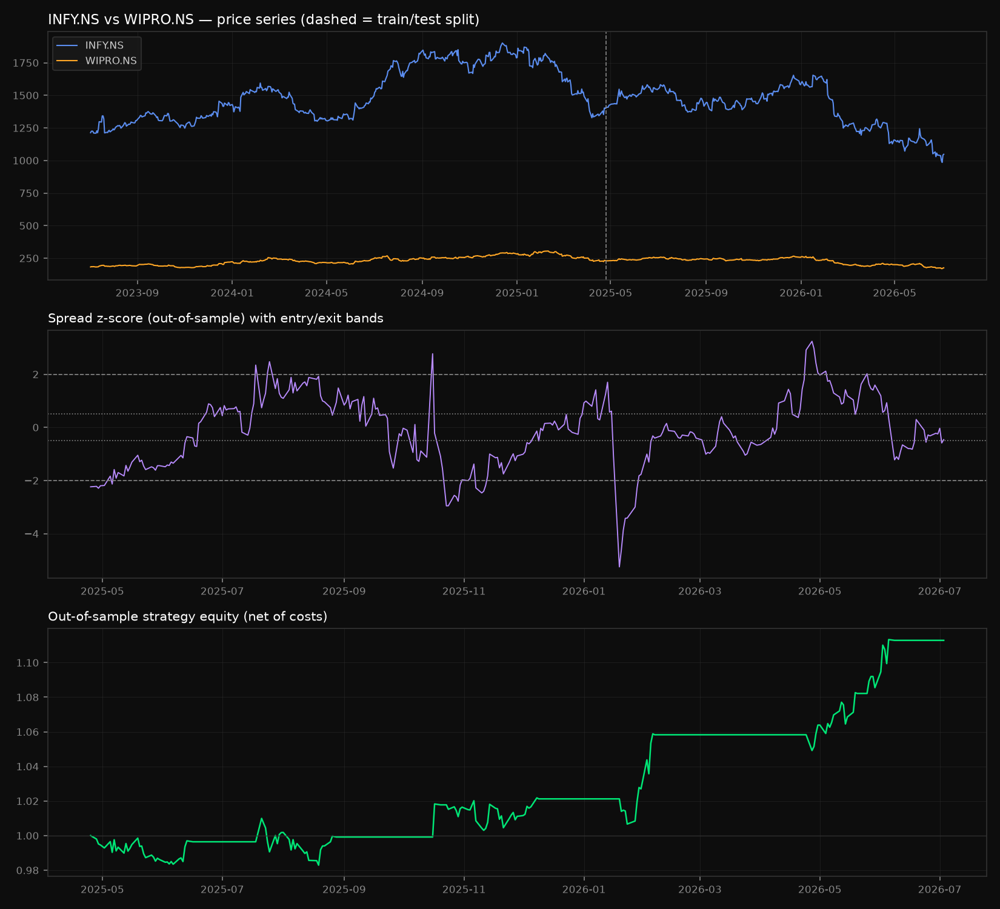

---

### HCLTECH.NS / TECHM.NS

- **Latest prices:** HCLTECH.NS ₹1,139.00 · TECHM.NS ₹1,410.10
- **Hedge ratio (train-fitted):** 0.7848
- **Cointegration (train):** FAIL at 5% — ADF -2.01, p=0.2816
- **Persistence:** passed 5% in 0 of 2 real-data runs (strict tier: 0/2)
- **Spread half-life:** 27.2 days
- **Current z-score:** +0.56
- **Signal today:** watch (approaching band)
- ⚠️ _Pair did not cointegrate on training data. Any signal here is not statistically justified — observation only._

**Out-of-sample backtest** (beta frozen from train window):

| Metric | Value |
|---|---|
| Sharpe | 0.22 |
| Sortino | 0.22 |
| Annualised return | 1.42% |
| Annualised vol | 7.65% |
| Max drawdown | -7.12% |
| Round-trip trades | 5 |

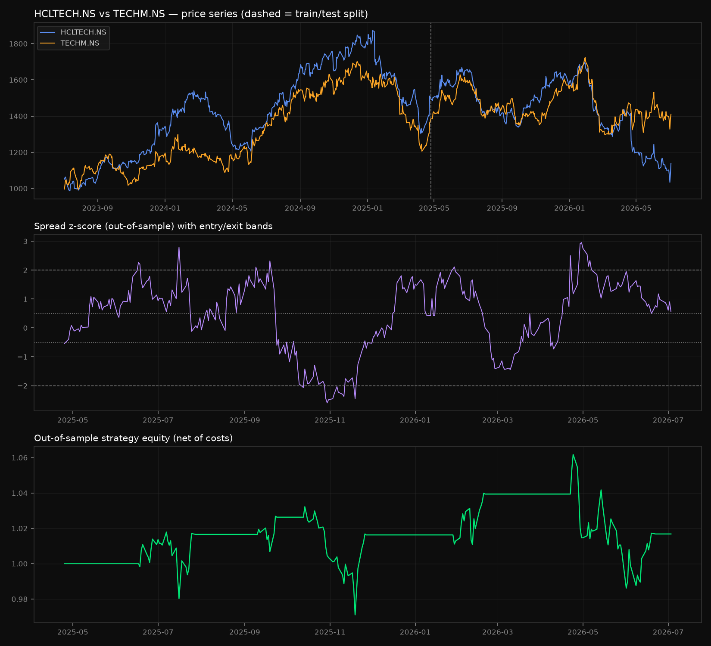

---

### ACC.NS / AMBUJACEM.NS

- **Latest prices:** ACC.NS ₹1,393.80 · AMBUJACEM.NS ₹443.40
- **Hedge ratio (train-fitted):** 0.2545
- **Cointegration (train):** FAIL at 5% — ADF -1.19, p=0.6774
- **Persistence:** passed 5% in 0 of 2 real-data runs (strict tier: 0/2)
- **Spread half-life:** 61.2 days
- **Current z-score:** +0.47
- **Signal today:** flat / no stretch
- ⚠️ _Pair did not cointegrate on training data. Any signal here is not statistically justified — observation only._

**Out-of-sample backtest** (beta frozen from train window):

| Metric | Value |
|---|---|
| Sharpe | 0.44 |
| Sortino | 0.48 |
| Annualised return | 2.52% |
| Annualised vol | 6.03% |
| Max drawdown | -6.76% |
| Round-trip trades | 5 |

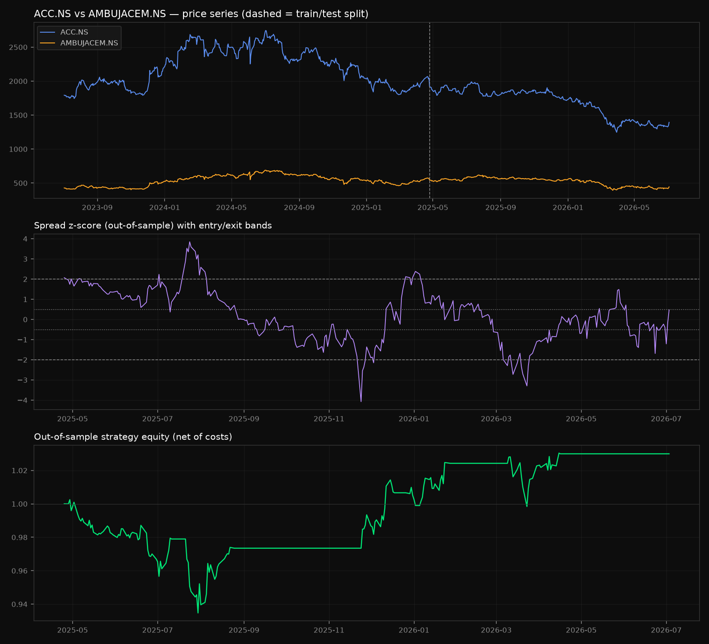

---

### ULTRACEMCO.NS / SHREECEM.NS

- **Latest prices:** ULTRACEMCO.NS ₹11,723.00 · SHREECEM.NS ₹26,765.00
- **Hedge ratio (train-fitted):** 0.5864
- **Cointegration (train):** FAIL at 5% — ADF -2.34, p=0.1607
- **Persistence:** passed 5% in 0 of 2 real-data runs (strict tier: 0/2)
- **Spread half-life:** 31.0 days
- **Current z-score:** +3.07
- **Signal today:** SHORT spread (short SHREECEM.NS, long ULTRACEMCO.NS)
- ⚠️ _Pair did not cointegrate on training data. Any signal here is not statistically justified — observation only._

**Out-of-sample backtest** (beta frozen from train window):

| Metric | Value |
|---|---|
| Sharpe | 0.30 |
| Sortino | 0.29 |
| Annualised return | 2.03% |
| Annualised vol | 7.57% |
| Max drawdown | -9.01% |
| Round-trip trades | 5 |

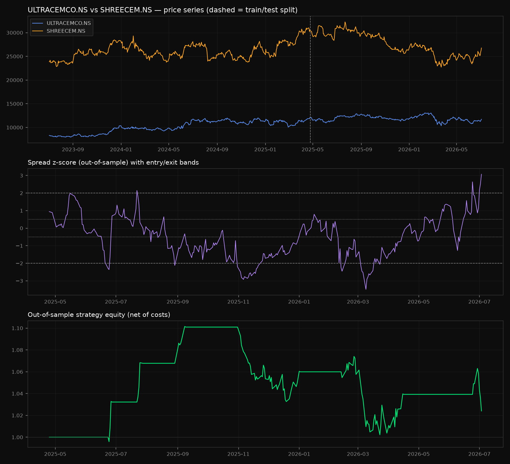

---

### IOC.NS / BPCL.NS

- **Latest prices:** IOC.NS ₹141.56 · BPCL.NS ₹308.15
- **Hedge ratio (train-fitted):** 1.7625
- **Cointegration (train):** FAIL at 5% — ADF -0.95, p=0.7716
- **Persistence:** passed 5% in 0 of 2 real-data runs (strict tier: 0/2)
- **Spread half-life:** 108.2 days
- **Current z-score:** +1.52
- **Signal today:** watch (approaching band)
- ⚠️ _Pair did not cointegrate on training data. Any signal here is not statistically justified — observation only._

**Out-of-sample backtest** (beta frozen from train window):

| Metric | Value |
|---|---|
| Sharpe | 0.64 |
| Sortino | 0.74 |
| Annualised return | 4.63% |
| Annualised vol | 7.57% |
| Max drawdown | -7.19% |
| Round-trip trades | 7 |

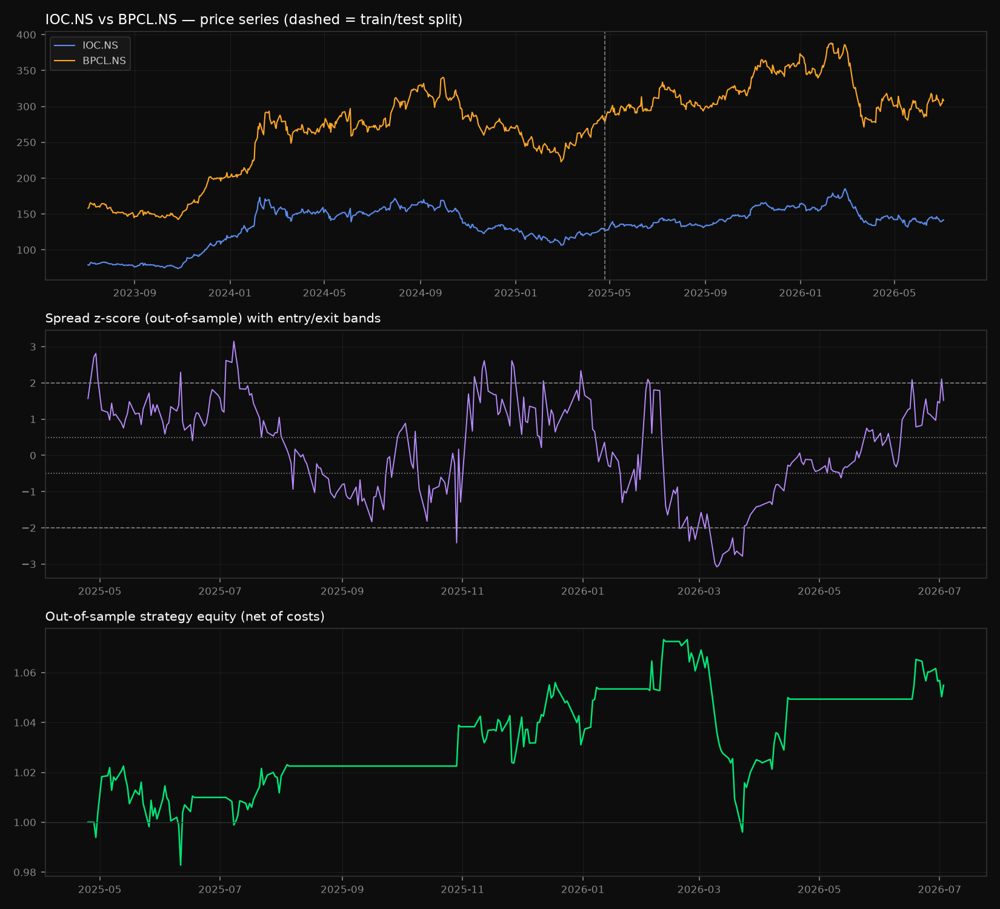

---

### BPCL.NS / HINDPETRO.NS

- **Latest prices:** BPCL.NS ₹308.15 · HINDPETRO.NS ₹399.25
- **Hedge ratio (train-fitted):** 1.4234
- **Cointegration (train):** FAIL at 5% — ADF -1.83, p=0.3634
- **Persistence:** passed 5% in 0 of 2 real-data runs (strict tier: 0/2)
- **Spread half-life:** 43.5 days
- **Current z-score:** +0.45
- **Signal today:** flat / no stretch
- ⚠️ _Pair did not cointegrate on training data. Any signal here is not statistically justified — observation only._

**Out-of-sample backtest** (beta frozen from train window):

| Metric | Value |
|---|---|
| Sharpe | 0.21 |
| Sortino | 0.18 |
| Annualised return | 1.14% |
| Annualised vol | 6.34% |
| Max drawdown | -7.38% |
| Round-trip trades | 5 |

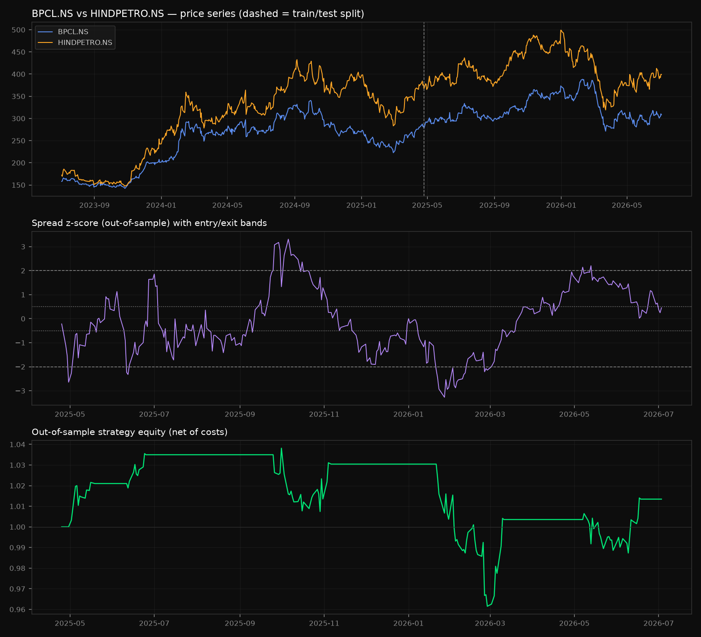

---

### ONGC.NS / COALINDIA.NS

- **Latest prices:** ONGC.NS ₹237.84 · COALINDIA.NS ₹438.70
- **Hedge ratio (train-fitted):** 1.7421
- **Cointegration (train):** FAIL at 5% — ADF -2.78, p=0.0606
- **Persistence:** passed 5% in 0 of 2 real-data runs (strict tier: 0/2)
- **Spread half-life:** 16.9 days
- **Current z-score:** +1.22
- **Signal today:** watch (approaching band)
- ⚠️ _Pair did not cointegrate on training data. Any signal here is not statistically justified — observation only._

**Out-of-sample backtest** (beta frozen from train window):

| Metric | Value |
|---|---|
| Sharpe | 0.84 |
| Sortino | 0.77 |
| Annualised return | 6.81% |
| Annualised vol | 8.25% |
| Max drawdown | -6.00% |
| Round-trip trades | 5 |

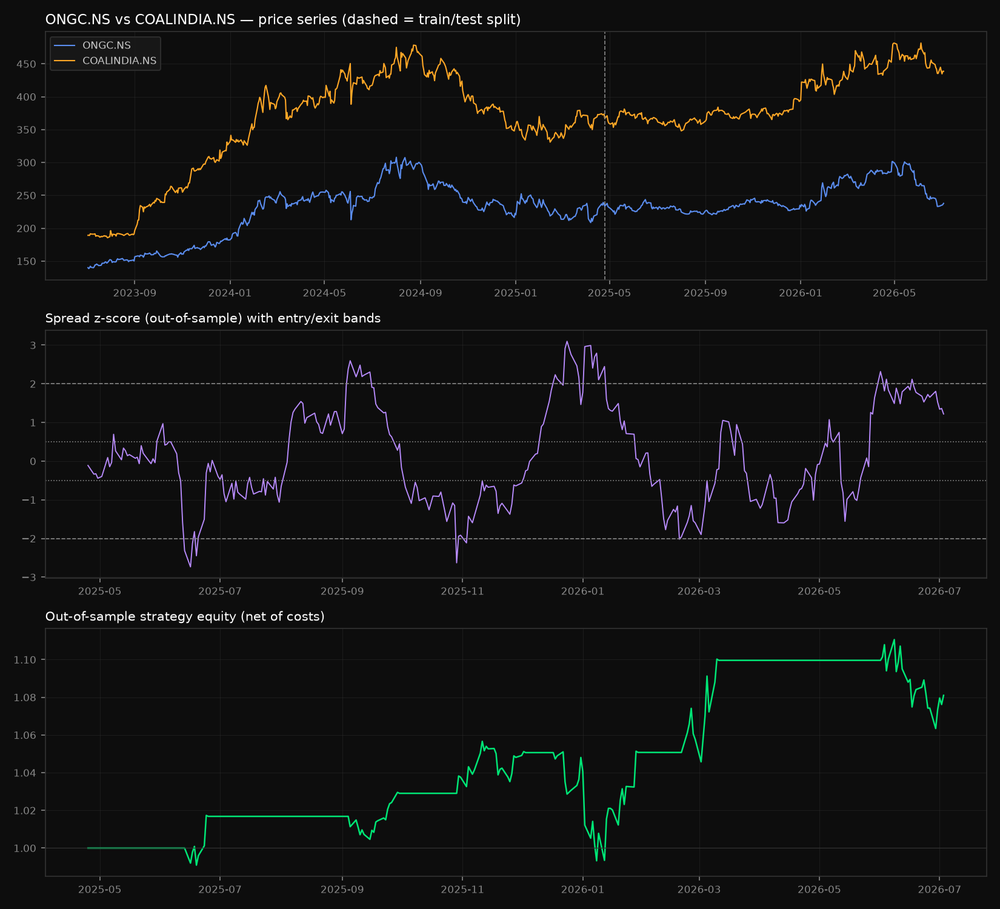

---

### NTPC.NS / POWERGRID.NS

- **Latest prices:** NTPC.NS ₹356.45 · POWERGRID.NS ₹287.85
- **Hedge ratio (train-fitted):** 0.8049
- **Cointegration (train):** FAIL at 5% — ADF -2.65, p=0.0823
- **Persistence:** passed 5% in 0 of 2 real-data runs (strict tier: 0/2)
- **Spread half-life:** 22.6 days
- **Current z-score:** +1.00
- **Signal today:** watch (approaching band)
- ⚠️ _Pair did not cointegrate on training data. Any signal here is not statistically justified — observation only._

**Out-of-sample backtest** (beta frozen from train window):

| Metric | Value |
|---|---|
| Sharpe | 0.82 |
| Sortino | 0.70 |
| Annualised return | 4.48% |
| Annualised vol | 5.50% |
| Max drawdown | -4.98% |
| Round-trip trades | 7 |

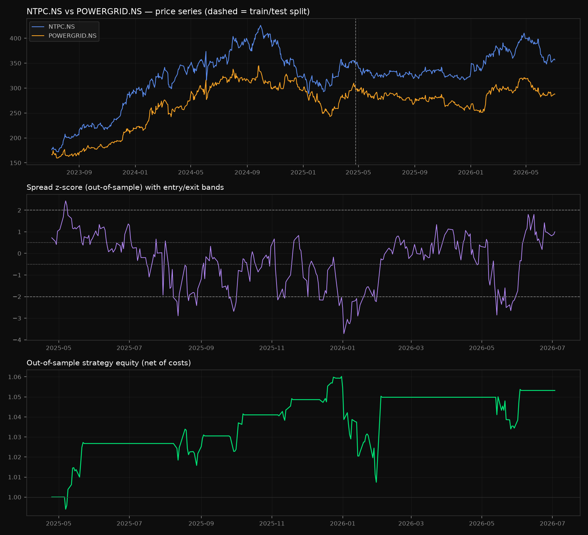

---

### BAJAJ-AUTO.NS / HEROMOTOCO.NS

- **Latest prices:** BAJAJ-AUTO.NS ₹9,785.50 · HEROMOTOCO.NS ₹4,852.60
- **Hedge ratio (train-fitted):** 0.4108
- **Cointegration (train):** FAIL at 5% — ADF -2.19, p=0.2096
- **Persistence:** passed 5% in 0 of 2 real-data runs (strict tier: 0/2)
- **Spread half-life:** 30.9 days
- **Current z-score:** -0.32
- **Signal today:** flat / no stretch
- ⚠️ _Pair did not cointegrate on training data. Any signal here is not statistically justified — observation only._

**Out-of-sample backtest** (beta frozen from train window):

| Metric | Value |
|---|---|
| Sharpe | -1.41 |
| Sortino | -1.46 |
| Annualised return | -15.47% |
| Annualised vol | 11.43% |
| Max drawdown | -22.58% |
| Round-trip trades | 4 |

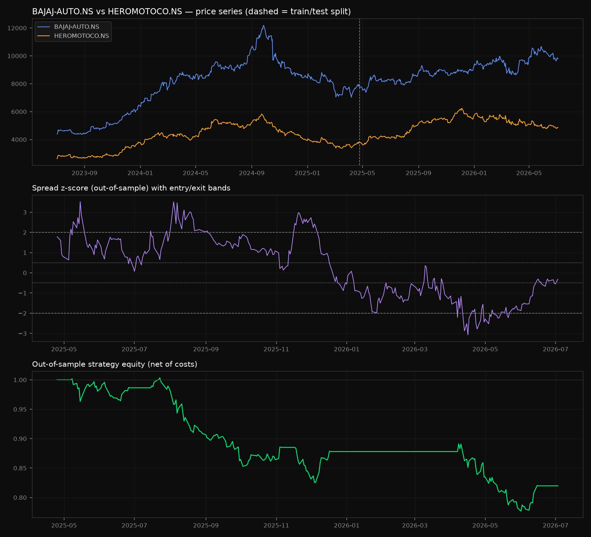

---

### TATASTEEL.NS / JSWSTEEL.NS

- **Latest prices:** TATASTEEL.NS ₹189.80 · JSWSTEEL.NS ₹1,230.20
- **Hedge ratio (train-fitted):** 3.0254
- **Cointegration (train):** FAIL at 5% — ADF 0.16, p=0.9697
- **Persistence:** passed 5% in 0 of 2 real-data runs (strict tier: 0/2)
- **Spread half-life:** 220.9 days
- **Current z-score:** +0.08
- **Signal today:** flat / no stretch
- ⚠️ _Pair did not cointegrate on training data. Any signal here is not statistically justified — observation only._

**Out-of-sample backtest** (beta frozen from train window):

| Metric | Value |
|---|---|
| Sharpe | 0.57 |
| Sortino | 0.51 |
| Annualised return | 5.06% |
| Annualised vol | 9.35% |
| Max drawdown | -6.60% |
| Round-trip trades | 5 |

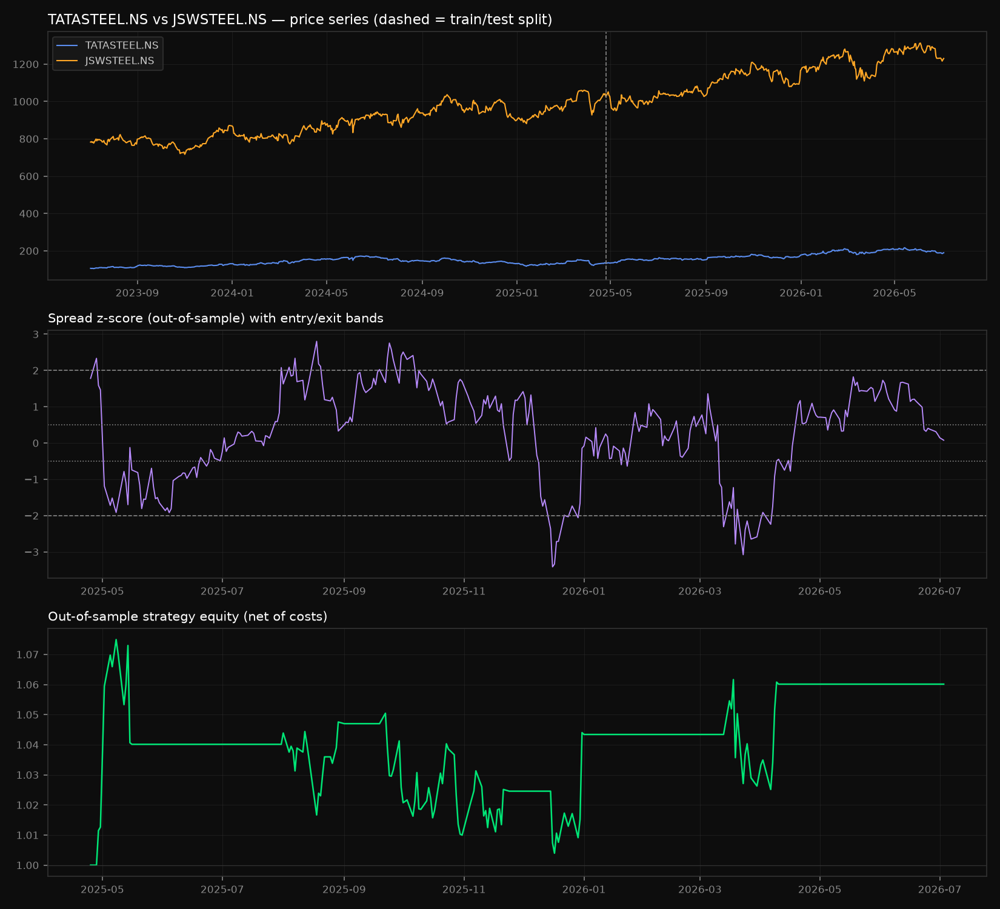

---

### SUNPHARMA.NS / CIPLA.NS

- **Latest prices:** SUNPHARMA.NS ₹1,904.80 · CIPLA.NS ₹1,458.20
- **Hedge ratio (train-fitted):** 0.5317
- **Cointegration (train):** PASS at 5% — ADF -3.52, p=0.0074
- **Persistence:** passed 5% in 2 of 2 real-data runs (strict tier: 0/2)
- **Spread half-life:** 12.1 days
- **Current z-score:** +1.08
- **Signal today:** watch (approaching band)

**Out-of-sample backtest** (beta frozen from train window):

| Metric | Value |
|---|---|
| Sharpe | -0.44 |
| Sortino | -0.45 |
| Annualised return | -3.12% |
| Annualised vol | 6.76% |
| Max drawdown | -9.87% |
| Round-trip trades | 5 |

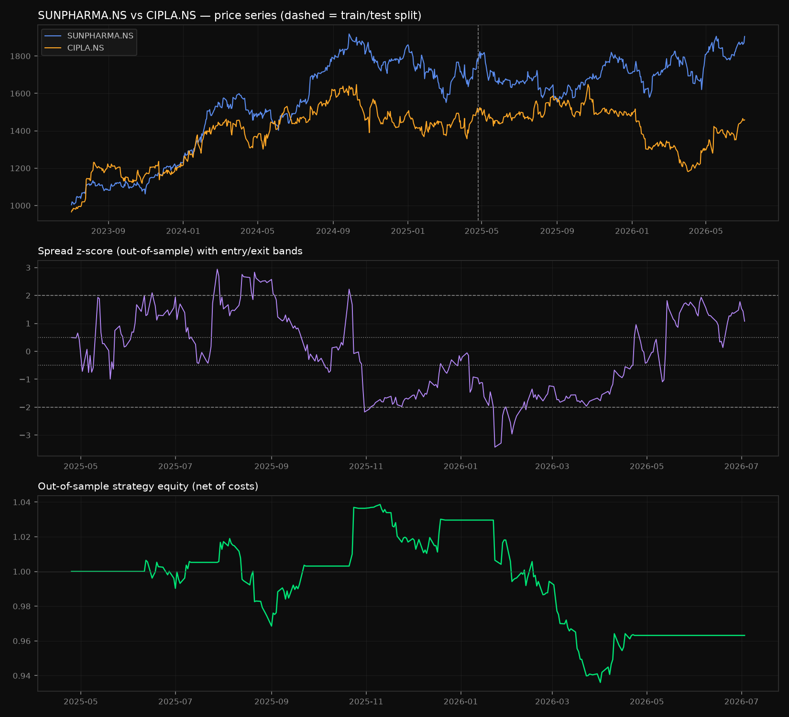

---

_Generated 2026-07-04 · pairs mean-reversion scanner · out-of-sample backtest · multiple-testing-aware · not investment advice._
