# Indian Pairs-Trading Scanner — 2026-07-06

> **What this is:** a market-neutral *pairs mean-reversion* scanner. It flags when two related NSE stocks have drifted apart far enough that their historical relationship signals a possible convergence trade. It does **not** forecast growth, rank "best" stocks, or predict company performance. A signal means the *spread between two stocks* is stretched — nothing about either stock being a good investment. Not investment advice; do your own research.

## Methodology (fixed in advance)

- **Universe:** 16 declared sector-mate pairs. Parameters (3y window, 60/40 train-test, z-entry 2.0, z-exit 0.5, 5 bps costs) are pre-registered; changes are logged in the README changelog *before* looking at results.
- **Multiple testing:** at the 5% level across 16 pairs, **≈0.8 false positives per run are expected by chance alone** even if nothing truly cointegrates. A single-day pass is a candidate, not a discovery.
- **Strict tier:** Bonferroni-corrected threshold p < 0.0031 (marked ✓✓).
- **Evidence = persistence:** the Persistence column counts how often each pair has passed the 5% test across all *real-data* daily runs recorded in `reports/history.csv`. Pairs deserve attention only when they pass persistently.

## Summary

| Pair | p-value | Coint. | Persistence | Current z | Signal | OOS Sharpe |
|---|---|---|---|---|---|---|
| HDFCBANK.NS/ICICIBANK.NS | 0.1951 | ✗ | 0/3 | +0.47 | flat / no stretch | -0.30 |
| AXISBANK.NS/ICICIBANK.NS | 0.9196 | ✗ | 0/3 | +4.03 | SHORT spread | 0.20 |
| KOTAKBANK.NS/HDFCBANK.NS | 0.1712 | ✗ | 0/3 | +2.95 | SHORT spread | -0.24 |
| SBIN.NS/BANKBARODA.NS | 0.2208 | ✗ | 0/3 | -1.96 | watch | 0.83 |
| TCS.NS/INFY.NS | 0.3739 | ✗ | 0/3 | +0.48 | flat / no stretch | 0.98 |
| INFY.NS/WIPRO.NS | 0.1811 | ✗ | 0/3 | -0.61 | watch | 1.65 |
| HCLTECH.NS/TECHM.NS | 0.2721 | ✗ | 0/3 | +0.55 | watch | 0.22 |
| ACC.NS/AMBUJACEM.NS | 0.7272 | ✗ | 0/3 | -0.08 | flat / no stretch | 0.55 |
| ULTRACEMCO.NS/SHREECEM.NS | 0.1586 | ✗ | 0/3 | +2.68 | SHORT spread | 0.34 |
| IOC.NS/BPCL.NS | 0.8717 | ✗ | 0/3 | +1.42 | watch | 0.71 |
| BPCL.NS/HINDPETRO.NS | 0.3279 | ✗ | 0/3 | +0.51 | watch | 0.21 |
| ONGC.NS/COALINDIA.NS | 0.0601 | ✗ | 0/3 | +0.70 | watch | 0.99 |
| NTPC.NS/POWERGRID.NS | 0.0628 | ✗ | 0/3 | +0.69 | watch | 0.82 |
| BAJAJ-AUTO.NS/HEROMOTOCO.NS | 0.2128 | ✗ | 0/3 | -0.34 | flat / no stretch | -1.41 |
| TATASTEEL.NS/JSWSTEEL.NS | 0.9647 | ✗ | 0/3 | +0.43 | flat / no stretch | 0.26 |
| SUNPHARMA.NS/CIPLA.NS | 0.0078 | ✓ | 3/3 | +1.26 | watch | -0.39 |

_Legend: ✓✓ passes strict Bonferroni tier · ✓ passes 5% only · ✗ fails. Persistence = 5%-passes / real-data runs recorded. \*no real-data history yet._

---

### HDFCBANK.NS / ICICIBANK.NS

- **Latest prices:** HDFCBANK.NS ₹829.85 · ICICIBANK.NS ₹1,426.90
- **Hedge ratio (train-fitted):** 1.6967
- **Cointegration (train):** FAIL at 5% — ADF -2.23, p=0.1951
- **Persistence:** passed 5% in 0 of 3 real-data runs (strict tier: 0/3)
- **Spread half-life:** 34.3 days
- **Current z-score:** +0.47
- **Signal today:** flat / no stretch
- ⚠️ _Pair did not cointegrate on training data. Any signal here is not statistically justified — observation only._

**Out-of-sample backtest** (beta frozen from train window):

| Metric | Value |
|---|---|
| Sharpe | -0.30 |
| Sortino | -0.30 |
| Annualised return | -1.96% |
| Annualised vol | 6.05% |
| Max drawdown | -8.58% |
| Round-trip trades | 4 |

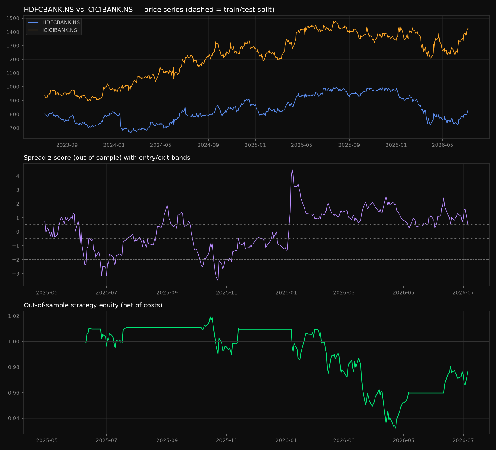

---

### AXISBANK.NS / ICICIBANK.NS

- **Latest prices:** AXISBANK.NS ₹1,339.60 · ICICIBANK.NS ₹1,426.90
- **Hedge ratio (train-fitted):** 0.8661
- **Cointegration (train):** FAIL at 5% — ADF -0.34, p=0.9196
- **Persistence:** passed 5% in 0 of 3 real-data runs (strict tier: 0/3)
- **Spread half-life:** 264.7 days
- **Current z-score:** +4.03
- **Signal today:** SHORT spread (short ICICIBANK.NS, long AXISBANK.NS)
- ⚠️ _Pair did not cointegrate on training data. Any signal here is not statistically justified — observation only._

**Out-of-sample backtest** (beta frozen from train window):

| Metric | Value |
|---|---|
| Sharpe | 0.20 |
| Sortino | 0.21 |
| Annualised return | 1.33% |
| Annualised vol | 8.07% |
| Max drawdown | -7.28% |
| Round-trip trades | 7 |

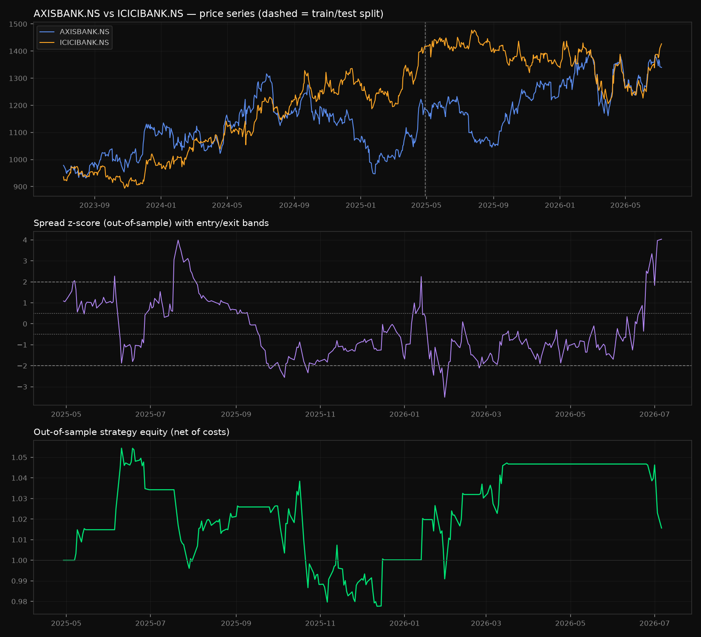

---

### KOTAKBANK.NS / HDFCBANK.NS

- **Latest prices:** KOTAKBANK.NS ₹381.30 · HDFCBANK.NS ₹829.85
- **Hedge ratio (train-fitted):** 1.7165
- **Cointegration (train):** FAIL at 5% — ADF -2.30, p=0.1712
- **Persistence:** passed 5% in 0 of 3 real-data runs (strict tier: 0/3)
- **Spread half-life:** 29.2 days
- **Current z-score:** +2.95
- **Signal today:** SHORT spread (short HDFCBANK.NS, long KOTAKBANK.NS)
- ⚠️ _Pair did not cointegrate on training data. Any signal here is not statistically justified — observation only._

**Out-of-sample backtest** (beta frozen from train window):

| Metric | Value |
|---|---|
| Sharpe | -0.24 |
| Sortino | -0.21 |
| Annualised return | -1.76% |
| Annualised vol | 6.44% |
| Max drawdown | -5.75% |
| Round-trip trades | 4 |

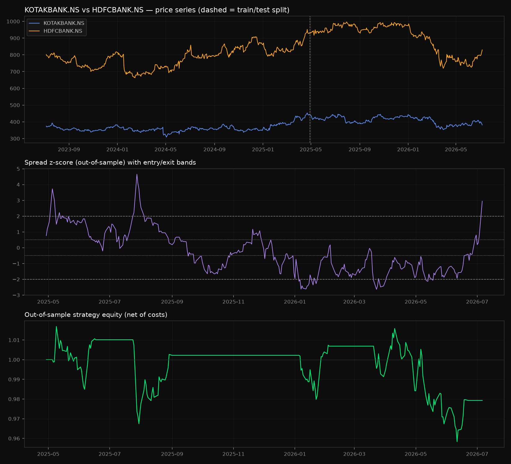

---

### SBIN.NS / BANKBARODA.NS

- **Latest prices:** SBIN.NS ₹1,037.70 · BANKBARODA.NS ₹249.95
- **Hedge ratio (train-fitted):** 0.2121
- **Cointegration (train):** FAIL at 5% — ADF -2.16, p=0.2208
- **Persistence:** passed 5% in 0 of 3 real-data runs (strict tier: 0/3)
- **Spread half-life:** 25.2 days
- **Current z-score:** -1.96
- **Signal today:** watch (approaching band)
- ⚠️ _Pair did not cointegrate on training data. Any signal here is not statistically justified — observation only._

**Out-of-sample backtest** (beta frozen from train window):

| Metric | Value |
|---|---|
| Sharpe | 0.83 |
| Sortino | 0.62 |
| Annualised return | 7.54% |
| Annualised vol | 9.28% |
| Max drawdown | -8.99% |
| Round-trip trades | 6 |

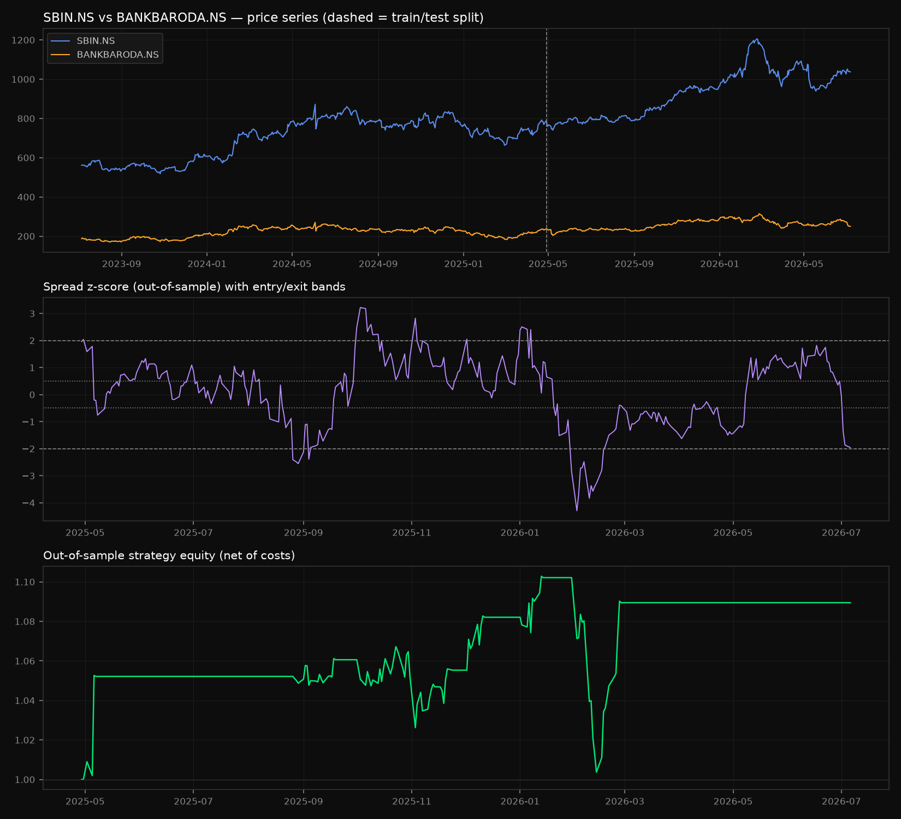

---

### TCS.NS / INFY.NS

- **Latest prices:** TCS.NS ₹2,057.60 · INFY.NS ₹1,042.20
- **Hedge ratio (train-fitted):** 0.5324
- **Cointegration (train):** FAIL at 5% — ADF -1.81, p=0.3739
- **Persistence:** passed 5% in 0 of 3 real-data runs (strict tier: 0/3)
- **Spread half-life:** 38.1 days
- **Current z-score:** +0.48
- **Signal today:** flat / no stretch
- ⚠️ _Pair did not cointegrate on training data. Any signal here is not statistically justified — observation only._

**Out-of-sample backtest** (beta frozen from train window):

| Metric | Value |
|---|---|
| Sharpe | 0.98 |
| Sortino | 0.88 |
| Annualised return | 4.16% |
| Annualised vol | 4.26% |
| Max drawdown | -4.35% |
| Round-trip trades | 6 |

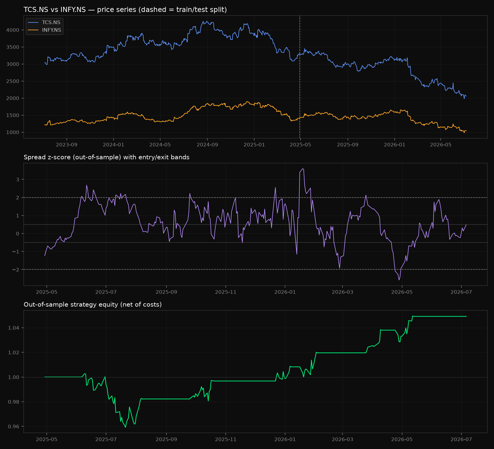

---

### INFY.NS / WIPRO.NS

- **Latest prices:** INFY.NS ₹1,042.20 · WIPRO.NS ₹174.32
- **Hedge ratio (train-fitted):** 0.1413
- **Cointegration (train):** FAIL at 5% — ADF -2.27, p=0.1811
- **Persistence:** passed 5% in 0 of 3 real-data runs (strict tier: 0/3)
- **Spread half-life:** 29.2 days
- **Current z-score:** -0.61
- **Signal today:** watch (approaching band)
- ⚠️ _Pair did not cointegrate on training data. Any signal here is not statistically justified — observation only._

**Out-of-sample backtest** (beta frozen from train window):

| Metric | Value |
|---|---|
| Sharpe | 1.65 |
| Sortino | 2.22 |
| Annualised return | 9.86% |
| Annualised vol | 5.80% |
| Max drawdown | -2.65% |
| Round-trip trades | 7 |

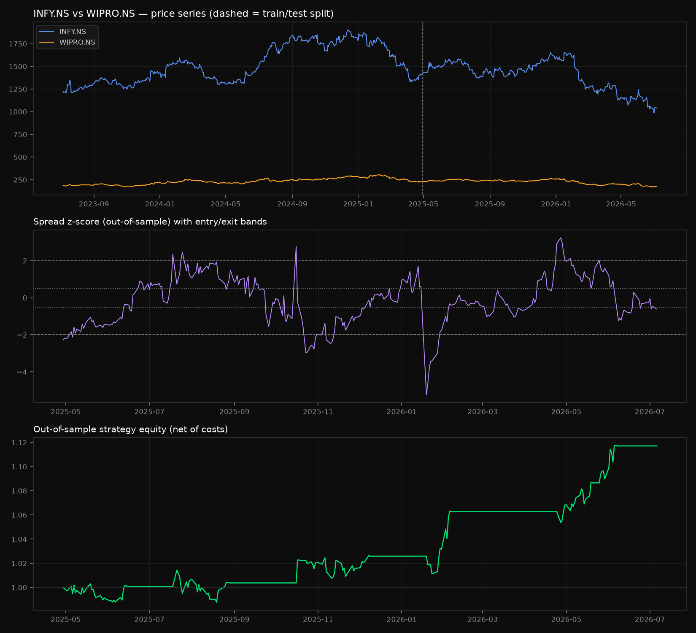

---

### HCLTECH.NS / TECHM.NS

- **Latest prices:** HCLTECH.NS ₹1,134.20 · TECHM.NS ₹1,406.50
- **Hedge ratio (train-fitted):** 0.7844
- **Cointegration (train):** FAIL at 5% — ADF -2.03, p=0.2721
- **Persistence:** passed 5% in 0 of 3 real-data runs (strict tier: 0/3)
- **Spread half-life:** 27.3 days
- **Current z-score:** +0.55
- **Signal today:** watch (approaching band)
- ⚠️ _Pair did not cointegrate on training data. Any signal here is not statistically justified — observation only._

**Out-of-sample backtest** (beta frozen from train window):

| Metric | Value |
|---|---|
| Sharpe | 0.22 |
| Sortino | 0.22 |
| Annualised return | 1.42% |
| Annualised vol | 7.55% |
| Max drawdown | -7.02% |
| Round-trip trades | 5 |

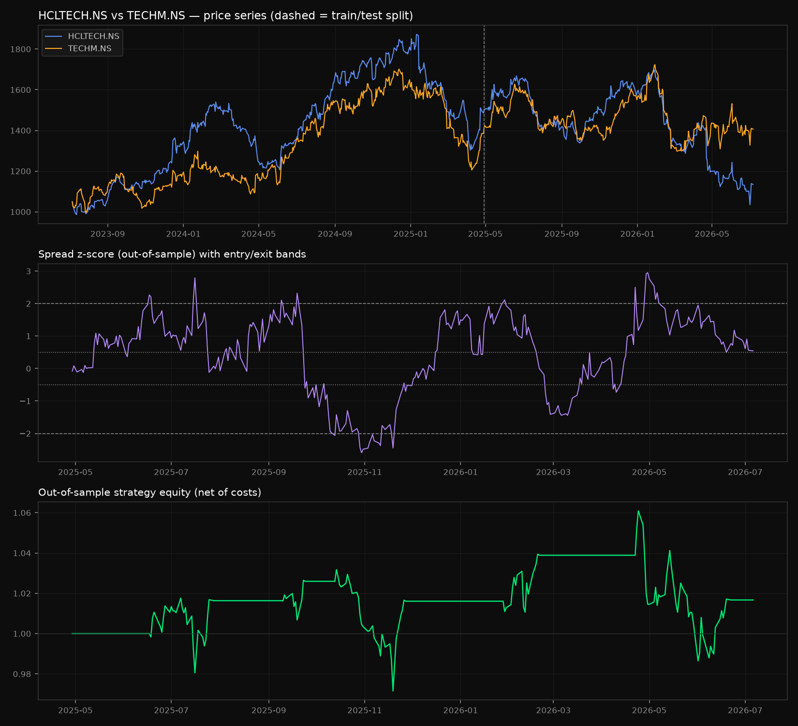

---

### ACC.NS / AMBUJACEM.NS

- **Latest prices:** ACC.NS ₹1,397.10 · AMBUJACEM.NS ₹441.40
- **Hedge ratio (train-fitted):** 0.2529
- **Cointegration (train):** FAIL at 5% — ADF -1.07, p=0.7272
- **Persistence:** passed 5% in 0 of 3 real-data runs (strict tier: 0/3)
- **Spread half-life:** 67.7 days
- **Current z-score:** -0.08
- **Signal today:** flat / no stretch
- ⚠️ _Pair did not cointegrate on training data. Any signal here is not statistically justified — observation only._

**Out-of-sample backtest** (beta frozen from train window):

| Metric | Value |
|---|---|
| Sharpe | 0.55 |
| Sortino | 0.58 |
| Annualised return | 3.21% |
| Annualised vol | 6.12% |
| Max drawdown | -5.87% |
| Round-trip trades | 5 |

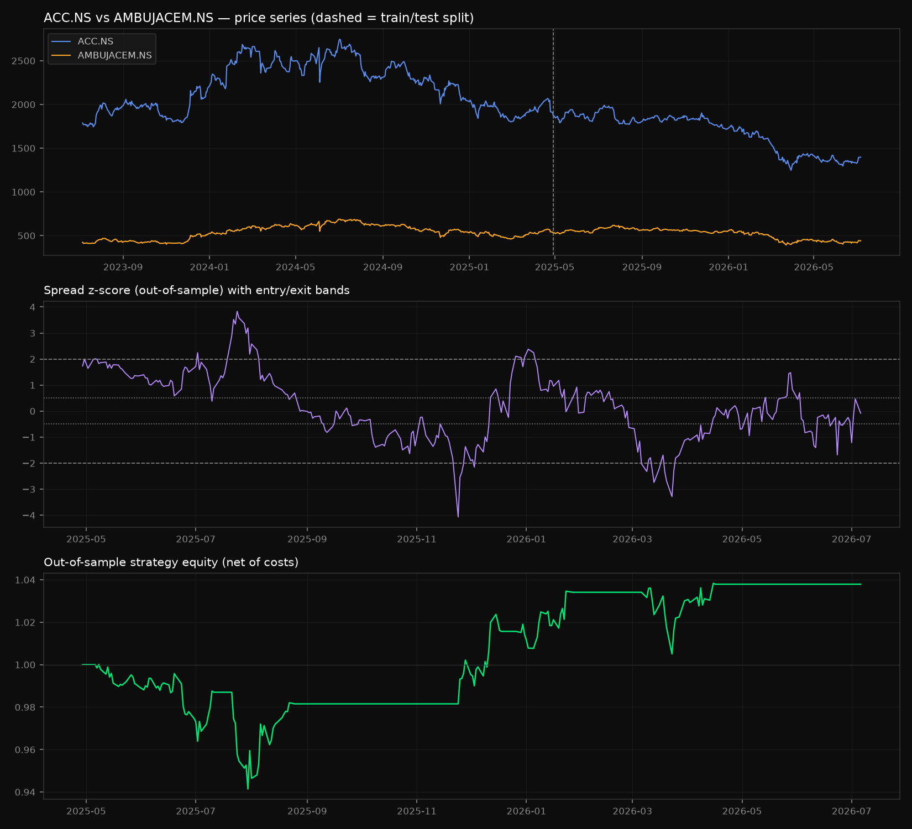

---

### ULTRACEMCO.NS / SHREECEM.NS

- **Latest prices:** ULTRACEMCO.NS ₹11,661.00 · SHREECEM.NS ₹26,630.00
- **Hedge ratio (train-fitted):** 0.5954
- **Cointegration (train):** FAIL at 5% — ADF -2.34, p=0.1586
- **Persistence:** passed 5% in 0 of 3 real-data runs (strict tier: 0/3)
- **Spread half-life:** 30.5 days
- **Current z-score:** +2.68
- **Signal today:** SHORT spread (short SHREECEM.NS, long ULTRACEMCO.NS)
- ⚠️ _Pair did not cointegrate on training data. Any signal here is not statistically justified — observation only._

**Out-of-sample backtest** (beta frozen from train window):

| Metric | Value |
|---|---|
| Sharpe | 0.34 |
| Sortino | 0.32 |
| Annualised return | 2.32% |
| Annualised vol | 7.68% |
| Max drawdown | -9.10% |
| Round-trip trades | 5 |

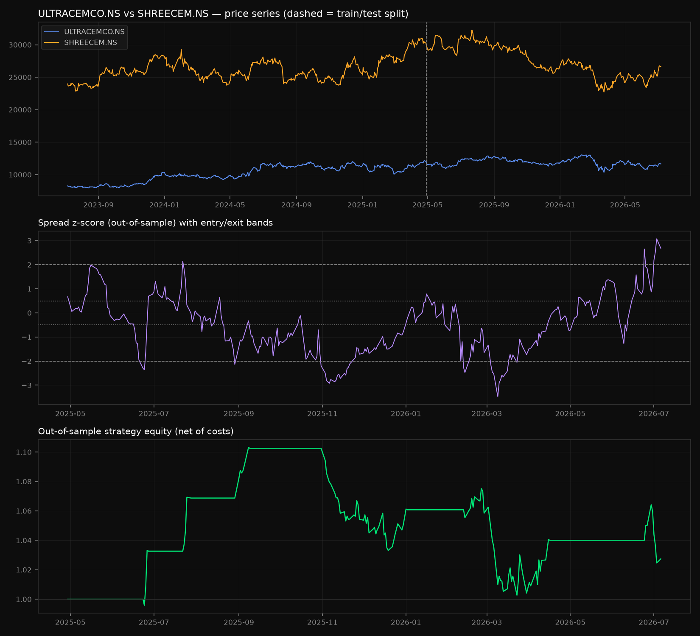

---

### IOC.NS / BPCL.NS

- **Latest prices:** IOC.NS ₹141.68 · BPCL.NS ₹308.15
- **Hedge ratio (train-fitted):** 1.7630
- **Cointegration (train):** FAIL at 5% — ADF -0.60, p=0.8717
- **Persistence:** passed 5% in 0 of 3 real-data runs (strict tier: 0/3)
- **Spread half-life:** 170.4 days
- **Current z-score:** +1.42
- **Signal today:** watch (approaching band)
- ⚠️ _Pair did not cointegrate on training data. Any signal here is not statistically justified — observation only._

**Out-of-sample backtest** (beta frozen from train window):

| Metric | Value |
|---|---|
| Sharpe | 0.71 |
| Sortino | 0.81 |
| Annualised return | 5.01% |
| Annualised vol | 7.30% |
| Max drawdown | -6.96% |
| Round-trip trades | 7 |

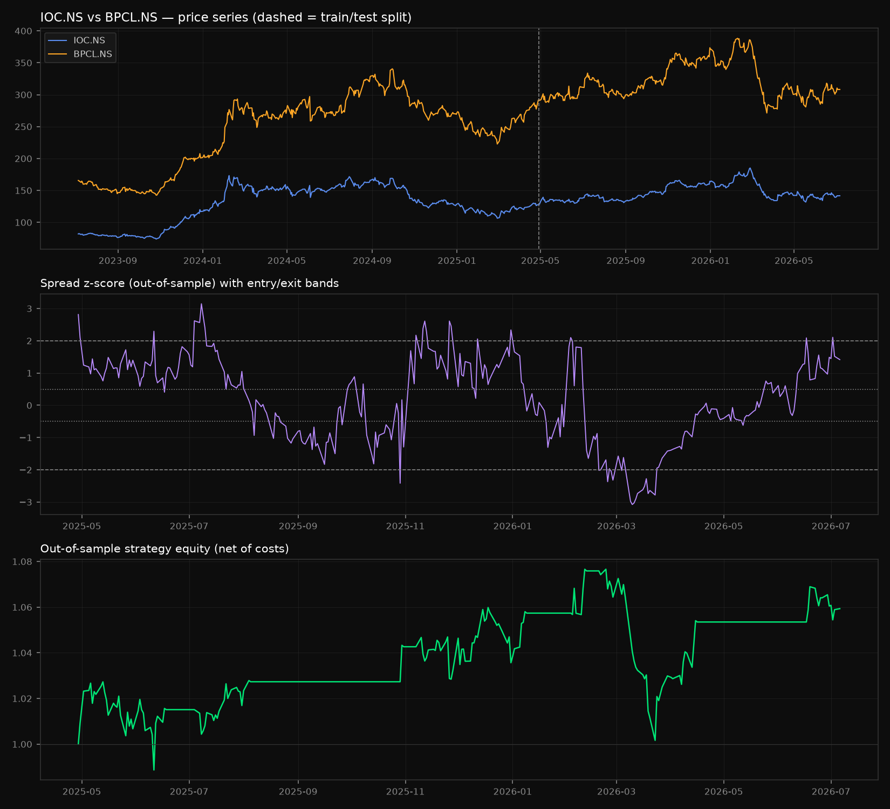

---

### BPCL.NS / HINDPETRO.NS

- **Latest prices:** BPCL.NS ₹308.15 · HINDPETRO.NS ₹400.35
- **Hedge ratio (train-fitted):** 1.4232
- **Cointegration (train):** FAIL at 5% — ADF -1.91, p=0.3279
- **Persistence:** passed 5% in 0 of 3 real-data runs (strict tier: 0/3)
- **Spread half-life:** 41.7 days
- **Current z-score:** +0.51
- **Signal today:** watch (approaching band)
- ⚠️ _Pair did not cointegrate on training data. Any signal here is not statistically justified — observation only._

**Out-of-sample backtest** (beta frozen from train window):

| Metric | Value |
|---|---|
| Sharpe | 0.21 |
| Sortino | 0.18 |
| Annualised return | 1.10% |
| Annualised vol | 6.10% |
| Max drawdown | -7.10% |
| Round-trip trades | 5 |

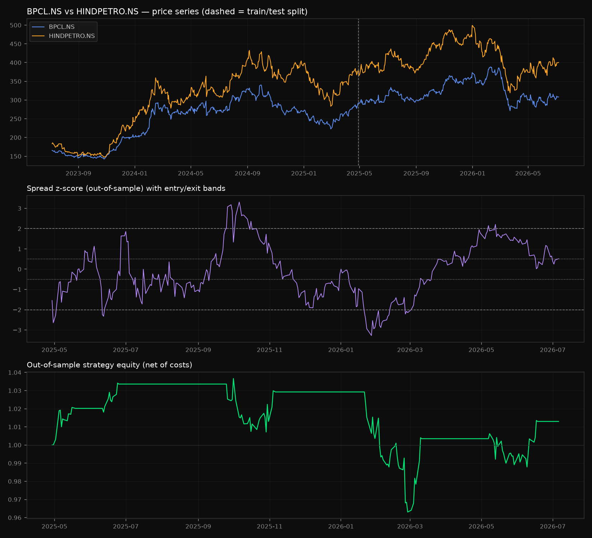

---

### ONGC.NS / COALINDIA.NS

- **Latest prices:** ONGC.NS ₹243.90 · COALINDIA.NS ₹432.35
- **Hedge ratio (train-fitted):** 1.7360
- **Cointegration (train):** FAIL at 5% — ADF -2.79, p=0.0601
- **Persistence:** passed 5% in 0 of 3 real-data runs (strict tier: 0/3)
- **Spread half-life:** 16.9 days
- **Current z-score:** +0.70
- **Signal today:** watch (approaching band)
- ⚠️ _Pair did not cointegrate on training data. Any signal here is not statistically justified — observation only._

**Out-of-sample backtest** (beta frozen from train window):

| Metric | Value |
|---|---|
| Sharpe | 0.99 |
| Sortino | 0.93 |
| Annualised return | 8.10% |
| Annualised vol | 8.22% |
| Max drawdown | -6.05% |
| Round-trip trades | 5 |

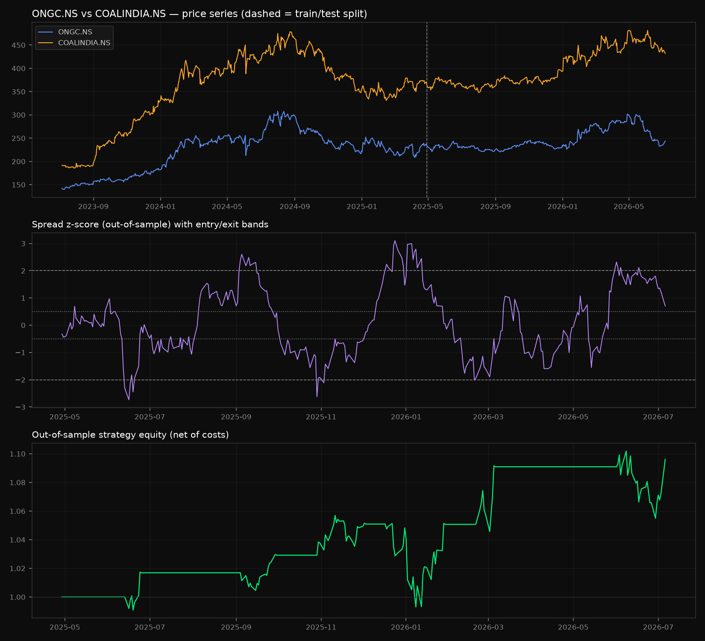

---

### NTPC.NS / POWERGRID.NS

- **Latest prices:** NTPC.NS ₹356.25 · POWERGRID.NS ₹285.40
- **Hedge ratio (train-fitted):** 0.8089
- **Cointegration (train):** FAIL at 5% — ADF -2.77, p=0.0628
- **Persistence:** passed 5% in 0 of 3 real-data runs (strict tier: 0/3)
- **Spread half-life:** 21.6 days
- **Current z-score:** +0.69
- **Signal today:** watch (approaching band)
- ⚠️ _Pair did not cointegrate on training data. Any signal here is not statistically justified — observation only._

**Out-of-sample backtest** (beta frozen from train window):

| Metric | Value |
|---|---|
| Sharpe | 0.82 |
| Sortino | 0.70 |
| Annualised return | 4.50% |
| Annualised vol | 5.54% |
| Max drawdown | -5.01% |
| Round-trip trades | 7 |

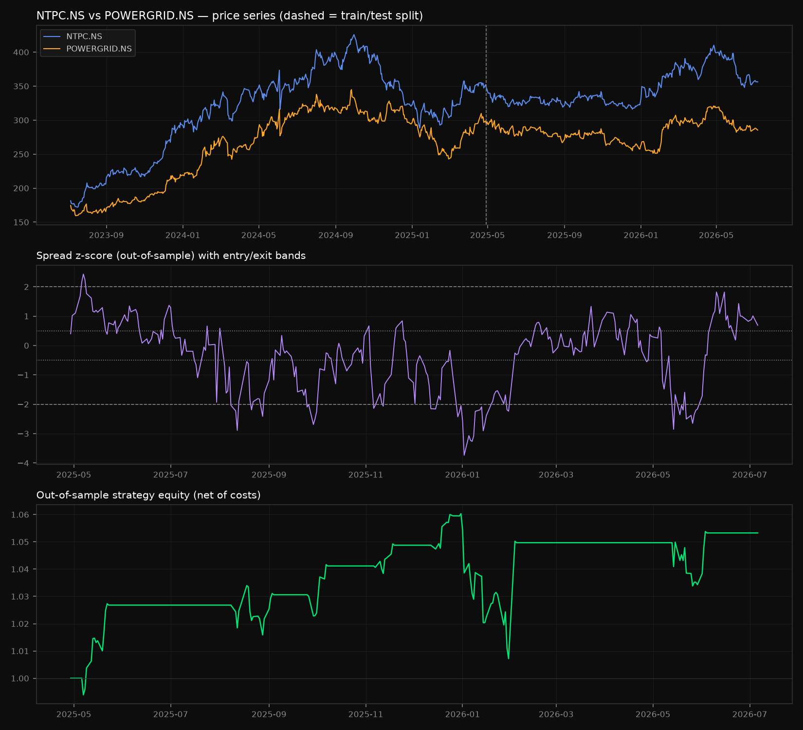

---

### BAJAJ-AUTO.NS / HEROMOTOCO.NS

- **Latest prices:** BAJAJ-AUTO.NS ₹10,036.50 · HEROMOTOCO.NS ₹4,944.40
- **Hedge ratio (train-fitted):** 0.4109
- **Cointegration (train):** FAIL at 5% — ADF -2.18, p=0.2128
- **Persistence:** passed 5% in 0 of 3 real-data runs (strict tier: 0/3)
- **Spread half-life:** 31.2 days
- **Current z-score:** -0.34
- **Signal today:** flat / no stretch
- ⚠️ _Pair did not cointegrate on training data. Any signal here is not statistically justified — observation only._

**Out-of-sample backtest** (beta frozen from train window):

| Metric | Value |
|---|---|
| Sharpe | -1.41 |
| Sortino | -1.47 |
| Annualised return | -15.56% |
| Annualised vol | 11.49% |
| Max drawdown | -22.65% |
| Round-trip trades | 4 |

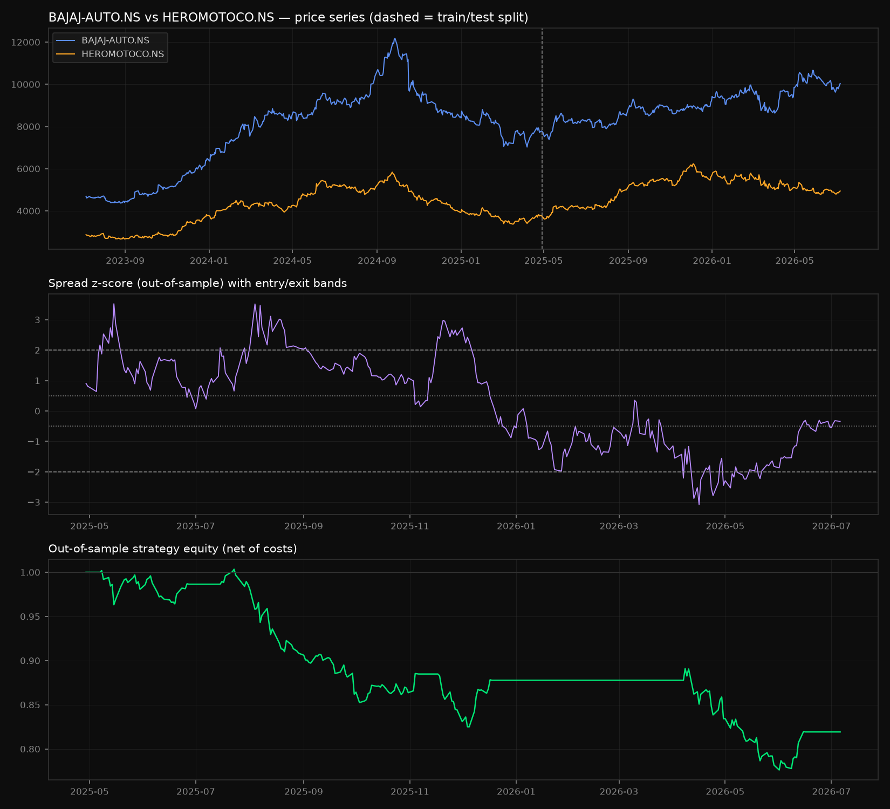

---

### TATASTEEL.NS / JSWSTEEL.NS

- **Latest prices:** TATASTEEL.NS ₹190.87 · JSWSTEEL.NS ₹1,243.20
- **Hedge ratio (train-fitted):** 3.0161
- **Cointegration (train):** FAIL at 5% — ADF 0.08, p=0.9647
- **Persistence:** passed 5% in 0 of 3 real-data runs (strict tier: 0/3)
- **Spread half-life:** 273.5 days
- **Current z-score:** +0.43
- **Signal today:** flat / no stretch
- ⚠️ _Pair did not cointegrate on training data. Any signal here is not statistically justified — observation only._

**Out-of-sample backtest** (beta frozen from train window):

| Metric | Value |
|---|---|
| Sharpe | 0.26 |
| Sortino | 0.21 |
| Annualised return | 1.63% |
| Annualised vol | 7.40% |
| Max drawdown | -4.38% |
| Round-trip trades | 4 |

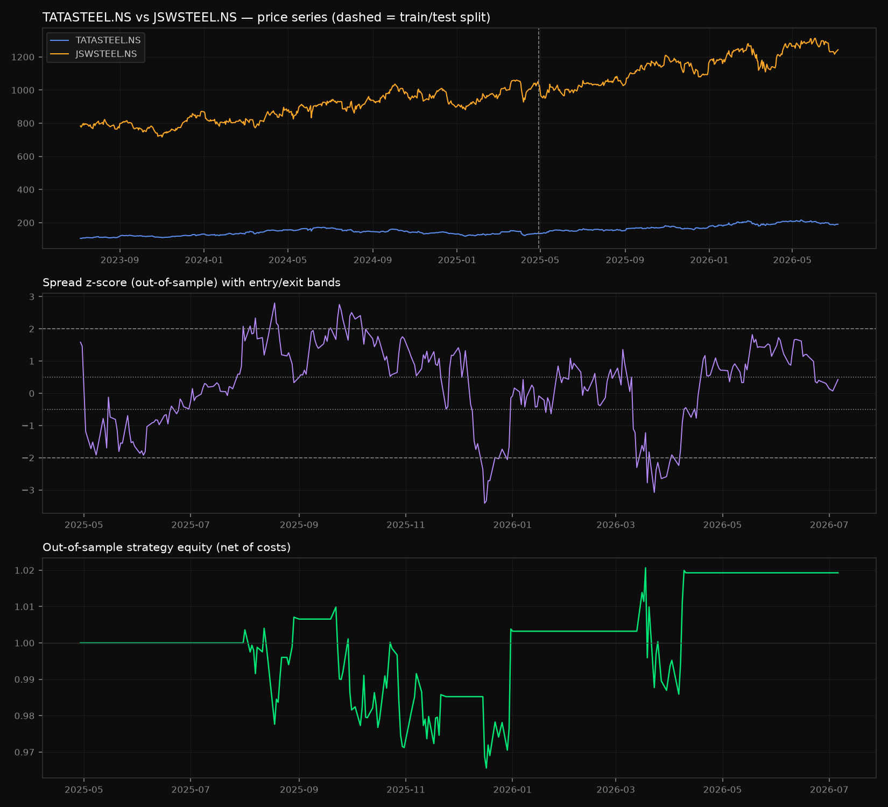

---

### SUNPHARMA.NS / CIPLA.NS

- **Latest prices:** SUNPHARMA.NS ₹1,912.80 · CIPLA.NS ₹1,472.30
- **Hedge ratio (train-fitted):** 0.5250
- **Cointegration (train):** PASS at 5% — ADF -3.51, p=0.0078
- **Persistence:** passed 5% in 3 of 3 real-data runs (strict tier: 0/3)
- **Spread half-life:** 11.9 days
- **Current z-score:** +1.26
- **Signal today:** watch (approaching band)

**Out-of-sample backtest** (beta frozen from train window):

| Metric | Value |
|---|---|
| Sharpe | -0.39 |
| Sortino | -0.40 |
| Annualised return | -2.80% |
| Annualised vol | 6.64% |
| Max drawdown | -9.78% |
| Round-trip trades | 5 |

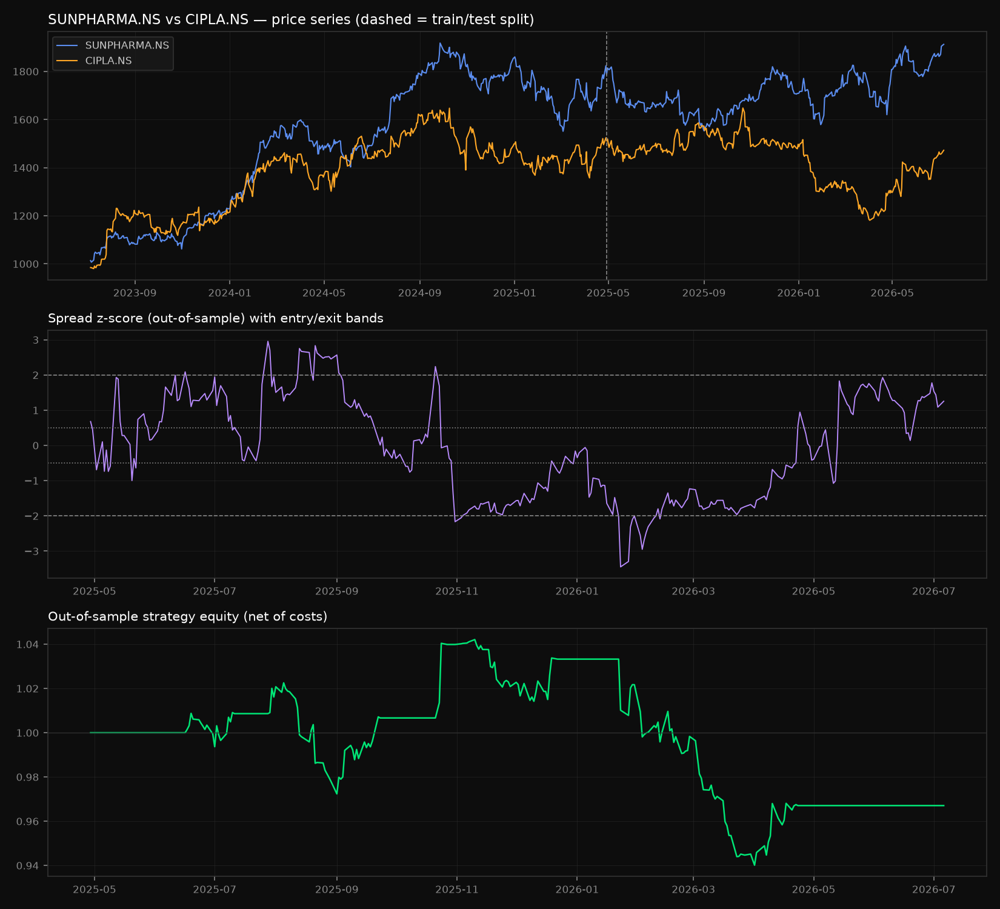

---

_Generated 2026-07-06 · pairs mean-reversion scanner · out-of-sample backtest · multiple-testing-aware · not investment advice._
