# Indian Pairs-Trading Scanner — 2026-07-07

> **What this is:** a market-neutral *pairs mean-reversion* scanner. It flags when two related NSE stocks have drifted apart far enough that their historical relationship signals a possible convergence trade. It does **not** forecast growth, rank "best" stocks, or predict company performance. A signal means the *spread between two stocks* is stretched — nothing about either stock being a good investment. Not investment advice; do your own research.

## Methodology (fixed in advance)

- **Universe:** 16 declared sector-mate pairs. Parameters (3y window, 60/40 train-test, z-entry 2.0, z-exit 0.5, 5 bps costs) are pre-registered; changes are logged in the README changelog *before* looking at results.
- **Multiple testing:** at the 5% level across 16 pairs, **≈0.8 false positives per run are expected by chance alone** even if nothing truly cointegrates. A single-day pass is a candidate, not a discovery.
- **Strict tier:** Bonferroni-corrected threshold p < 0.0031 (marked ✓✓).
- **Evidence = persistence:** the Persistence column counts how often each pair has passed the 5% test across all *real-data* daily runs recorded in `reports/history.csv`. Pairs deserve attention only when they pass persistently.

## Summary

| Pair | p-value | Coint. | Persistence | Current z | Signal | OOS Sharpe |
|---|---|---|---|---|---|---|
| HDFCBANK.NS/ICICIBANK.NS | 0.1174 | ✗ | 0/4 | +0.08 | flat / no stretch | -0.31 |
| AXISBANK.NS/ICICIBANK.NS | 0.9287 | ✗ | 0/4 | +3.13 | SHORT spread | 0.26 |
| KOTAKBANK.NS/HDFCBANK.NS | 0.1711 | ✗ | 0/4 | +2.75 | SHORT spread | -0.24 |
| SBIN.NS/BANKBARODA.NS | 0.2205 | ✗ | 0/4 | -2.07 | LONG spread | 0.83 |
| TCS.NS/INFY.NS | 0.3743 | ✗ | 0/4 | +0.69 | watch | 0.98 |
| INFY.NS/WIPRO.NS | 0.1794 | ✗ | 0/4 | -1.34 | watch | 1.66 |
| HCLTECH.NS/TECHM.NS | 0.2713 | ✗ | 0/4 | +0.77 | watch | 0.22 |
| ACC.NS/AMBUJACEM.NS | 0.7105 | ✗ | 0/4 | -0.53 | watch | 0.54 |
| ULTRACEMCO.NS/SHREECEM.NS | 0.1383 | ✗ | 0/4 | +2.63 | SHORT spread | 0.25 |
| IOC.NS/BPCL.NS | 0.8949 | ✗ | 0/4 | +2.46 | SHORT spread | 0.48 |
| BPCL.NS/HINDPETRO.NS | 0.3221 | ✗ | 0/4 | +0.27 | flat / no stretch | 0.21 |
| ONGC.NS/COALINDIA.NS | 0.0610 | ✗ | 0/4 | +0.57 | watch | 1.04 |
| NTPC.NS/POWERGRID.NS | 0.0637 | ✗ | 0/4 | +0.75 | watch | 0.82 |
| BAJAJ-AUTO.NS/HEROMOTOCO.NS | 0.2264 | ✗ | 0/4 | -0.21 | flat / no stretch | -1.41 |
| TATASTEEL.NS/JSWSTEEL.NS | 0.9512 | ✗ | 0/4 | +0.97 | watch | 0.26 |
| SUNPHARMA.NS/CIPLA.NS | 0.0060 | ✓ | 4/4 | +0.84 | watch | -0.14 |

_Legend: ✓✓ passes strict Bonferroni tier · ✓ passes 5% only · ✗ fails. Persistence = 5%-passes / real-data runs recorded. \*no real-data history yet._

---

### HDFCBANK.NS / ICICIBANK.NS

- **Latest prices:** HDFCBANK.NS ₹829.30 · ICICIBANK.NS ₹1,414.70
- **Hedge ratio (train-fitted):** 1.7039
- **Cointegration (train):** FAIL at 5% — ADF -2.49, p=0.1174
- **Persistence:** passed 5% in 0 of 4 real-data runs (strict tier: 0/4)
- **Spread half-life:** 33.8 days
- **Current z-score:** +0.08
- **Signal today:** flat / no stretch
- ⚠️ _Pair did not cointegrate on training data. Any signal here is not statistically justified — observation only._

**Out-of-sample backtest** (beta frozen from train window):

| Metric | Value |
|---|---|
| Sharpe | -0.31 |
| Sortino | -0.31 |
| Annualised return | -2.00% |
| Annualised vol | 6.03% |
| Max drawdown | -8.57% |
| Round-trip trades | 5 |

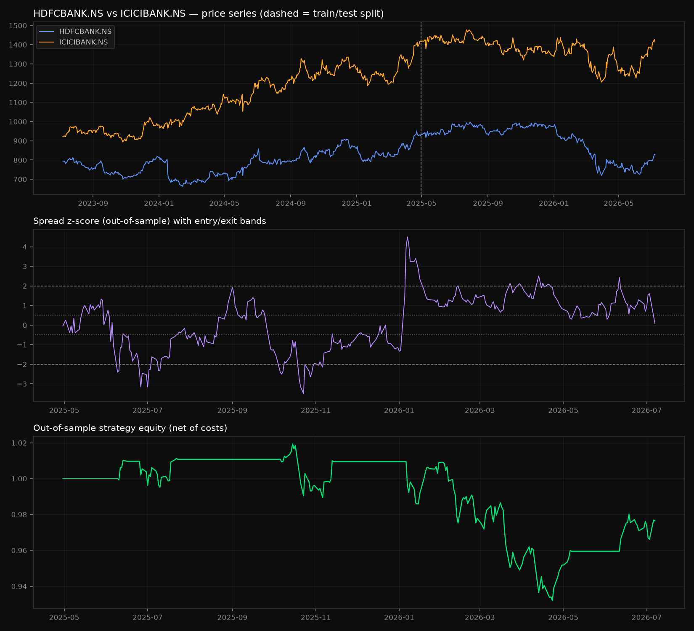

---

### AXISBANK.NS / ICICIBANK.NS

- **Latest prices:** AXISBANK.NS ₹1,341.00 · ICICIBANK.NS ₹1,414.70
- **Hedge ratio (train-fitted):** 0.8692
- **Cointegration (train):** FAIL at 5% — ADF -0.28, p=0.9287
- **Persistence:** passed 5% in 0 of 4 real-data runs (strict tier: 0/4)
- **Spread half-life:** 266.7 days
- **Current z-score:** +3.13
- **Signal today:** SHORT spread (short ICICIBANK.NS, long AXISBANK.NS)
- ⚠️ _Pair did not cointegrate on training data. Any signal here is not statistically justified — observation only._

**Out-of-sample backtest** (beta frozen from train window):

| Metric | Value |
|---|---|
| Sharpe | 0.26 |
| Sortino | 0.27 |
| Annualised return | 1.81% |
| Annualised vol | 8.11% |
| Max drawdown | -7.31% |
| Round-trip trades | 7 |

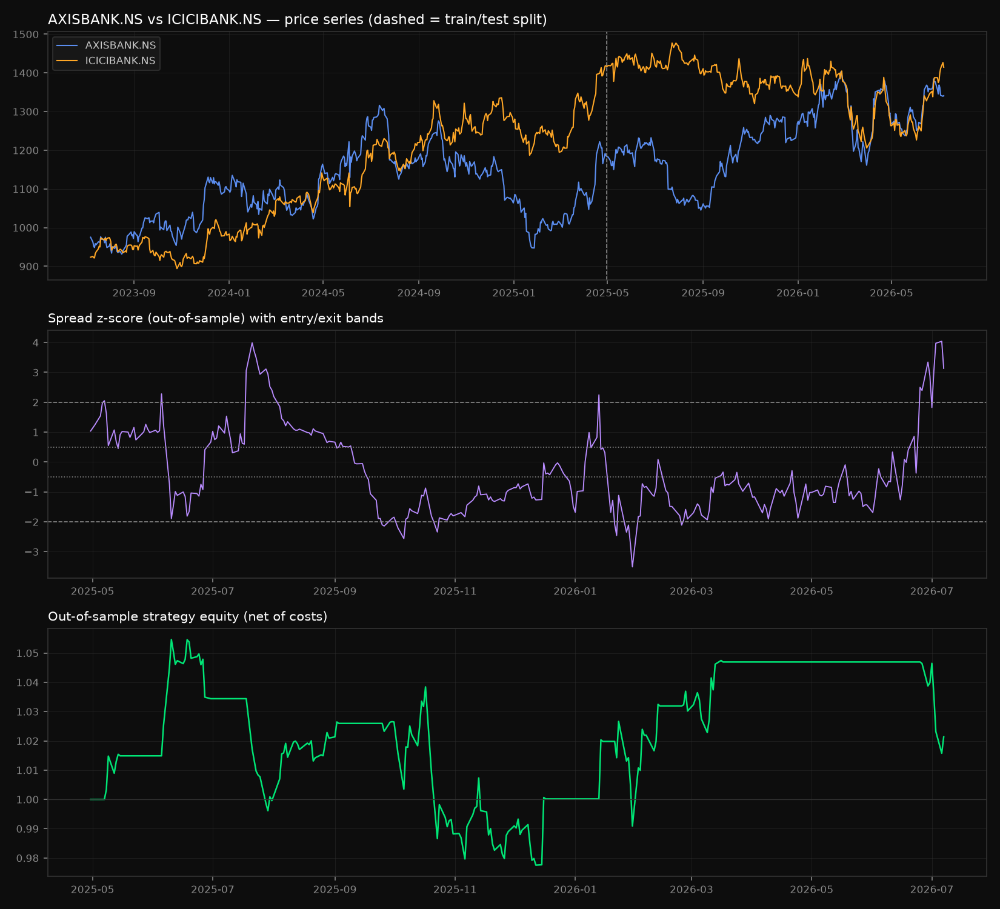

---

### KOTAKBANK.NS / HDFCBANK.NS

- **Latest prices:** KOTAKBANK.NS ₹381.70 · HDFCBANK.NS ₹829.30
- **Hedge ratio (train-fitted):** 1.7193
- **Cointegration (train):** FAIL at 5% — ADF -2.30, p=0.1711
- **Persistence:** passed 5% in 0 of 4 real-data runs (strict tier: 0/4)
- **Spread half-life:** 29.2 days
- **Current z-score:** +2.75
- **Signal today:** SHORT spread (short HDFCBANK.NS, long KOTAKBANK.NS)
- ⚠️ _Pair did not cointegrate on training data. Any signal here is not statistically justified — observation only._

**Out-of-sample backtest** (beta frozen from train window):

| Metric | Value |
|---|---|
| Sharpe | -0.24 |
| Sortino | -0.21 |
| Annualised return | -1.73% |
| Annualised vol | 6.41% |
| Max drawdown | -5.72% |
| Round-trip trades | 4 |

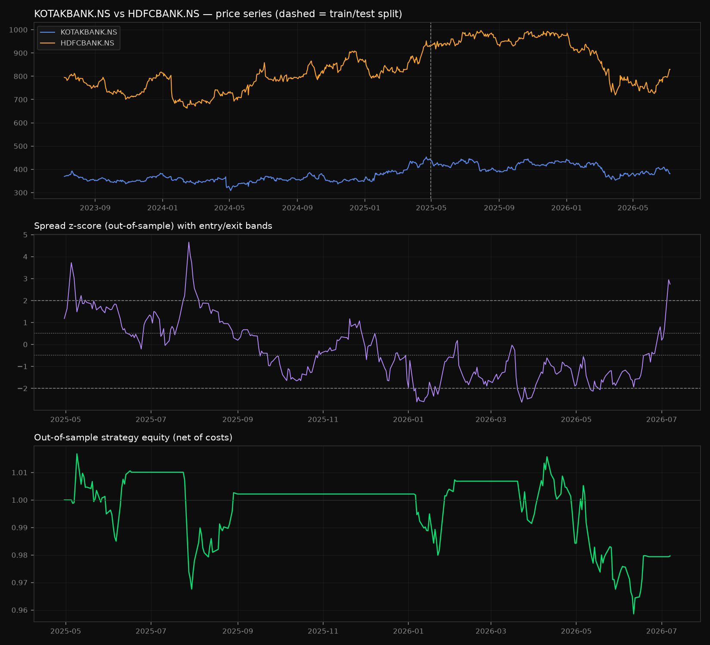

---

### SBIN.NS / BANKBARODA.NS

- **Latest prices:** SBIN.NS ₹1,038.10 · BANKBARODA.NS ₹247.85
- **Hedge ratio (train-fitted):** 0.2121
- **Cointegration (train):** FAIL at 5% — ADF -2.16, p=0.2205
- **Persistence:** passed 5% in 0 of 4 real-data runs (strict tier: 0/4)
- **Spread half-life:** 25.3 days
- **Current z-score:** -2.07
- **Signal today:** LONG spread (long BANKBARODA.NS, short SBIN.NS)
- ⚠️ _Pair did not cointegrate on training data. Any signal here is not statistically justified — observation only._

**Out-of-sample backtest** (beta frozen from train window):

| Metric | Value |
|---|---|
| Sharpe | 0.83 |
| Sortino | 0.62 |
| Annualised return | 7.69% |
| Annualised vol | 9.47% |
| Max drawdown | -9.16% |
| Round-trip trades | 6 |

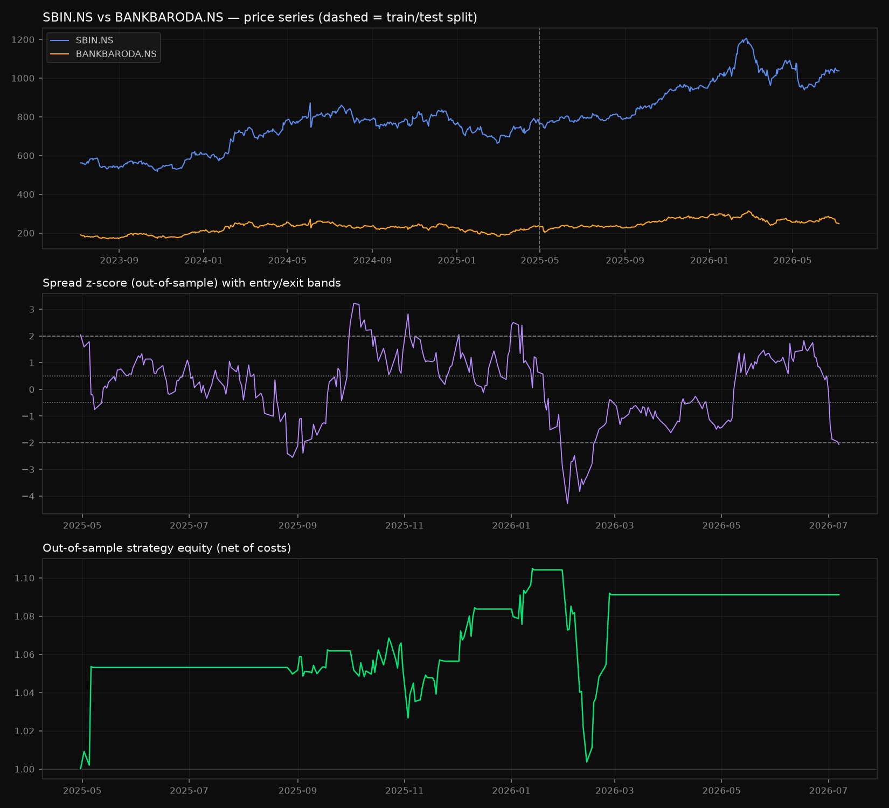

---

### TCS.NS / INFY.NS

- **Latest prices:** TCS.NS ₹2,096.10 · INFY.NS ₹1,071.80
- **Hedge ratio (train-fitted):** 0.5320
- **Cointegration (train):** FAIL at 5% — ADF -1.81, p=0.3743
- **Persistence:** passed 5% in 0 of 4 real-data runs (strict tier: 0/4)
- **Spread half-life:** 38.1 days
- **Current z-score:** +0.69
- **Signal today:** watch (approaching band)
- ⚠️ _Pair did not cointegrate on training data. Any signal here is not statistically justified — observation only._

**Out-of-sample backtest** (beta frozen from train window):

| Metric | Value |
|---|---|
| Sharpe | 0.98 |
| Sortino | 0.88 |
| Annualised return | 4.17% |
| Annualised vol | 4.27% |
| Max drawdown | -4.36% |
| Round-trip trades | 6 |

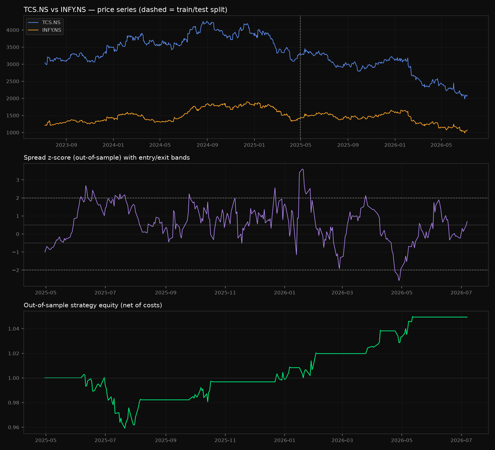

---

### INFY.NS / WIPRO.NS

- **Latest prices:** INFY.NS ₹1,071.80 · WIPRO.NS ₹173.00
- **Hedge ratio (train-fitted):** 0.1412
- **Cointegration (train):** FAIL at 5% — ADF -2.28, p=0.1794
- **Persistence:** passed 5% in 0 of 4 real-data runs (strict tier: 0/4)
- **Spread half-life:** 29.2 days
- **Current z-score:** -1.34
- **Signal today:** watch (approaching band)
- ⚠️ _Pair did not cointegrate on training data. Any signal here is not statistically justified — observation only._

**Out-of-sample backtest** (beta frozen from train window):

| Metric | Value |
|---|---|
| Sharpe | 1.66 |
| Sortino | 2.23 |
| Annualised return | 9.91% |
| Annualised vol | 5.79% |
| Max drawdown | -2.64% |
| Round-trip trades | 7 |

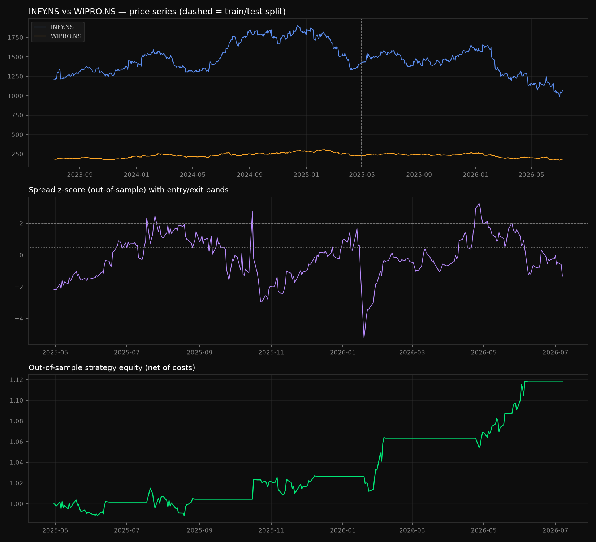

---

### HCLTECH.NS / TECHM.NS

- **Latest prices:** HCLTECH.NS ₹1,168.20 · TECHM.NS ₹1,447.50
- **Hedge ratio (train-fitted):** 0.7849
- **Cointegration (train):** FAIL at 5% — ADF -2.04, p=0.2713
- **Persistence:** passed 5% in 0 of 4 real-data runs (strict tier: 0/4)
- **Spread half-life:** 27.5 days
- **Current z-score:** +0.77
- **Signal today:** watch (approaching band)
- ⚠️ _Pair did not cointegrate on training data. Any signal here is not statistically justified — observation only._

**Out-of-sample backtest** (beta frozen from train window):

| Metric | Value |
|---|---|
| Sharpe | 0.22 |
| Sortino | 0.22 |
| Annualised return | 1.40% |
| Annualised vol | 7.53% |
| Max drawdown | -7.00% |
| Round-trip trades | 5 |

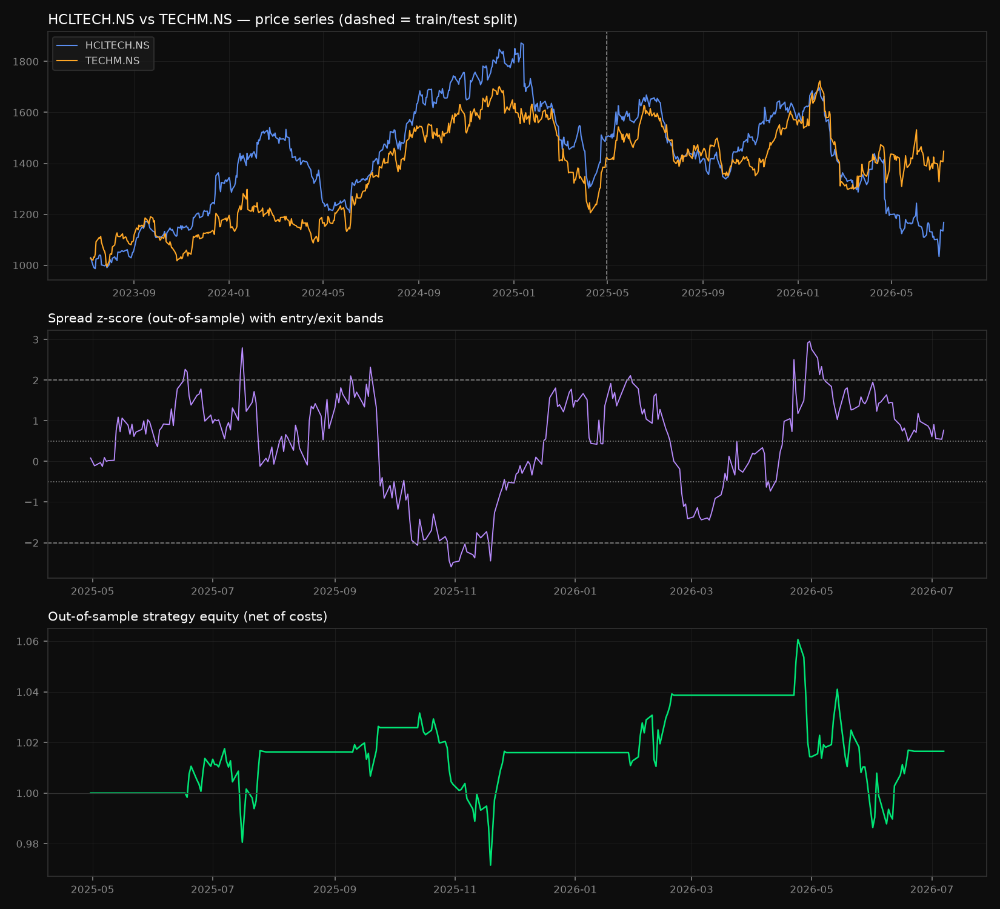

---

### ACC.NS / AMBUJACEM.NS

- **Latest prices:** ACC.NS ₹1,384.40 · AMBUJACEM.NS ₹435.90
- **Hedge ratio (train-fitted):** 0.2520
- **Cointegration (train):** FAIL at 5% — ADF -1.11, p=0.7105
- **Persistence:** passed 5% in 0 of 4 real-data runs (strict tier: 0/4)
- **Spread half-life:** 65.1 days
- **Current z-score:** -0.53
- **Signal today:** watch (approaching band)
- ⚠️ _Pair did not cointegrate on training data. Any signal here is not statistically justified — observation only._

**Out-of-sample backtest** (beta frozen from train window):

| Metric | Value |
|---|---|
| Sharpe | 0.54 |
| Sortino | 0.58 |
| Annualised return | 3.19% |
| Annualised vol | 6.10% |
| Max drawdown | -5.86% |
| Round-trip trades | 5 |

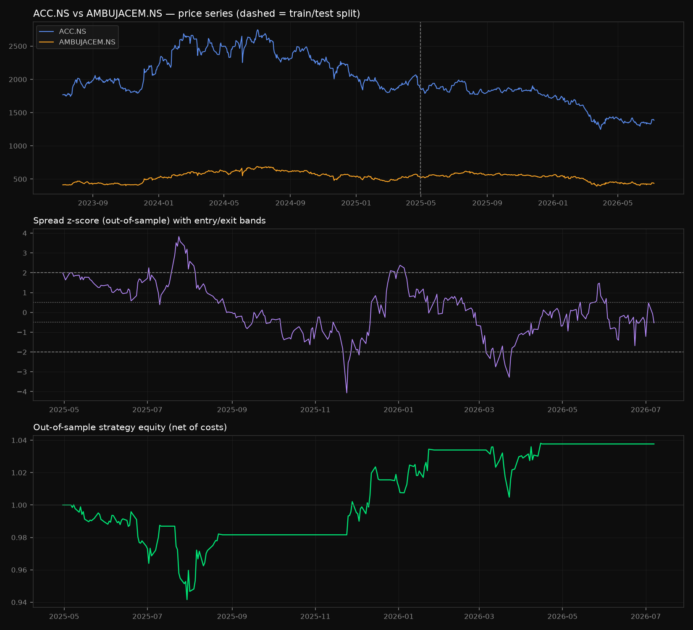

---

### ULTRACEMCO.NS / SHREECEM.NS

- **Latest prices:** ULTRACEMCO.NS ₹11,649.00 · SHREECEM.NS ₹26,710.00
- **Hedge ratio (train-fitted):** 0.5992
- **Cointegration (train):** FAIL at 5% — ADF -2.41, p=0.1383
- **Persistence:** passed 5% in 0 of 4 real-data runs (strict tier: 0/4)
- **Spread half-life:** 29.4 days
- **Current z-score:** +2.63
- **Signal today:** SHORT spread (short SHREECEM.NS, long ULTRACEMCO.NS)
- ⚠️ _Pair did not cointegrate on training data. Any signal here is not statistically justified — observation only._

**Out-of-sample backtest** (beta frozen from train window):

| Metric | Value |
|---|---|
| Sharpe | 0.25 |
| Sortino | 0.24 |
| Annualised return | 1.68% |
| Annualised vol | 7.89% |
| Max drawdown | -9.65% |
| Round-trip trades | 5 |

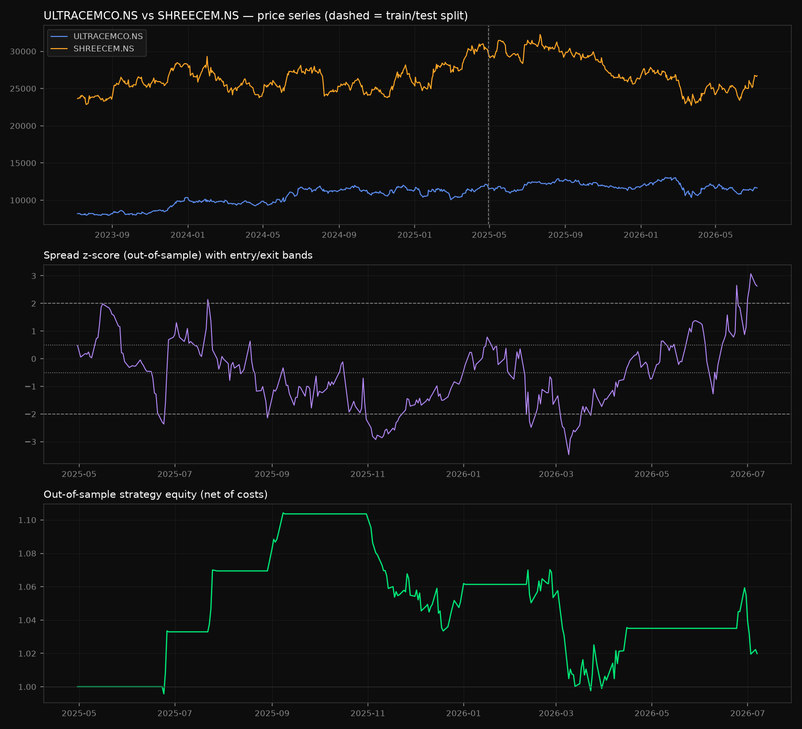

---

### IOC.NS / BPCL.NS

- **Latest prices:** IOC.NS ₹142.18 · BPCL.NS ₹313.95
- **Hedge ratio (train-fitted):** 1.7632
- **Cointegration (train):** FAIL at 5% — ADF -0.48, p=0.8949
- **Persistence:** passed 5% in 0 of 4 real-data runs (strict tier: 0/4)
- **Spread half-life:** 211.0 days
- **Current z-score:** +2.46
- **Signal today:** SHORT spread (short BPCL.NS, long IOC.NS)
- ⚠️ _Pair did not cointegrate on training data. Any signal here is not statistically justified — observation only._

**Out-of-sample backtest** (beta frozen from train window):

| Metric | Value |
|---|---|
| Sharpe | 0.48 |
| Sortino | 0.55 |
| Annualised return | 3.31% |
| Annualised vol | 7.28% |
| Max drawdown | -6.93% |
| Round-trip trades | 7 |

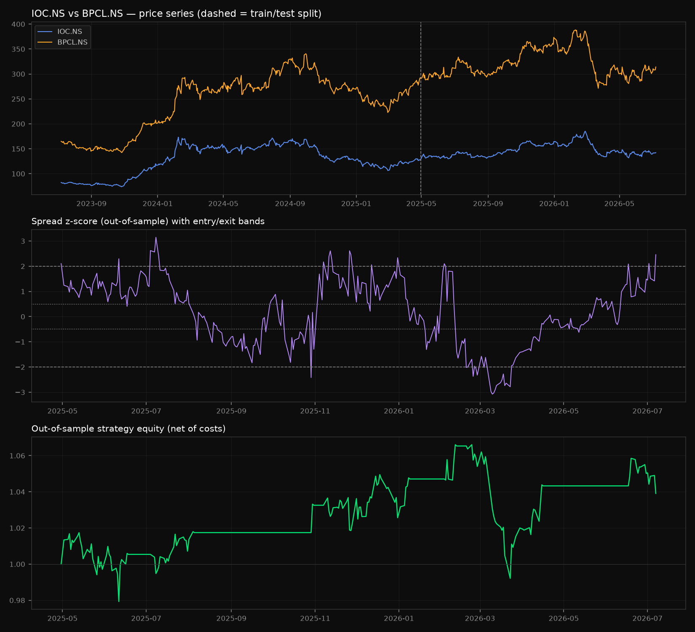

---

### BPCL.NS / HINDPETRO.NS

- **Latest prices:** BPCL.NS ₹313.95 · HINDPETRO.NS ₹405.95
- **Hedge ratio (train-fitted):** 1.4232
- **Cointegration (train):** FAIL at 5% — ADF -1.92, p=0.3221
- **Persistence:** passed 5% in 0 of 4 real-data runs (strict tier: 0/4)
- **Spread half-life:** 41.4 days
- **Current z-score:** +0.27
- **Signal today:** flat / no stretch
- ⚠️ _Pair did not cointegrate on training data. Any signal here is not statistically justified — observation only._

**Out-of-sample backtest** (beta frozen from train window):

| Metric | Value |
|---|---|
| Sharpe | 0.21 |
| Sortino | 0.18 |
| Annualised return | 1.12% |
| Annualised vol | 6.21% |
| Max drawdown | -7.22% |
| Round-trip trades | 5 |

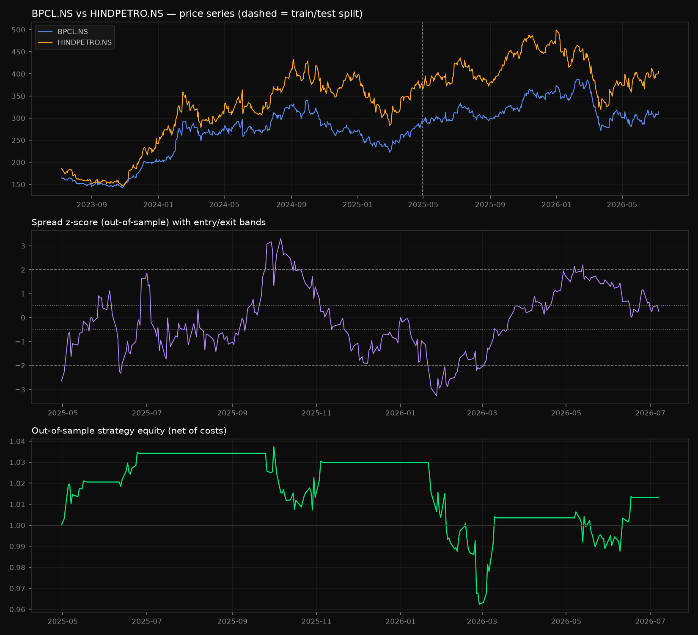

---

### ONGC.NS / COALINDIA.NS

- **Latest prices:** ONGC.NS ₹244.18 · COALINDIA.NS ₹428.95
- **Hedge ratio (train-fitted):** 1.7337
- **Cointegration (train):** FAIL at 5% — ADF -2.78, p=0.0610
- **Persistence:** passed 5% in 0 of 4 real-data runs (strict tier: 0/4)
- **Spread half-life:** 17.0 days
- **Current z-score:** +0.57
- **Signal today:** watch (approaching band)
- ⚠️ _Pair did not cointegrate on training data. Any signal here is not statistically justified — observation only._

**Out-of-sample backtest** (beta frozen from train window):

| Metric | Value |
|---|---|
| Sharpe | 1.04 |
| Sortino | 0.98 |
| Annualised return | 8.62% |
| Annualised vol | 8.30% |
| Max drawdown | -6.09% |
| Round-trip trades | 5 |

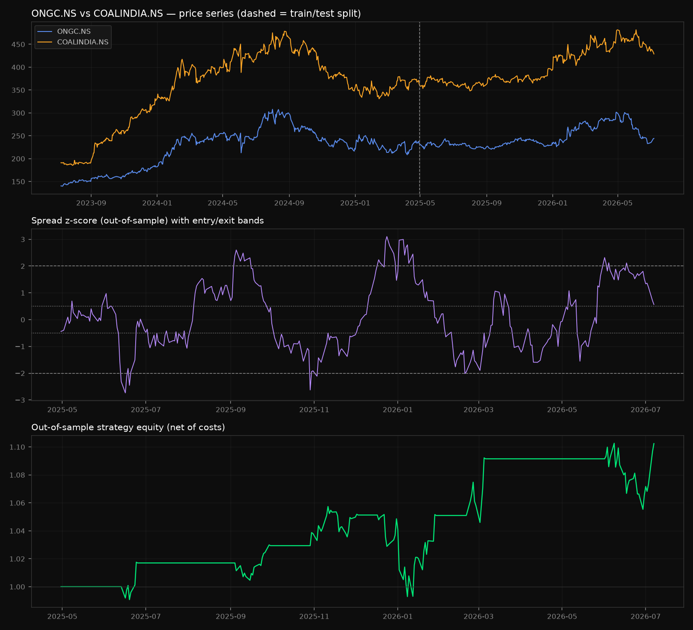

---

### NTPC.NS / POWERGRID.NS

- **Latest prices:** NTPC.NS ₹354.20 · POWERGRID.NS ₹284.35
- **Hedge ratio (train-fitted):** 0.8107
- **Cointegration (train):** FAIL at 5% — ADF -2.76, p=0.0637
- **Persistence:** passed 5% in 0 of 4 real-data runs (strict tier: 0/4)
- **Spread half-life:** 21.6 days
- **Current z-score:** +0.75
- **Signal today:** watch (approaching band)
- ⚠️ _Pair did not cointegrate on training data. Any signal here is not statistically justified — observation only._

**Out-of-sample backtest** (beta frozen from train window):

| Metric | Value |
|---|---|
| Sharpe | 0.82 |
| Sortino | 0.69 |
| Annualised return | 4.47% |
| Annualised vol | 5.52% |
| Max drawdown | -4.99% |
| Round-trip trades | 7 |

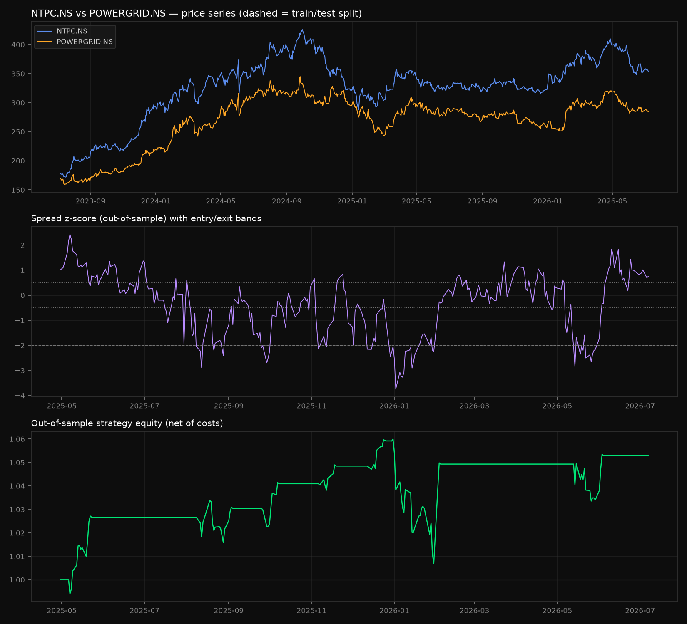

---

### BAJAJ-AUTO.NS / HEROMOTOCO.NS

- **Latest prices:** BAJAJ-AUTO.NS ₹10,109.50 · HEROMOTOCO.NS ₹4,995.40
- **Hedge ratio (train-fitted):** 0.4111
- **Cointegration (train):** FAIL at 5% — ADF -2.15, p=0.2264
- **Persistence:** passed 5% in 0 of 4 real-data runs (strict tier: 0/4)
- **Spread half-life:** 31.7 days
- **Current z-score:** -0.21
- **Signal today:** flat / no stretch
- ⚠️ _Pair did not cointegrate on training data. Any signal here is not statistically justified — observation only._

**Out-of-sample backtest** (beta frozen from train window):

| Metric | Value |
|---|---|
| Sharpe | -1.41 |
| Sortino | -1.47 |
| Annualised return | -15.65% |
| Annualised vol | 11.56% |
| Max drawdown | -22.78% |
| Round-trip trades | 4 |

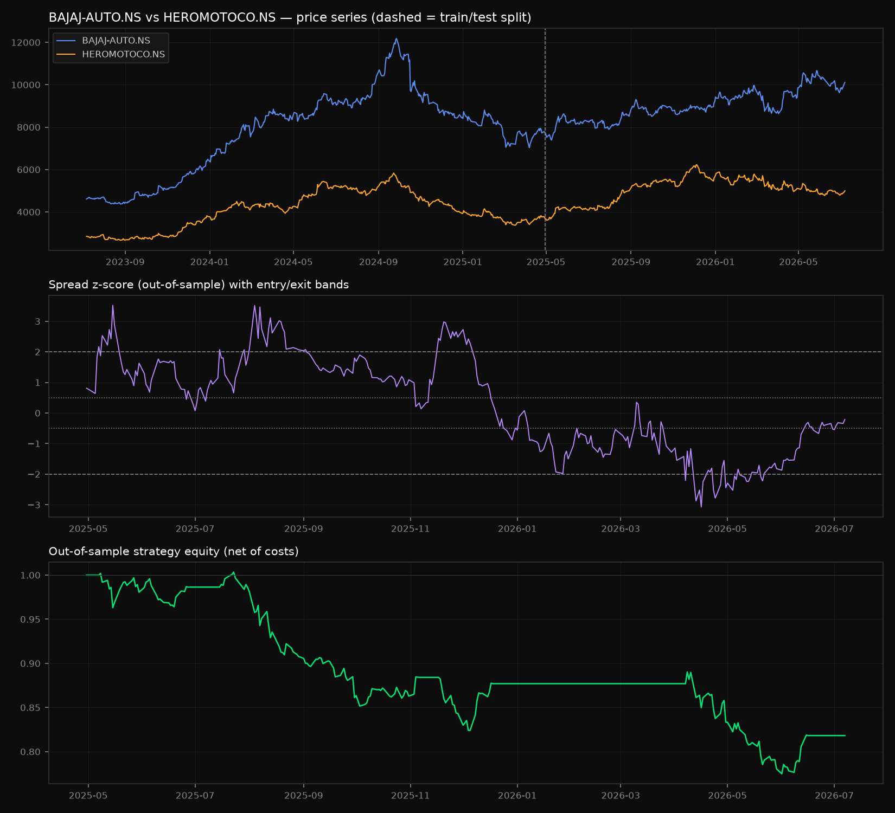

---

### TATASTEEL.NS / JSWSTEEL.NS

- **Latest prices:** TATASTEEL.NS ₹189.79 · JSWSTEEL.NS ₹1,246.40
- **Hedge ratio (train-fitted):** 2.9964
- **Cointegration (train):** FAIL at 5% — ADF -0.08, p=0.9512
- **Persistence:** passed 5% in 0 of 4 real-data runs (strict tier: 0/4)
- **Spread half-life:** 176.5 days
- **Current z-score:** +0.97
- **Signal today:** watch (approaching band)
- ⚠️ _Pair did not cointegrate on training data. Any signal here is not statistically justified — observation only._

**Out-of-sample backtest** (beta frozen from train window):

| Metric | Value |
|---|---|
| Sharpe | 0.26 |
| Sortino | 0.21 |
| Annualised return | 1.65% |
| Annualised vol | 7.46% |
| Max drawdown | -4.41% |
| Round-trip trades | 4 |

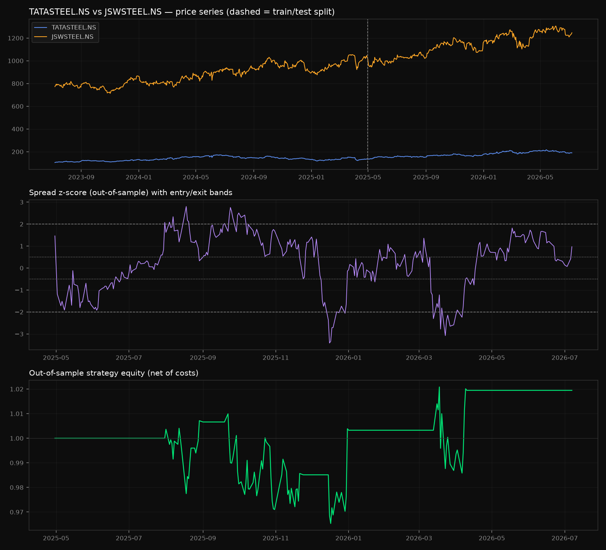

---

### SUNPHARMA.NS / CIPLA.NS

- **Latest prices:** SUNPHARMA.NS ₹1,903.40 · CIPLA.NS ₹1,451.80
- **Hedge ratio (train-fitted):** 0.5242
- **Cointegration (train):** PASS at 5% — ADF -3.59, p=0.0060
- **Persistence:** passed 5% in 4 of 4 real-data runs (strict tier: 0/4)
- **Spread half-life:** 11.7 days
- **Current z-score:** +0.84
- **Signal today:** watch (approaching band)

**Out-of-sample backtest** (beta frozen from train window):

| Metric | Value |
|---|---|
| Sharpe | -0.14 |
| Sortino | -0.15 |
| Annualised return | -1.23% |
| Annualised vol | 7.18% |
| Max drawdown | -9.70% |
| Round-trip trades | 5 |

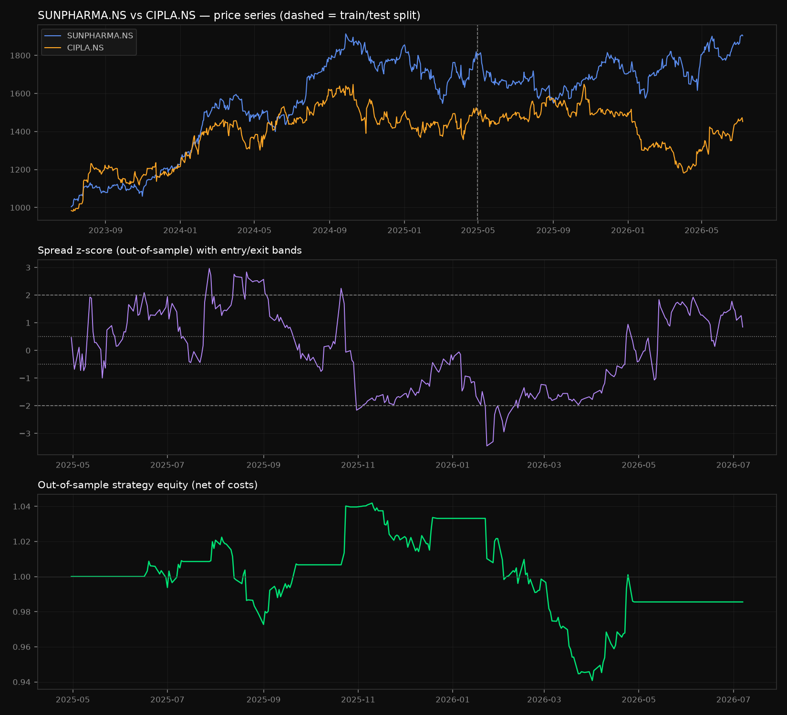

---

_Generated 2026-07-07 · pairs mean-reversion scanner · out-of-sample backtest · multiple-testing-aware · not investment advice._
