# Indian Pairs-Trading Scanner — 2026-07-09

> **What this is:** a market-neutral *pairs mean-reversion* scanner. It flags when two related NSE stocks have drifted apart far enough that their historical relationship signals a possible convergence trade. It does **not** forecast growth, rank "best" stocks, or predict company performance. A signal means the *spread between two stocks* is stretched — nothing about either stock being a good investment. Not investment advice; do your own research.

## Methodology (fixed in advance)

- **Universe:** 16 declared sector-mate pairs. Parameters (3y window, 60/40 train-test, z-entry 2.0, z-exit 0.5, 5 bps costs) are pre-registered; changes are logged in the README changelog *before* looking at results.
- **Multiple testing:** at the 5% level across 16 pairs, **≈0.8 false positives per run are expected by chance alone** even if nothing truly cointegrates. A single-day pass is a candidate, not a discovery.
- **Strict tier:** Bonferroni-corrected threshold p < 0.0031 (marked ✓✓).
- **Evidence = persistence:** the Persistence column counts how often each pair has passed the 5% test across all *real-data* daily runs recorded in `reports/history.csv`. Pairs deserve attention only when they pass persistently.

## Summary

| Pair | p-value | Coint. | Persistence | Current z | Signal | OOS Sharpe |
|---|---|---|---|---|---|---|
| HDFCBANK.NS/ICICIBANK.NS | 0.1138 | ✗ | 0/6 | -0.39 | flat / no stretch | -0.30 |
| AXISBANK.NS/ICICIBANK.NS | 0.9303 | ✗ | 0/6 | +2.78 | SHORT spread | 0.25 |
| KOTAKBANK.NS/HDFCBANK.NS | 0.1711 | ✗ | 0/6 | +2.33 | SHORT spread | -0.21 |
| SBIN.NS/BANKBARODA.NS | 0.2223 | ✗ | 0/6 | -1.84 | watch | 0.40 |
| TCS.NS/INFY.NS | 0.3855 | ✗ | 0/6 | +0.75 | watch | 0.98 |
| INFY.NS/WIPRO.NS | 0.1756 | ✗ | 0/6 | -0.93 | watch | 1.69 |
| HCLTECH.NS/TECHM.NS | 0.2630 | ✗ | 0/6 | +0.61 | watch | 0.22 |
| ACC.NS/AMBUJACEM.NS | 0.7532 | ✗ | 0/6 | -0.88 | watch | 0.54 |
| ULTRACEMCO.NS/SHREECEM.NS | 0.1322 | ✗ | 0/6 | +1.90 | watch | 0.34 |
| IOC.NS/BPCL.NS | 0.8488 | ✗ | 0/6 | +2.45 | SHORT spread | 0.76 |
| BPCL.NS/HINDPETRO.NS | 0.3079 | ✗ | 0/6 | -0.29 | flat / no stretch | 0.16 |
| ONGC.NS/COALINDIA.NS | 0.0591 | ✗ | 0/6 | +0.57 | watch | 1.09 |
| NTPC.NS/POWERGRID.NS | 0.0754 | ✗ | 0/6 | +1.45 | watch | 0.82 |
| BAJAJ-AUTO.NS/HEROMOTOCO.NS | 0.2324 | ✗ | 0/6 | -0.73 | watch | -1.41 |
| TATASTEEL.NS/JSWSTEEL.NS | 0.9434 | ✗ | 0/6 | +0.26 | flat / no stretch | 0.26 |
| SUNPHARMA.NS/CIPLA.NS | 0.0050 | ✓ | 6/6 | +0.16 | flat / no stretch | -0.13 |

_Legend: ✓✓ passes strict Bonferroni tier · ✓ passes 5% only · ✗ fails. Persistence = 5%-passes / real-data runs recorded. \*no real-data history yet._

---

### HDFCBANK.NS / ICICIBANK.NS

- **Latest prices:** HDFCBANK.NS ₹817.55 · ICICIBANK.NS ₹1,380.70
- **Hedge ratio (train-fitted):** 1.7089
- **Cointegration (train):** FAIL at 5% — ADF -2.51, p=0.1138
- **Persistence:** passed 5% in 0 of 6 real-data runs (strict tier: 0/6)
- **Spread half-life:** 33.3 days
- **Current z-score:** -0.39
- **Signal today:** flat / no stretch
- ⚠️ _Pair did not cointegrate on training data. Any signal here is not statistically justified — observation only._

**Out-of-sample backtest** (beta frozen from train window):

| Metric | Value |
|---|---|
| Sharpe | -0.30 |
| Sortino | -0.31 |
| Annualised return | -1.99% |
| Annualised vol | 6.02% |
| Max drawdown | -8.58% |
| Round-trip trades | 5 |

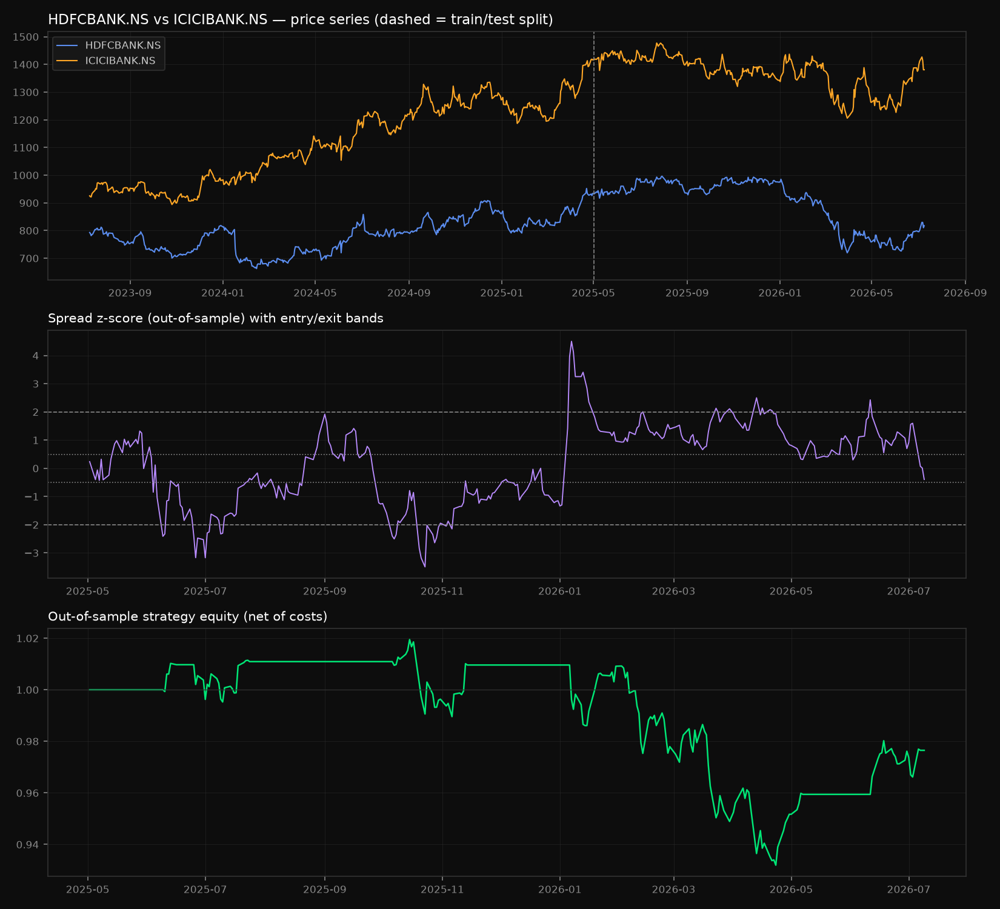

---

### AXISBANK.NS / ICICIBANK.NS

- **Latest prices:** AXISBANK.NS ₹1,297.60 · ICICIBANK.NS ₹1,380.70
- **Hedge ratio (train-fitted):** 0.8716
- **Cointegration (train):** FAIL at 5% — ADF -0.27, p=0.9303
- **Persistence:** passed 5% in 0 of 6 real-data runs (strict tier: 0/6)
- **Spread half-life:** 281.1 days
- **Current z-score:** +2.78
- **Signal today:** SHORT spread (short ICICIBANK.NS, long AXISBANK.NS)
- ⚠️ _Pair did not cointegrate on training data. Any signal here is not statistically justified — observation only._

**Out-of-sample backtest** (beta frozen from train window):

| Metric | Value |
|---|---|
| Sharpe | 0.25 |
| Sortino | 0.26 |
| Annualised return | 1.67% |
| Annualised vol | 8.10% |
| Max drawdown | -7.31% |
| Round-trip trades | 7 |

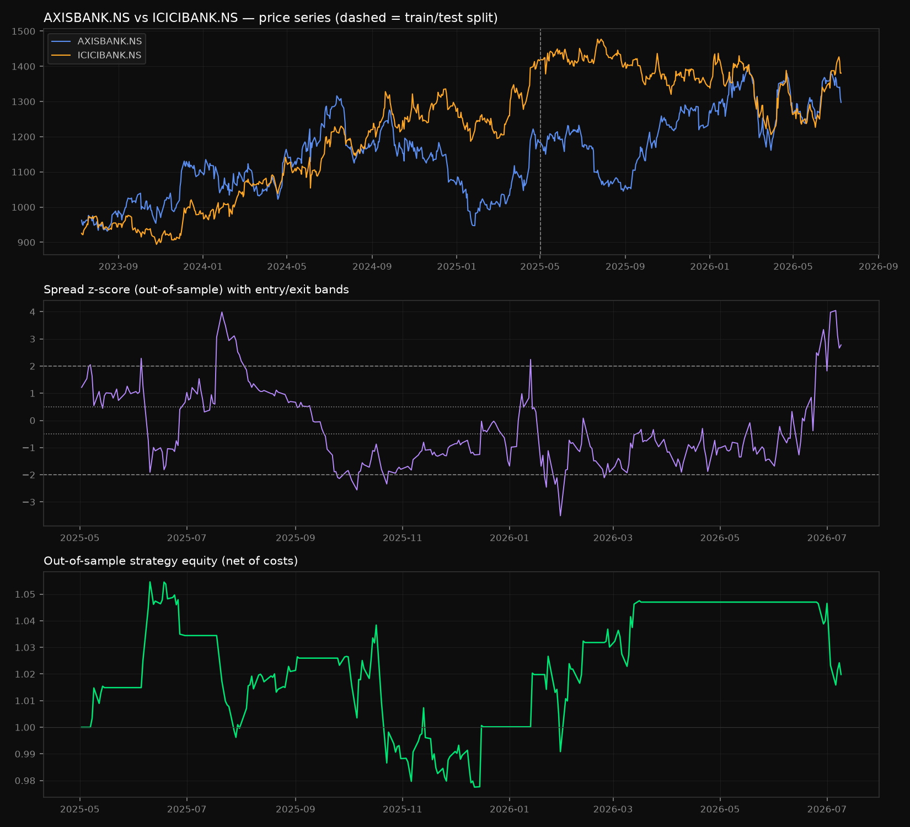

---

### KOTAKBANK.NS / HDFCBANK.NS

- **Latest prices:** KOTAKBANK.NS ₹377.15 · HDFCBANK.NS ₹817.55
- **Hedge ratio (train-fitted):** 1.7242
- **Cointegration (train):** FAIL at 5% — ADF -2.30, p=0.1711
- **Persistence:** passed 5% in 0 of 6 real-data runs (strict tier: 0/6)
- **Spread half-life:** 29.2 days
- **Current z-score:** +2.33
- **Signal today:** SHORT spread (short HDFCBANK.NS, long KOTAKBANK.NS)
- ⚠️ _Pair did not cointegrate on training data. Any signal here is not statistically justified — observation only._

**Out-of-sample backtest** (beta frozen from train window):

| Metric | Value |
|---|---|
| Sharpe | -0.21 |
| Sortino | -0.19 |
| Annualised return | -1.55% |
| Annualised vol | 6.44% |
| Max drawdown | -5.76% |
| Round-trip trades | 4 |

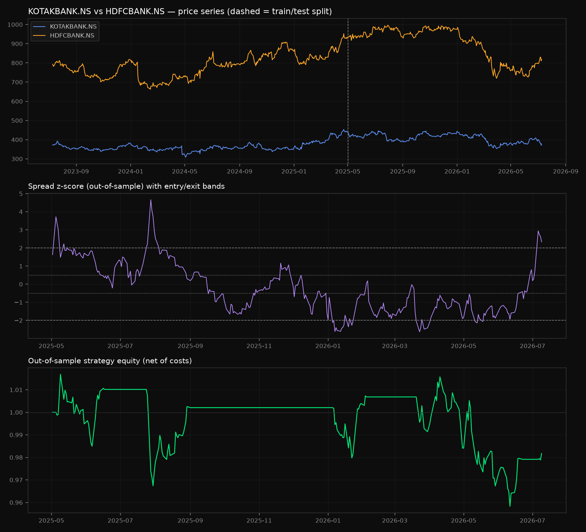

---

### SBIN.NS / BANKBARODA.NS

- **Latest prices:** SBIN.NS ₹1,022.10 · BANKBARODA.NS ₹244.60
- **Hedge ratio (train-fitted):** 0.2122
- **Cointegration (train):** FAIL at 5% — ADF -2.16, p=0.2223
- **Persistence:** passed 5% in 0 of 6 real-data runs (strict tier: 0/6)
- **Spread half-life:** 25.5 days
- **Current z-score:** -1.84
- **Signal today:** watch (approaching band)
- ⚠️ _Pair did not cointegrate on training data. Any signal here is not statistically justified — observation only._

**Out-of-sample backtest** (beta frozen from train window):

| Metric | Value |
|---|---|
| Sharpe | 0.40 |
| Sortino | 0.26 |
| Annualised return | 3.02% |
| Annualised vol | 8.19% |
| Max drawdown | -9.18% |
| Round-trip trades | 5 |

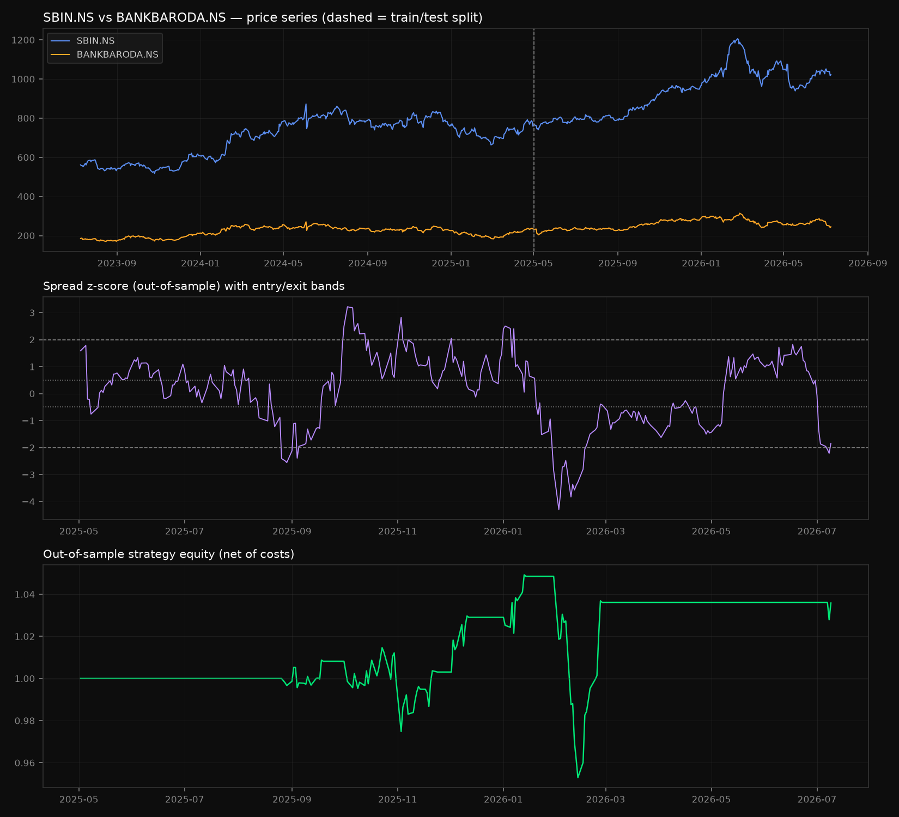

---

### TCS.NS / INFY.NS

- **Latest prices:** TCS.NS ₹2,049.50 · INFY.NS ₹1,050.80
- **Hedge ratio (train-fitted):** 0.5314
- **Cointegration (train):** FAIL at 5% — ADF -1.79, p=0.3855
- **Persistence:** passed 5% in 0 of 6 real-data runs (strict tier: 0/6)
- **Spread half-life:** 38.7 days
- **Current z-score:** +0.75
- **Signal today:** watch (approaching band)
- ⚠️ _Pair did not cointegrate on training data. Any signal here is not statistically justified — observation only._

**Out-of-sample backtest** (beta frozen from train window):

| Metric | Value |
|---|---|
| Sharpe | 0.98 |
| Sortino | 0.87 |
| Annualised return | 4.17% |
| Annualised vol | 4.27% |
| Max drawdown | -4.36% |
| Round-trip trades | 6 |

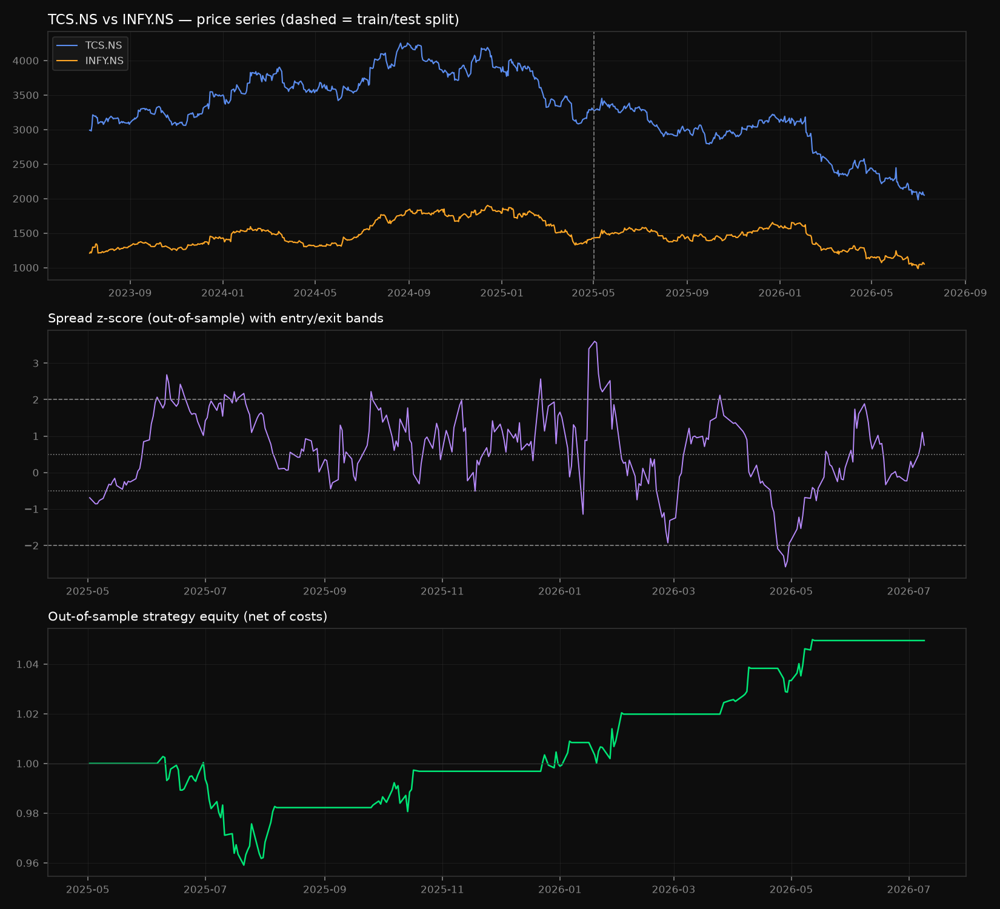

---

### INFY.NS / WIPRO.NS

- **Latest prices:** INFY.NS ₹1,050.80 · WIPRO.NS ₹172.76
- **Hedge ratio (train-fitted):** 0.1410
- **Cointegration (train):** FAIL at 5% — ADF -2.29, p=0.1756
- **Persistence:** passed 5% in 0 of 6 real-data runs (strict tier: 0/6)
- **Spread half-life:** 29.1 days
- **Current z-score:** -0.93
- **Signal today:** watch (approaching band)
- ⚠️ _Pair did not cointegrate on training data. Any signal here is not statistically justified — observation only._

**Out-of-sample backtest** (beta frozen from train window):

| Metric | Value |
|---|---|
| Sharpe | 1.69 |
| Sortino | 2.24 |
| Annualised return | 10.01% |
| Annualised vol | 5.76% |
| Max drawdown | -2.63% |
| Round-trip trades | 7 |

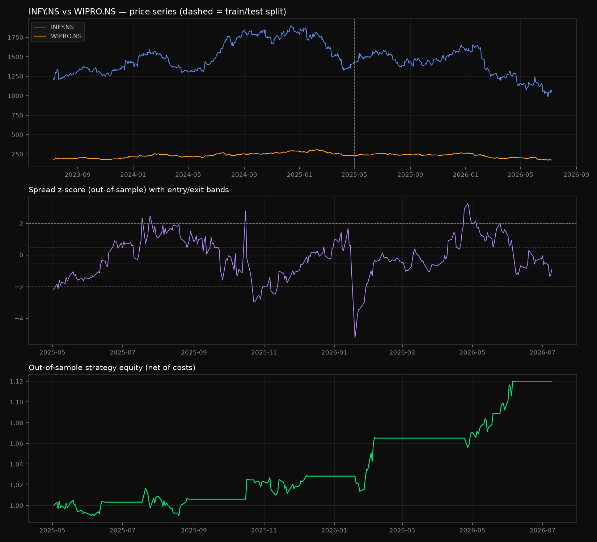

---

### HCLTECH.NS / TECHM.NS

- **Latest prices:** HCLTECH.NS ₹1,150.40 · TECHM.NS ₹1,426.30
- **Hedge ratio (train-fitted):** 0.7854
- **Cointegration (train):** FAIL at 5% — ADF -2.06, p=0.2630
- **Persistence:** passed 5% in 0 of 6 real-data runs (strict tier: 0/6)
- **Spread half-life:** 27.5 days
- **Current z-score:** +0.61
- **Signal today:** watch (approaching band)
- ⚠️ _Pair did not cointegrate on training data. Any signal here is not statistically justified — observation only._

**Out-of-sample backtest** (beta frozen from train window):

| Metric | Value |
|---|---|
| Sharpe | 0.22 |
| Sortino | 0.22 |
| Annualised return | 1.39% |
| Annualised vol | 7.53% |
| Max drawdown | -7.01% |
| Round-trip trades | 5 |

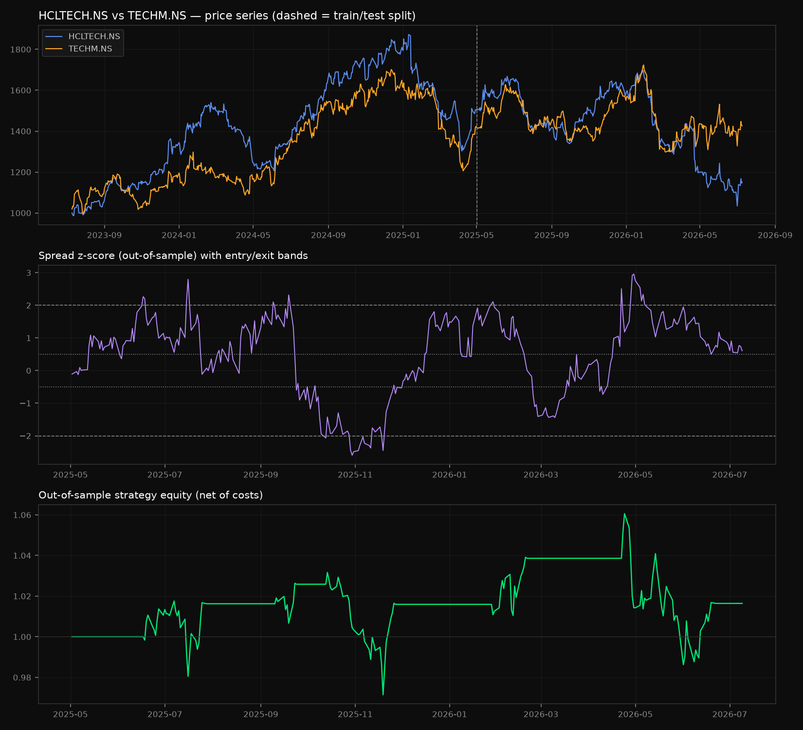

---

### ACC.NS / AMBUJACEM.NS

- **Latest prices:** ACC.NS ₹1,362.20 · AMBUJACEM.NS ₹428.15
- **Hedge ratio (train-fitted):** 0.2510
- **Cointegration (train):** FAIL at 5% — ADF -1.00, p=0.7532
- **Persistence:** passed 5% in 0 of 6 real-data runs (strict tier: 0/6)
- **Spread half-life:** 70.9 days
- **Current z-score:** -0.88
- **Signal today:** watch (approaching band)
- ⚠️ _Pair did not cointegrate on training data. Any signal here is not statistically justified — observation only._

**Out-of-sample backtest** (beta frozen from train window):

| Metric | Value |
|---|---|
| Sharpe | 0.54 |
| Sortino | 0.58 |
| Annualised return | 3.22% |
| Annualised vol | 6.21% |
| Max drawdown | -5.97% |
| Round-trip trades | 5 |

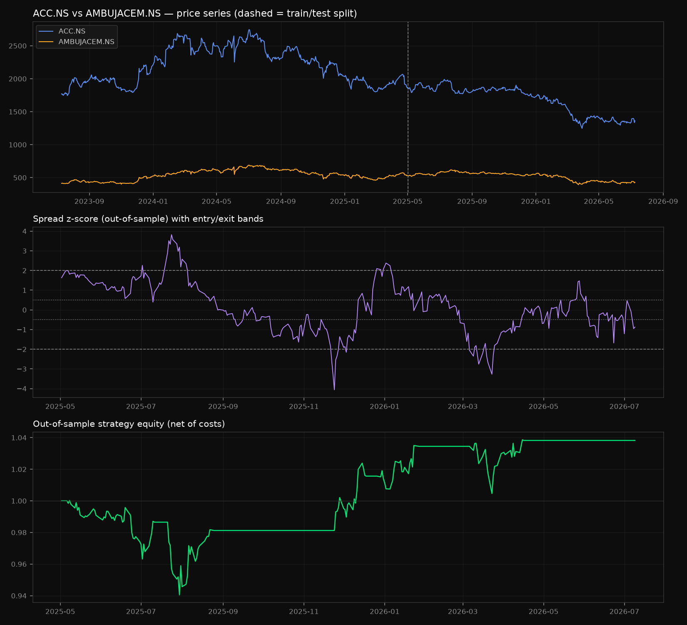

---

### ULTRACEMCO.NS / SHREECEM.NS

- **Latest prices:** ULTRACEMCO.NS ₹11,524.00 · SHREECEM.NS ₹26,295.00
- **Hedge ratio (train-fitted):** 0.6007
- **Cointegration (train):** FAIL at 5% — ADF -2.43, p=0.1322
- **Persistence:** passed 5% in 0 of 6 real-data runs (strict tier: 0/6)
- **Spread half-life:** 29.1 days
- **Current z-score:** +1.90
- **Signal today:** watch (approaching band)
- ⚠️ _Pair did not cointegrate on training data. Any signal here is not statistically justified — observation only._

**Out-of-sample backtest** (beta frozen from train window):

| Metric | Value |
|---|---|
| Sharpe | 0.34 |
| Sortino | 0.34 |
| Annualised return | 2.49% |
| Annualised vol | 8.16% |
| Max drawdown | -9.75% |
| Round-trip trades | 5 |

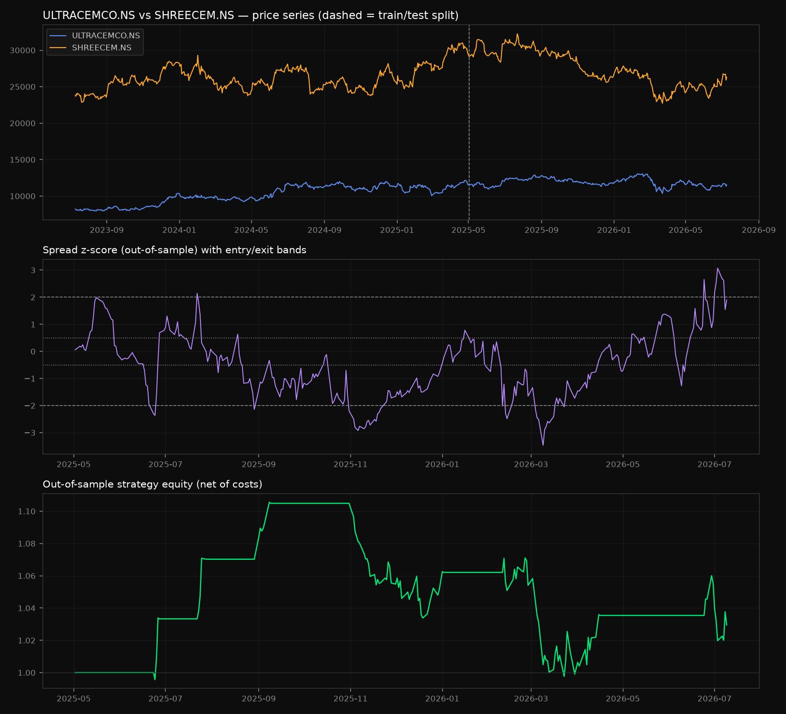

---

### IOC.NS / BPCL.NS

- **Latest prices:** IOC.NS ₹138.26 · BPCL.NS ₹308.20
- **Hedge ratio (train-fitted):** 1.7635
- **Cointegration (train):** FAIL at 5% — ADF -0.69, p=0.8488
- **Persistence:** passed 5% in 0 of 6 real-data runs (strict tier: 0/6)
- **Spread half-life:** 148.3 days
- **Current z-score:** +2.45
- **Signal today:** SHORT spread (short BPCL.NS, long IOC.NS)
- ⚠️ _Pair did not cointegrate on training data. Any signal here is not statistically justified — observation only._

**Out-of-sample backtest** (beta frozen from train window):

| Metric | Value |
|---|---|
| Sharpe | 0.76 |
| Sortino | 0.78 |
| Annualised return | 4.80% |
| Annualised vol | 6.46% |
| Max drawdown | -6.81% |
| Round-trip trades | 7 |

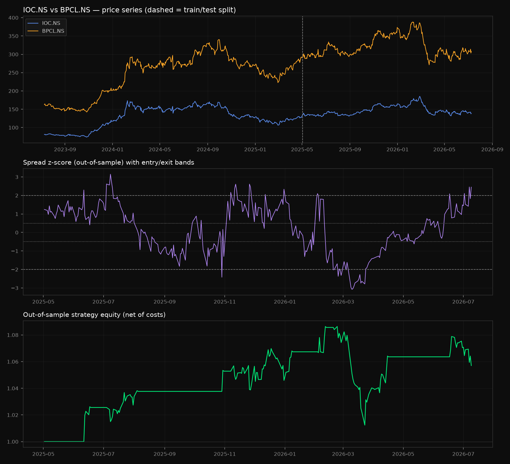

---

### BPCL.NS / HINDPETRO.NS

- **Latest prices:** BPCL.NS ₹308.20 · HINDPETRO.NS ₹392.10
- **Hedge ratio (train-fitted):** 1.4232
- **Cointegration (train):** FAIL at 5% — ADF -1.95, p=0.3079
- **Persistence:** passed 5% in 0 of 6 real-data runs (strict tier: 0/6)
- **Spread half-life:** 40.6 days
- **Current z-score:** -0.29
- **Signal today:** flat / no stretch
- ⚠️ _Pair did not cointegrate on training data. Any signal here is not statistically justified — observation only._

**Out-of-sample backtest** (beta frozen from train window):

| Metric | Value |
|---|---|
| Sharpe | 0.16 |
| Sortino | 0.14 |
| Annualised return | 0.80% |
| Annualised vol | 6.13% |
| Max drawdown | -7.16% |
| Round-trip trades | 5 |

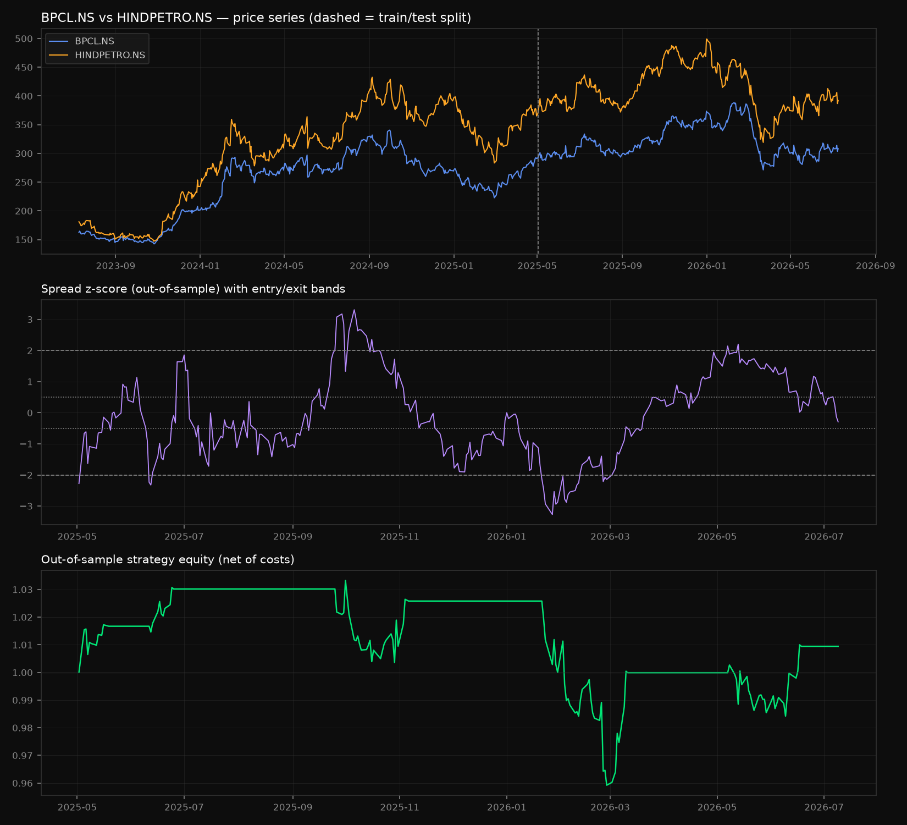

---

### ONGC.NS / COALINDIA.NS

- **Latest prices:** ONGC.NS ₹243.65 · COALINDIA.NS ₹429.90
- **Hedge ratio (train-fitted):** 1.7315
- **Cointegration (train):** FAIL at 5% — ADF -2.79, p=0.0591
- **Persistence:** passed 5% in 0 of 6 real-data runs (strict tier: 0/6)
- **Spread half-life:** 17.0 days
- **Current z-score:** +0.57
- **Signal today:** watch (approaching band)
- ⚠️ _Pair did not cointegrate on training data. Any signal here is not statistically justified — observation only._

**Out-of-sample backtest** (beta frozen from train window):

| Metric | Value |
|---|---|
| Sharpe | 1.09 |
| Sortino | 1.03 |
| Annualised return | 9.17% |
| Annualised vol | 8.35% |
| Max drawdown | -6.13% |
| Round-trip trades | 6 |

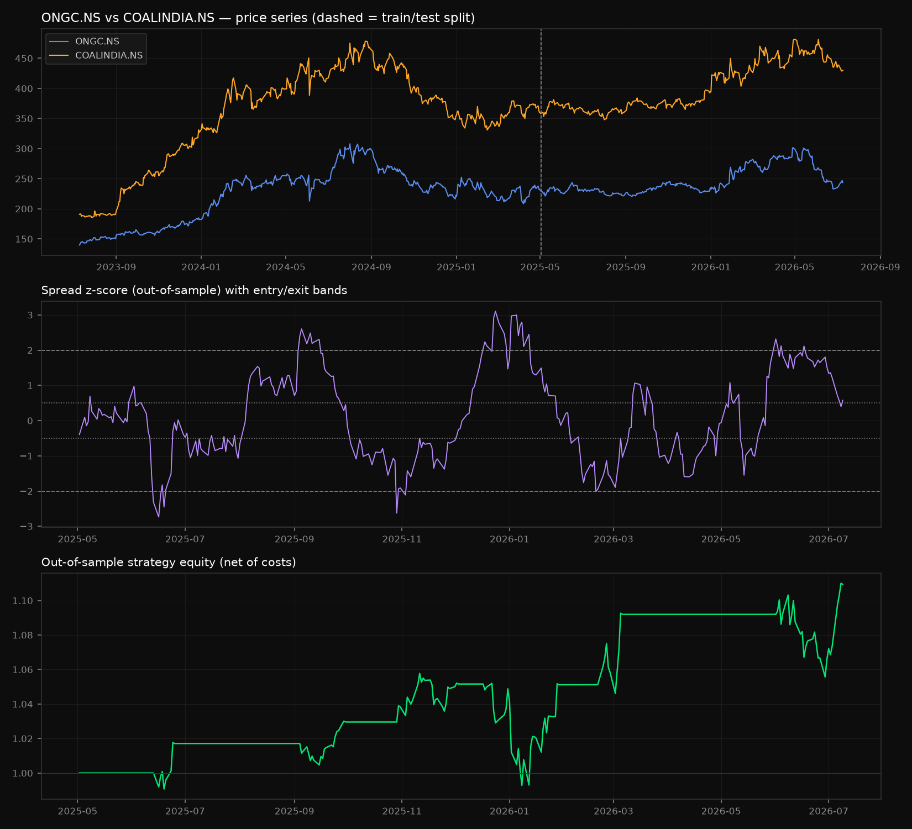

---

### NTPC.NS / POWERGRID.NS

- **Latest prices:** NTPC.NS ₹343.70 · POWERGRID.NS ₹281.35
- **Hedge ratio (train-fitted):** 0.8125
- **Cointegration (train):** FAIL at 5% — ADF -2.69, p=0.0754
- **Persistence:** passed 5% in 0 of 6 real-data runs (strict tier: 0/6)
- **Spread half-life:** 22.0 days
- **Current z-score:** +1.45
- **Signal today:** watch (approaching band)
- ⚠️ _Pair did not cointegrate on training data. Any signal here is not statistically justified — observation only._

**Out-of-sample backtest** (beta frozen from train window):

| Metric | Value |
|---|---|
| Sharpe | 0.82 |
| Sortino | 0.69 |
| Annualised return | 4.52% |
| Annualised vol | 5.59% |
| Max drawdown | -5.07% |
| Round-trip trades | 7 |

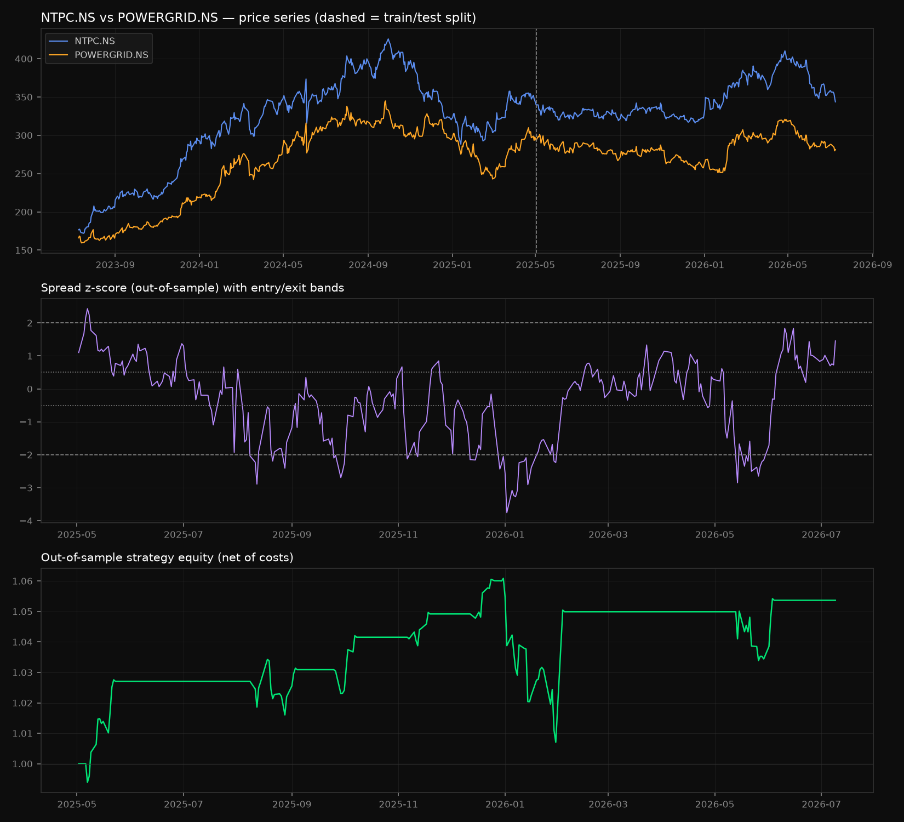

---

### BAJAJ-AUTO.NS / HEROMOTOCO.NS

- **Latest prices:** BAJAJ-AUTO.NS ₹10,155.00 · HEROMOTOCO.NS ₹4,898.50
- **Hedge ratio (train-fitted):** 0.4112
- **Cointegration (train):** FAIL at 5% — ADF -2.13, p=0.2324
- **Persistence:** passed 5% in 0 of 6 real-data runs (strict tier: 0/6)
- **Spread half-life:** 32.0 days
- **Current z-score:** -0.73
- **Signal today:** watch (approaching band)
- ⚠️ _Pair did not cointegrate on training data. Any signal here is not statistically justified — observation only._

**Out-of-sample backtest** (beta frozen from train window):

| Metric | Value |
|---|---|
| Sharpe | -1.41 |
| Sortino | -1.46 |
| Annualised return | -15.98% |
| Annualised vol | 11.83% |
| Max drawdown | -23.29% |
| Round-trip trades | 4 |

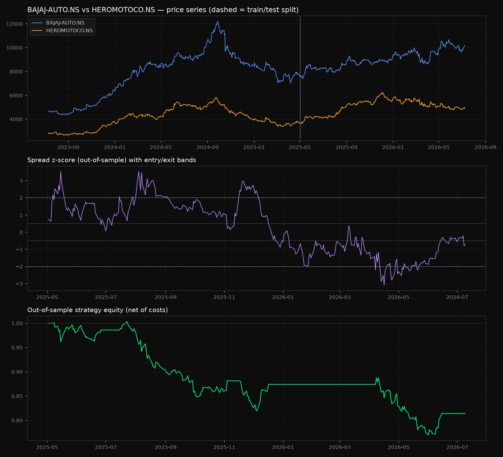

---

### TATASTEEL.NS / JSWSTEEL.NS

- **Latest prices:** TATASTEEL.NS ₹187.91 · JSWSTEEL.NS ₹1,225.80
- **Hedge ratio (train-fitted):** 2.9910
- **Cointegration (train):** FAIL at 5% — ADF -0.16, p=0.9434
- **Persistence:** passed 5% in 0 of 6 real-data runs (strict tier: 0/6)
- **Spread half-life:** 173.8 days
- **Current z-score:** +0.26
- **Signal today:** flat / no stretch
- ⚠️ _Pair did not cointegrate on training data. Any signal here is not statistically justified — observation only._

**Out-of-sample backtest** (beta frozen from train window):

| Metric | Value |
|---|---|
| Sharpe | 0.26 |
| Sortino | 0.21 |
| Annualised return | 1.71% |
| Annualised vol | 7.77% |
| Max drawdown | -4.61% |
| Round-trip trades | 4 |

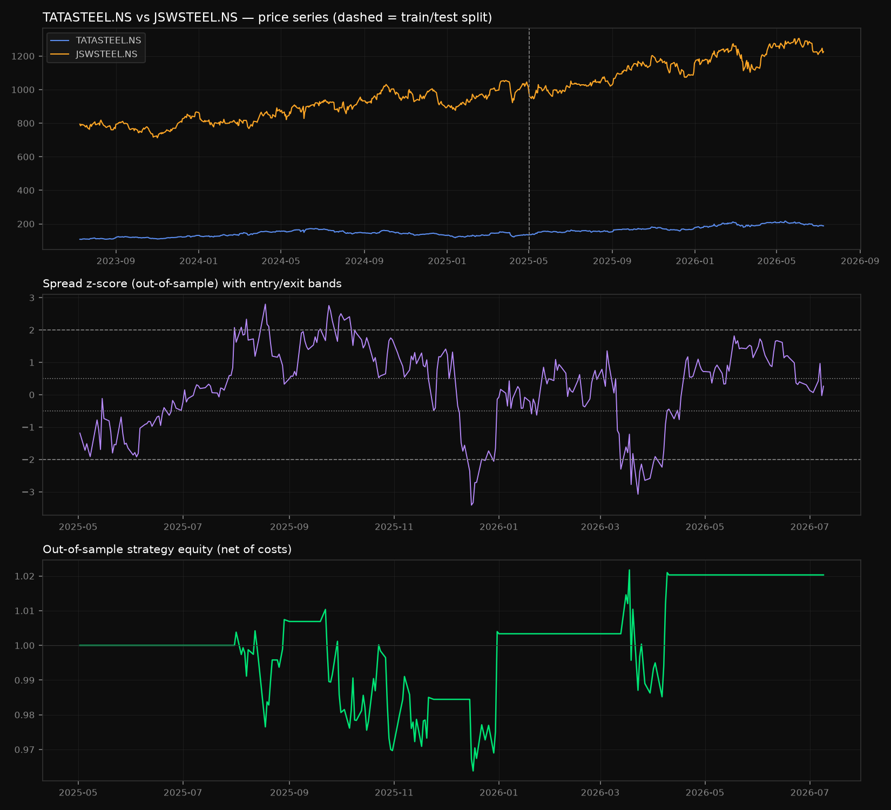

---

### SUNPHARMA.NS / CIPLA.NS

- **Latest prices:** SUNPHARMA.NS ₹1,938.70 · CIPLA.NS ₹1,441.30
- **Hedge ratio (train-fitted):** 0.5220
- **Cointegration (train):** PASS at 5% — ADF -3.65, p=0.0050
- **Persistence:** passed 5% in 6 of 6 real-data runs (strict tier: 0/6)
- **Spread half-life:** 11.5 days
- **Current z-score:** +0.16
- **Signal today:** flat / no stretch

**Out-of-sample backtest** (beta frozen from train window):

| Metric | Value |
|---|---|
| Sharpe | -0.13 |
| Sortino | -0.14 |
| Annualised return | -1.23% |
| Annualised vol | 7.29% |
| Max drawdown | -9.85% |
| Round-trip trades | 5 |

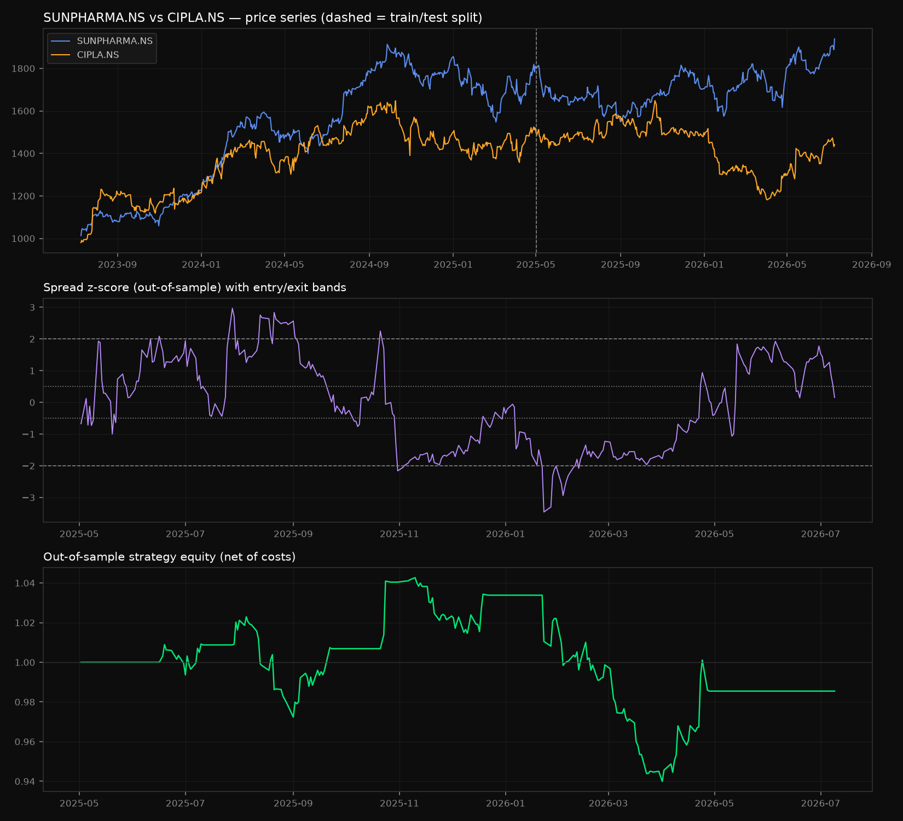

---

_Generated 2026-07-09 · pairs mean-reversion scanner · out-of-sample backtest · multiple-testing-aware · not investment advice._
