# Indian Pairs-Trading Scanner — 2026-07-10

> **What this is:** a market-neutral *pairs mean-reversion* scanner. It flags when two related NSE stocks have drifted apart far enough that their historical relationship signals a possible convergence trade. It does **not** forecast growth, rank "best" stocks, or predict company performance. A signal means the *spread between two stocks* is stretched — nothing about either stock being a good investment. Not investment advice; do your own research.

## Methodology (fixed in advance)

- **Universe:** 16 declared sector-mate pairs. Parameters (3y window, 60/40 train-test, z-entry 2.0, z-exit 0.5, 5 bps costs) are pre-registered; changes are logged in the README changelog *before* looking at results.
- **Multiple testing:** at the 5% level across 16 pairs, **≈0.8 false positives per run are expected by chance alone** even if nothing truly cointegrates. A single-day pass is a candidate, not a discovery.
- **Strict tier:** Bonferroni-corrected threshold p < 0.0031 (marked ✓✓).
- **Evidence = persistence:** the Persistence column counts how often each pair has passed the 5% test across all *real-data* daily runs recorded in `reports/history.csv`. Pairs deserve attention only when they pass persistently.

## Summary

| Pair | p-value | Coint. | Persistence | Current z | Signal | OOS Sharpe |
|---|---|---|---|---|---|---|
| HDFCBANK.NS/ICICIBANK.NS | 0.1142 | ✗ | 0/7 | -0.13 | flat / no stretch | -0.30 |
| AXISBANK.NS/ICICIBANK.NS | 0.9327 | ✗ | 0/7 | +2.49 | SHORT spread | 0.26 |
| KOTAKBANK.NS/HDFCBANK.NS | 0.1724 | ✗ | 0/7 | +2.42 | SHORT spread | -0.26 |
| SBIN.NS/BANKBARODA.NS | 0.2176 | ✗ | 0/7 | -1.49 | watch | 0.49 |
| TCS.NS/INFY.NS | 0.3994 | ✗ | 0/7 | +0.89 | watch | 0.98 |
| INFY.NS/WIPRO.NS | 0.1728 | ✗ | 0/7 | -0.90 | watch | 1.74 |
| HCLTECH.NS/TECHM.NS | 0.2583 | ✗ | 0/7 | +0.95 | watch | 0.22 |
| ACC.NS/AMBUJACEM.NS | 0.7258 | ✗ | 0/7 | -0.33 | flat / no stretch | 1.11 |
| ULTRACEMCO.NS/SHREECEM.NS | 0.1059 | ✗ | 0/7 | +2.10 | SHORT spread | 0.28 |
| IOC.NS/BPCL.NS | 0.7699 | ✗ | 0/7 | +2.36 | SHORT spread | 0.75 |
| BPCL.NS/HINDPETRO.NS | 0.3068 | ✗ | 0/7 | -0.26 | flat / no stretch | -0.07 |
| ONGC.NS/COALINDIA.NS | 0.0583 | ✗ | 0/7 | +0.46 | flat / no stretch | 1.09 |
| NTPC.NS/POWERGRID.NS | 0.0758 | ✗ | 0/7 | +1.56 | watch | 0.82 |
| BAJAJ-AUTO.NS/HEROMOTOCO.NS | 0.2337 | ✗ | 0/7 | -0.44 | flat / no stretch | -1.41 |
| TATASTEEL.NS/JSWSTEEL.NS | 0.9104 | ✗ | 0/7 | +0.73 | watch | 0.26 |
| SUNPHARMA.NS/CIPLA.NS | 0.0054 | ✓ | 7/7 | +0.13 | flat / no stretch | -0.13 |

_Legend: ✓✓ passes strict Bonferroni tier · ✓ passes 5% only · ✗ fails. Persistence = 5%-passes / real-data runs recorded. \*no real-data history yet._

---

### HDFCBANK.NS / ICICIBANK.NS

- **Latest prices:** HDFCBANK.NS ₹824.95 · ICICIBANK.NS ₹1,401.20
- **Hedge ratio (train-fitted):** 1.7129
- **Cointegration (train):** FAIL at 5% — ADF -2.51, p=0.1142
- **Persistence:** passed 5% in 0 of 7 real-data runs (strict tier: 0/7)
- **Spread half-life:** 33.3 days
- **Current z-score:** -0.13
- **Signal today:** flat / no stretch
- ⚠️ _Pair did not cointegrate on training data. Any signal here is not statistically justified — observation only._

**Out-of-sample backtest** (beta frozen from train window):

| Metric | Value |
|---|---|
| Sharpe | -0.30 |
| Sortino | -0.31 |
| Annualised return | -1.99% |
| Annualised vol | 6.00% |
| Max drawdown | -8.56% |
| Round-trip trades | 5 |

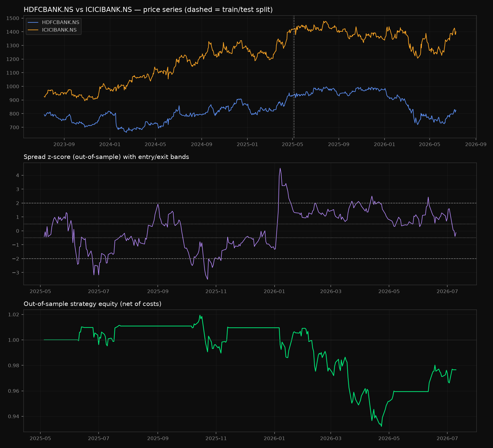

---

### AXISBANK.NS / ICICIBANK.NS

- **Latest prices:** AXISBANK.NS ₹1,323.70 · ICICIBANK.NS ₹1,401.20
- **Hedge ratio (train-fitted):** 0.8779
- **Cointegration (train):** FAIL at 5% — ADF -0.25, p=0.9327
- **Persistence:** passed 5% in 0 of 7 real-data runs (strict tier: 0/7)
- **Spread half-life:** 293.5 days
- **Current z-score:** +2.49
- **Signal today:** SHORT spread (short ICICIBANK.NS, long AXISBANK.NS)
- ⚠️ _Pair did not cointegrate on training data. Any signal here is not statistically justified — observation only._

**Out-of-sample backtest** (beta frozen from train window):

| Metric | Value |
|---|---|
| Sharpe | 0.26 |
| Sortino | 0.27 |
| Annualised return | 1.80% |
| Annualised vol | 8.14% |
| Max drawdown | -7.35% |
| Round-trip trades | 7 |

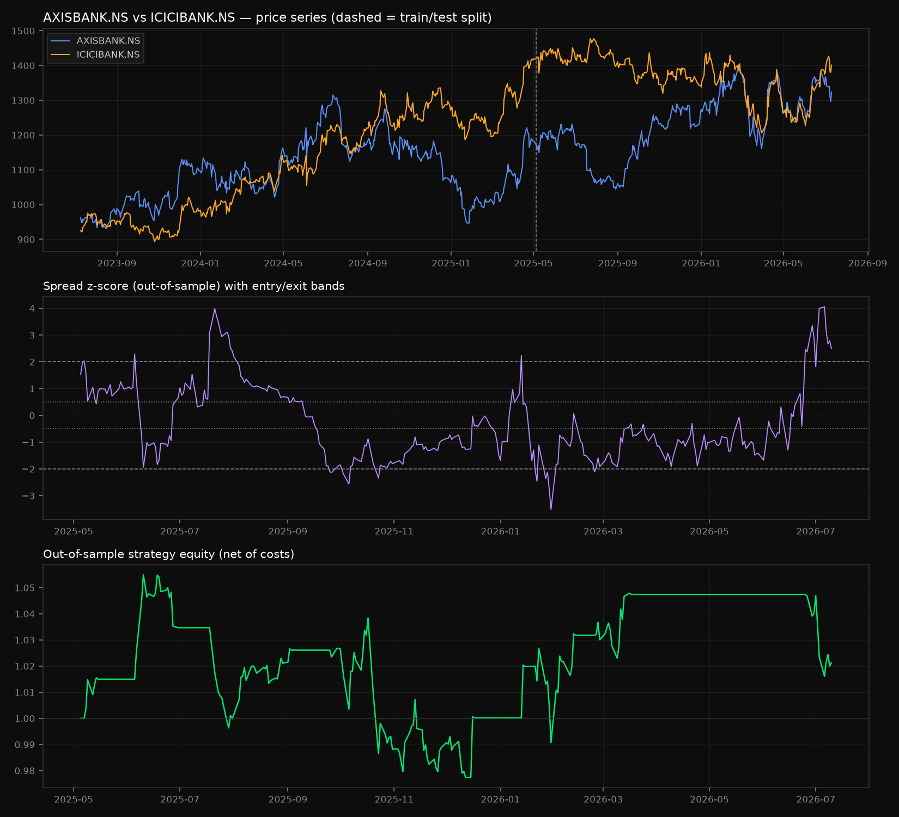

---

### KOTAKBANK.NS / HDFCBANK.NS

- **Latest prices:** KOTAKBANK.NS ₹377.60 · HDFCBANK.NS ₹824.95
- **Hedge ratio (train-fitted):** 1.7309
- **Cointegration (train):** FAIL at 5% — ADF -2.30, p=0.1724
- **Persistence:** passed 5% in 0 of 7 real-data runs (strict tier: 0/7)
- **Spread half-life:** 29.2 days
- **Current z-score:** +2.42
- **Signal today:** SHORT spread (short HDFCBANK.NS, long KOTAKBANK.NS)
- ⚠️ _Pair did not cointegrate on training data. Any signal here is not statistically justified — observation only._

**Out-of-sample backtest** (beta frozen from train window):

| Metric | Value |
|---|---|
| Sharpe | -0.26 |
| Sortino | -0.23 |
| Annualised return | -1.92% |
| Annualised vol | 6.55% |
| Max drawdown | -5.86% |
| Round-trip trades | 4 |

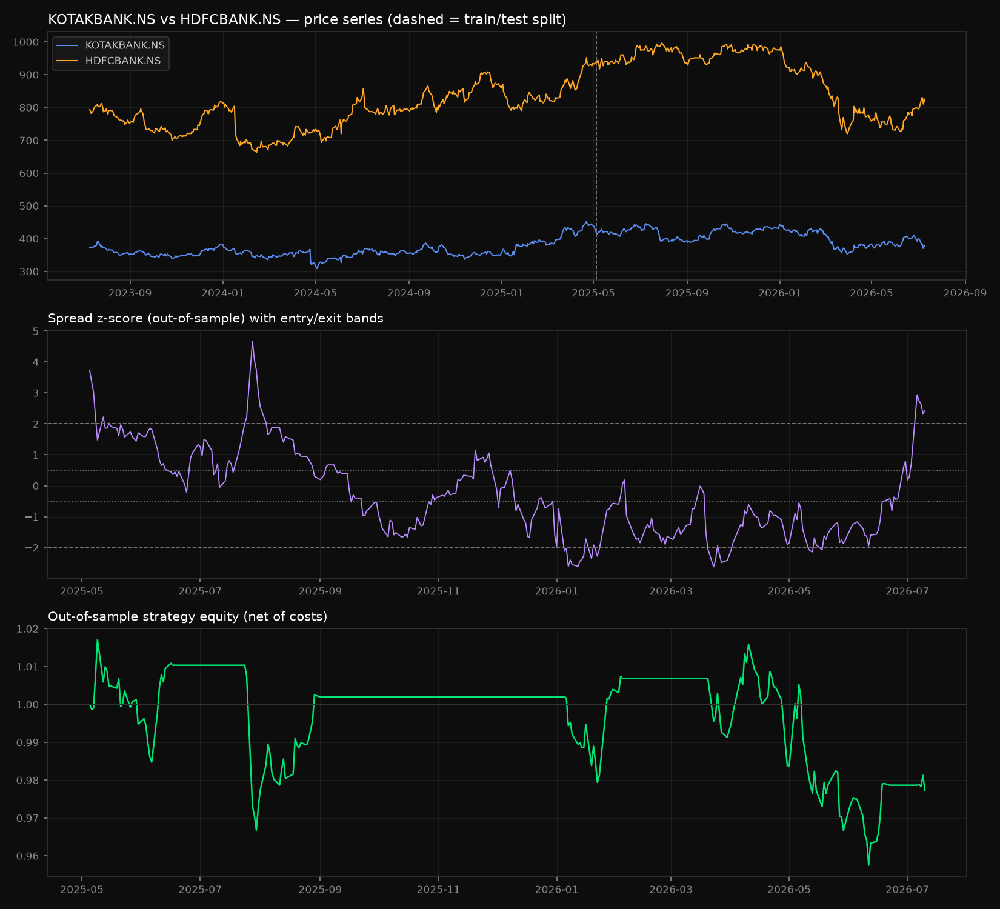

---

### SBIN.NS / BANKBARODA.NS

- **Latest prices:** SBIN.NS ₹1,036.00 · BANKBARODA.NS ₹250.95
- **Hedge ratio (train-fitted):** 0.2122
- **Cointegration (train):** FAIL at 5% — ADF -2.17, p=0.2176
- **Persistence:** passed 5% in 0 of 7 real-data runs (strict tier: 0/7)
- **Spread half-life:** 25.3 days
- **Current z-score:** -1.49
- **Signal today:** watch (approaching band)
- ⚠️ _Pair did not cointegrate on training data. Any signal here is not statistically justified — observation only._

**Out-of-sample backtest** (beta frozen from train window):

| Metric | Value |
|---|---|
| Sharpe | 0.49 |
| Sortino | 0.32 |
| Annualised return | 3.77% |
| Annualised vol | 8.22% |
| Max drawdown | -9.17% |
| Round-trip trades | 5 |

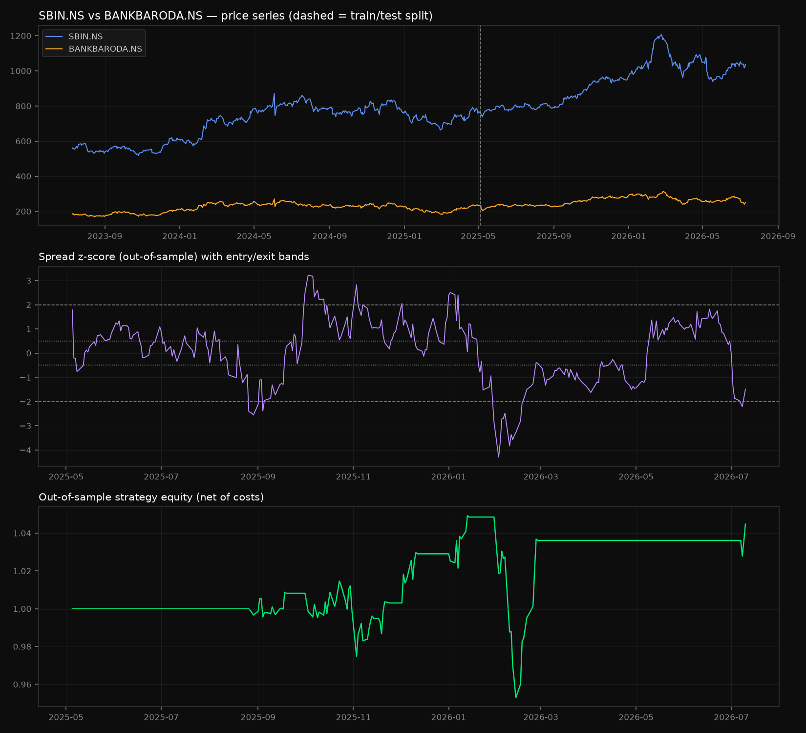

---

### TCS.NS / INFY.NS

- **Latest prices:** TCS.NS ₹2,069.00 · INFY.NS ₹1,068.00
- **Hedge ratio (train-fitted):** 0.5309
- **Cointegration (train):** FAIL at 5% — ADF -1.76, p=0.3994
- **Persistence:** passed 5% in 0 of 7 real-data runs (strict tier: 0/7)
- **Spread half-life:** 39.3 days
- **Current z-score:** +0.89
- **Signal today:** watch (approaching band)
- ⚠️ _Pair did not cointegrate on training data. Any signal here is not statistically justified — observation only._

**Out-of-sample backtest** (beta frozen from train window):

| Metric | Value |
|---|---|
| Sharpe | 0.98 |
| Sortino | 0.88 |
| Annualised return | 4.16% |
| Annualised vol | 4.25% |
| Max drawdown | -4.34% |
| Round-trip trades | 6 |

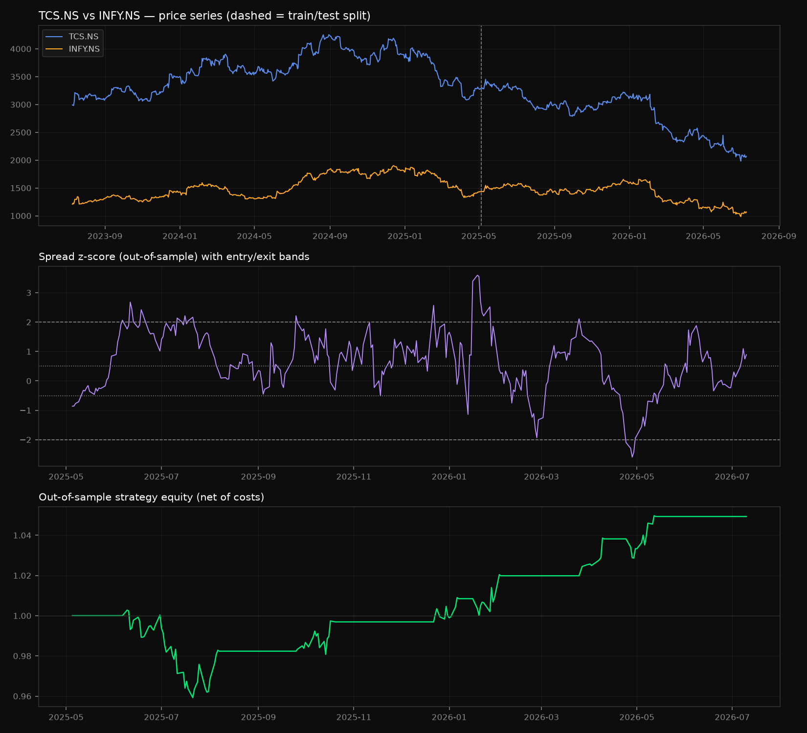

---

### INFY.NS / WIPRO.NS

- **Latest prices:** INFY.NS ₹1,068.00 · WIPRO.NS ₹175.46
- **Hedge ratio (train-fitted):** 0.1410
- **Cointegration (train):** FAIL at 5% — ADF -2.30, p=0.1728
- **Persistence:** passed 5% in 0 of 7 real-data runs (strict tier: 0/7)
- **Spread half-life:** 29.0 days
- **Current z-score:** -0.90
- **Signal today:** watch (approaching band)
- ⚠️ _Pair did not cointegrate on training data. Any signal here is not statistically justified — observation only._

**Out-of-sample backtest** (beta frozen from train window):

| Metric | Value |
|---|---|
| Sharpe | 1.74 |
| Sortino | 2.29 |
| Annualised return | 10.20% |
| Annualised vol | 5.69% |
| Max drawdown | -2.62% |
| Round-trip trades | 7 |

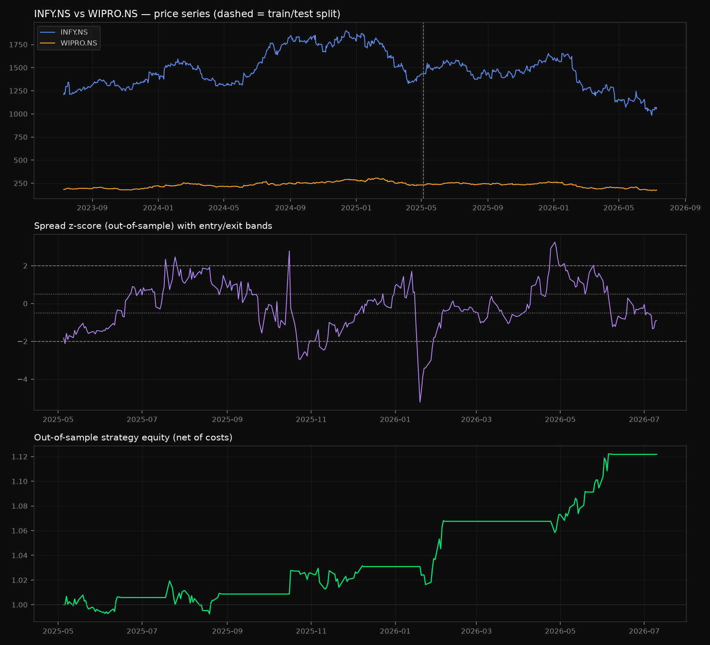

---

### HCLTECH.NS / TECHM.NS

- **Latest prices:** HCLTECH.NS ₹1,164.10 · TECHM.NS ₹1,454.80
- **Hedge ratio (train-fitted):** 0.7855
- **Cointegration (train):** FAIL at 5% — ADF -2.07, p=0.2583
- **Persistence:** passed 5% in 0 of 7 real-data runs (strict tier: 0/7)
- **Spread half-life:** 27.3 days
- **Current z-score:** +0.95
- **Signal today:** watch (approaching band)
- ⚠️ _Pair did not cointegrate on training data. Any signal here is not statistically justified — observation only._

**Out-of-sample backtest** (beta frozen from train window):

| Metric | Value |
|---|---|
| Sharpe | 0.22 |
| Sortino | 0.22 |
| Annualised return | 1.38% |
| Annualised vol | 7.54% |
| Max drawdown | -7.02% |
| Round-trip trades | 5 |

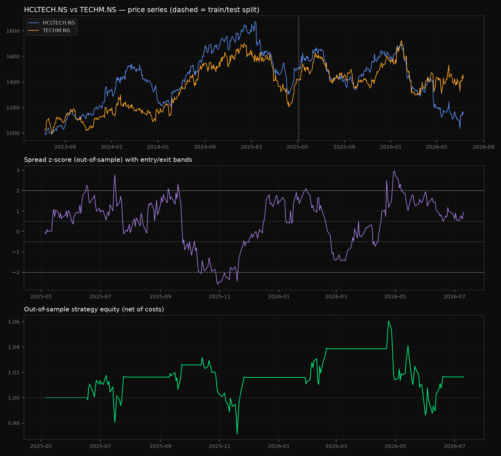

---

### ACC.NS / AMBUJACEM.NS

- **Latest prices:** ACC.NS ₹1,384.50 · AMBUJACEM.NS ₹436.45
- **Hedge ratio (train-fitted):** 0.2502
- **Cointegration (train):** FAIL at 5% — ADF -1.07, p=0.7258
- **Persistence:** passed 5% in 0 of 7 real-data runs (strict tier: 0/7)
- **Spread half-life:** 66.7 days
- **Current z-score:** -0.33
- **Signal today:** flat / no stretch
- ⚠️ _Pair did not cointegrate on training data. Any signal here is not statistically justified — observation only._

**Out-of-sample backtest** (beta frozen from train window):

| Metric | Value |
|---|---|
| Sharpe | 1.11 |
| Sortino | 1.01 |
| Annualised return | 6.39% |
| Annualised vol | 5.75% |
| Max drawdown | -4.63% |
| Round-trip trades | 5 |

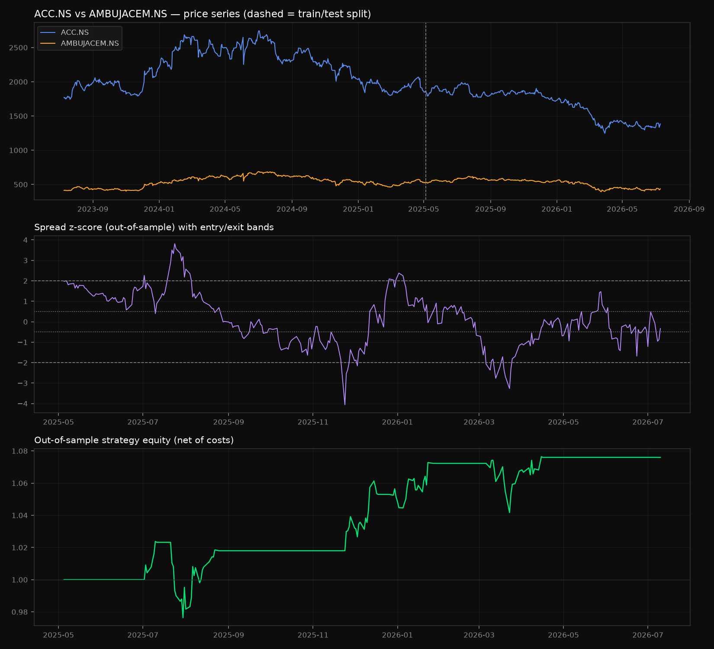

---

### ULTRACEMCO.NS / SHREECEM.NS

- **Latest prices:** ULTRACEMCO.NS ₹11,711.00 · SHREECEM.NS ₹26,615.00
- **Hedge ratio (train-fitted):** 0.6050
- **Cointegration (train):** FAIL at 5% — ADF -2.54, p=0.1059
- **Persistence:** passed 5% in 0 of 7 real-data runs (strict tier: 0/7)
- **Spread half-life:** 28.1 days
- **Current z-score:** +2.10
- **Signal today:** SHORT spread (short SHREECEM.NS, long ULTRACEMCO.NS)
- ⚠️ _Pair did not cointegrate on training data. Any signal here is not statistically justified — observation only._

**Out-of-sample backtest** (beta frozen from train window):

| Metric | Value |
|---|---|
| Sharpe | 0.28 |
| Sortino | 0.28 |
| Annualised return | 1.99% |
| Annualised vol | 8.10% |
| Max drawdown | -9.65% |
| Round-trip trades | 5 |

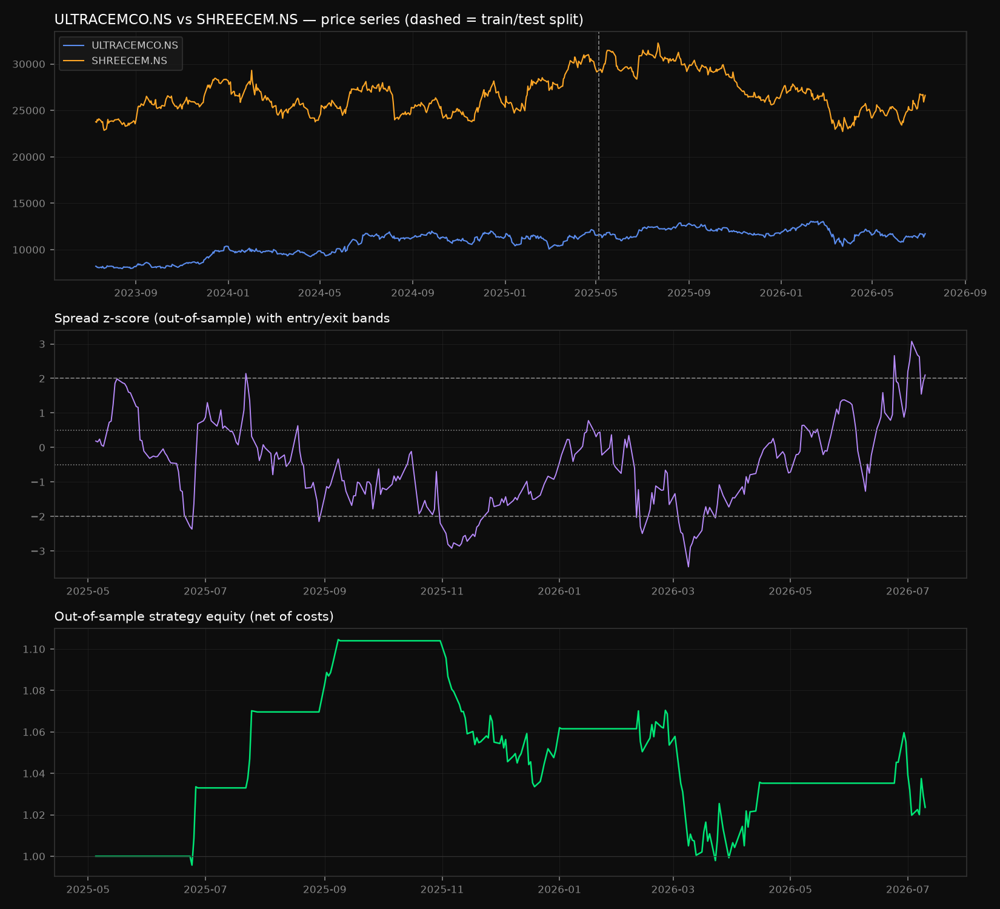

---

### IOC.NS / BPCL.NS

- **Latest prices:** IOC.NS ₹138.96 · BPCL.NS ₹309.75
- **Hedge ratio (train-fitted):** 1.7642
- **Cointegration (train):** FAIL at 5% — ADF -0.95, p=0.7699
- **Persistence:** passed 5% in 0 of 7 real-data runs (strict tier: 0/7)
- **Spread half-life:** 107.6 days
- **Current z-score:** +2.36
- **Signal today:** SHORT spread (short BPCL.NS, long IOC.NS)
- ⚠️ _Pair did not cointegrate on training data. Any signal here is not statistically justified — observation only._

**Out-of-sample backtest** (beta frozen from train window):

| Metric | Value |
|---|---|
| Sharpe | 0.75 |
| Sortino | 0.78 |
| Annualised return | 4.60% |
| Annualised vol | 6.24% |
| Max drawdown | -6.58% |
| Round-trip trades | 7 |

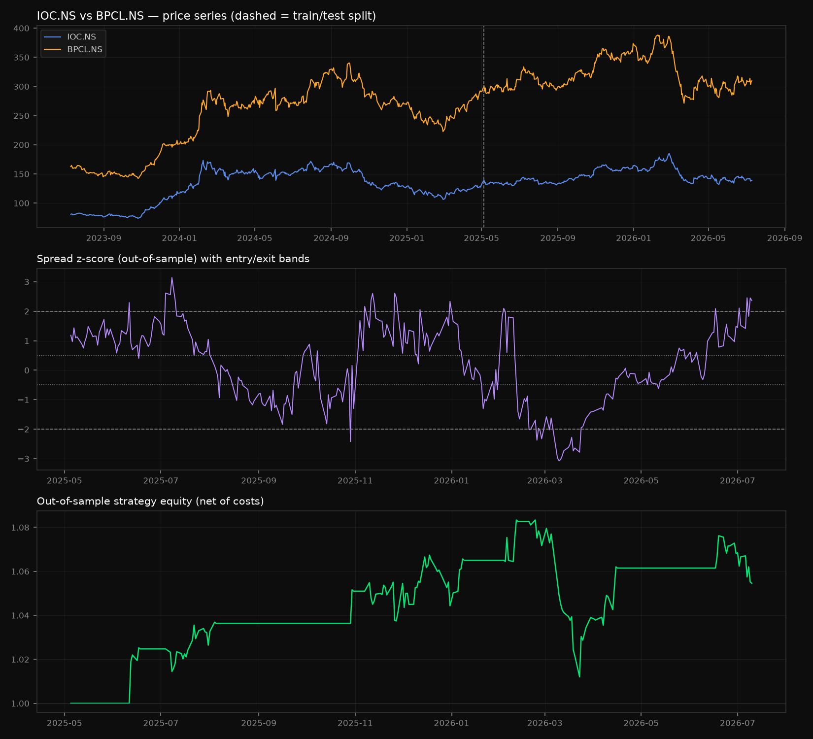

---

### BPCL.NS / HINDPETRO.NS

- **Latest prices:** BPCL.NS ₹309.75 · HINDPETRO.NS ₹395.30
- **Hedge ratio (train-fitted):** 1.4232
- **Cointegration (train):** FAIL at 5% — ADF -1.95, p=0.3068
- **Persistence:** passed 5% in 0 of 7 real-data runs (strict tier: 0/7)
- **Spread half-life:** 40.5 days
- **Current z-score:** -0.26
- **Signal today:** flat / no stretch
- ⚠️ _Pair did not cointegrate on training data. Any signal here is not statistically justified — observation only._

**Out-of-sample backtest** (beta frozen from train window):

| Metric | Value |
|---|---|
| Sharpe | -0.07 |
| Sortino | -0.06 |
| Annualised return | -0.57% |
| Annualised vol | 5.60% |
| Max drawdown | -6.84% |
| Round-trip trades | 4 |

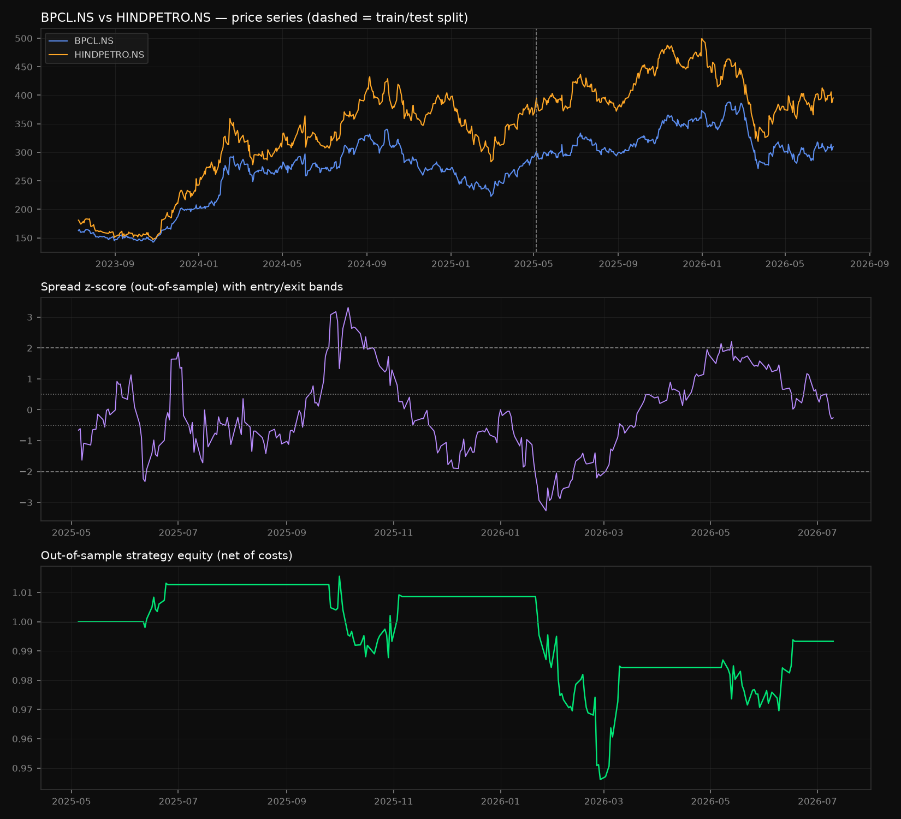

---

### ONGC.NS / COALINDIA.NS

- **Latest prices:** ONGC.NS ₹244.96 · COALINDIA.NS ₹429.30
- **Hedge ratio (train-fitted):** 1.7315
- **Cointegration (train):** FAIL at 5% — ADF -2.80, p=0.0583
- **Persistence:** passed 5% in 0 of 7 real-data runs (strict tier: 0/7)
- **Spread half-life:** 17.0 days
- **Current z-score:** +0.46
- **Signal today:** flat / no stretch
- ⚠️ _Pair did not cointegrate on training data. Any signal here is not statistically justified — observation only._

**Out-of-sample backtest** (beta frozen from train window):

| Metric | Value |
|---|---|
| Sharpe | 1.09 |
| Sortino | 1.03 |
| Annualised return | 9.22% |
| Annualised vol | 8.39% |
| Max drawdown | -6.16% |
| Round-trip trades | 6 |

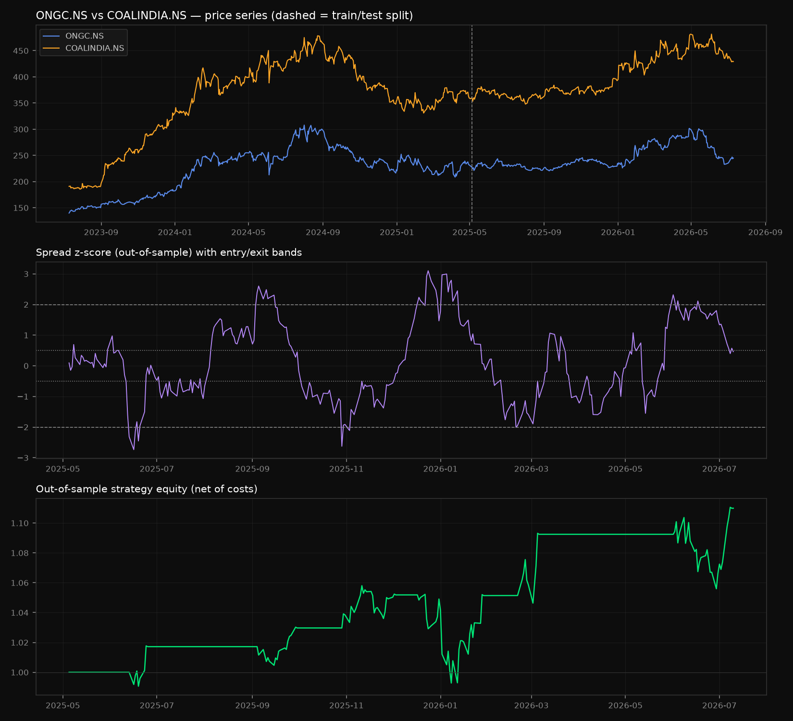

---

### NTPC.NS / POWERGRID.NS

- **Latest prices:** NTPC.NS ₹344.55 · POWERGRID.NS ₹283.10
- **Hedge ratio (train-fitted):** 0.8127
- **Cointegration (train):** FAIL at 5% — ADF -2.69, p=0.0758
- **Persistence:** passed 5% in 0 of 7 real-data runs (strict tier: 0/7)
- **Spread half-life:** 22.1 days
- **Current z-score:** +1.56
- **Signal today:** watch (approaching band)
- ⚠️ _Pair did not cointegrate on training data. Any signal here is not statistically justified — observation only._

**Out-of-sample backtest** (beta frozen from train window):

| Metric | Value |
|---|---|
| Sharpe | 0.82 |
| Sortino | 0.69 |
| Annualised return | 4.48% |
| Annualised vol | 5.54% |
| Max drawdown | -5.03% |
| Round-trip trades | 7 |

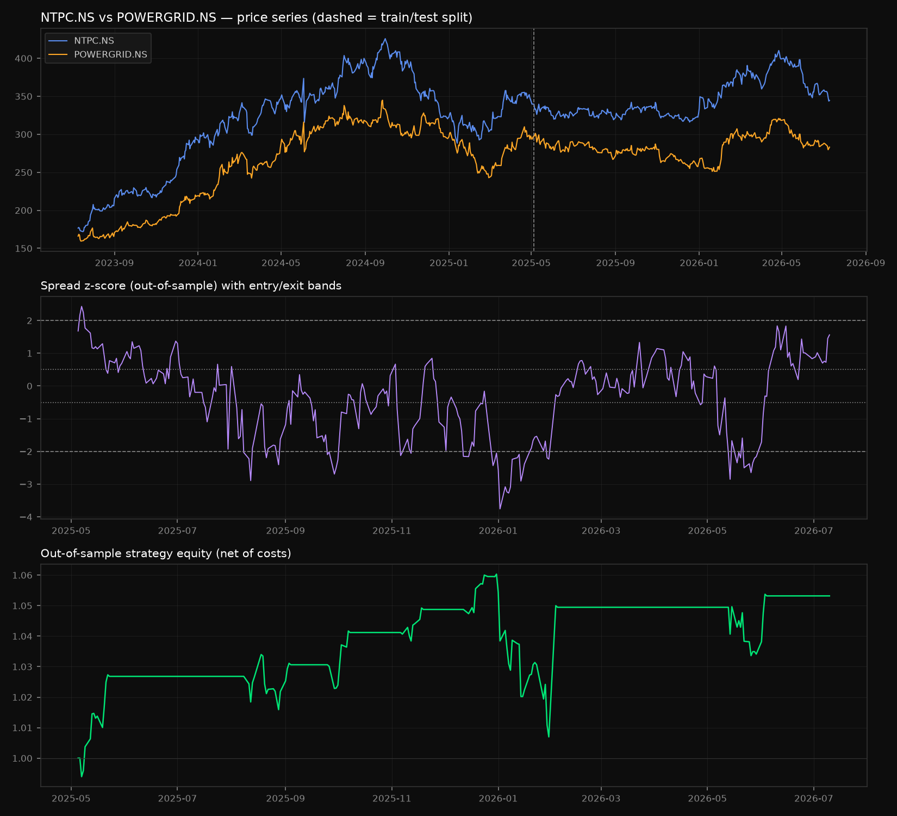

---

### BAJAJ-AUTO.NS / HEROMOTOCO.NS

- **Latest prices:** BAJAJ-AUTO.NS ₹10,156.00 · HEROMOTOCO.NS ₹4,949.10
- **Hedge ratio (train-fitted):** 0.4113
- **Cointegration (train):** FAIL at 5% — ADF -2.13, p=0.2337
- **Persistence:** passed 5% in 0 of 7 real-data runs (strict tier: 0/7)
- **Spread half-life:** 32.1 days
- **Current z-score:** -0.44
- **Signal today:** flat / no stretch
- ⚠️ _Pair did not cointegrate on training data. Any signal here is not statistically justified — observation only._

**Out-of-sample backtest** (beta frozen from train window):

| Metric | Value |
|---|---|
| Sharpe | -1.41 |
| Sortino | -1.46 |
| Annualised return | -15.82% |
| Annualised vol | 11.71% |
| Max drawdown | -23.08% |
| Round-trip trades | 4 |

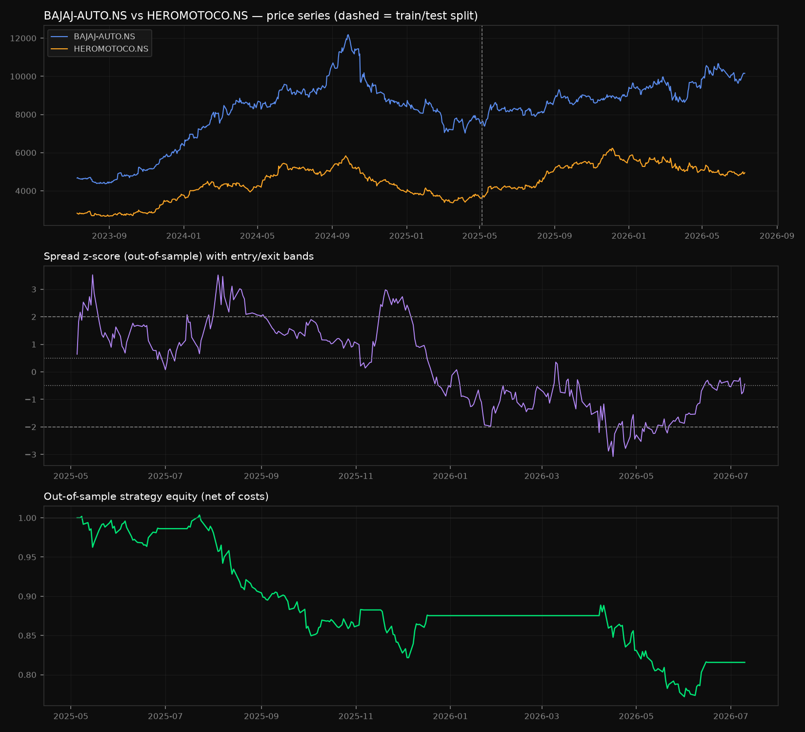

---

### TATASTEEL.NS / JSWSTEEL.NS

- **Latest prices:** TATASTEEL.NS ₹191.19 · JSWSTEEL.NS ₹1,245.40
- **Hedge ratio (train-fitted):** 2.9904
- **Cointegration (train):** FAIL at 5% — ADF -0.40, p=0.9104
- **Persistence:** passed 5% in 0 of 7 real-data runs (strict tier: 0/7)
- **Spread half-life:** 80.8 days
- **Current z-score:** +0.73
- **Signal today:** watch (approaching band)
- ⚠️ _Pair did not cointegrate on training data. Any signal here is not statistically justified — observation only._

**Out-of-sample backtest** (beta frozen from train window):

| Metric | Value |
|---|---|
| Sharpe | 0.26 |
| Sortino | 0.21 |
| Annualised return | 1.73% |
| Annualised vol | 7.83% |
| Max drawdown | -4.64% |
| Round-trip trades | 4 |

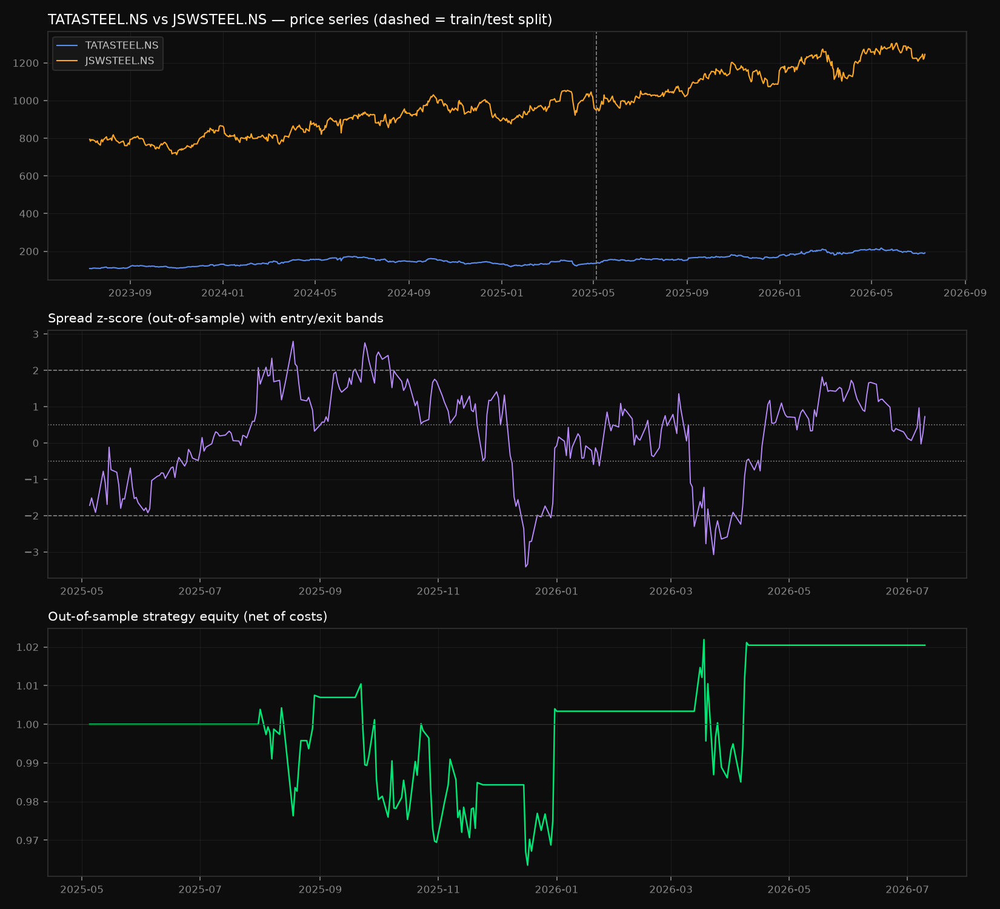

---

### SUNPHARMA.NS / CIPLA.NS

- **Latest prices:** SUNPHARMA.NS ₹1,935.50 · CIPLA.NS ₹1,439.40
- **Hedge ratio (train-fitted):** 0.5215
- **Cointegration (train):** PASS at 5% — ADF -3.62, p=0.0054
- **Persistence:** passed 5% in 7 of 7 real-data runs (strict tier: 0/7)
- **Spread half-life:** 11.5 days
- **Current z-score:** +0.13
- **Signal today:** flat / no stretch

**Out-of-sample backtest** (beta frozen from train window):

| Metric | Value |
|---|---|
| Sharpe | -0.13 |
| Sortino | -0.14 |
| Annualised return | -1.21% |
| Annualised vol | 7.19% |
| Max drawdown | -9.72% |
| Round-trip trades | 5 |

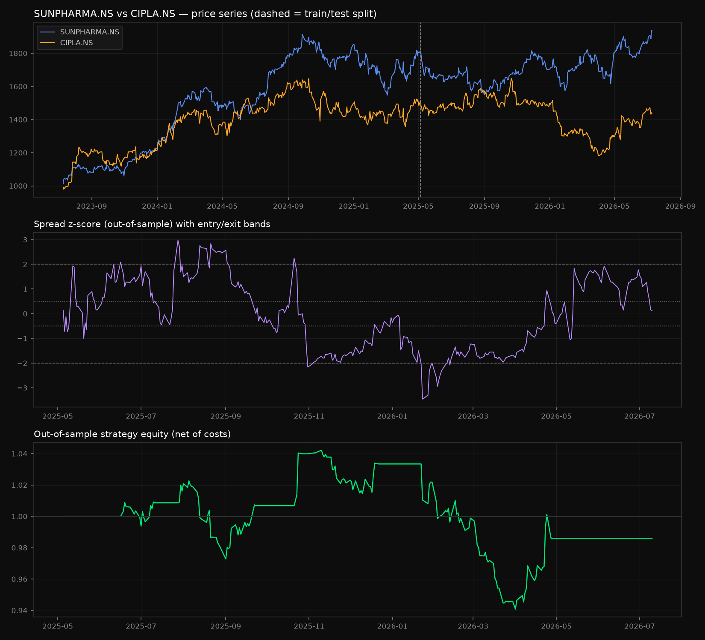

---

_Generated 2026-07-10 · pairs mean-reversion scanner · out-of-sample backtest · multiple-testing-aware · not investment advice._
