# Indian Pairs-Trading Scanner — 2026-07-13

> **What this is:** a market-neutral *pairs mean-reversion* scanner. It flags when two related NSE stocks have drifted apart far enough that their historical relationship signals a possible convergence trade. It does **not** forecast growth, rank "best" stocks, or predict company performance. A signal means the *spread between two stocks* is stretched — nothing about either stock being a good investment. Not investment advice; do your own research.

## Methodology (fixed in advance)

- **Universe:** 16 declared sector-mate pairs. Parameters (3y window, 60/40 train-test, z-entry 2.0, z-exit 0.5, 5 bps costs) are pre-registered; changes are logged in the README changelog *before* looking at results.
- **Multiple testing:** at the 5% level across 16 pairs, **≈0.8 false positives per run are expected by chance alone** even if nothing truly cointegrates. A single-day pass is a candidate, not a discovery.
- **Strict tier:** Bonferroni-corrected threshold p < 0.0031 (marked ✓✓).
- **Evidence = persistence:** the Persistence column counts how often each pair has passed the 5% test across all *real-data* daily runs recorded in `reports/history.csv`. Pairs deserve attention only when they pass persistently.

## Summary

| Pair | p-value | Coint. | Persistence | Current z | Signal | OOS Sharpe |
|---|---|---|---|---|---|---|
| HDFCBANK.NS/ICICIBANK.NS | 0.1299 | ✗ | 0/8 | +0.56 | watch | -0.31 |
| AXISBANK.NS/ICICIBANK.NS | 0.9519 | ✗ | 0/8 | +2.65 | SHORT spread | 0.21 |
| KOTAKBANK.NS/HDFCBANK.NS | 0.2050 | ✗ | 0/8 | +1.72 | watch | 0.06 |
| SBIN.NS/BANKBARODA.NS | 0.2402 | ✗ | 0/8 | -1.49 | watch | 0.48 |
| TCS.NS/INFY.NS | 0.3893 | ✗ | 0/8 | +0.29 | flat / no stretch | 0.98 |
| INFY.NS/WIPRO.NS | 0.1656 | ✗ | 0/8 | -1.17 | watch | 1.73 |
| HCLTECH.NS/TECHM.NS | 0.2274 | ✗ | 0/8 | +1.04 | watch | 0.21 |
| ACC.NS/AMBUJACEM.NS | 0.7832 | ✗ | 0/8 | -0.84 | watch | 1.17 |
| ULTRACEMCO.NS/SHREECEM.NS | 0.1082 | ✗ | 0/8 | +1.85 | watch | 0.32 |
| IOC.NS/BPCL.NS | 0.7519 | ✗ | 0/8 | +1.52 | watch | 0.75 |
| BPCL.NS/HINDPETRO.NS | 0.3210 | ✗ | 0/8 | -0.38 | flat / no stretch | -0.07 |
| ONGC.NS/COALINDIA.NS | 0.0447 | ✓ | 1/8 | +0.28 | flat / no stretch | 1.09 |
| NTPC.NS/POWERGRID.NS | 0.1021 | ✗ | 0/8 | +1.16 | watch | 0.91 |
| BAJAJ-AUTO.NS/HEROMOTOCO.NS | 0.2121 | ✗ | 0/8 | -0.90 | watch | -1.41 |
| TATASTEEL.NS/JSWSTEEL.NS | 0.8832 | ✗ | 0/8 | +0.91 | watch | 0.26 |
| SUNPHARMA.NS/CIPLA.NS | 0.0039 | ✓ | 8/8 | -0.01 | flat / no stretch | -0.13 |

_Legend: ✓✓ passes strict Bonferroni tier · ✓ passes 5% only · ✗ fails. Persistence = 5%-passes / real-data runs recorded. \*no real-data history yet._

---

### HDFCBANK.NS / ICICIBANK.NS

- **Latest prices:** HDFCBANK.NS ₹817.95 · ICICIBANK.NS ₹1,409.50
- **Hedge ratio (train-fitted):** 1.7197
- **Cointegration (train):** FAIL at 5% — ADF -2.44, p=0.1299
- **Persistence:** passed 5% in 0 of 8 real-data runs (strict tier: 0/8)
- **Spread half-life:** 33.5 days
- **Current z-score:** +0.56
- **Signal today:** watch (approaching band)
- ⚠️ _Pair did not cointegrate on training data. Any signal here is not statistically justified — observation only._

**Out-of-sample backtest** (beta frozen from train window):

| Metric | Value |
|---|---|
| Sharpe | -0.31 |
| Sortino | -0.31 |
| Annualised return | -2.00% |
| Annualised vol | 5.99% |
| Max drawdown | -8.55% |
| Round-trip trades | 5 |

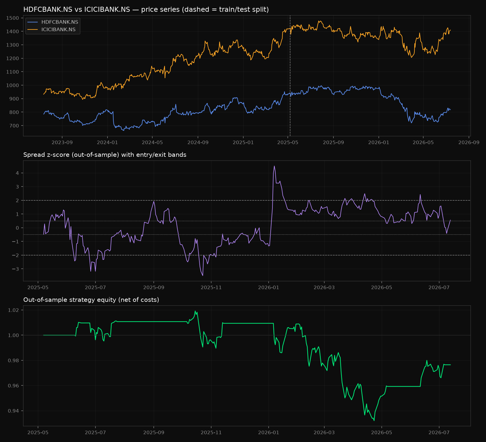

---

### AXISBANK.NS / ICICIBANK.NS

- **Latest prices:** AXISBANK.NS ₹1,319.40 · ICICIBANK.NS ₹1,409.50
- **Hedge ratio (train-fitted):** 0.8783
- **Cointegration (train):** FAIL at 5% — ADF -0.07, p=0.9519
- **Persistence:** passed 5% in 0 of 8 real-data runs (strict tier: 0/8)
- **Spread half-life:** 453.7 days
- **Current z-score:** +2.65
- **Signal today:** SHORT spread (short ICICIBANK.NS, long AXISBANK.NS)
- ⚠️ _Pair did not cointegrate on training data. Any signal here is not statistically justified — observation only._

**Out-of-sample backtest** (beta frozen from train window):

| Metric | Value |
|---|---|
| Sharpe | 0.21 |
| Sortino | 0.22 |
| Annualised return | 1.39% |
| Annualised vol | 8.18% |
| Max drawdown | -7.37% |
| Round-trip trades | 7 |

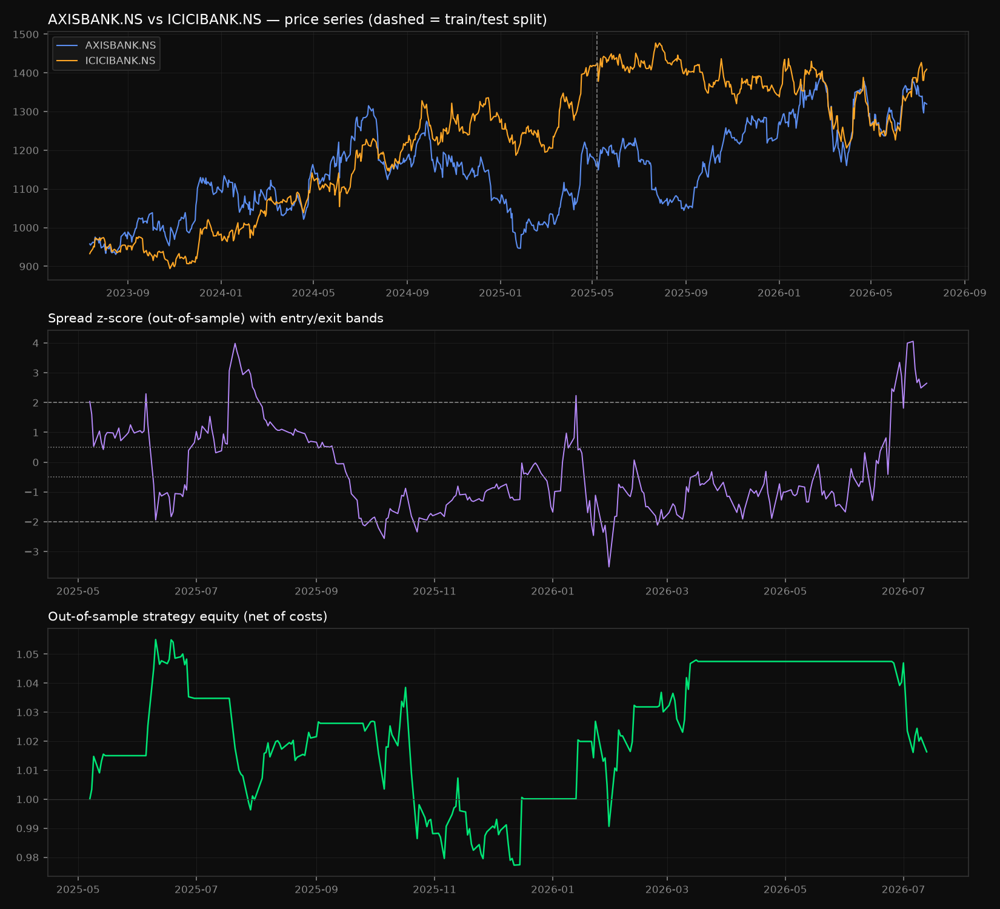

---

### KOTAKBANK.NS / HDFCBANK.NS

- **Latest prices:** KOTAKBANK.NS ₹384.65 · HDFCBANK.NS ₹817.95
- **Hedge ratio (train-fitted):** 1.7606
- **Cointegration (train):** FAIL at 5% — ADF -2.20, p=0.2050
- **Persistence:** passed 5% in 0 of 8 real-data runs (strict tier: 0/8)
- **Spread half-life:** 29.8 days
- **Current z-score:** +1.72
- **Signal today:** watch (approaching band)
- ⚠️ _Pair did not cointegrate on training data. Any signal here is not statistically justified — observation only._

**Out-of-sample backtest** (beta frozen from train window):

| Metric | Value |
|---|---|
| Sharpe | 0.06 |
| Sortino | 0.06 |
| Annualised return | 0.20% |
| Annualised vol | 6.54% |
| Max drawdown | -5.71% |
| Round-trip trades | 4 |

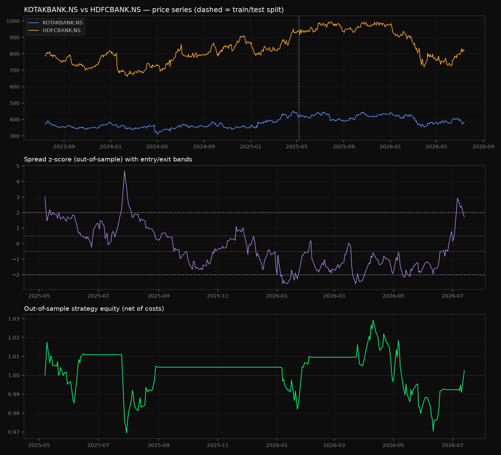

---

### SBIN.NS / BANKBARODA.NS

- **Latest prices:** SBIN.NS ₹1,037.00 · BANKBARODA.NS ₹250.65
- **Hedge ratio (train-fitted):** 0.2120
- **Cointegration (train):** FAIL at 5% — ADF -2.11, p=0.2402
- **Persistence:** passed 5% in 0 of 8 real-data runs (strict tier: 0/8)
- **Spread half-life:** 24.6 days
- **Current z-score:** -1.49
- **Signal today:** watch (approaching band)
- ⚠️ _Pair did not cointegrate on training data. Any signal here is not statistically justified — observation only._

**Out-of-sample backtest** (beta frozen from train window):

| Metric | Value |
|---|---|
| Sharpe | 0.48 |
| Sortino | 0.31 |
| Annualised return | 3.91% |
| Annualised vol | 8.82% |
| Max drawdown | -9.79% |
| Round-trip trades | 5 |

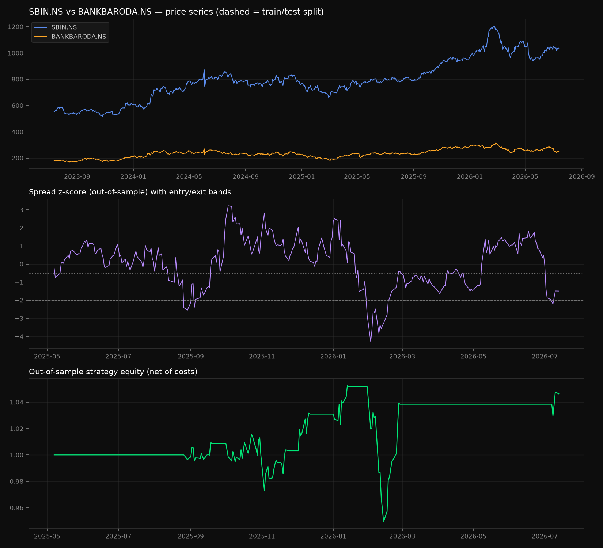

---

### TCS.NS / INFY.NS

- **Latest prices:** TCS.NS ₹2,181.50 · INFY.NS ₹1,102.60
- **Hedge ratio (train-fitted):** 0.5306
- **Cointegration (train):** FAIL at 5% — ADF -1.78, p=0.3893
- **Persistence:** passed 5% in 0 of 8 real-data runs (strict tier: 0/8)
- **Spread half-life:** 39.2 days
- **Current z-score:** +0.29
- **Signal today:** flat / no stretch
- ⚠️ _Pair did not cointegrate on training data. Any signal here is not statistically justified — observation only._

**Out-of-sample backtest** (beta frozen from train window):

| Metric | Value |
|---|---|
| Sharpe | 0.98 |
| Sortino | 0.88 |
| Annualised return | 4.18% |
| Annualised vol | 4.26% |
| Max drawdown | -4.35% |
| Round-trip trades | 6 |

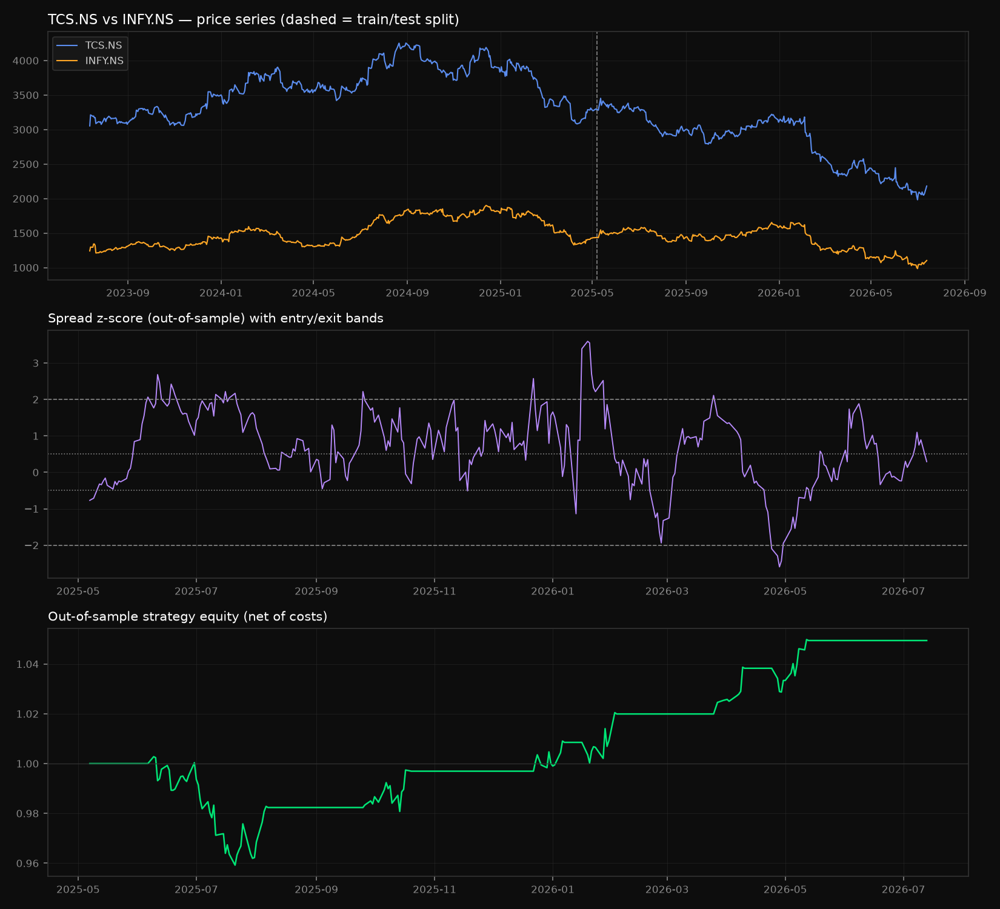

---

### INFY.NS / WIPRO.NS

- **Latest prices:** INFY.NS ₹1,102.60 · WIPRO.NS ₹178.43
- **Hedge ratio (train-fitted):** 0.1405
- **Cointegration (train):** FAIL at 5% — ADF -2.32, p=0.1656
- **Persistence:** passed 5% in 0 of 8 real-data runs (strict tier: 0/8)
- **Spread half-life:** 28.8 days
- **Current z-score:** -1.17
- **Signal today:** watch (approaching band)
- ⚠️ _Pair did not cointegrate on training data. Any signal here is not statistically justified — observation only._

**Out-of-sample backtest** (beta frozen from train window):

| Metric | Value |
|---|---|
| Sharpe | 1.73 |
| Sortino | 2.03 |
| Annualised return | 9.71% |
| Annualised vol | 5.44% |
| Max drawdown | -2.61% |
| Round-trip trades | 6 |

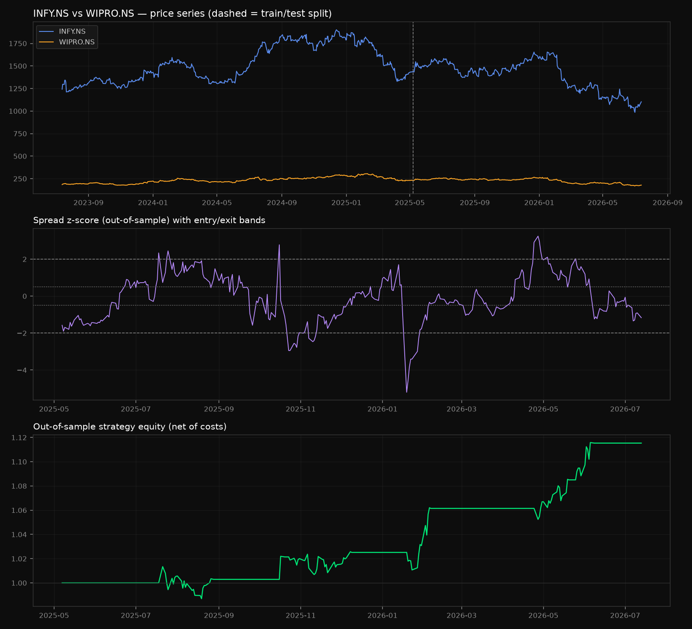

---

### HCLTECH.NS / TECHM.NS

- **Latest prices:** HCLTECH.NS ₹1,221.20 · TECHM.NS ₹1,504.50
- **Hedge ratio (train-fitted):** 0.7884
- **Cointegration (train):** FAIL at 5% — ADF -2.14, p=0.2274
- **Persistence:** passed 5% in 0 of 8 real-data runs (strict tier: 0/8)
- **Spread half-life:** 26.5 days
- **Current z-score:** +1.04
- **Signal today:** watch (approaching band)
- ⚠️ _Pair did not cointegrate on training data. Any signal here is not statistically justified — observation only._

**Out-of-sample backtest** (beta frozen from train window):

| Metric | Value |
|---|---|
| Sharpe | 0.21 |
| Sortino | 0.21 |
| Annualised return | 1.32% |
| Annualised vol | 7.55% |
| Max drawdown | -7.01% |
| Round-trip trades | 5 |

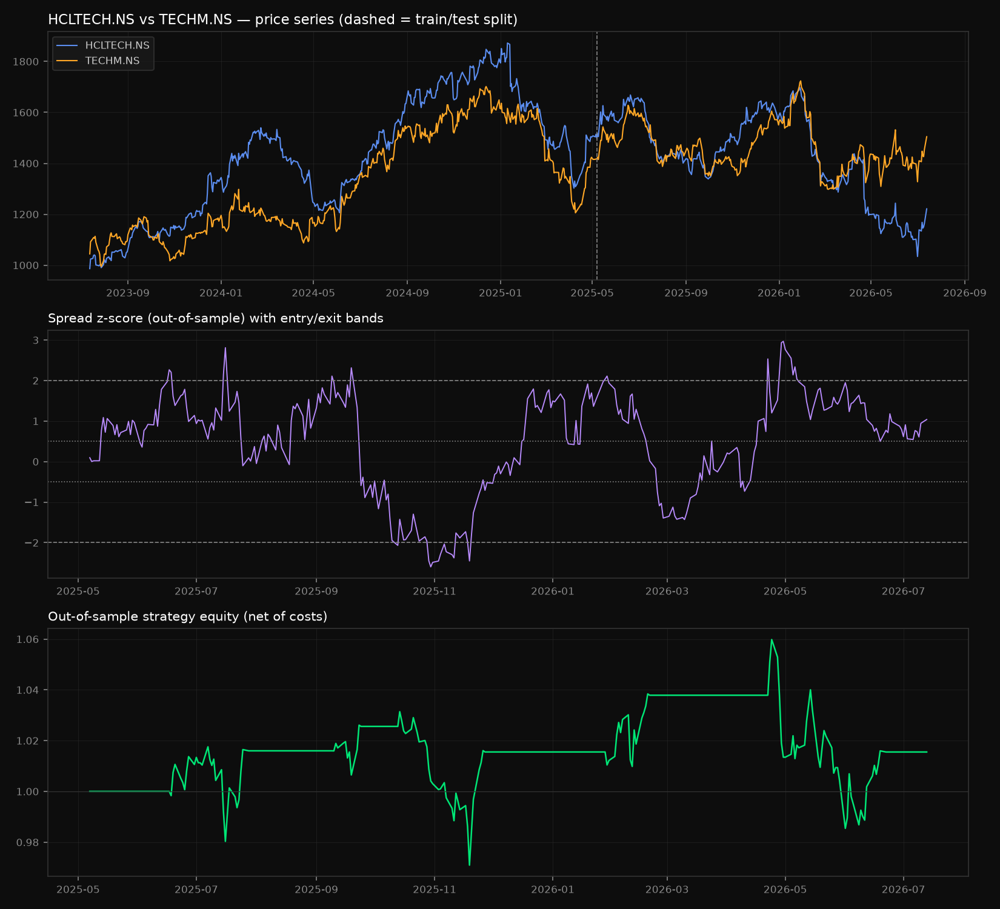

---

### ACC.NS / AMBUJACEM.NS

- **Latest prices:** ACC.NS ₹1,378.80 · AMBUJACEM.NS ₹432.15
- **Hedge ratio (train-fitted):** 0.2478
- **Cointegration (train):** FAIL at 5% — ADF -0.91, p=0.7832
- **Persistence:** passed 5% in 0 of 8 real-data runs (strict tier: 0/8)
- **Spread half-life:** 77.2 days
- **Current z-score:** -0.84
- **Signal today:** watch (approaching band)
- ⚠️ _Pair did not cointegrate on training data. Any signal here is not statistically justified — observation only._

**Out-of-sample backtest** (beta frozen from train window):

| Metric | Value |
|---|---|
| Sharpe | 1.17 |
| Sortino | 1.04 |
| Annualised return | 6.87% |
| Annualised vol | 5.84% |
| Max drawdown | -4.68% |
| Round-trip trades | 5 |

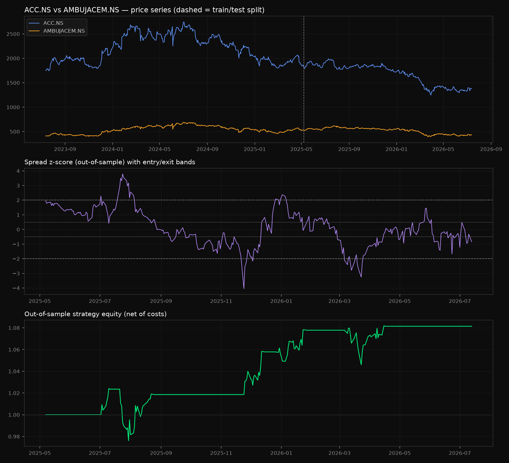

---

### ULTRACEMCO.NS / SHREECEM.NS

- **Latest prices:** ULTRACEMCO.NS ₹11,571.00 · SHREECEM.NS ₹26,420.00
- **Hedge ratio (train-fitted):** 0.6048
- **Cointegration (train):** FAIL at 5% — ADF -2.53, p=0.1082
- **Persistence:** passed 5% in 0 of 8 real-data runs (strict tier: 0/8)
- **Spread half-life:** 28.9 days
- **Current z-score:** +1.85
- **Signal today:** watch (approaching band)
- ⚠️ _Pair did not cointegrate on training data. Any signal here is not statistically justified — observation only._

**Out-of-sample backtest** (beta frozen from train window):

| Metric | Value |
|---|---|
| Sharpe | 0.32 |
| Sortino | 0.32 |
| Annualised return | 2.26% |
| Annualised vol | 8.10% |
| Max drawdown | -9.63% |
| Round-trip trades | 5 |

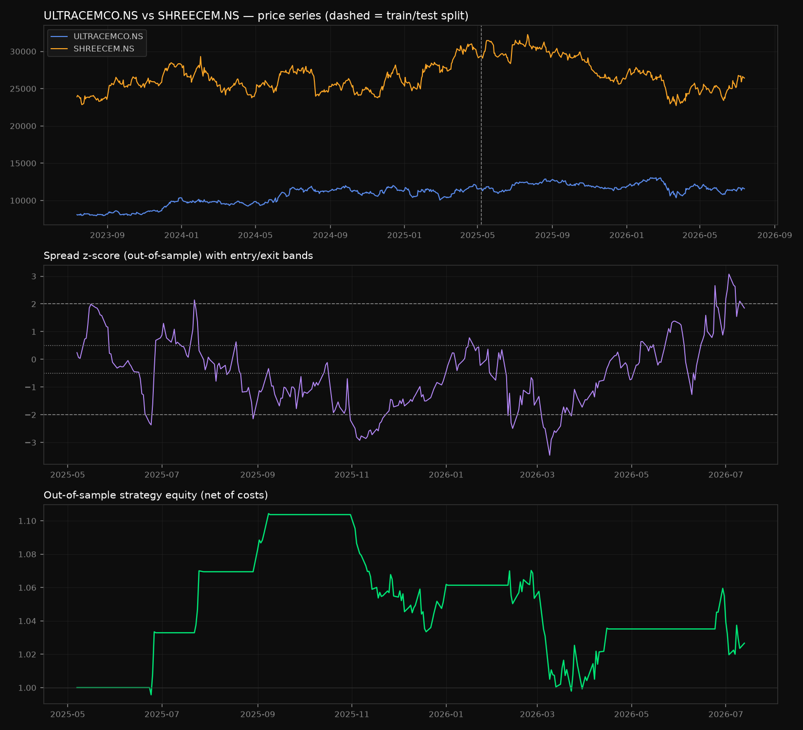

---

### IOC.NS / BPCL.NS

- **Latest prices:** IOC.NS ₹139.95 · BPCL.NS ₹307.55
- **Hedge ratio (train-fitted):** 1.7661
- **Cointegration (train):** FAIL at 5% — ADF -1.00, p=0.7519
- **Persistence:** passed 5% in 0 of 8 real-data runs (strict tier: 0/8)
- **Spread half-life:** 102.8 days
- **Current z-score:** +1.52
- **Signal today:** watch (approaching band)
- ⚠️ _Pair did not cointegrate on training data. Any signal here is not statistically justified — observation only._

**Out-of-sample backtest** (beta frozen from train window):

| Metric | Value |
|---|---|
| Sharpe | 0.75 |
| Sortino | 0.78 |
| Annualised return | 4.67% |
| Annualised vol | 6.37% |
| Max drawdown | -6.71% |
| Round-trip trades | 7 |

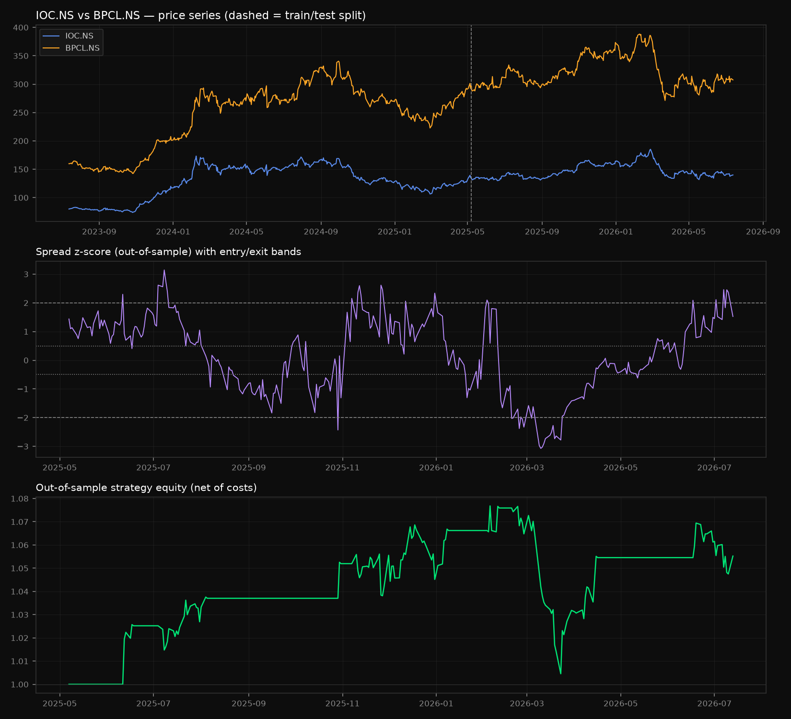

---

### BPCL.NS / HINDPETRO.NS

- **Latest prices:** BPCL.NS ₹307.55 · HINDPETRO.NS ₹391.60
- **Hedge ratio (train-fitted):** 1.4234
- **Cointegration (train):** FAIL at 5% — ADF -1.92, p=0.3210
- **Persistence:** passed 5% in 0 of 8 real-data runs (strict tier: 0/8)
- **Spread half-life:** 40.8 days
- **Current z-score:** -0.38
- **Signal today:** flat / no stretch
- ⚠️ _Pair did not cointegrate on training data. Any signal here is not statistically justified — observation only._

**Out-of-sample backtest** (beta frozen from train window):

| Metric | Value |
|---|---|
| Sharpe | -0.07 |
| Sortino | -0.06 |
| Annualised return | -0.58% |
| Annualised vol | 5.73% |
| Max drawdown | -6.99% |
| Round-trip trades | 4 |

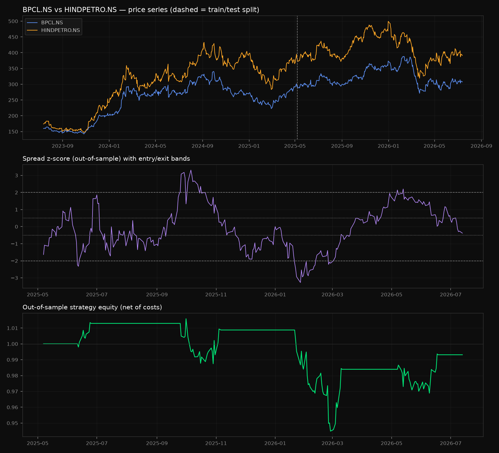

---

### ONGC.NS / COALINDIA.NS

- **Latest prices:** ONGC.NS ₹248.45 · COALINDIA.NS ₹430.20
- **Hedge ratio (train-fitted):** 1.7245
- **Cointegration (train):** PASS at 5% — ADF -2.91, p=0.0447
- **Persistence:** passed 5% in 1 of 8 real-data runs (strict tier: 0/8)
- **Spread half-life:** 16.4 days
- **Current z-score:** +0.28
- **Signal today:** flat / no stretch

**Out-of-sample backtest** (beta frozen from train window):

| Metric | Value |
|---|---|
| Sharpe | 1.09 |
| Sortino | 1.03 |
| Annualised return | 9.28% |
| Annualised vol | 8.44% |
| Max drawdown | -6.20% |
| Round-trip trades | 6 |

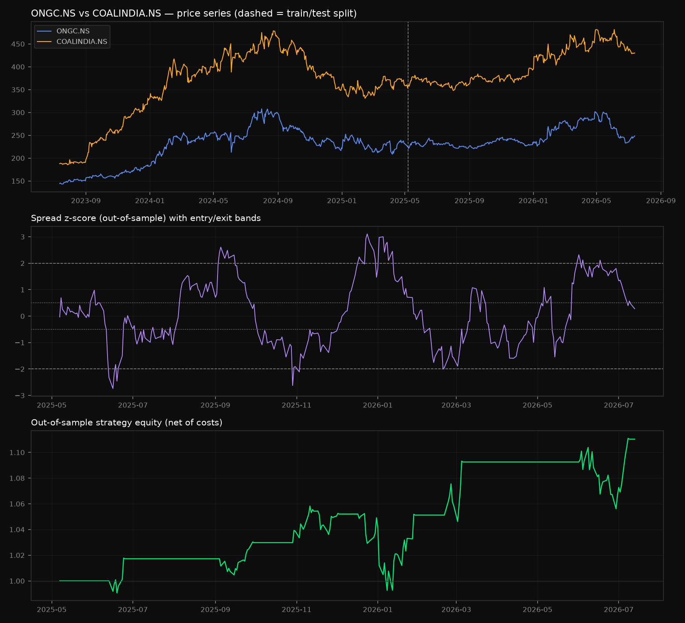

---

### NTPC.NS / POWERGRID.NS

- **Latest prices:** NTPC.NS ₹351.75 · POWERGRID.NS ₹286.00
- **Hedge ratio (train-fitted):** 0.8178
- **Cointegration (train):** FAIL at 5% — ADF -2.56, p=0.1021
- **Persistence:** passed 5% in 0 of 8 real-data runs (strict tier: 0/8)
- **Spread half-life:** 23.0 days
- **Current z-score:** +1.16
- **Signal today:** watch (approaching band)
- ⚠️ _Pair did not cointegrate on training data. Any signal here is not statistically justified — observation only._

**Out-of-sample backtest** (beta frozen from train window):

| Metric | Value |
|---|---|
| Sharpe | 0.91 |
| Sortino | 0.75 |
| Annualised return | 4.99% |
| Annualised vol | 5.54% |
| Max drawdown | -5.06% |
| Round-trip trades | 7 |

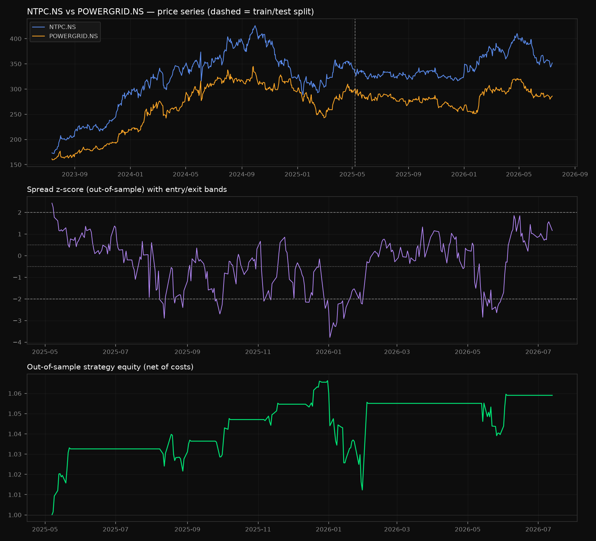

---

### BAJAJ-AUTO.NS / HEROMOTOCO.NS

- **Latest prices:** BAJAJ-AUTO.NS ₹10,381.00 · HEROMOTOCO.NS ₹4,952.10
- **Hedge ratio (train-fitted):** 0.4115
- **Cointegration (train):** FAIL at 5% — ADF -2.18, p=0.2121
- **Persistence:** passed 5% in 0 of 8 real-data runs (strict tier: 0/8)
- **Spread half-life:** 31.3 days
- **Current z-score:** -0.90
- **Signal today:** watch (approaching band)
- ⚠️ _Pair did not cointegrate on training data. Any signal here is not statistically justified — observation only._

**Out-of-sample backtest** (beta frozen from train window):

| Metric | Value |
|---|---|
| Sharpe | -1.41 |
| Sortino | -1.46 |
| Annualised return | -15.72% |
| Annualised vol | 11.61% |
| Max drawdown | -22.87% |
| Round-trip trades | 4 |

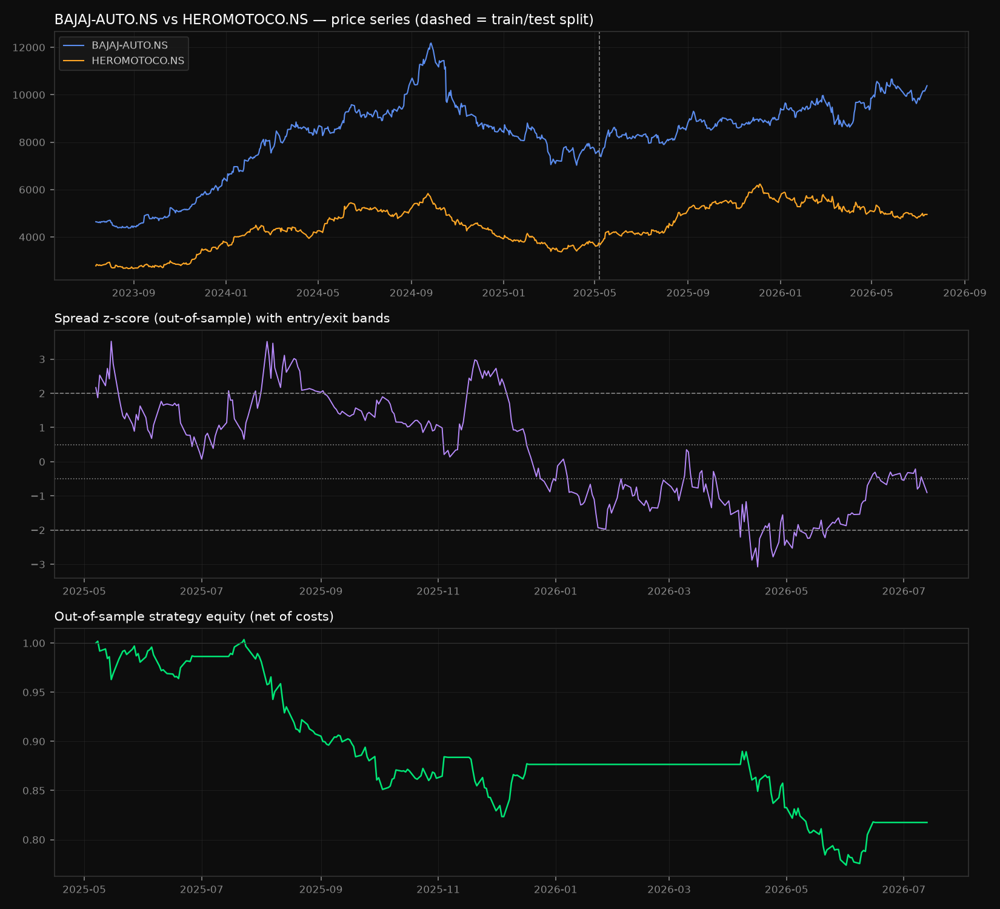

---

### TATASTEEL.NS / JSWSTEEL.NS

- **Latest prices:** TATASTEEL.NS ₹187.11 · JSWSTEEL.NS ₹1,237.40
- **Hedge ratio (train-fitted):** 2.9892
- **Cointegration (train):** FAIL at 5% — ADF -0.54, p=0.8832
- **Persistence:** passed 5% in 0 of 8 real-data runs (strict tier: 0/8)
- **Spread half-life:** 78.1 days
- **Current z-score:** +0.91
- **Signal today:** watch (approaching band)
- ⚠️ _Pair did not cointegrate on training data. Any signal here is not statistically justified — observation only._

**Out-of-sample backtest** (beta frozen from train window):

| Metric | Value |
|---|---|
| Sharpe | 0.26 |
| Sortino | 0.21 |
| Annualised return | 1.71% |
| Annualised vol | 7.72% |
| Max drawdown | -4.57% |
| Round-trip trades | 4 |

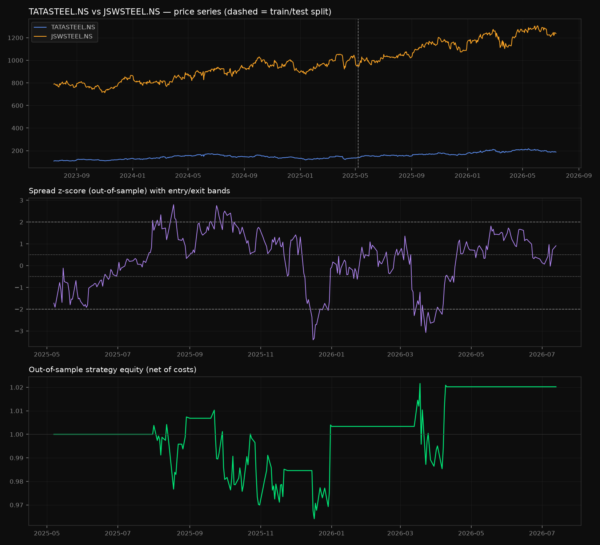

---

### SUNPHARMA.NS / CIPLA.NS

- **Latest prices:** SUNPHARMA.NS ₹1,921.40 · CIPLA.NS ₹1,426.70
- **Hedge ratio (train-fitted):** 0.5142
- **Cointegration (train):** PASS at 5% — ADF -3.71, p=0.0039
- **Persistence:** passed 5% in 8 of 8 real-data runs (strict tier: 0/8)
- **Spread half-life:** 10.7 days
- **Current z-score:** -0.01
- **Signal today:** flat / no stretch

**Out-of-sample backtest** (beta frozen from train window):

| Metric | Value |
|---|---|
| Sharpe | -0.13 |
| Sortino | -0.13 |
| Annualised return | -1.19% |
| Annualised vol | 7.40% |
| Max drawdown | -9.97% |
| Round-trip trades | 5 |

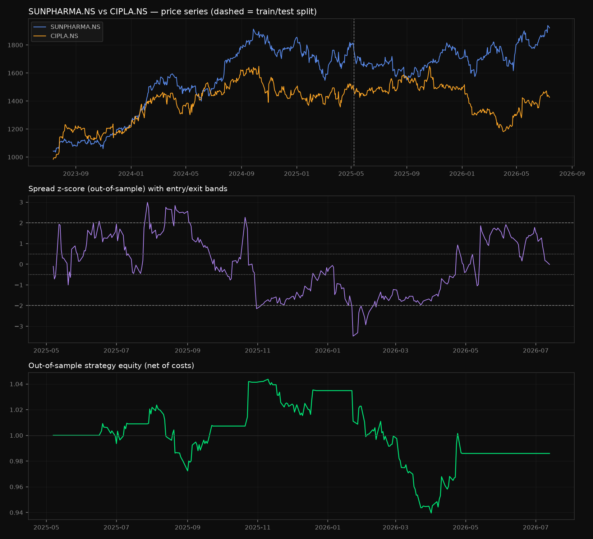

---

_Generated 2026-07-13 · pairs mean-reversion scanner · out-of-sample backtest · multiple-testing-aware · not investment advice._
