# Indian Pairs-Trading Scanner — 2026-07-14

> **What this is:** a market-neutral *pairs mean-reversion* scanner. It flags when two related NSE stocks have drifted apart far enough that their historical relationship signals a possible convergence trade. It does **not** forecast growth, rank "best" stocks, or predict company performance. A signal means the *spread between two stocks* is stretched — nothing about either stock being a good investment. Not investment advice; do your own research.

## Methodology (fixed in advance)

- **Universe:** 16 declared sector-mate pairs. Parameters (3y window, 60/40 train-test, z-entry 2.0, z-exit 0.5, 5 bps costs) are pre-registered; changes are logged in the README changelog *before* looking at results.
- **Multiple testing:** at the 5% level across 16 pairs, **≈0.8 false positives per run are expected by chance alone** even if nothing truly cointegrates. A single-day pass is a candidate, not a discovery.
- **Strict tier:** Bonferroni-corrected threshold p < 0.0031 (marked ✓✓).
- **Evidence = persistence:** the Persistence column counts how often each pair has passed the 5% test across all *real-data* daily runs recorded in `reports/history.csv`. Pairs deserve attention only when they pass persistently.

## Summary

| Pair | p-value | Coint. | Persistence | Current z | Signal | OOS Sharpe |
|---|---|---|---|---|---|---|
| HDFCBANK.NS/ICICIBANK.NS | 0.1255 | ✗ | 0/9 | +1.00 | watch | -0.31 |
| AXISBANK.NS/ICICIBANK.NS | 0.9551 | ✗ | 0/9 | +2.47 | SHORT spread | 0.06 |
| KOTAKBANK.NS/HDFCBANK.NS | 0.2007 | ✗ | 0/9 | +1.75 | watch | -0.07 |
| SBIN.NS/BANKBARODA.NS | 0.2482 | ✗ | 0/9 | -1.41 | watch | 0.49 |
| TCS.NS/INFY.NS | 0.3884 | ✗ | 0/9 | -0.18 | flat / no stretch | 0.98 |
| INFY.NS/WIPRO.NS | 0.1667 | ✗ | 0/9 | -1.15 | watch | 1.73 |
| HCLTECH.NS/TECHM.NS | 0.2315 | ✗ | 0/9 | +1.57 | watch | 0.21 |
| ACC.NS/AMBUJACEM.NS | 0.7770 | ✗ | 0/9 | -0.47 | flat / no stretch | 1.17 |
| ULTRACEMCO.NS/SHREECEM.NS | 0.1043 | ✗ | 0/9 | +1.65 | watch | 0.34 |
| IOC.NS/BPCL.NS | 0.7962 | ✗ | 0/9 | +2.04 | SHORT spread | 0.67 |
| BPCL.NS/HINDPETRO.NS | 0.3018 | ✗ | 0/9 | -0.72 | watch | -0.07 |
| ONGC.NS/COALINDIA.NS | 0.0478 | ✓ | 2/9 | +0.24 | flat / no stretch | 1.09 |
| NTPC.NS/POWERGRID.NS | 0.1202 | ✗ | 0/9 | +1.53 | watch | 0.88 |
| BAJAJ-AUTO.NS/HEROMOTOCO.NS | 0.2032 | ✗ | 0/9 | -0.80 | watch | -1.36 |
| TATASTEEL.NS/JSWSTEEL.NS | 0.7184 | ✗ | 0/9 | +1.22 | watch | 0.26 |
| SUNPHARMA.NS/CIPLA.NS | 0.0032 | ✓ | 9/9 | -0.02 | flat / no stretch | -0.13 |

_Legend: ✓✓ passes strict Bonferroni tier · ✓ passes 5% only · ✗ fails. Persistence = 5%-passes / real-data runs recorded. \*no real-data history yet._

---

### HDFCBANK.NS / ICICIBANK.NS

- **Latest prices:** HDFCBANK.NS ₹809.40 · ICICIBANK.NS ₹1,407.70
- **Hedge ratio (train-fitted):** 1.7222
- **Cointegration (train):** FAIL at 5% — ADF -2.46, p=0.1255
- **Persistence:** passed 5% in 0 of 9 real-data runs (strict tier: 0/9)
- **Spread half-life:** 33.1 days
- **Current z-score:** +1.00
- **Signal today:** watch (approaching band)
- ⚠️ _Pair did not cointegrate on training data. Any signal here is not statistically justified — observation only._

**Out-of-sample backtest** (beta frozen from train window):

| Metric | Value |
|---|---|
| Sharpe | -0.31 |
| Sortino | -0.31 |
| Annualised return | -2.01% |
| Annualised vol | 6.02% |
| Max drawdown | -8.59% |
| Round-trip trades | 5 |

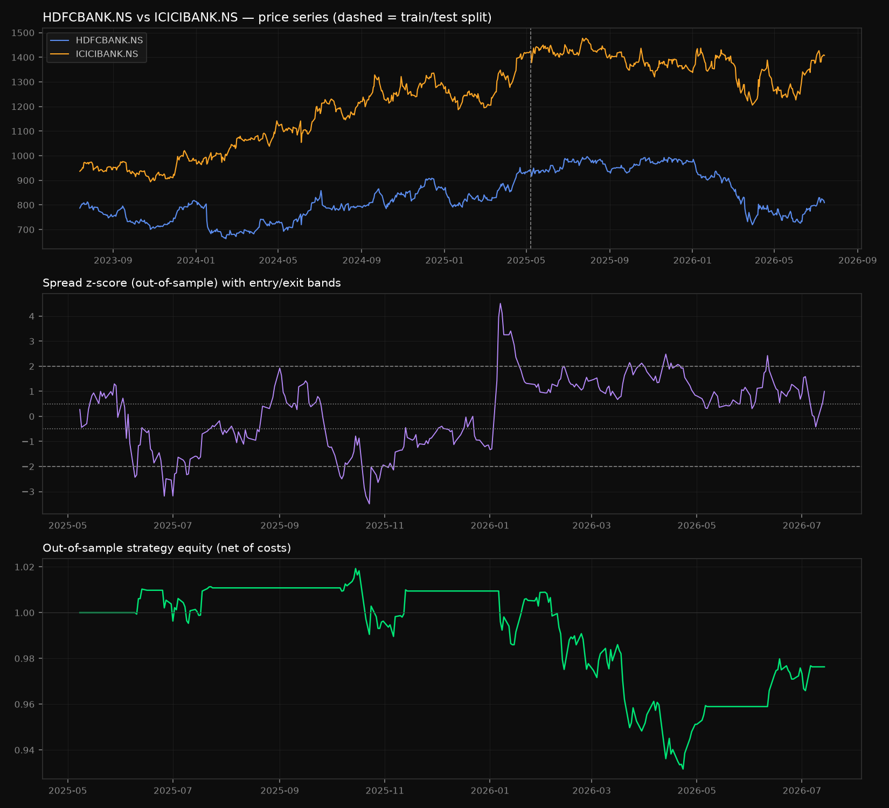

---

### AXISBANK.NS / ICICIBANK.NS

- **Latest prices:** AXISBANK.NS ₹1,317.60 · ICICIBANK.NS ₹1,407.70
- **Hedge ratio (train-fitted):** 0.8801
- **Cointegration (train):** FAIL at 5% — ADF -0.04, p=0.9551
- **Persistence:** passed 5% in 0 of 9 real-data runs (strict tier: 0/9)
- **Spread half-life:** 518.7 days
- **Current z-score:** +2.47
- **Signal today:** SHORT spread (short ICICIBANK.NS, long AXISBANK.NS)
- ⚠️ _Pair did not cointegrate on training data. Any signal here is not statistically justified — observation only._

**Out-of-sample backtest** (beta frozen from train window):

| Metric | Value |
|---|---|
| Sharpe | 0.06 |
| Sortino | 0.06 |
| Annualised return | 0.12% |
| Annualised vol | 8.05% |
| Max drawdown | -7.35% |
| Round-trip trades | 6 |

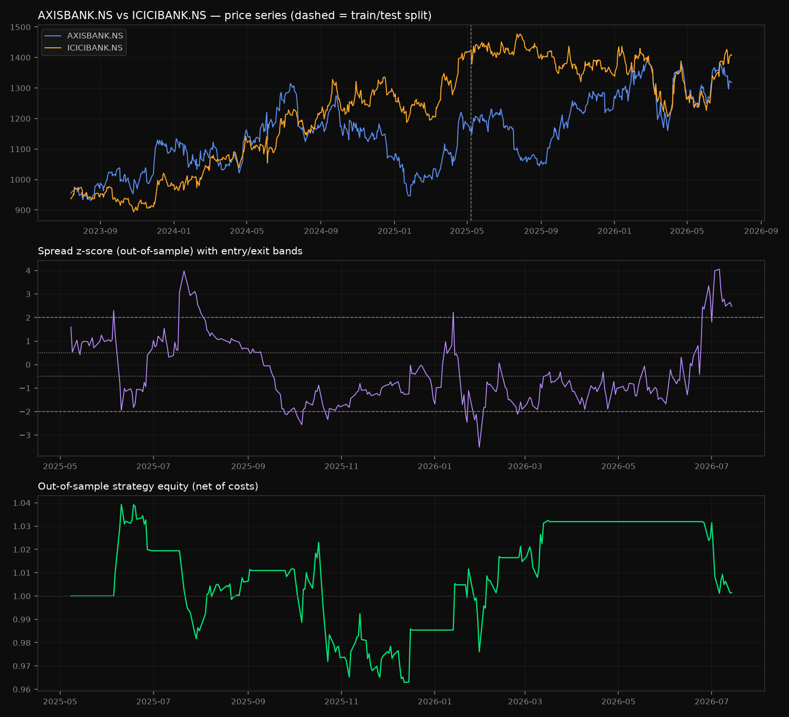

---

### KOTAKBANK.NS / HDFCBANK.NS

- **Latest prices:** KOTAKBANK.NS ₹378.65 · HDFCBANK.NS ₹809.40
- **Hedge ratio (train-fitted):** 1.7753
- **Cointegration (train):** FAIL at 5% — ADF -2.22, p=0.2007
- **Persistence:** passed 5% in 0 of 9 real-data runs (strict tier: 0/9)
- **Spread half-life:** 29.6 days
- **Current z-score:** +1.75
- **Signal today:** watch (approaching band)
- ⚠️ _Pair did not cointegrate on training data. Any signal here is not statistically justified — observation only._

**Out-of-sample backtest** (beta frozen from train window):

| Metric | Value |
|---|---|
| Sharpe | -0.07 |
| Sortino | -0.06 |
| Annualised return | -0.67% |
| Annualised vol | 6.50% |
| Max drawdown | -5.71% |
| Round-trip trades | 4 |

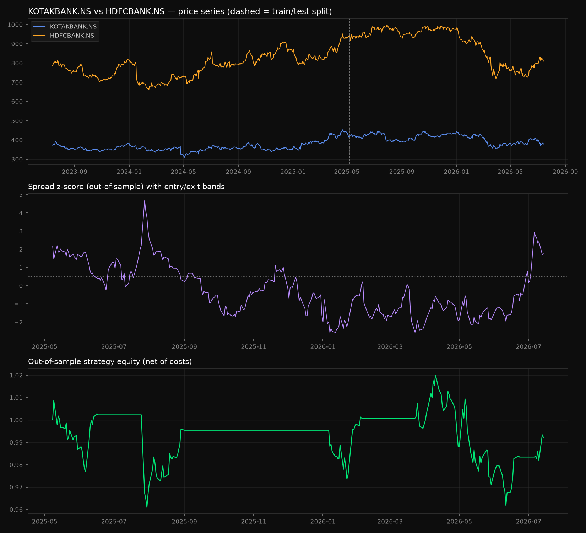

---

### SBIN.NS / BANKBARODA.NS

- **Latest prices:** SBIN.NS ₹1,015.40 · BANKBARODA.NS ₹246.60
- **Hedge ratio (train-fitted):** 0.2116
- **Cointegration (train):** FAIL at 5% — ADF -2.09, p=0.2482
- **Persistence:** passed 5% in 0 of 9 real-data runs (strict tier: 0/9)
- **Spread half-life:** 24.7 days
- **Current z-score:** -1.41
- **Signal today:** watch (approaching band)
- ⚠️ _Pair did not cointegrate on training data. Any signal here is not statistically justified — observation only._

**Out-of-sample backtest** (beta frozen from train window):

| Metric | Value |
|---|---|
| Sharpe | 0.49 |
| Sortino | 0.32 |
| Annualised return | 4.13% |
| Annualised vol | 9.03% |
| Max drawdown | -10.00% |
| Round-trip trades | 5 |

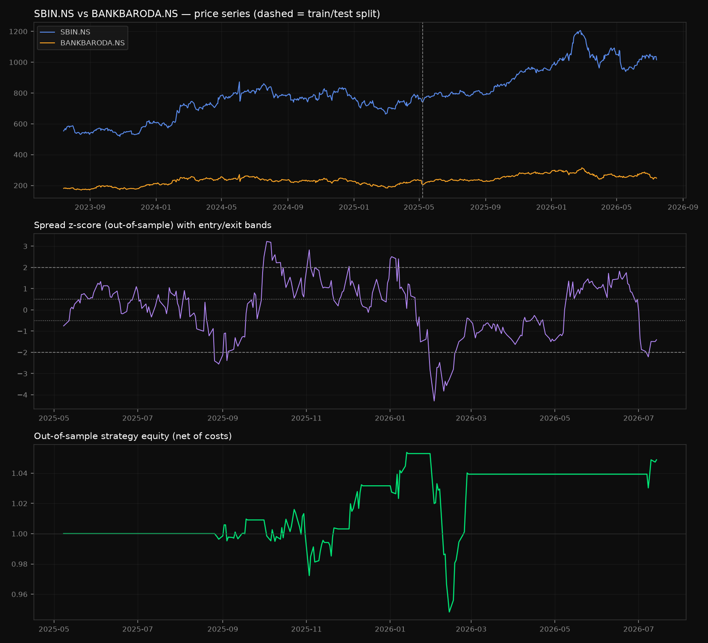

---

### TCS.NS / INFY.NS

- **Latest prices:** TCS.NS ₹2,200.60 · INFY.NS ₹1,092.90
- **Hedge ratio (train-fitted):** 0.5302
- **Cointegration (train):** FAIL at 5% — ADF -1.78, p=0.3884
- **Persistence:** passed 5% in 0 of 9 real-data runs (strict tier: 0/9)
- **Spread half-life:** 39.5 days
- **Current z-score:** -0.18
- **Signal today:** flat / no stretch
- ⚠️ _Pair did not cointegrate on training data. Any signal here is not statistically justified — observation only._

**Out-of-sample backtest** (beta frozen from train window):

| Metric | Value |
|---|---|
| Sharpe | 0.98 |
| Sortino | 0.88 |
| Annualised return | 4.18% |
| Annualised vol | 4.26% |
| Max drawdown | -4.34% |
| Round-trip trades | 6 |

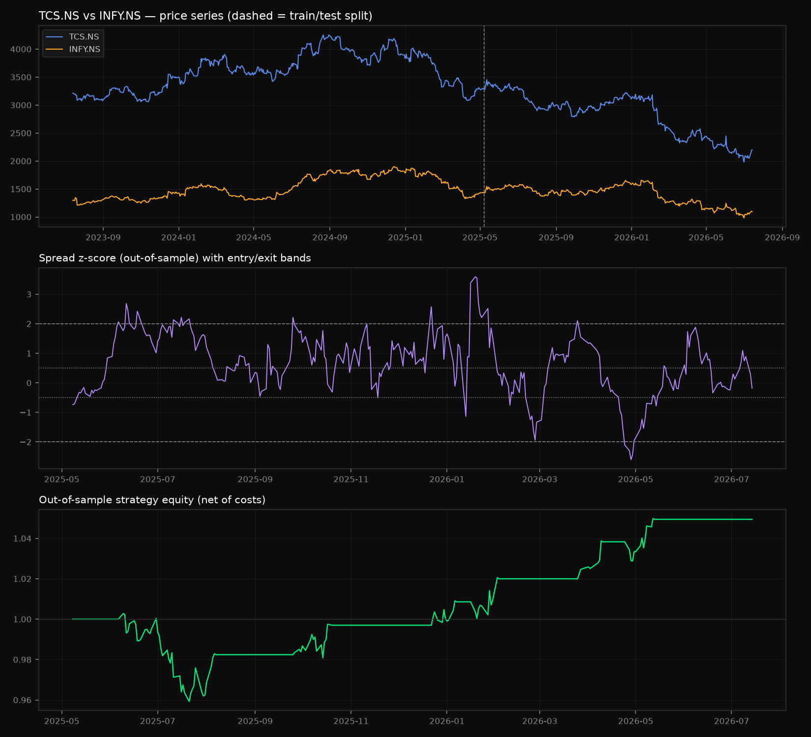

---

### INFY.NS / WIPRO.NS

- **Latest prices:** INFY.NS ₹1,092.90 · WIPRO.NS ₹177.14
- **Hedge ratio (train-fitted):** 0.1403
- **Cointegration (train):** FAIL at 5% — ADF -2.32, p=0.1667
- **Persistence:** passed 5% in 0 of 9 real-data runs (strict tier: 0/9)
- **Spread half-life:** 28.8 days
- **Current z-score:** -1.15
- **Signal today:** watch (approaching band)
- ⚠️ _Pair did not cointegrate on training data. Any signal here is not statistically justified — observation only._

**Out-of-sample backtest** (beta frozen from train window):

| Metric | Value |
|---|---|
| Sharpe | 1.73 |
| Sortino | 2.03 |
| Annualised return | 9.76% |
| Annualised vol | 5.46% |
| Max drawdown | -2.61% |
| Round-trip trades | 6 |

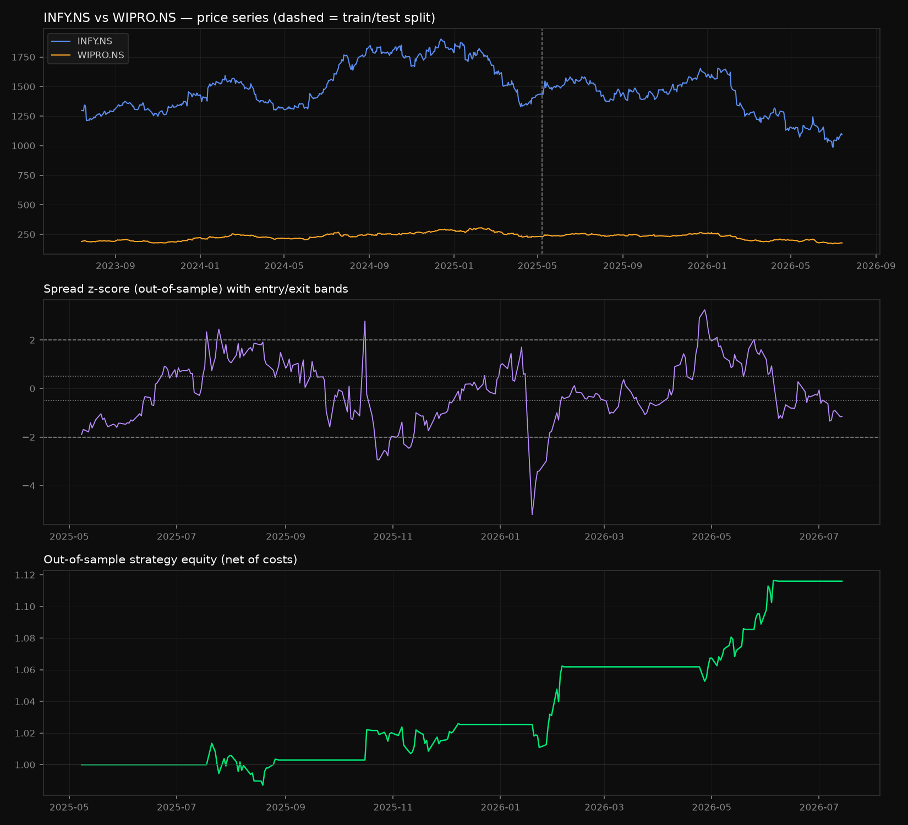

---

### HCLTECH.NS / TECHM.NS

- **Latest prices:** HCLTECH.NS ₹1,166.70 · TECHM.NS ₹1,484.30
- **Hedge ratio (train-fitted):** 0.7899
- **Cointegration (train):** FAIL at 5% — ADF -2.13, p=0.2315
- **Persistence:** passed 5% in 0 of 9 real-data runs (strict tier: 0/9)
- **Spread half-life:** 26.1 days
- **Current z-score:** +1.57
- **Signal today:** watch (approaching band)
- ⚠️ _Pair did not cointegrate on training data. Any signal here is not statistically justified — observation only._

**Out-of-sample backtest** (beta frozen from train window):

| Metric | Value |
|---|---|
| Sharpe | 0.21 |
| Sortino | 0.20 |
| Annualised return | 1.27% |
| Annualised vol | 7.48% |
| Max drawdown | -6.95% |
| Round-trip trades | 5 |

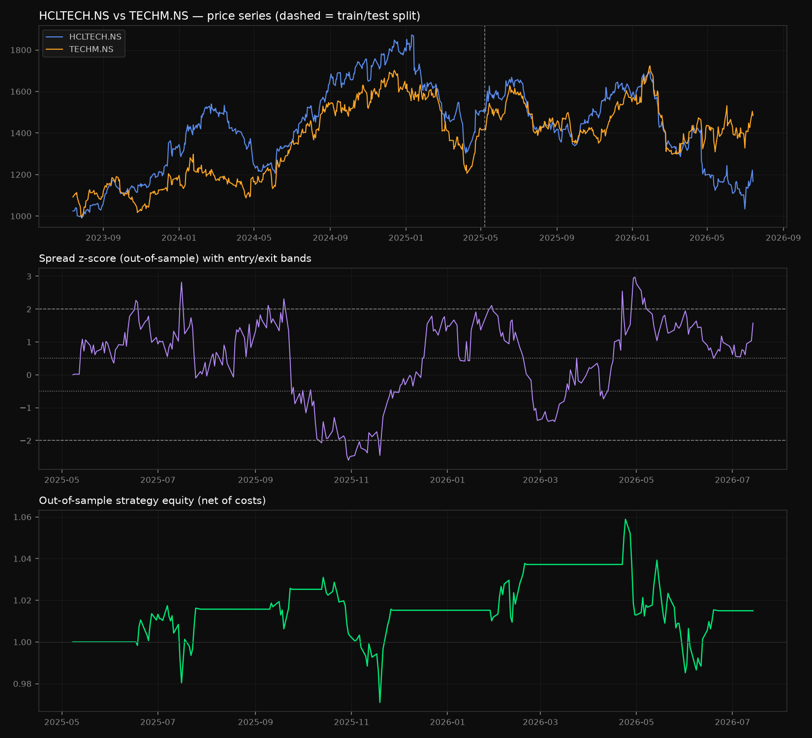

---

### ACC.NS / AMBUJACEM.NS

- **Latest prices:** ACC.NS ₹1,361.90 · AMBUJACEM.NS ₹429.80
- **Hedge ratio (train-fitted):** 0.2466
- **Cointegration (train):** FAIL at 5% — ADF -0.93, p=0.7770
- **Persistence:** passed 5% in 0 of 9 real-data runs (strict tier: 0/9)
- **Spread half-life:** 78.1 days
- **Current z-score:** -0.47
- **Signal today:** flat / no stretch
- ⚠️ _Pair did not cointegrate on training data. Any signal here is not statistically justified — observation only._

**Out-of-sample backtest** (beta frozen from train window):

| Metric | Value |
|---|---|
| Sharpe | 1.17 |
| Sortino | 1.04 |
| Annualised return | 7.02% |
| Annualised vol | 5.98% |
| Max drawdown | -4.76% |
| Round-trip trades | 5 |

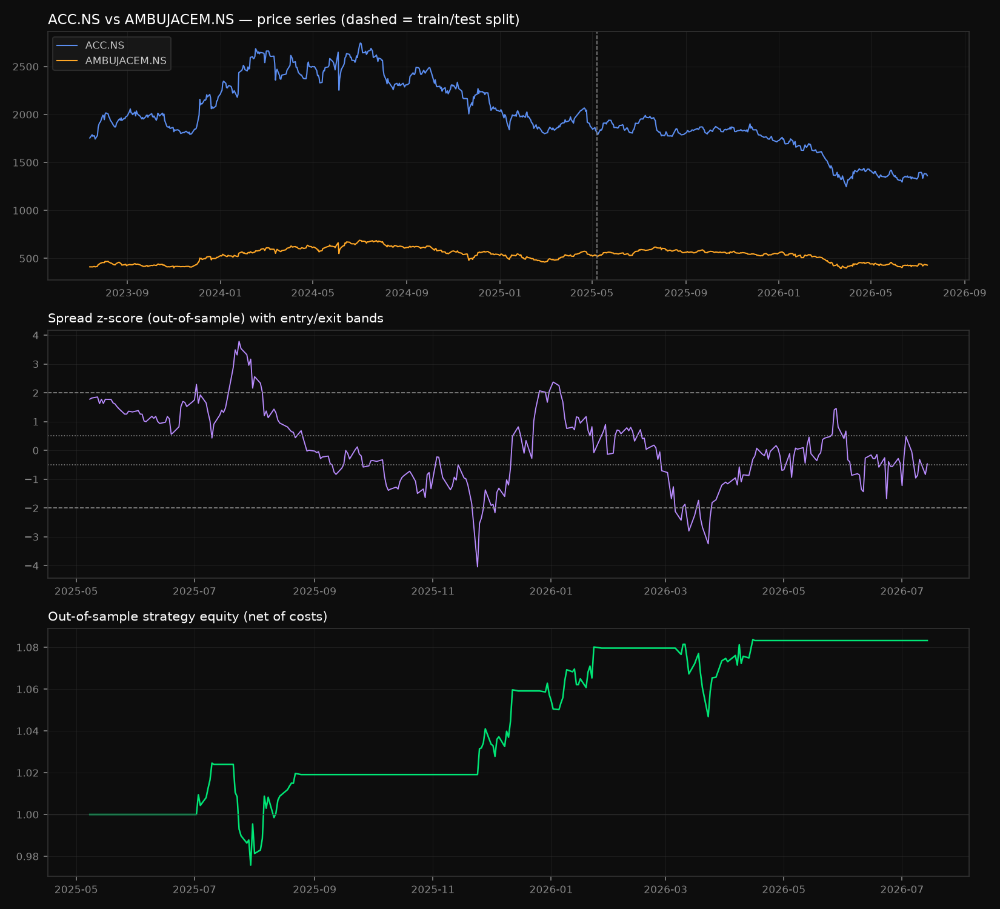

---

### ULTRACEMCO.NS / SHREECEM.NS

- **Latest prices:** ULTRACEMCO.NS ₹11,496.00 · SHREECEM.NS ₹26,280.00
- **Hedge ratio (train-fitted):** 0.6066
- **Cointegration (train):** FAIL at 5% — ADF -2.55, p=0.1043
- **Persistence:** passed 5% in 0 of 9 real-data runs (strict tier: 0/9)
- **Spread half-life:** 29.6 days
- **Current z-score:** +1.65
- **Signal today:** watch (approaching band)
- ⚠️ _Pair did not cointegrate on training data. Any signal here is not statistically justified — observation only._

**Out-of-sample backtest** (beta frozen from train window):

| Metric | Value |
|---|---|
| Sharpe | 0.34 |
| Sortino | 0.34 |
| Annualised return | 2.49% |
| Annualised vol | 8.13% |
| Max drawdown | -9.66% |
| Round-trip trades | 5 |

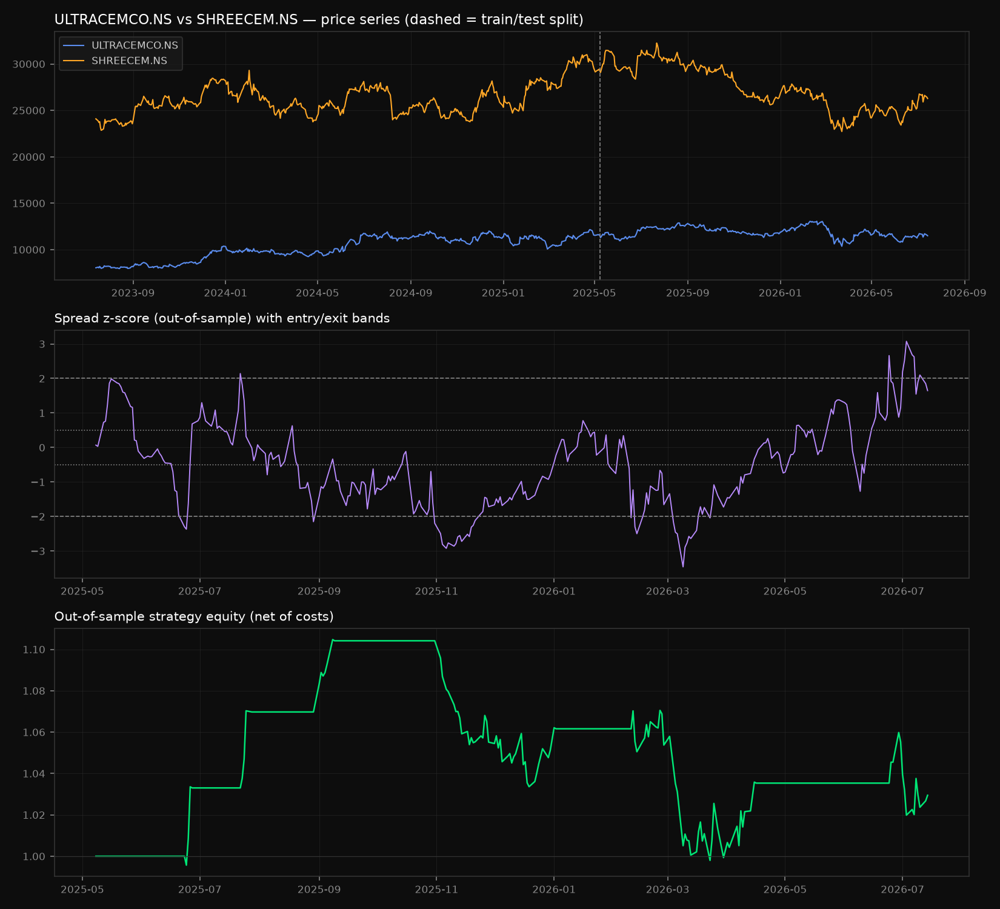

---

### IOC.NS / BPCL.NS

- **Latest prices:** IOC.NS ₹137.05 · BPCL.NS ₹305.35
- **Hedge ratio (train-fitted):** 1.7668
- **Cointegration (train):** FAIL at 5% — ADF -0.87, p=0.7962
- **Persistence:** passed 5% in 0 of 9 real-data runs (strict tier: 0/9)
- **Spread half-life:** 118.0 days
- **Current z-score:** +2.04
- **Signal today:** SHORT spread (short BPCL.NS, long IOC.NS)
- ⚠️ _Pair did not cointegrate on training data. Any signal here is not statistically justified — observation only._

**Out-of-sample backtest** (beta frozen from train window):

| Metric | Value |
|---|---|
| Sharpe | 0.67 |
| Sortino | 0.71 |
| Annualised return | 4.29% |
| Annualised vol | 6.56% |
| Max drawdown | -6.88% |
| Round-trip trades | 7 |

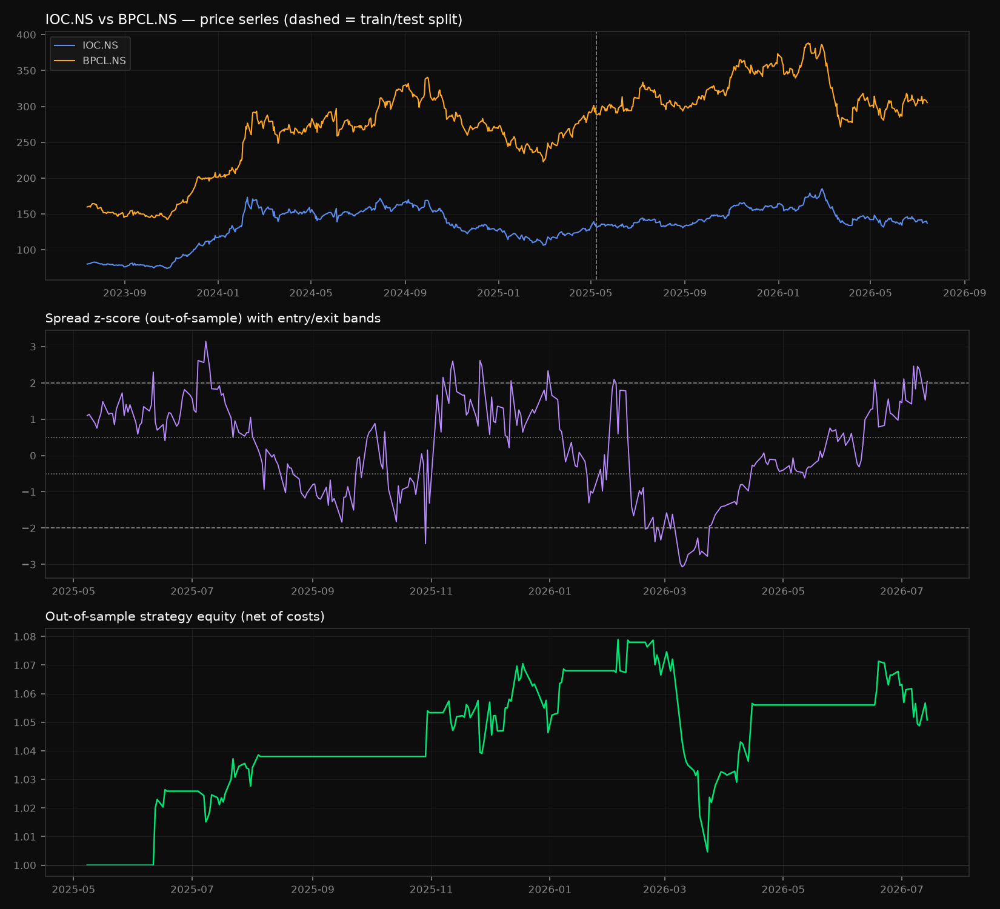

---

### BPCL.NS / HINDPETRO.NS

- **Latest prices:** BPCL.NS ₹305.35 · HINDPETRO.NS ₹386.00
- **Hedge ratio (train-fitted):** 1.4234
- **Cointegration (train):** FAIL at 5% — ADF -1.97, p=0.3018
- **Persistence:** passed 5% in 0 of 9 real-data runs (strict tier: 0/9)
- **Spread half-life:** 39.8 days
- **Current z-score:** -0.72
- **Signal today:** watch (approaching band)
- ⚠️ _Pair did not cointegrate on training data. Any signal here is not statistically justified — observation only._

**Out-of-sample backtest** (beta frozen from train window):

| Metric | Value |
|---|---|
| Sharpe | -0.07 |
| Sortino | -0.06 |
| Annualised return | -0.60% |
| Annualised vol | 5.88% |
| Max drawdown | -7.17% |
| Round-trip trades | 4 |

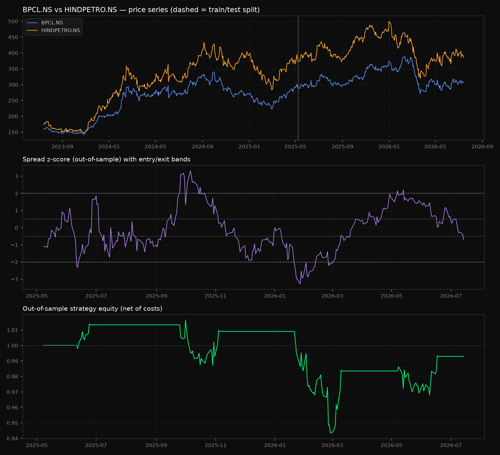

---

### ONGC.NS / COALINDIA.NS

- **Latest prices:** ONGC.NS ₹248.90 · COALINDIA.NS ₹430.60
- **Hedge ratio (train-fitted):** 1.7214
- **Cointegration (train):** PASS at 5% — ADF -2.88, p=0.0478
- **Persistence:** passed 5% in 2 of 9 real-data runs (strict tier: 0/9)
- **Spread half-life:** 16.3 days
- **Current z-score:** +0.24
- **Signal today:** flat / no stretch

**Out-of-sample backtest** (beta frozen from train window):

| Metric | Value |
|---|---|
| Sharpe | 1.09 |
| Sortino | 1.03 |
| Annualised return | 9.37% |
| Annualised vol | 8.52% |
| Max drawdown | -6.26% |
| Round-trip trades | 6 |

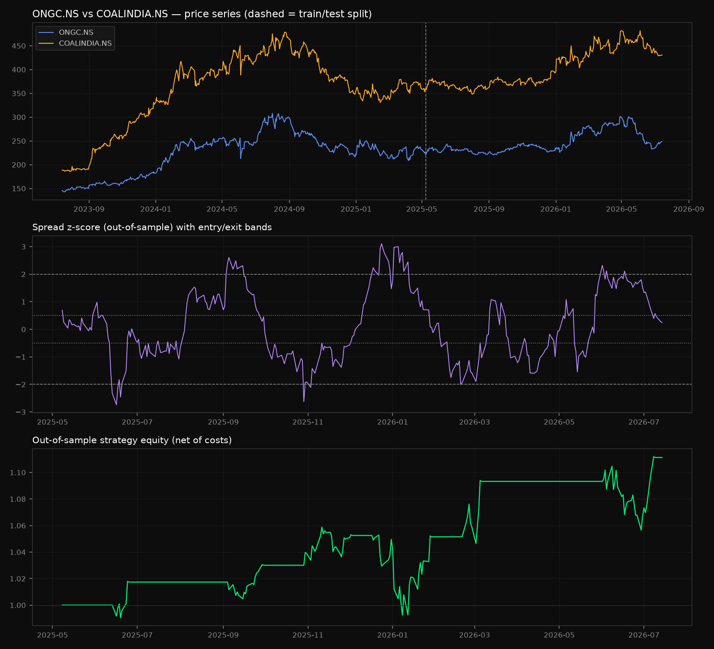

---

### NTPC.NS / POWERGRID.NS

- **Latest prices:** NTPC.NS ₹348.15 · POWERGRID.NS ₹286.15
- **Hedge ratio (train-fitted):** 0.8195
- **Cointegration (train):** FAIL at 5% — ADF -2.48, p=0.1202
- **Persistence:** passed 5% in 0 of 9 real-data runs (strict tier: 0/9)
- **Spread half-life:** 23.7 days
- **Current z-score:** +1.53
- **Signal today:** watch (approaching band)
- ⚠️ _Pair did not cointegrate on training data. Any signal here is not statistically justified — observation only._

**Out-of-sample backtest** (beta frozen from train window):

| Metric | Value |
|---|---|
| Sharpe | 0.88 |
| Sortino | 0.72 |
| Annualised return | 4.84% |
| Annualised vol | 5.58% |
| Max drawdown | -5.10% |
| Round-trip trades | 7 |

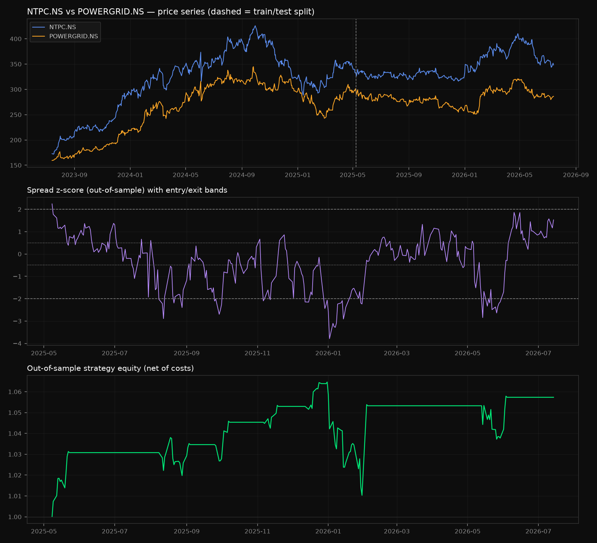

---

### BAJAJ-AUTO.NS / HEROMOTOCO.NS

- **Latest prices:** BAJAJ-AUTO.NS ₹10,166.00 · HEROMOTOCO.NS ₹4,878.30
- **Hedge ratio (train-fitted):** 0.4115
- **Cointegration (train):** FAIL at 5% — ADF -2.21, p=0.2032
- **Persistence:** passed 5% in 0 of 9 real-data runs (strict tier: 0/9)
- **Spread half-life:** 31.0 days
- **Current z-score:** -0.80
- **Signal today:** watch (approaching band)
- ⚠️ _Pair did not cointegrate on training data. Any signal here is not statistically justified — observation only._

**Out-of-sample backtest** (beta frozen from train window):

| Metric | Value |
|---|---|
| Sharpe | -1.36 |
| Sortino | -1.40 |
| Annualised return | -15.41% |
| Annualised vol | 11.77% |
| Max drawdown | -23.22% |
| Round-trip trades | 4 |

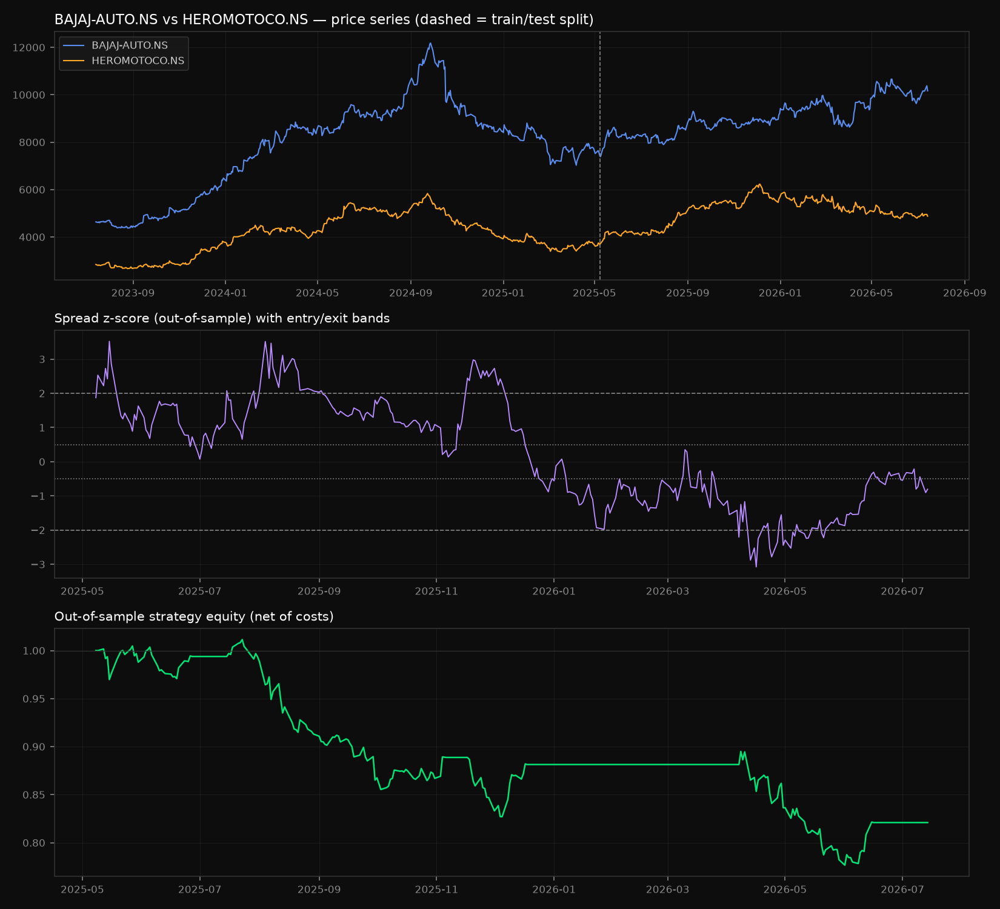

---

### TATASTEEL.NS / JSWSTEEL.NS

- **Latest prices:** TATASTEEL.NS ₹188.27 · JSWSTEEL.NS ₹1,247.70
- **Hedge ratio (train-fitted):** 2.9902
- **Cointegration (train):** FAIL at 5% — ADF -1.09, p=0.7184
- **Persistence:** passed 5% in 0 of 9 real-data runs (strict tier: 0/9)
- **Spread half-life:** 76.4 days
- **Current z-score:** +1.22
- **Signal today:** watch (approaching band)
- ⚠️ _Pair did not cointegrate on training data. Any signal here is not statistically justified — observation only._

**Out-of-sample backtest** (beta frozen from train window):

| Metric | Value |
|---|---|
| Sharpe | 0.26 |
| Sortino | 0.21 |
| Annualised return | 1.73% |
| Annualised vol | 7.83% |
| Max drawdown | -4.63% |
| Round-trip trades | 4 |

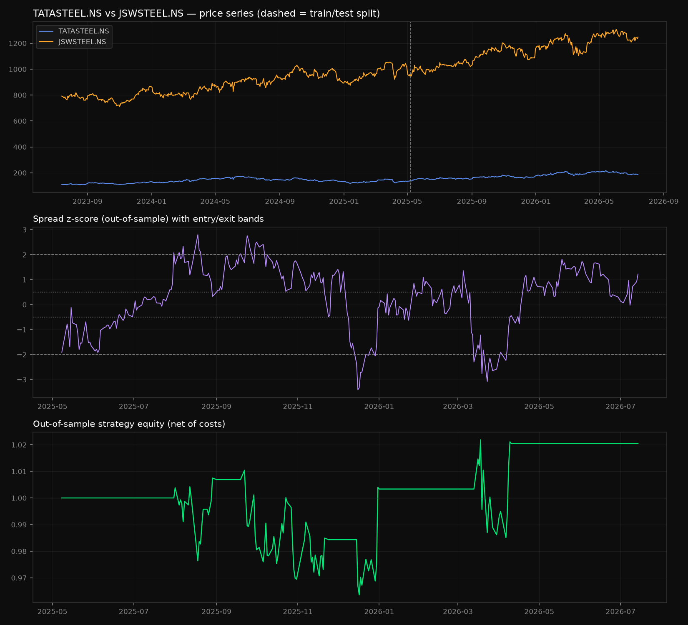

---

### SUNPHARMA.NS / CIPLA.NS

- **Latest prices:** SUNPHARMA.NS ₹1,942.60 · CIPLA.NS ₹1,438.10
- **Hedge ratio (train-fitted):** 0.5116
- **Cointegration (train):** PASS at 5% — ADF -3.77, p=0.0032
- **Persistence:** passed 5% in 9 of 9 real-data runs (strict tier: 0/9)
- **Spread half-life:** 10.6 days
- **Current z-score:** -0.02
- **Signal today:** flat / no stretch

**Out-of-sample backtest** (beta frozen from train window):

| Metric | Value |
|---|---|
| Sharpe | -0.13 |
| Sortino | -0.14 |
| Annualised return | -1.22% |
| Annualised vol | 7.53% |
| Max drawdown | -10.13% |
| Round-trip trades | 5 |

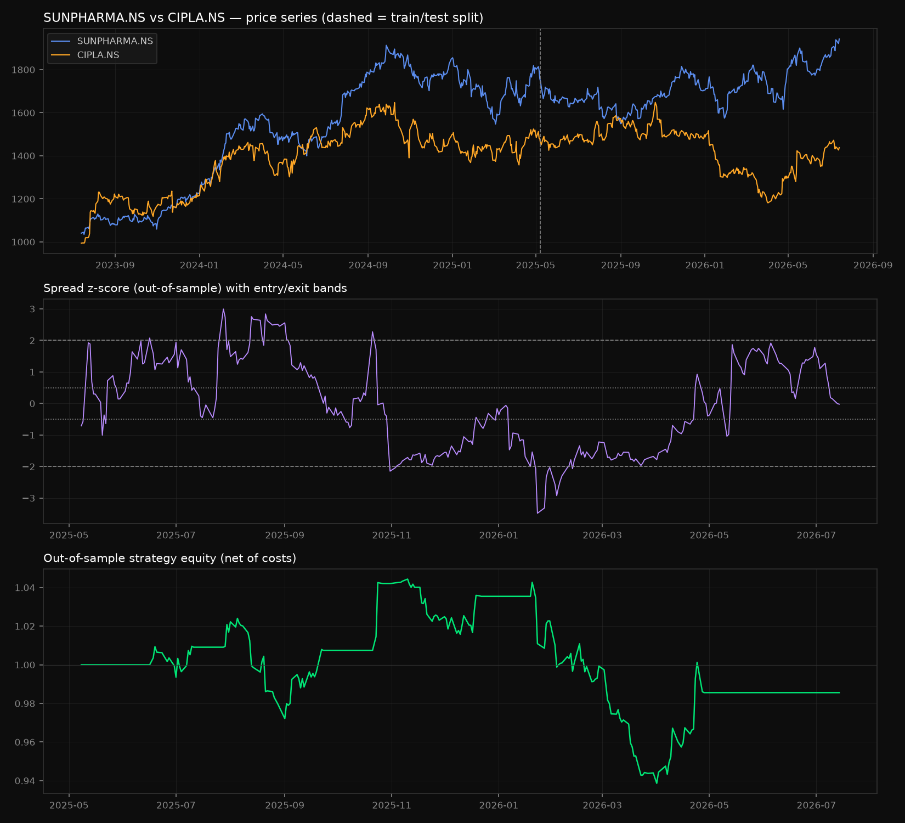

---

_Generated 2026-07-14 · pairs mean-reversion scanner · out-of-sample backtest · multiple-testing-aware · not investment advice._
