# Indian Pairs-Trading Scanner — 2026-07-15

> **What this is:** a market-neutral *pairs mean-reversion* scanner. It flags when two related NSE stocks have drifted apart far enough that their historical relationship signals a possible convergence trade. It does **not** forecast growth, rank "best" stocks, or predict company performance. A signal means the *spread between two stocks* is stretched — nothing about either stock being a good investment. Not investment advice; do your own research.

## Methodology (fixed in advance)

- **Universe:** 16 declared sector-mate pairs. Parameters (3y window, 60/40 train-test, z-entry 2.0, z-exit 0.5, 5 bps costs) are pre-registered; changes are logged in the README changelog *before* looking at results.
- **Multiple testing:** at the 5% level across 16 pairs, **≈0.8 false positives per run are expected by chance alone** even if nothing truly cointegrates. A single-day pass is a candidate, not a discovery.
- **Strict tier:** Bonferroni-corrected threshold p < 0.0031 (marked ✓✓).
- **Evidence = persistence:** the Persistence column counts how often each pair has passed the 5% test across all *real-data* daily runs recorded in `reports/history.csv`. Pairs deserve attention only when they pass persistently.

## Summary

| Pair | p-value | Coint. | Persistence | Current z | Signal | OOS Sharpe |
|---|---|---|---|---|---|---|
| HDFCBANK.NS/ICICIBANK.NS | 0.0953 | ✗ | 0/10 | +0.93 | watch | -0.31 |
| AXISBANK.NS/ICICIBANK.NS | 0.9491 | ✗ | 0/10 | +2.62 | SHORT spread | -0.00 |
| KOTAKBANK.NS/HDFCBANK.NS | 0.1755 | ✗ | 0/10 | +1.90 | watch | -0.11 |
| SBIN.NS/BANKBARODA.NS | 0.2914 | ✗ | 0/10 | -1.49 | watch | 0.45 |
| TCS.NS/INFY.NS | 0.3934 | ✗ | 0/10 | -0.58 | watch | 0.98 |
| INFY.NS/WIPRO.NS | 0.1727 | ✗ | 0/10 | -1.15 | watch | 1.73 |
| HCLTECH.NS/TECHM.NS | 0.2135 | ✗ | 0/10 | +1.82 | watch | -0.20 |
| ACC.NS/AMBUJACEM.NS | 0.7684 | ✗ | 0/10 | -0.40 | flat / no stretch | 1.16 |
| ULTRACEMCO.NS/SHREECEM.NS | 0.0919 | ✗ | 0/10 | +2.17 | SHORT spread | 0.21 |
| IOC.NS/BPCL.NS | 0.7687 | ✗ | 0/10 | +1.70 | watch | 0.70 |
| BPCL.NS/HINDPETRO.NS | 0.3105 | ✗ | 0/10 | -0.52 | watch | -0.07 |
| ONGC.NS/COALINDIA.NS | 0.0444 | ✓ | 3/10 | +0.22 | flat / no stretch | 1.09 |
| NTPC.NS/POWERGRID.NS | 0.1103 | ✗ | 0/10 | +1.20 | watch | 0.43 |
| BAJAJ-AUTO.NS/HEROMOTOCO.NS | 0.2085 | ✗ | 0/10 | -1.19 | watch | -1.36 |
| TATASTEEL.NS/JSWSTEEL.NS | 0.7024 | ✗ | 0/10 | +0.60 | watch | 0.26 |
| SUNPHARMA.NS/CIPLA.NS | 0.0033 | ✓ | 10/10 | -0.16 | flat / no stretch | -0.12 |

_Legend: ✓✓ passes strict Bonferroni tier · ✓ passes 5% only · ✗ fails. Persistence = 5%-passes / real-data runs recorded. \*no real-data history yet._

---

### HDFCBANK.NS / ICICIBANK.NS

- **Latest prices:** HDFCBANK.NS ₹815.45 · ICICIBANK.NS ₹1,416.20
- **Hedge ratio (train-fitted):** 1.7257
- **Cointegration (train):** FAIL at 5% — ADF -2.59, p=0.0953
- **Persistence:** passed 5% in 0 of 10 real-data runs (strict tier: 0/10)
- **Spread half-life:** 31.3 days
- **Current z-score:** +0.93
- **Signal today:** watch (approaching band)
- ⚠️ _Pair did not cointegrate on training data. Any signal here is not statistically justified — observation only._

**Out-of-sample backtest** (beta frozen from train window):

| Metric | Value |
|---|---|
| Sharpe | -0.31 |
| Sortino | -0.31 |
| Annualised return | -2.08% |
| Annualised vol | 6.18% |
| Max drawdown | -8.83% |
| Round-trip trades | 5 |

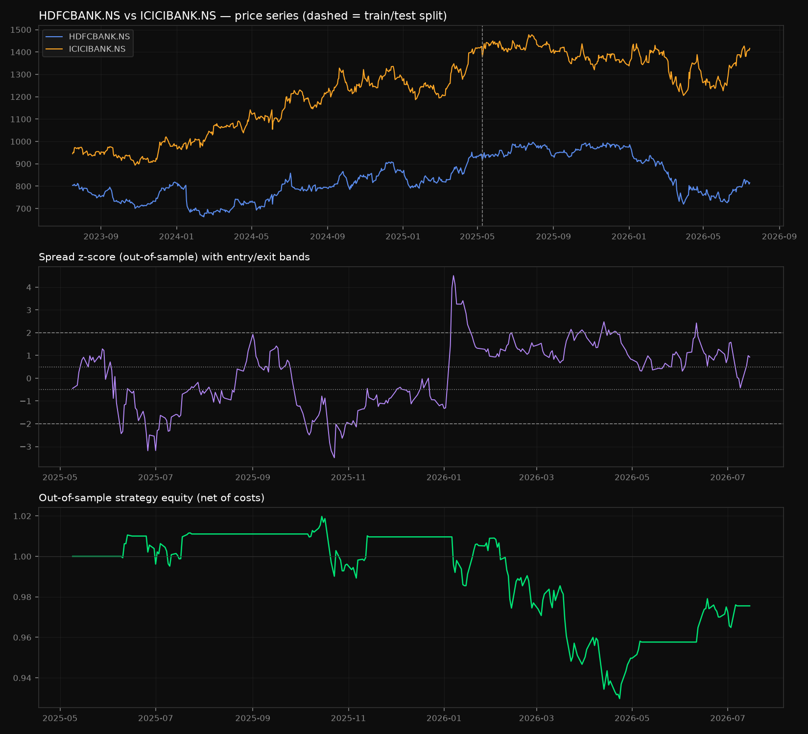

---

### AXISBANK.NS / ICICIBANK.NS

- **Latest prices:** AXISBANK.NS ₹1,312.30 · ICICIBANK.NS ₹1,416.20
- **Hedge ratio (train-fitted):** 0.8825
- **Cointegration (train):** FAIL at 5% — ADF -0.10, p=0.9491
- **Persistence:** passed 5% in 0 of 10 real-data runs (strict tier: 0/10)
- **Spread half-life:** 402.0 days
- **Current z-score:** +2.62
- **Signal today:** SHORT spread (short ICICIBANK.NS, long AXISBANK.NS)
- ⚠️ _Pair did not cointegrate on training data. Any signal here is not statistically justified — observation only._

**Out-of-sample backtest** (beta frozen from train window):

| Metric | Value |
|---|---|
| Sharpe | -0.00 |
| Sortino | -0.00 |
| Annualised return | -0.35% |
| Annualised vol | 8.29% |
| Max drawdown | -7.55% |
| Round-trip trades | 6 |

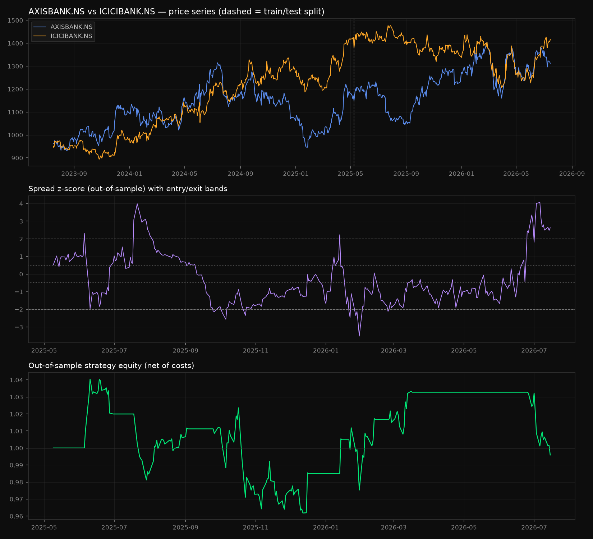

---

### KOTAKBANK.NS / HDFCBANK.NS

- **Latest prices:** KOTAKBANK.NS ₹378.40 · HDFCBANK.NS ₹815.45
- **Hedge ratio (train-fitted):** 1.7868
- **Cointegration (train):** FAIL at 5% — ADF -2.29, p=0.1755
- **Persistence:** passed 5% in 0 of 10 real-data runs (strict tier: 0/10)
- **Spread half-life:** 28.6 days
- **Current z-score:** +1.90
- **Signal today:** watch (approaching band)
- ⚠️ _Pair did not cointegrate on training data. Any signal here is not statistically justified — observation only._

**Out-of-sample backtest** (beta frozen from train window):

| Metric | Value |
|---|---|
| Sharpe | -0.11 |
| Sortino | -0.09 |
| Annualised return | -0.91% |
| Annualised vol | 6.47% |
| Max drawdown | -5.78% |
| Round-trip trades | 4 |

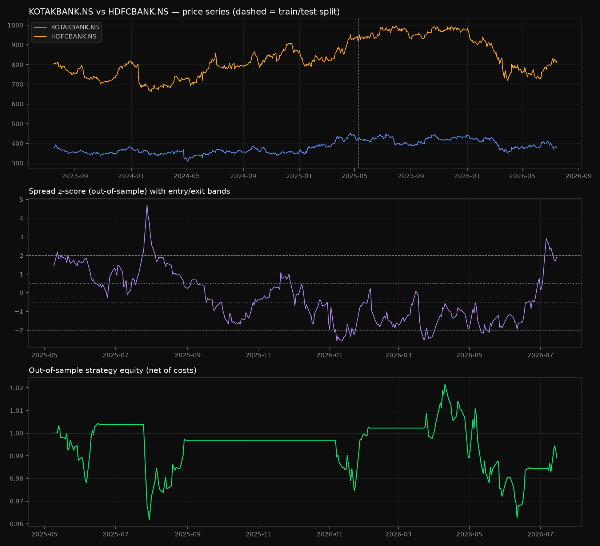

---

### SBIN.NS / BANKBARODA.NS

- **Latest prices:** SBIN.NS ₹1,030.10 · BANKBARODA.NS ₹248.15
- **Hedge ratio (train-fitted):** 0.2112
- **Cointegration (train):** FAIL at 5% — ADF -1.99, p=0.2914
- **Persistence:** passed 5% in 0 of 10 real-data runs (strict tier: 0/10)
- **Spread half-life:** 25.8 days
- **Current z-score:** -1.49
- **Signal today:** watch (approaching band)
- ⚠️ _Pair did not cointegrate on training data. Any signal here is not statistically justified — observation only._

**Out-of-sample backtest** (beta frozen from train window):

| Metric | Value |
|---|---|
| Sharpe | 0.45 |
| Sortino | 0.30 |
| Annualised return | 3.71% |
| Annualised vol | 8.93% |
| Max drawdown | -9.88% |
| Round-trip trades | 5 |

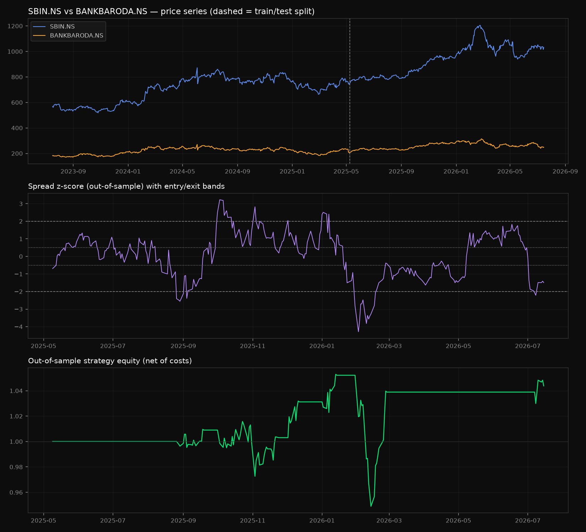

---

### TCS.NS / INFY.NS

- **Latest prices:** TCS.NS ₹2,189.20 · INFY.NS ₹1,076.30
- **Hedge ratio (train-fitted):** 0.5324
- **Cointegration (train):** FAIL at 5% — ADF -1.77, p=0.3934
- **Persistence:** passed 5% in 0 of 10 real-data runs (strict tier: 0/10)
- **Spread half-life:** 39.7 days
- **Current z-score:** -0.58
- **Signal today:** watch (approaching band)
- ⚠️ _Pair did not cointegrate on training data. Any signal here is not statistically justified — observation only._

**Out-of-sample backtest** (beta frozen from train window):

| Metric | Value |
|---|---|
| Sharpe | 0.98 |
| Sortino | 0.89 |
| Annualised return | 4.19% |
| Annualised vol | 4.27% |
| Max drawdown | -4.35% |
| Round-trip trades | 6 |

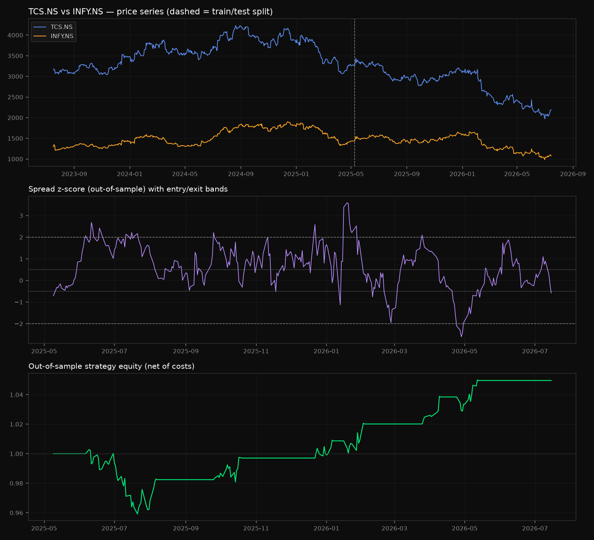

---

### INFY.NS / WIPRO.NS

- **Latest prices:** INFY.NS ₹1,076.30 · WIPRO.NS ₹174.65
- **Hedge ratio (train-fitted):** 0.1401
- **Cointegration (train):** FAIL at 5% — ADF -2.30, p=0.1727
- **Persistence:** passed 5% in 0 of 10 real-data runs (strict tier: 0/10)
- **Spread half-life:** 29.1 days
- **Current z-score:** -1.15
- **Signal today:** watch (approaching band)
- ⚠️ _Pair did not cointegrate on training data. Any signal here is not statistically justified — observation only._

**Out-of-sample backtest** (beta frozen from train window):

| Metric | Value |
|---|---|
| Sharpe | 1.73 |
| Sortino | 2.03 |
| Annualised return | 9.76% |
| Annualised vol | 5.46% |
| Max drawdown | -2.61% |
| Round-trip trades | 6 |

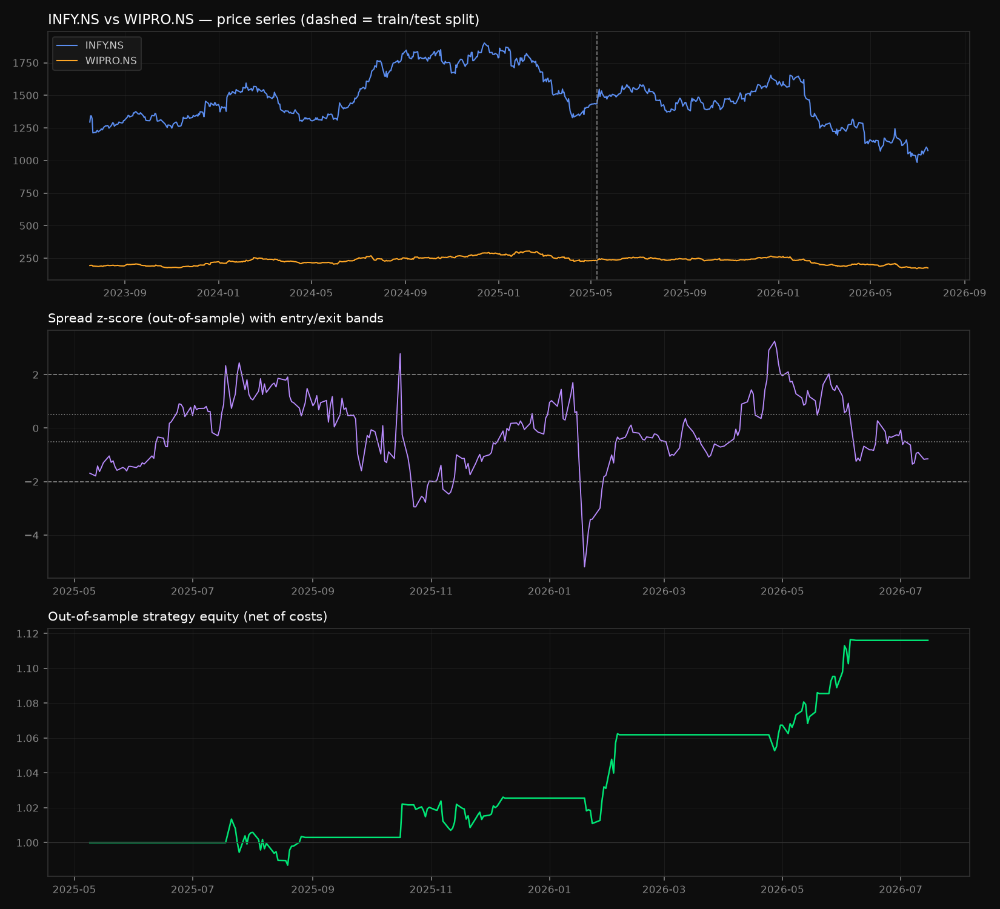

---

### HCLTECH.NS / TECHM.NS

- **Latest prices:** HCLTECH.NS ₹1,168.00 · TECHM.NS ₹1,498.70
- **Hedge ratio (train-fitted):** 0.7916
- **Cointegration (train):** FAIL at 5% — ADF -2.18, p=0.2135
- **Persistence:** passed 5% in 0 of 10 real-data runs (strict tier: 0/10)
- **Spread half-life:** 25.6 days
- **Current z-score:** +1.82
- **Signal today:** watch (approaching band)
- ⚠️ _Pair did not cointegrate on training data. Any signal here is not statistically justified — observation only._

**Out-of-sample backtest** (beta frozen from train window):

| Metric | Value |
|---|---|
| Sharpe | -0.20 |
| Sortino | -0.21 |
| Annualised return | -1.88% |
| Annualised vol | 7.94% |
| Max drawdown | -7.63% |
| Round-trip trades | 4 |

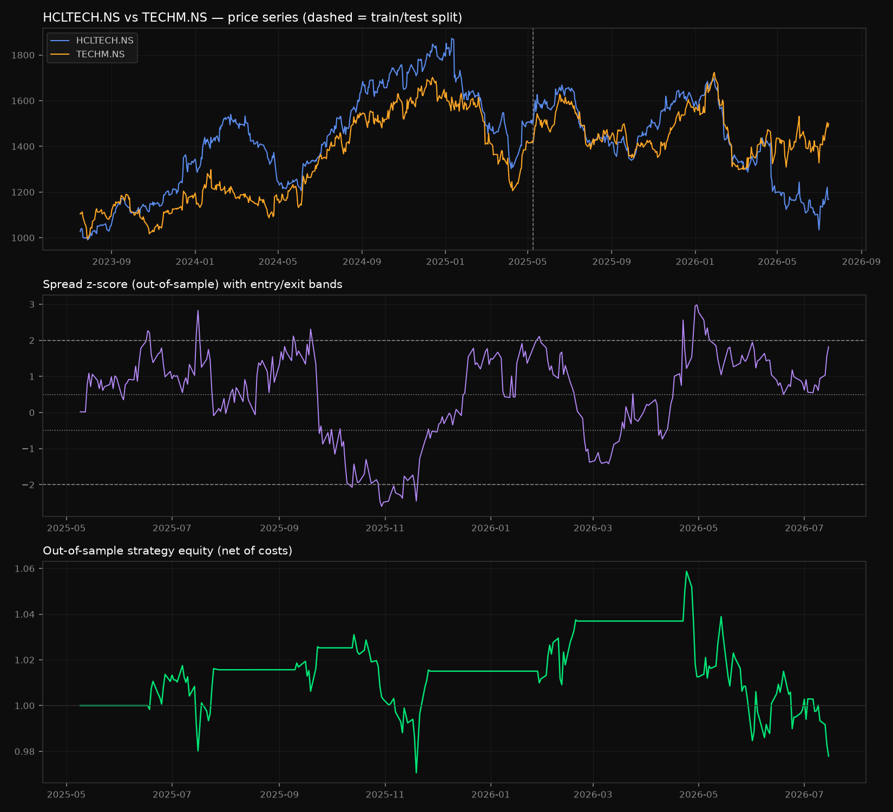

---

### ACC.NS / AMBUJACEM.NS

- **Latest prices:** ACC.NS ₹1,383.20 · AMBUJACEM.NS ₹435.25
- **Hedge ratio (train-fitted):** 0.2453
- **Cointegration (train):** FAIL at 5% — ADF -0.96, p=0.7684
- **Persistence:** passed 5% in 0 of 10 real-data runs (strict tier: 0/10)
- **Spread half-life:** 73.8 days
- **Current z-score:** -0.40
- **Signal today:** flat / no stretch
- ⚠️ _Pair did not cointegrate on training data. Any signal here is not statistically justified — observation only._

**Out-of-sample backtest** (beta frozen from train window):

| Metric | Value |
|---|---|
| Sharpe | 1.16 |
| Sortino | 1.03 |
| Annualised return | 7.00% |
| Annualised vol | 5.97% |
| Max drawdown | -4.74% |
| Round-trip trades | 5 |

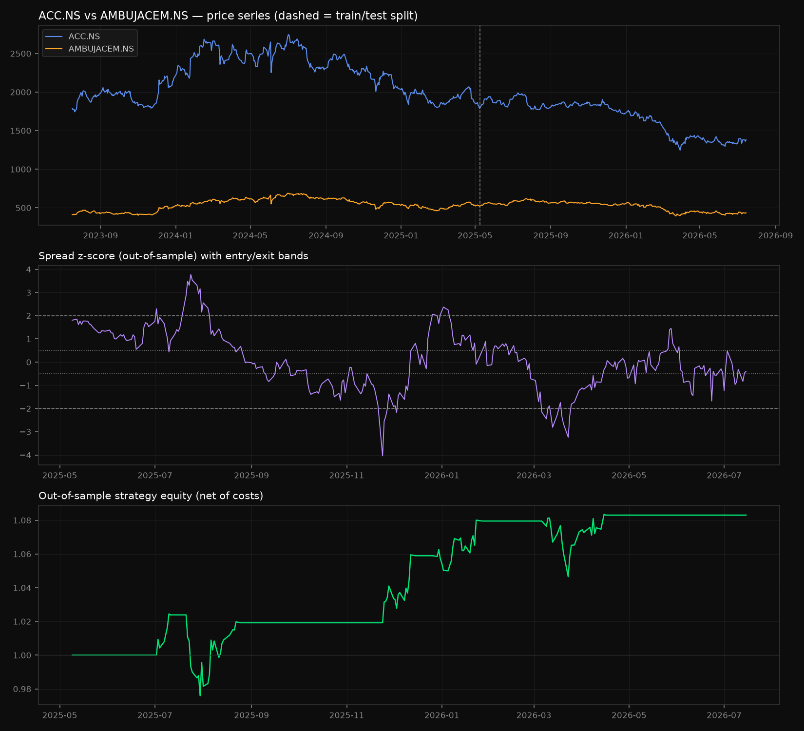

---

### ULTRACEMCO.NS / SHREECEM.NS

- **Latest prices:** ULTRACEMCO.NS ₹11,812.00 · SHREECEM.NS ₹26,925.00
- **Hedge ratio (train-fitted):** 0.6085
- **Cointegration (train):** FAIL at 5% — ADF -2.61, p=0.0919
- **Persistence:** passed 5% in 0 of 10 real-data runs (strict tier: 0/10)
- **Spread half-life:** 29.0 days
- **Current z-score:** +2.17
- **Signal today:** SHORT spread (short SHREECEM.NS, long ULTRACEMCO.NS)
- ⚠️ _Pair did not cointegrate on training data. Any signal here is not statistically justified — observation only._

**Out-of-sample backtest** (beta frozen from train window):

| Metric | Value |
|---|---|
| Sharpe | 0.21 |
| Sortino | 0.21 |
| Annualised return | 1.42% |
| Annualised vol | 8.28% |
| Max drawdown | -9.73% |
| Round-trip trades | 5 |

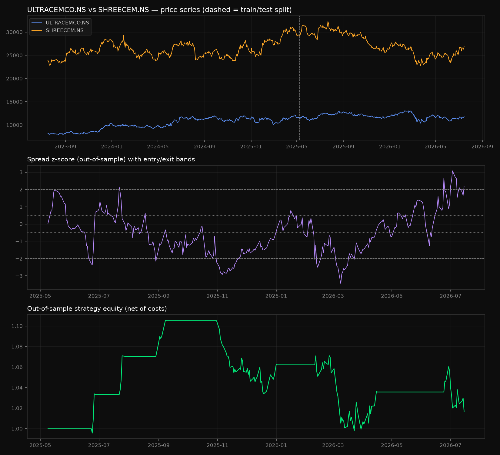

---

### IOC.NS / BPCL.NS

- **Latest prices:** IOC.NS ₹140.24 · BPCL.NS ₹309.60
- **Hedge ratio (train-fitted):** 1.7671
- **Cointegration (train):** FAIL at 5% — ADF -0.96, p=0.7687
- **Persistence:** passed 5% in 0 of 10 real-data runs (strict tier: 0/10)
- **Spread half-life:** 108.2 days
- **Current z-score:** +1.70
- **Signal today:** watch (approaching band)
- ⚠️ _Pair did not cointegrate on training data. Any signal here is not statistically justified — observation only._

**Out-of-sample backtest** (beta frozen from train window):

| Metric | Value |
|---|---|
| Sharpe | 0.70 |
| Sortino | 0.71 |
| Annualised return | 4.43% |
| Annualised vol | 6.51% |
| Max drawdown | -6.91% |
| Round-trip trades | 7 |

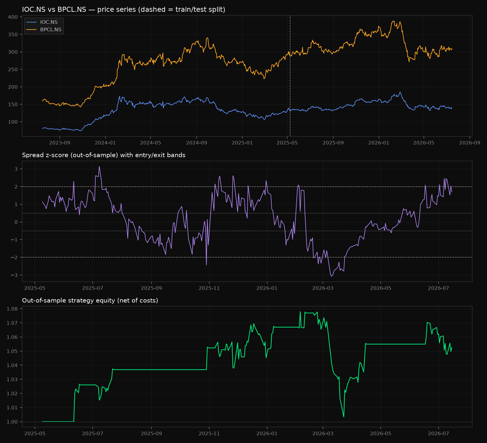

---

### BPCL.NS / HINDPETRO.NS

- **Latest prices:** BPCL.NS ₹309.60 · HINDPETRO.NS ₹394.40
- **Hedge ratio (train-fitted):** 1.4234
- **Cointegration (train):** FAIL at 5% — ADF -1.95, p=0.3105
- **Persistence:** passed 5% in 0 of 10 real-data runs (strict tier: 0/10)
- **Spread half-life:** 40.2 days
- **Current z-score:** -0.52
- **Signal today:** watch (approaching band)
- ⚠️ _Pair did not cointegrate on training data. Any signal here is not statistically justified — observation only._

**Out-of-sample backtest** (beta frozen from train window):

| Metric | Value |
|---|---|
| Sharpe | -0.07 |
| Sortino | -0.06 |
| Annualised return | -0.61% |
| Annualised vol | 5.91% |
| Max drawdown | -7.20% |
| Round-trip trades | 4 |

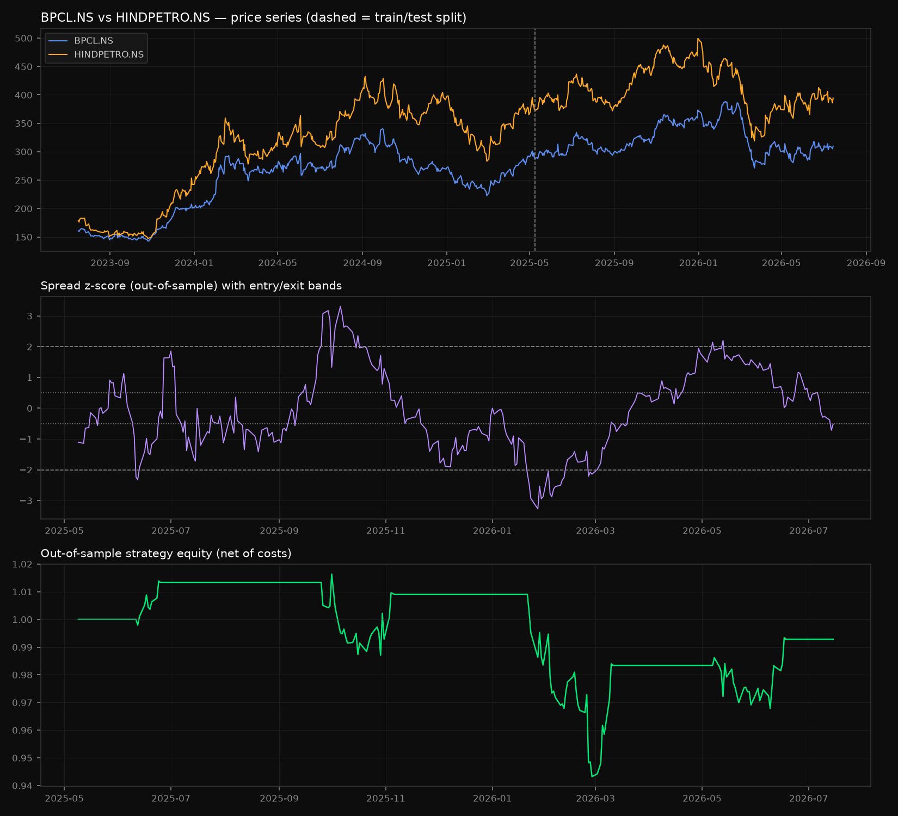

---

### ONGC.NS / COALINDIA.NS

- **Latest prices:** ONGC.NS ₹247.18 · COALINDIA.NS ₹427.55
- **Hedge ratio (train-fitted):** 1.7182
- **Cointegration (train):** PASS at 5% — ADF -2.91, p=0.0444
- **Persistence:** passed 5% in 3 of 10 real-data runs (strict tier: 0/10)
- **Spread half-life:** 16.4 days
- **Current z-score:** +0.22
- **Signal today:** flat / no stretch

**Out-of-sample backtest** (beta frozen from train window):

| Metric | Value |
|---|---|
| Sharpe | 1.09 |
| Sortino | 1.03 |
| Annualised return | 9.36% |
| Annualised vol | 8.52% |
| Max drawdown | -6.27% |
| Round-trip trades | 6 |

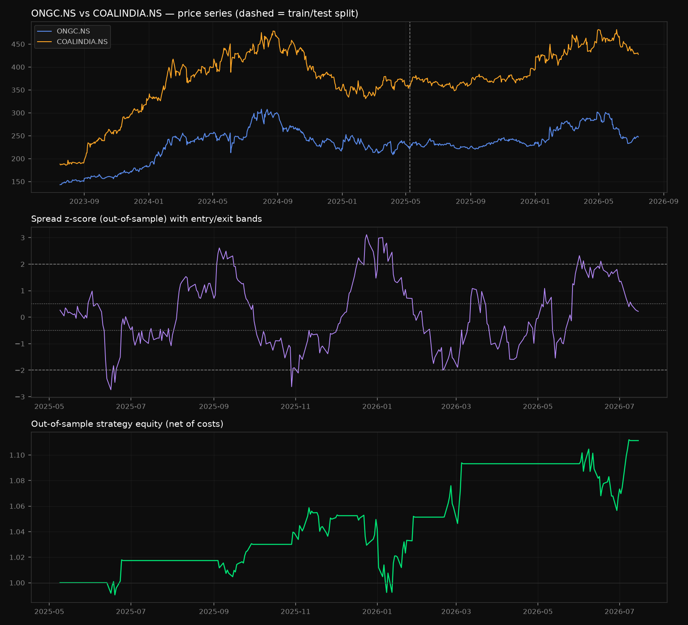

---

### NTPC.NS / POWERGRID.NS

- **Latest prices:** NTPC.NS ₹344.35 · POWERGRID.NS ₹280.70
- **Hedge ratio (train-fitted):** 0.8211
- **Cointegration (train):** FAIL at 5% — ADF -2.52, p=0.1103
- **Persistence:** passed 5% in 0 of 10 real-data runs (strict tier: 0/10)
- **Spread half-life:** 23.3 days
- **Current z-score:** +1.20
- **Signal today:** watch (approaching band)
- ⚠️ _Pair did not cointegrate on training data. Any signal here is not statistically justified — observation only._

**Out-of-sample backtest** (beta frozen from train window):

| Metric | Value |
|---|---|
| Sharpe | 0.43 |
| Sortino | 0.33 |
| Annualised return | 2.22% |
| Annualised vol | 5.50% |
| Max drawdown | -5.22% |
| Round-trip trades | 6 |

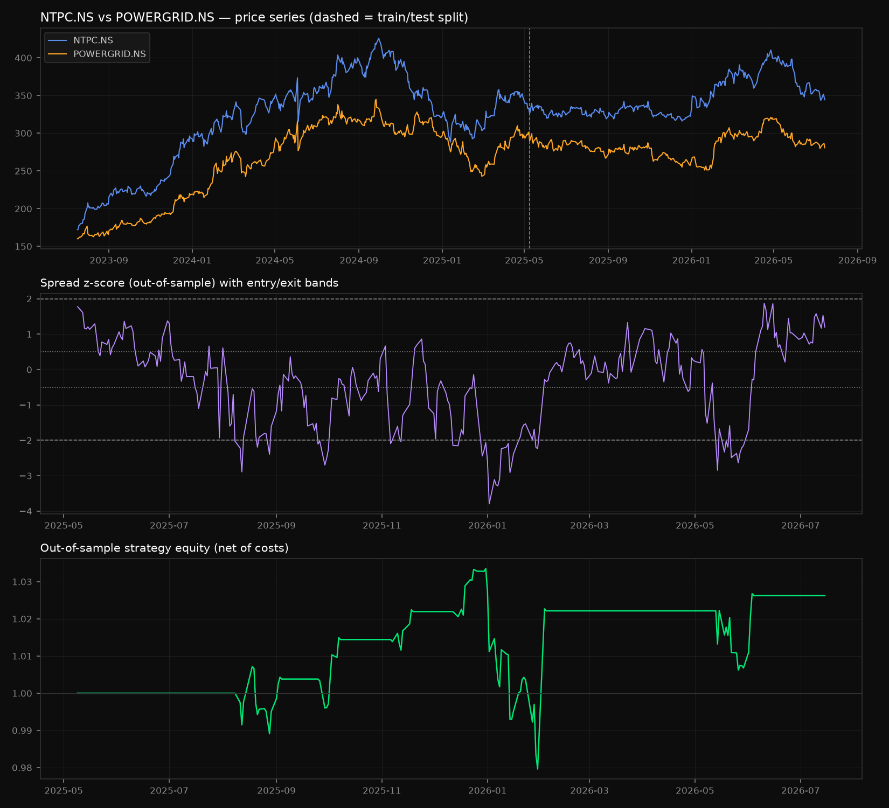

---

### BAJAJ-AUTO.NS / HEROMOTOCO.NS

- **Latest prices:** BAJAJ-AUTO.NS ₹10,323.00 · HEROMOTOCO.NS ₹4,876.20
- **Hedge ratio (train-fitted):** 0.4117
- **Cointegration (train):** FAIL at 5% — ADF -2.19, p=0.2085
- **Persistence:** passed 5% in 0 of 10 real-data runs (strict tier: 0/10)
- **Spread half-life:** 31.2 days
- **Current z-score:** -1.19
- **Signal today:** watch (approaching band)
- ⚠️ _Pair did not cointegrate on training data. Any signal here is not statistically justified — observation only._

**Out-of-sample backtest** (beta frozen from train window):

| Metric | Value |
|---|---|
| Sharpe | -1.36 |
| Sortino | -1.40 |
| Annualised return | -15.33% |
| Annualised vol | 11.71% |
| Max drawdown | -23.11% |
| Round-trip trades | 4 |

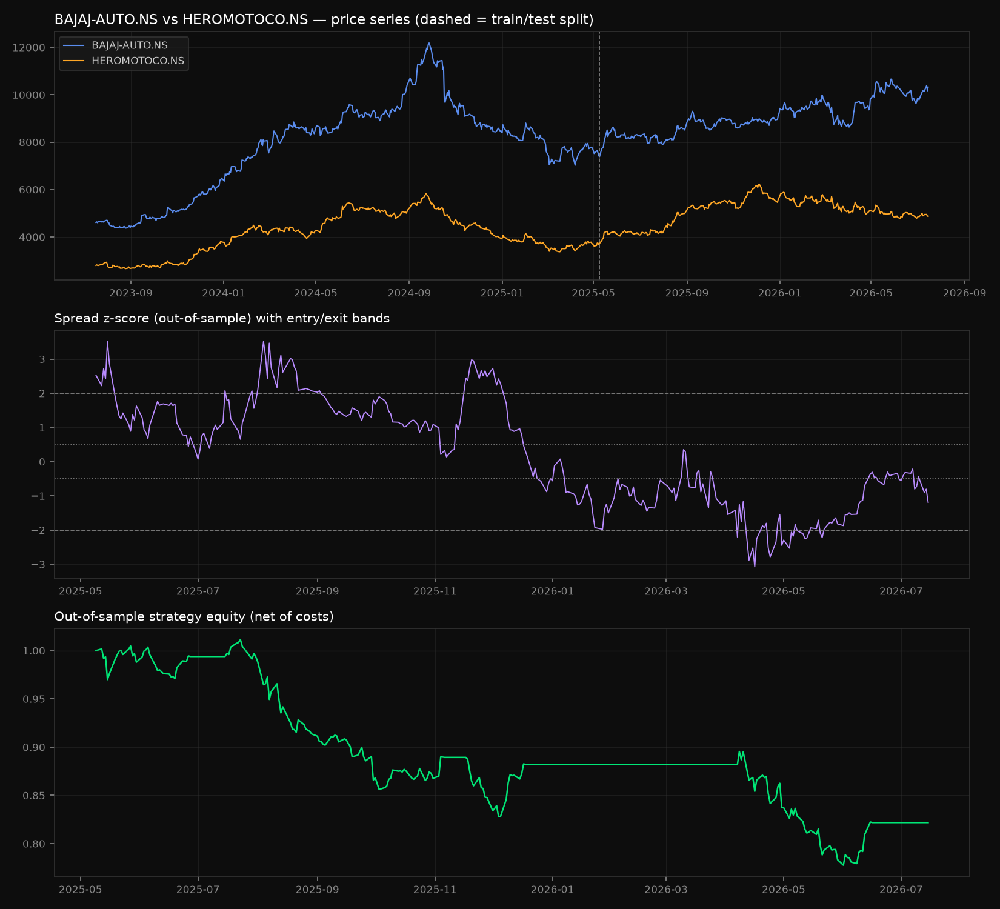

---

### TATASTEEL.NS / JSWSTEEL.NS

- **Latest prices:** TATASTEEL.NS ₹185.26 · JSWSTEEL.NS ₹1,226.90
- **Hedge ratio (train-fitted):** 2.9889
- **Cointegration (train):** FAIL at 5% — ADF -1.13, p=0.7024
- **Persistence:** passed 5% in 0 of 10 real-data runs (strict tier: 0/10)
- **Spread half-life:** 74.7 days
- **Current z-score:** +0.60
- **Signal today:** watch (approaching band)
- ⚠️ _Pair did not cointegrate on training data. Any signal here is not statistically justified — observation only._

**Out-of-sample backtest** (beta frozen from train window):

| Metric | Value |
|---|---|
| Sharpe | 0.26 |
| Sortino | 0.21 |
| Annualised return | 1.73% |
| Annualised vol | 7.83% |
| Max drawdown | -4.63% |
| Round-trip trades | 4 |

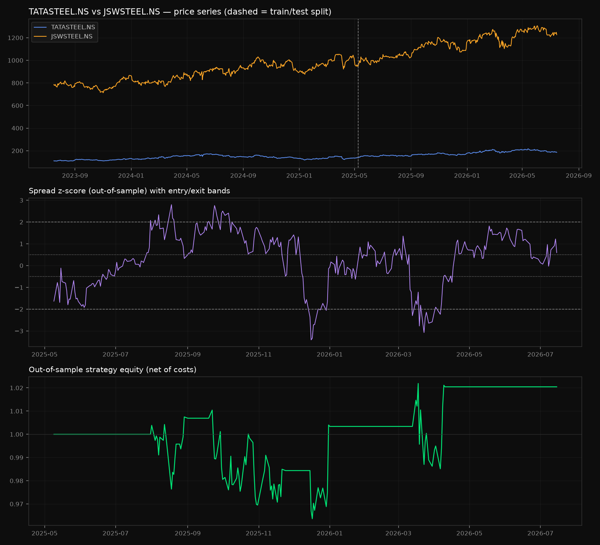

---

### SUNPHARMA.NS / CIPLA.NS

- **Latest prices:** SUNPHARMA.NS ₹1,951.50 · CIPLA.NS ₹1,438.00
- **Hedge ratio (train-fitted):** 0.5090
- **Cointegration (train):** PASS at 5% — ADF -3.77, p=0.0033
- **Persistence:** passed 5% in 10 of 10 real-data runs (strict tier: 0/10)
- **Spread half-life:** 10.5 days
- **Current z-score:** -0.16
- **Signal today:** flat / no stretch

**Out-of-sample backtest** (beta frozen from train window):

| Metric | Value |
|---|---|
| Sharpe | -0.12 |
| Sortino | -0.14 |
| Annualised return | -1.22% |
| Annualised vol | 7.60% |
| Max drawdown | -10.21% |
| Round-trip trades | 5 |

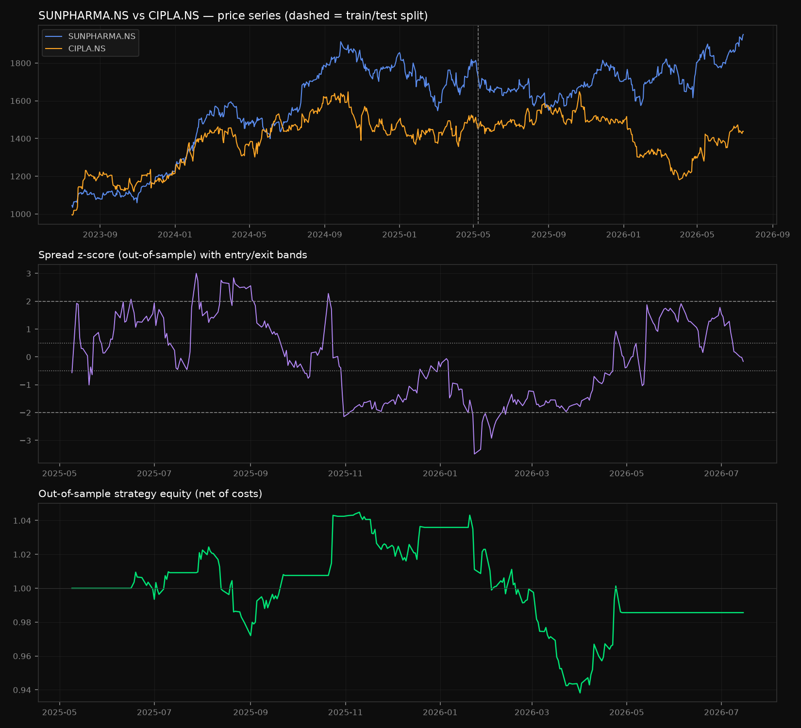

---

_Generated 2026-07-15 · pairs mean-reversion scanner · out-of-sample backtest · multiple-testing-aware · not investment advice._
