# Indian Pairs-Trading Scanner — 2026-07-17

> **What this is:** a market-neutral *pairs mean-reversion* scanner. It flags when two related NSE stocks have drifted apart far enough that their historical relationship signals a possible convergence trade. It does **not** forecast growth, rank "best" stocks, or predict company performance. A signal means the *spread between two stocks* is stretched — nothing about either stock being a good investment. Not investment advice; do your own research.

## Methodology (fixed in advance)

- **Universe:** 16 declared sector-mate pairs. Parameters (3y window, 60/40 train-test, z-entry 2.0, z-exit 0.5, 5 bps costs) are pre-registered; changes are logged in the README changelog *before* looking at results.
- **Multiple testing:** at the 5% level across 16 pairs, **≈0.8 false positives per run are expected by chance alone** even if nothing truly cointegrates. A single-day pass is a candidate, not a discovery.
- **Strict tier:** Bonferroni-corrected threshold p < 0.0031 (marked ✓✓).
- **Evidence = persistence:** the Persistence column counts how often each pair has passed the 5% test across all *real-data* daily runs recorded in `reports/history.csv`. Pairs deserve attention only when they pass persistently.

## Summary

| Pair | p-value | Coint. | Persistence | Current z | Signal | OOS Sharpe |
|---|---|---|---|---|---|---|
| HDFCBANK.NS/ICICIBANK.NS | 0.0911 | ✗ | 0/11 | +1.58 | watch | -0.31 |
| AXISBANK.NS/ICICIBANK.NS | 0.9215 | ✗ | 0/12 | +2.56 | SHORT spread | -0.07 |
| KOTAKBANK.NS/HDFCBANK.NS | 0.1558 | ✗ | 0/12 | +1.29 | watch | 0.03 |
| SBIN.NS/BANKBARODA.NS | 0.2934 | ✗ | 0/12 | -1.76 | watch | 0.34 |
| TCS.NS/INFY.NS | 0.3947 | ✗ | 0/12 | -1.13 | watch | 0.98 |
| INFY.NS/WIPRO.NS | 0.1747 | ✗ | 0/12 | -1.28 | watch | 1.73 |
| HCLTECH.NS/TECHM.NS | 0.2123 | ✗ | 0/12 | +2.64 | SHORT spread | -0.34 |
| ACC.NS/AMBUJACEM.NS | 0.7789 | ✗ | 0/12 | +0.53 | watch | 1.07 |
| ULTRACEMCO.NS/SHREECEM.NS | 0.0913 | ✗ | 0/12 | +1.59 | watch | 0.29 |
| IOC.NS/BPCL.NS | 0.7750 | ✗ | 0/12 | +2.15 | SHORT spread | 0.61 |
| BPCL.NS/HINDPETRO.NS | 0.3088 | ✗ | 0/12 | -1.00 | watch | -0.07 |
| ONGC.NS/COALINDIA.NS | 0.1195 | ✗ | 4/12 | +0.21 | flat / no stretch | 1.17 |
| NTPC.NS/POWERGRID.NS | 0.0929 | ✗ | 0/12 | +1.68 | watch | 0.43 |
| BAJAJ-AUTO.NS/HEROMOTOCO.NS | 0.1943 | ✗ | 0/12 | -1.23 | watch | -1.38 |
| TATASTEEL.NS/JSWSTEEL.NS | 0.8598 | ✗ | 0/12 | +1.00 | watch | 0.26 |
| SUNPHARMA.NS/CIPLA.NS | 0.0032 | ✓ | 12/12 | -0.39 | flat / no stretch | -0.12 |

_Legend: ✓✓ passes strict Bonferroni tier · ✓ passes 5% only · ✗ fails. Persistence = 5%-passes / real-data runs recorded. \*no real-data history yet._

---

### HDFCBANK.NS / ICICIBANK.NS

- **Latest prices:** HDFCBANK.NS ₹819.60 · ICICIBANK.NS ₹1,444.30
- **Hedge ratio (train-fitted):** 1.7277
- **Cointegration (train):** FAIL at 5% — ADF -2.61, p=0.0911
- **Persistence:** passed 5% in 0 of 11 real-data runs (strict tier: 0/11)
- **Spread half-life:** 31.0 days
- **Current z-score:** +1.58
- **Signal today:** watch (approaching band)
- ⚠️ _Pair did not cointegrate on training data. Any signal here is not statistically justified — observation only._

**Out-of-sample backtest** (beta frozen from train window):

| Metric | Value |
|---|---|
| Sharpe | -0.31 |
| Sortino | -0.31 |
| Annualised return | -1.99% |
| Annualised vol | 5.94% |
| Max drawdown | -8.51% |
| Round-trip trades | 5 |

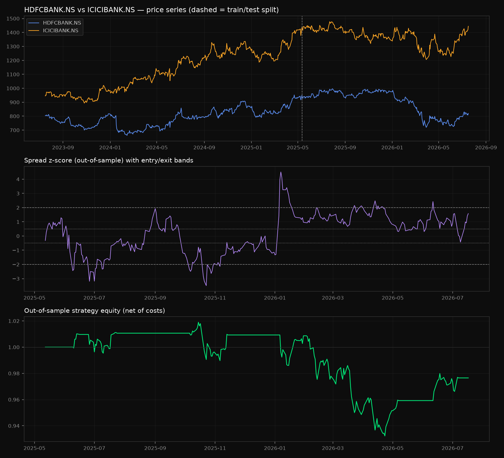

---

### AXISBANK.NS / ICICIBANK.NS

- **Latest prices:** AXISBANK.NS ₹1,328.50 · ICICIBANK.NS ₹1,444.30
- **Hedge ratio (train-fitted):** 0.8858
- **Cointegration (train):** FAIL at 5% — ADF -0.33, p=0.9215
- **Persistence:** passed 5% in 0 of 12 real-data runs (strict tier: 0/12)
- **Spread half-life:** 251.2 days
- **Current z-score:** +2.56
- **Signal today:** SHORT spread (short ICICIBANK.NS, long AXISBANK.NS)
- ⚠️ _Pair did not cointegrate on training data. Any signal here is not statistically justified — observation only._

**Out-of-sample backtest** (beta frozen from train window):

| Metric | Value |
|---|---|
| Sharpe | -0.07 |
| Sortino | -0.07 |
| Annualised return | -0.87% |
| Annualised vol | 7.94% |
| Max drawdown | -7.25% |
| Round-trip trades | 6 |

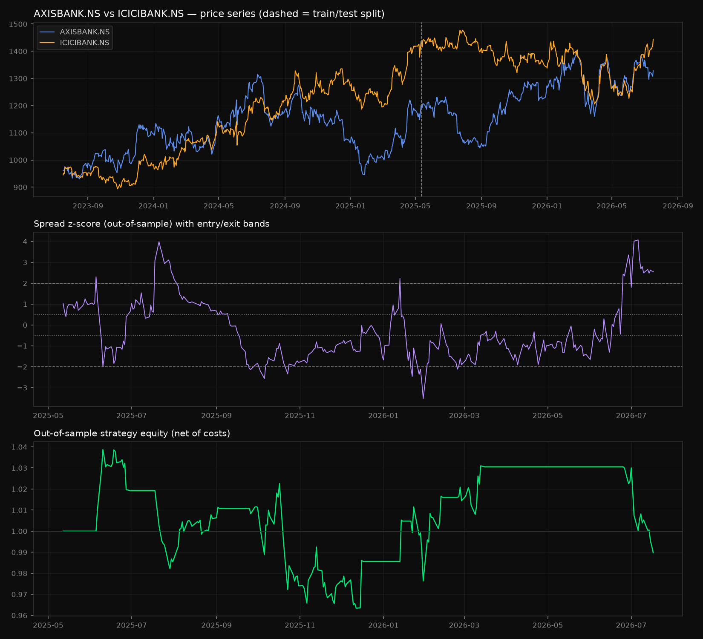

---

### KOTAKBANK.NS / HDFCBANK.NS

- **Latest prices:** KOTAKBANK.NS ₹389.95 · HDFCBANK.NS ₹819.60
- **Hedge ratio (train-fitted):** 1.7965
- **Cointegration (train):** FAIL at 5% — ADF -2.35, p=0.1558
- **Persistence:** passed 5% in 0 of 12 real-data runs (strict tier: 0/12)
- **Spread half-life:** 27.7 days
- **Current z-score:** +1.29
- **Signal today:** watch (approaching band)
- ⚠️ _Pair did not cointegrate on training data. Any signal here is not statistically justified — observation only._

**Out-of-sample backtest** (beta frozen from train window):

| Metric | Value |
|---|---|
| Sharpe | 0.03 |
| Sortino | 0.02 |
| Annualised return | -0.03% |
| Annualised vol | 6.32% |
| Max drawdown | -5.62% |
| Round-trip trades | 4 |

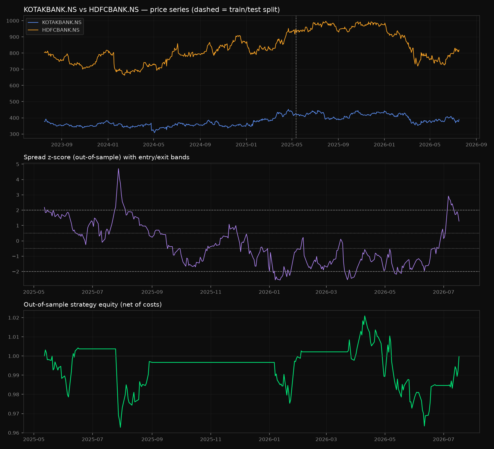

---

### SBIN.NS / BANKBARODA.NS

- **Latest prices:** SBIN.NS ₹1,044.30 · BANKBARODA.NS ₹246.80
- **Hedge ratio (train-fitted):** 0.2109
- **Cointegration (train):** FAIL at 5% — ADF -1.98, p=0.2934
- **Persistence:** passed 5% in 0 of 12 real-data runs (strict tier: 0/12)
- **Spread half-life:** 25.8 days
- **Current z-score:** -1.76
- **Signal today:** watch (approaching band)
- ⚠️ _Pair did not cointegrate on training data. Any signal here is not statistically justified — observation only._

**Out-of-sample backtest** (beta frozen from train window):

| Metric | Value |
|---|---|
| Sharpe | 0.34 |
| Sortino | 0.22 |
| Annualised return | 2.58% |
| Annualised vol | 8.72% |
| Max drawdown | -9.60% |
| Round-trip trades | 5 |

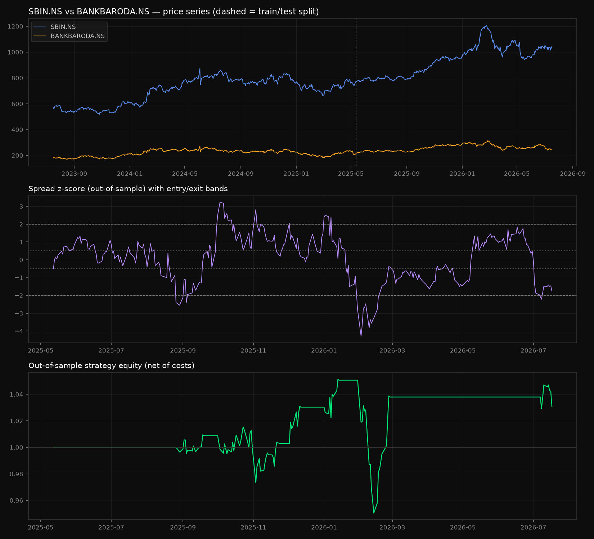

---

### TCS.NS / INFY.NS

- **Latest prices:** TCS.NS ₹2,269.00 · INFY.NS ₹1,096.50
- **Hedge ratio (train-fitted):** 0.5319
- **Cointegration (train):** FAIL at 5% — ADF -1.77, p=0.3947
- **Persistence:** passed 5% in 0 of 12 real-data runs (strict tier: 0/12)
- **Spread half-life:** 39.8 days
- **Current z-score:** -1.13
- **Signal today:** watch (approaching band)
- ⚠️ _Pair did not cointegrate on training data. Any signal here is not statistically justified — observation only._

**Out-of-sample backtest** (beta frozen from train window):

| Metric | Value |
|---|---|
| Sharpe | 0.98 |
| Sortino | 0.88 |
| Annualised return | 3.93% |
| Annualised vol | 4.00% |
| Max drawdown | -4.09% |
| Round-trip trades | 6 |

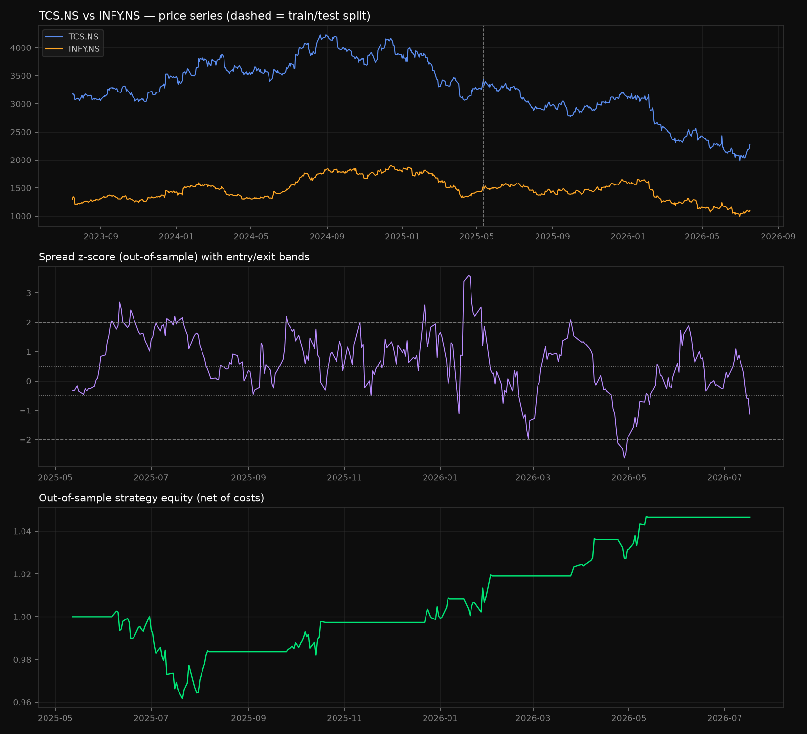

---

### INFY.NS / WIPRO.NS

- **Latest prices:** INFY.NS ₹1,096.50 · WIPRO.NS ₹176.00
- **Hedge ratio (train-fitted):** 0.1400
- **Cointegration (train):** FAIL at 5% — ADF -2.29, p=0.1747
- **Persistence:** passed 5% in 0 of 12 real-data runs (strict tier: 0/12)
- **Spread half-life:** 29.2 days
- **Current z-score:** -1.28
- **Signal today:** watch (approaching band)
- ⚠️ _Pair did not cointegrate on training data. Any signal here is not statistically justified — observation only._

**Out-of-sample backtest** (beta frozen from train window):

| Metric | Value |
|---|---|
| Sharpe | 1.73 |
| Sortino | 2.03 |
| Annualised return | 9.07% |
| Annualised vol | 5.09% |
| Max drawdown | -2.44% |
| Round-trip trades | 6 |

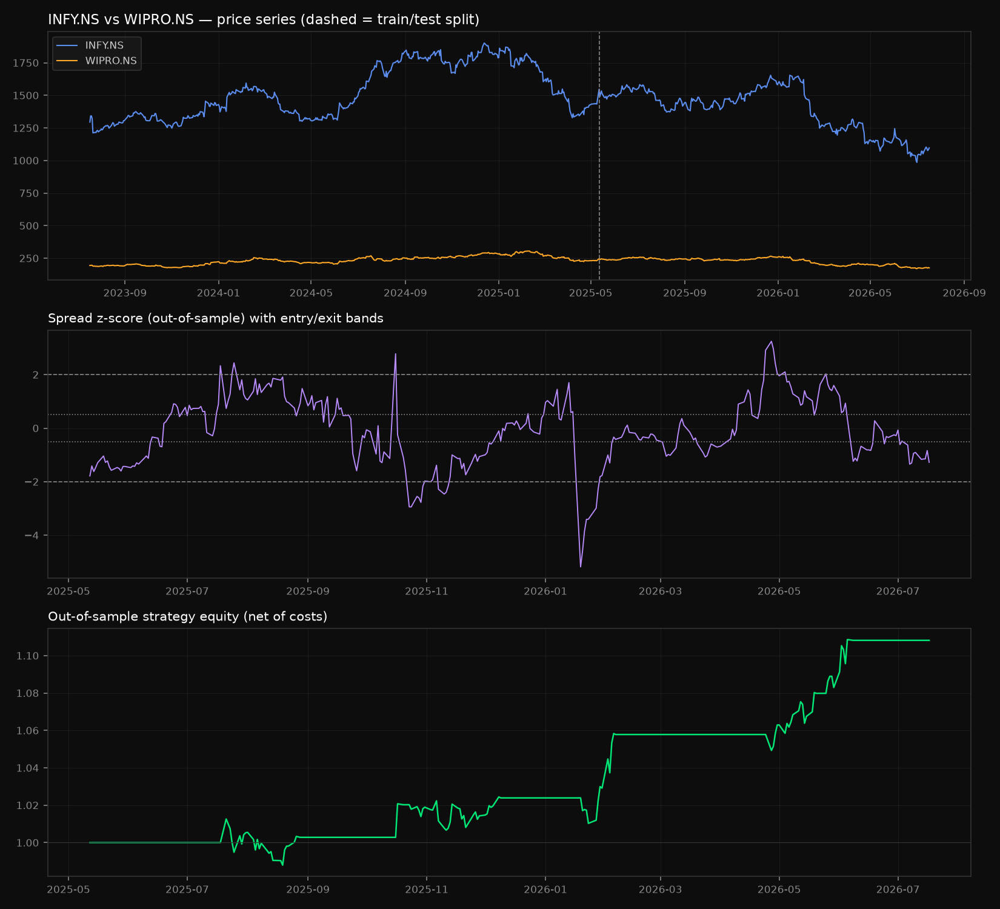

---

### HCLTECH.NS / TECHM.NS

- **Latest prices:** HCLTECH.NS ₹1,203.90 · TECHM.NS ₹1,572.90
- **Hedge ratio (train-fitted):** 0.7998
- **Cointegration (train):** FAIL at 5% — ADF -2.18, p=0.2123
- **Persistence:** passed 5% in 0 of 12 real-data runs (strict tier: 0/12)
- **Spread half-life:** 25.6 days
- **Current z-score:** +2.64
- **Signal today:** SHORT spread (short TECHM.NS, long HCLTECH.NS)
- ⚠️ _Pair did not cointegrate on training data. Any signal here is not statistically justified — observation only._

**Out-of-sample backtest** (beta frozen from train window):

| Metric | Value |
|---|---|
| Sharpe | -0.34 |
| Sortino | -0.35 |
| Annualised return | -2.85% |
| Annualised vol | 7.60% |
| Max drawdown | -8.44% |
| Round-trip trades | 4 |

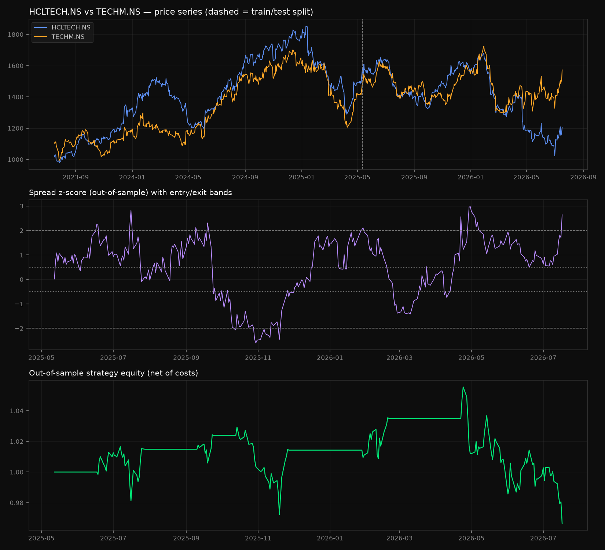

---

### ACC.NS / AMBUJACEM.NS

- **Latest prices:** ACC.NS ₹1,377.70 · AMBUJACEM.NS ₹438.50
- **Hedge ratio (train-fitted):** 0.2443
- **Cointegration (train):** FAIL at 5% — ADF -0.93, p=0.7789
- **Persistence:** passed 5% in 0 of 12 real-data runs (strict tier: 0/12)
- **Spread half-life:** 76.4 days
- **Current z-score:** +0.53
- **Signal today:** watch (approaching band)
- ⚠️ _Pair did not cointegrate on training data. Any signal here is not statistically justified — observation only._

**Out-of-sample backtest** (beta frozen from train window):

| Metric | Value |
|---|---|
| Sharpe | 1.07 |
| Sortino | 0.91 |
| Annualised return | 6.05% |
| Annualised vol | 5.66% |
| Max drawdown | -4.61% |
| Round-trip trades | 5 |

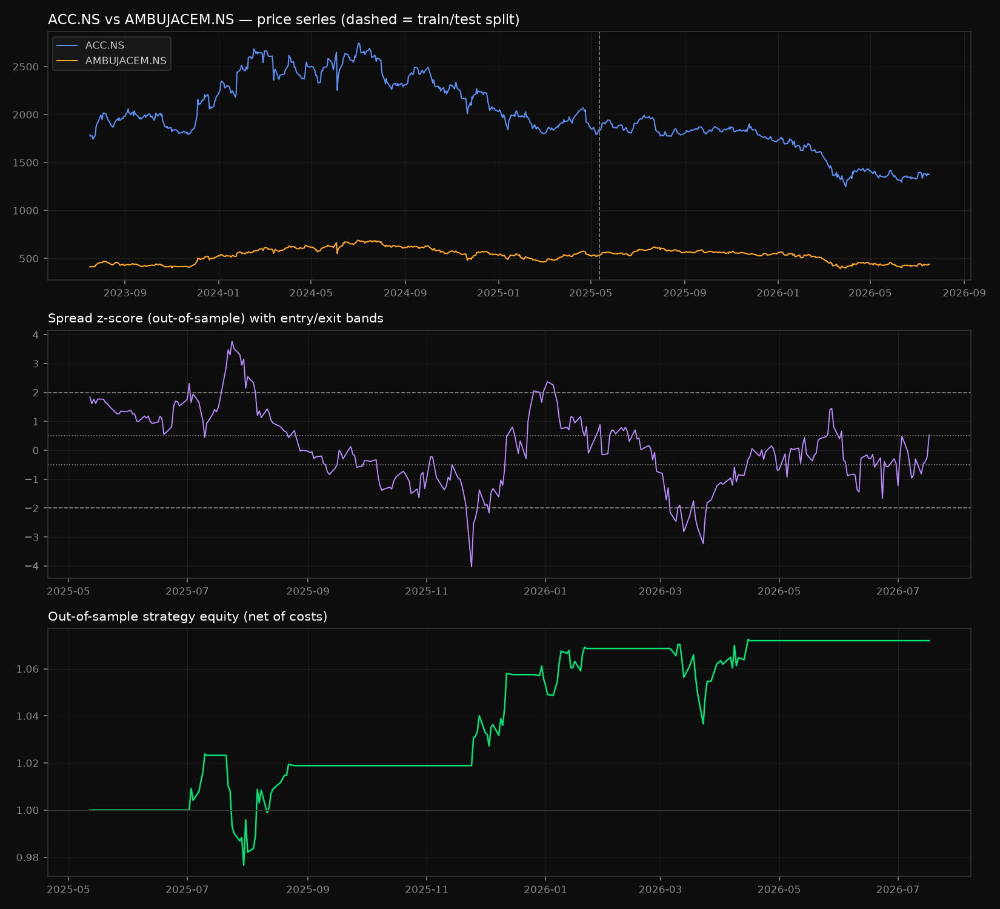

---

### ULTRACEMCO.NS / SHREECEM.NS

- **Latest prices:** ULTRACEMCO.NS ₹11,727.00 · SHREECEM.NS ₹26,515.00
- **Hedge ratio (train-fitted):** 0.6105
- **Cointegration (train):** FAIL at 5% — ADF -2.61, p=0.0913
- **Persistence:** passed 5% in 0 of 12 real-data runs (strict tier: 0/12)
- **Spread half-life:** 29.1 days
- **Current z-score:** +1.59
- **Signal today:** watch (approaching band)
- ⚠️ _Pair did not cointegrate on training data. Any signal here is not statistically justified — observation only._

**Out-of-sample backtest** (beta frozen from train window):

| Metric | Value |
|---|---|
| Sharpe | 0.29 |
| Sortino | 0.30 |
| Annualised return | 2.06% |
| Annualised vol | 8.05% |
| Max drawdown | -9.41% |
| Round-trip trades | 5 |

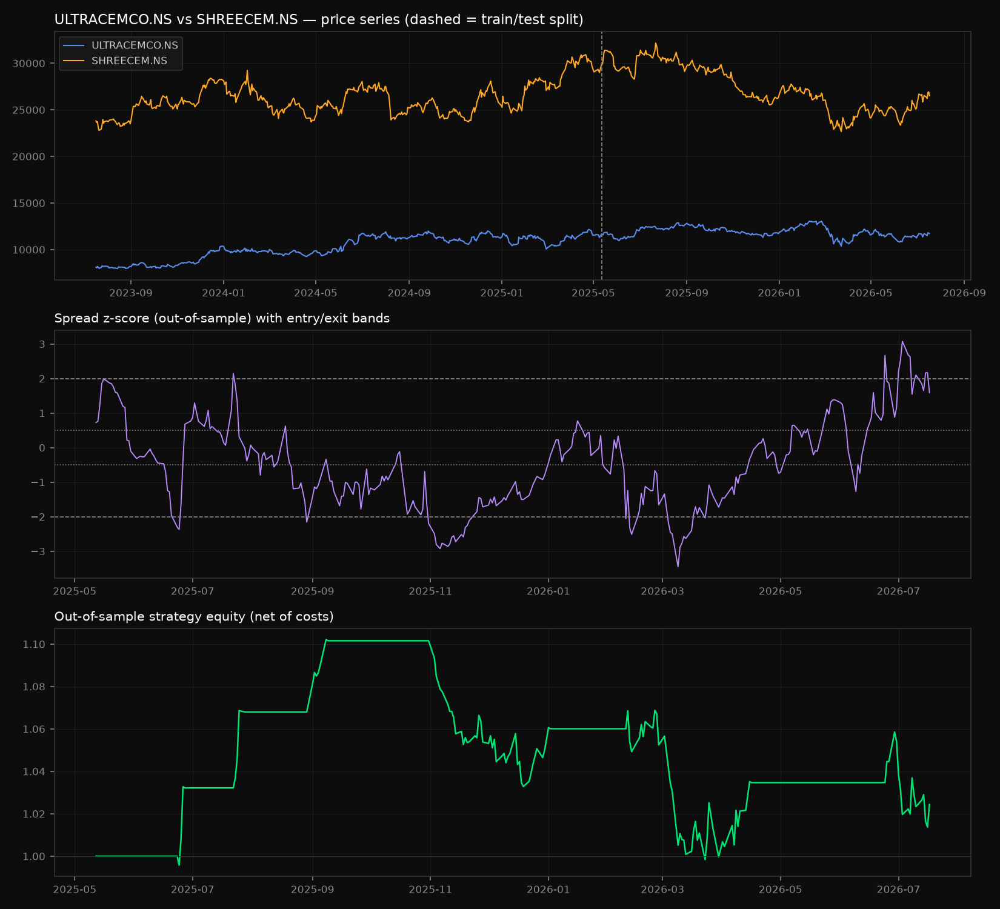

---

### IOC.NS / BPCL.NS

- **Latest prices:** IOC.NS ₹141.69 · BPCL.NS ₹315.55
- **Hedge ratio (train-fitted):** 1.7675
- **Cointegration (train):** FAIL at 5% — ADF -0.94, p=0.7750
- **Persistence:** passed 5% in 0 of 12 real-data runs (strict tier: 0/12)
- **Spread half-life:** 110.8 days
- **Current z-score:** +2.15
- **Signal today:** SHORT spread (short BPCL.NS, long IOC.NS)
- ⚠️ _Pair did not cointegrate on training data. Any signal here is not statistically justified — observation only._

**Out-of-sample backtest** (beta frozen from train window):

| Metric | Value |
|---|---|
| Sharpe | 0.61 |
| Sortino | 0.62 |
| Annualised return | 3.80% |
| Annualised vol | 6.45% |
| Max drawdown | -6.83% |
| Round-trip trades | 7 |

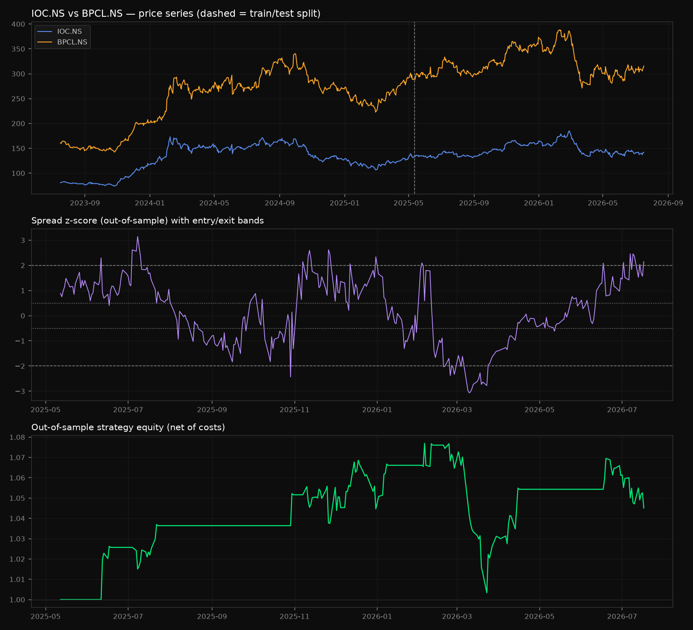

---

### BPCL.NS / HINDPETRO.NS

- **Latest prices:** BPCL.NS ₹315.55 · HINDPETRO.NS ₹400.40
- **Hedge ratio (train-fitted):** 1.4237
- **Cointegration (train):** FAIL at 5% — ADF -1.95, p=0.3088
- **Persistence:** passed 5% in 0 of 12 real-data runs (strict tier: 0/12)
- **Spread half-life:** 40.2 days
- **Current z-score:** -1.00
- **Signal today:** watch (approaching band)
- ⚠️ _Pair did not cointegrate on training data. Any signal here is not statistically justified — observation only._

**Out-of-sample backtest** (beta frozen from train window):

| Metric | Value |
|---|---|
| Sharpe | -0.07 |
| Sortino | -0.06 |
| Annualised return | -0.60% |
| Annualised vol | 5.86% |
| Max drawdown | -7.15% |
| Round-trip trades | 4 |

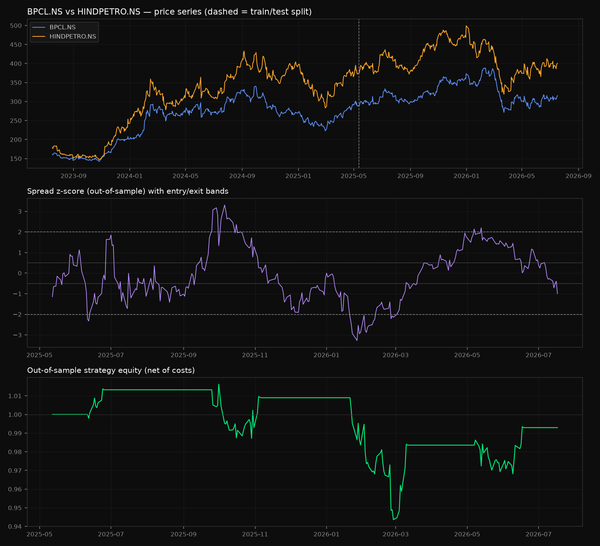

---

### ONGC.NS / COALINDIA.NS

- **Latest prices:** ONGC.NS ₹247.29 · COALINDIA.NS ₹427.65
- **Hedge ratio (train-fitted):** 1.7914
- **Cointegration (train):** FAIL at 5% — ADF -2.48, p=0.1195
- **Persistence:** passed 5% in 4 of 12 real-data runs (strict tier: 0/12)
- **Spread half-life:** 21.9 days
- **Current z-score:** +0.21
- **Signal today:** flat / no stretch
- ⚠️ _Pair did not cointegrate on training data. Any signal here is not statistically justified — observation only._

**Out-of-sample backtest** (beta frozen from train window):

| Metric | Value |
|---|---|
| Sharpe | 1.17 |
| Sortino | 1.11 |
| Annualised return | 9.64% |
| Annualised vol | 8.12% |
| Max drawdown | -5.10% |
| Round-trip trades | 6 |

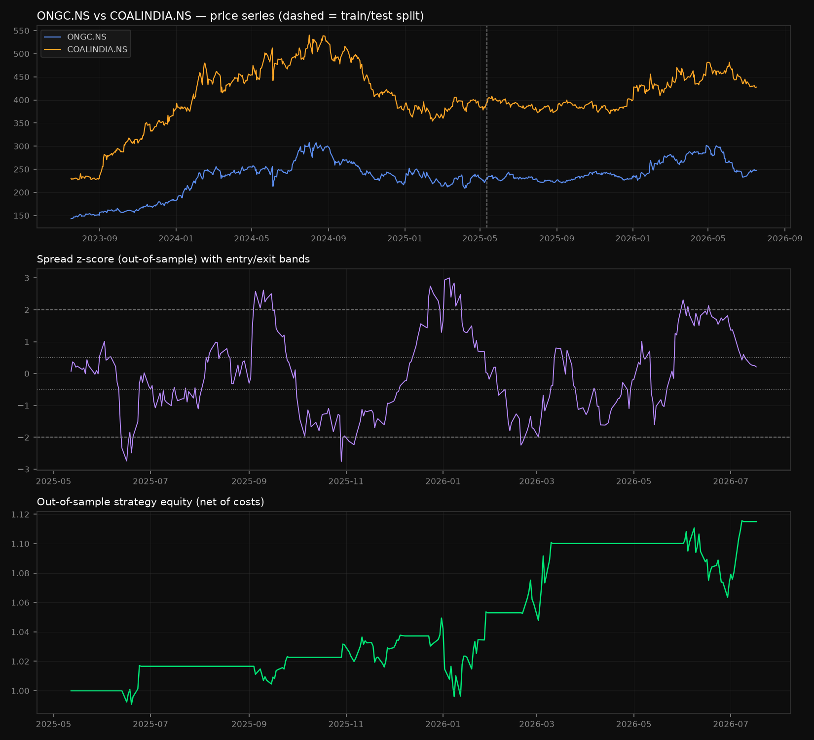

---

### NTPC.NS / POWERGRID.NS

- **Latest prices:** NTPC.NS ₹341.85 · POWERGRID.NS ₹283.55
- **Hedge ratio (train-fitted):** 0.8212
- **Cointegration (train):** FAIL at 5% — ADF -2.60, p=0.0929
- **Persistence:** passed 5% in 0 of 12 real-data runs (strict tier: 0/12)
- **Spread half-life:** 22.7 days
- **Current z-score:** +1.68
- **Signal today:** watch (approaching band)
- ⚠️ _Pair did not cointegrate on training data. Any signal here is not statistically justified — observation only._

**Out-of-sample backtest** (beta frozen from train window):

| Metric | Value |
|---|---|
| Sharpe | 0.43 |
| Sortino | 0.33 |
| Annualised return | 2.14% |
| Annualised vol | 5.30% |
| Max drawdown | -5.04% |
| Round-trip trades | 6 |

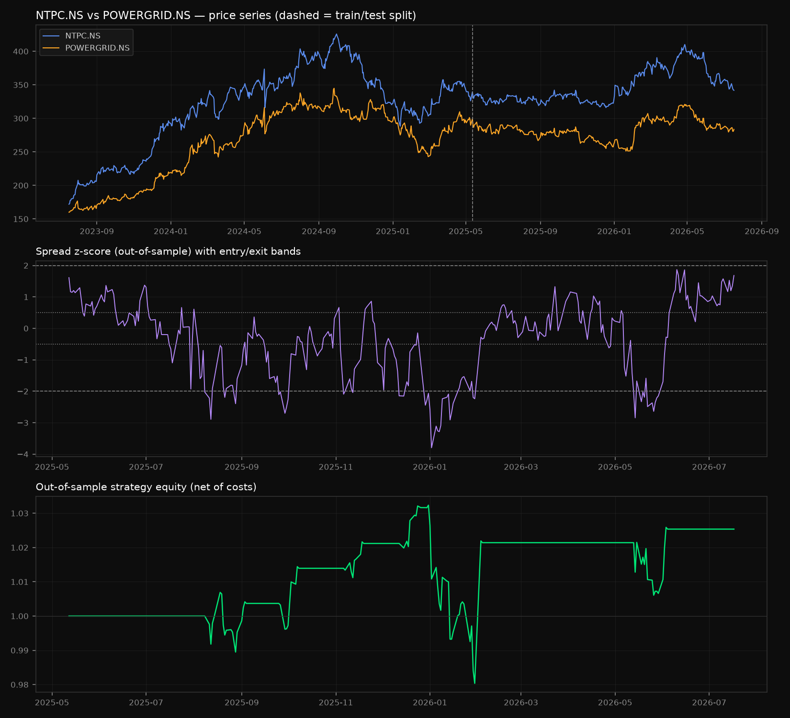

---

### BAJAJ-AUTO.NS / HEROMOTOCO.NS

- **Latest prices:** BAJAJ-AUTO.NS ₹10,443.00 · HEROMOTOCO.NS ₹4,909.90
- **Hedge ratio (train-fitted):** 0.4118
- **Cointegration (train):** FAIL at 5% — ADF -2.23, p=0.1943
- **Persistence:** passed 5% in 0 of 12 real-data runs (strict tier: 0/12)
- **Spread half-life:** 30.7 days
- **Current z-score:** -1.23
- **Signal today:** watch (approaching band)
- ⚠️ _Pair did not cointegrate on training data. Any signal here is not statistically justified — observation only._

**Out-of-sample backtest** (beta frozen from train window):

| Metric | Value |
|---|---|
| Sharpe | -1.38 |
| Sortino | -1.41 |
| Annualised return | -14.88% |
| Annualised vol | 11.24% |
| Max drawdown | -22.31% |
| Round-trip trades | 4 |

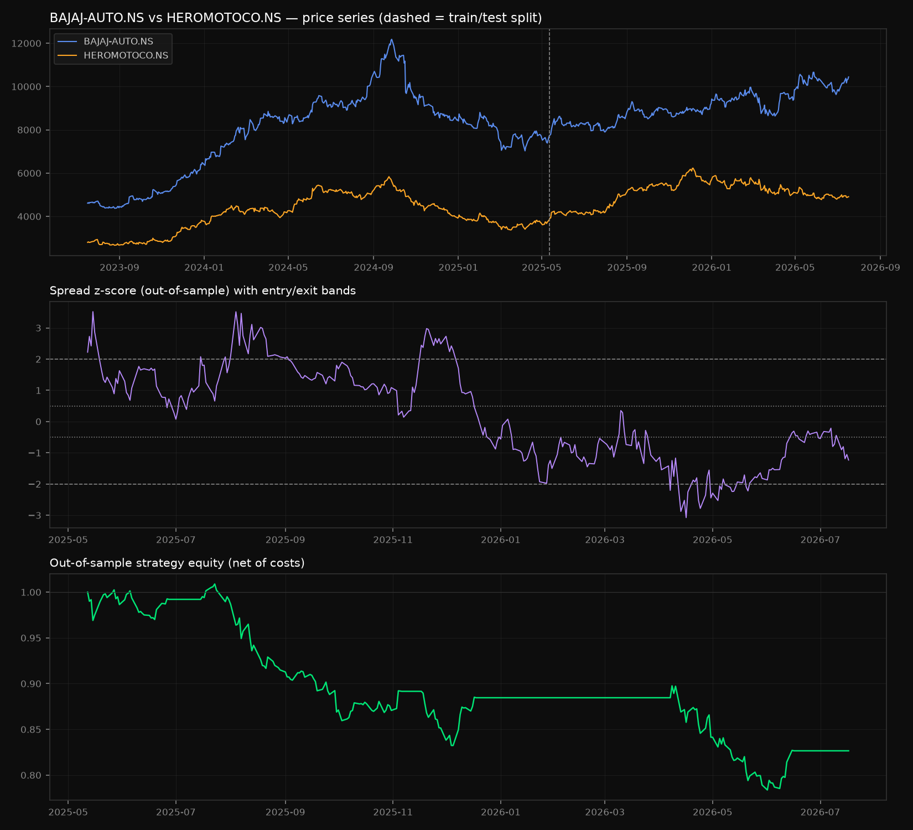

---

### TATASTEEL.NS / JSWSTEEL.NS

- **Latest prices:** TATASTEEL.NS ₹185.89 · JSWSTEEL.NS ₹1,237.30
- **Hedge ratio (train-fitted):** 2.9890
- **Cointegration (train):** FAIL at 5% — ADF -0.65, p=0.8598
- **Persistence:** passed 5% in 0 of 12 real-data runs (strict tier: 0/12)
- **Spread half-life:** 76.3 days
- **Current z-score:** +1.00
- **Signal today:** watch (approaching band)
- ⚠️ _Pair did not cointegrate on training data. Any signal here is not statistically justified — observation only._

**Out-of-sample backtest** (beta frozen from train window):

| Metric | Value |
|---|---|
| Sharpe | 0.26 |
| Sortino | 0.21 |
| Annualised return | 1.65% |
| Annualised vol | 7.41% |
| Max drawdown | -4.39% |
| Round-trip trades | 4 |

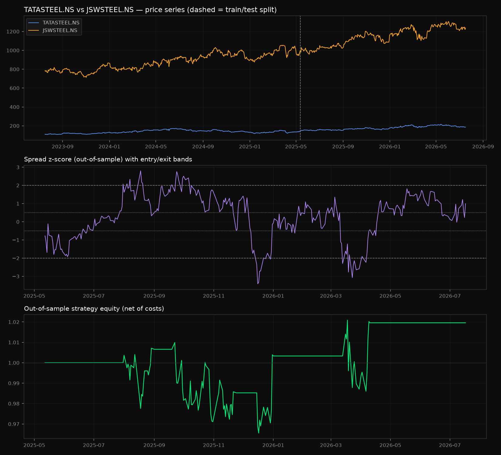

---

### SUNPHARMA.NS / CIPLA.NS

- **Latest prices:** SUNPHARMA.NS ₹1,932.60 · CIPLA.NS ₹1,418.70
- **Hedge ratio (train-fitted):** 0.5087
- **Cointegration (train):** PASS at 5% — ADF -3.78, p=0.0032
- **Persistence:** passed 5% in 12 of 12 real-data runs (strict tier: 0/12)
- **Spread half-life:** 10.5 days
- **Current z-score:** -0.39
- **Signal today:** flat / no stretch

**Out-of-sample backtest** (beta frozen from train window):

| Metric | Value |
|---|---|
| Sharpe | -0.12 |
| Sortino | -0.13 |
| Annualised return | -1.21% |
| Annualised vol | 7.58% |
| Max drawdown | -10.20% |
| Round-trip trades | 5 |

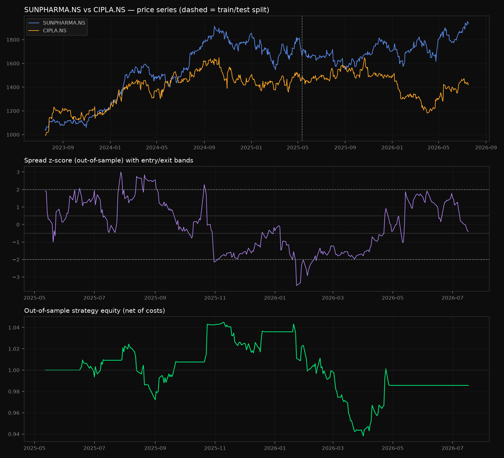

---

_Generated 2026-07-17 · pairs mean-reversion scanner · out-of-sample backtest · multiple-testing-aware · not investment advice._
