# Indian Pairs-Trading Scanner — 2026-07-20

> **What this is:** a market-neutral *pairs mean-reversion* scanner. It flags when two related NSE stocks have drifted apart far enough that their historical relationship signals a possible convergence trade. It does **not** forecast growth, rank "best" stocks, or predict company performance. A signal means the *spread between two stocks* is stretched — nothing about either stock being a good investment. Not investment advice; do your own research.

## Methodology (fixed in advance)

- **Universe:** 16 declared sector-mate pairs. Parameters (3y window, 60/40 train-test, z-entry 2.0, z-exit 0.5, 5 bps costs) are pre-registered; changes are logged in the README changelog *before* looking at results.
- **Multiple testing:** at the 5% level across 16 pairs, **≈0.8 false positives per run are expected by chance alone** even if nothing truly cointegrates. A single-day pass is a candidate, not a discovery.
- **Strict tier:** Bonferroni-corrected threshold p < 0.0031 (marked ✓✓).
- **Evidence = persistence:** the Persistence column counts how often each pair has passed the 5% test across all *real-data* daily runs recorded in `reports/history.csv`. Pairs deserve attention only when they pass persistently.

> ⚠️ **Some results use SIMULATED fallback data** (real data was unreachable this run) and are not real market results. These are marked below and are EXCLUDED from persistence counts.

## Summary

| Pair | p-value | Coint. | Persistence | Current z | Signal | OOS Sharpe |
|---|---|---|---|---|---|---|
| HDFCBANK.NS/ICICIBANK.NS *(sim)* | 0.0030 | ✓✓ | 0/11 | -1.55 | watch | 1.13 |
| AXISBANK.NS/ICICIBANK.NS | 0.9260 | ✗ | 0/13 | +3.80 | SHORT spread | -0.38 |
| KOTAKBANK.NS/HDFCBANK.NS | 0.1524 | ✗ | 0/13 | +0.43 | flat / no stretch | 0.25 |
| SBIN.NS/BANKBARODA.NS | 0.1989 | ✗ | 0/13 | -1.36 | watch | 0.46 |
| TCS.NS/INFY.NS | 0.4118 | ✗ | 0/13 | -1.15 | watch | 0.99 |
| INFY.NS/WIPRO.NS | 0.1749 | ✗ | 0/13 | -1.02 | watch | 1.74 |
| HCLTECH.NS/TECHM.NS | 0.2591 | ✗ | 0/13 | +2.35 | SHORT spread | -0.31 |
| ACC.NS/AMBUJACEM.NS | 0.7849 | ✗ | 0/13 | +0.26 | flat / no stretch | 1.06 |
| ULTRACEMCO.NS/SHREECEM.NS | 0.1793 | ✗ | 0/13 | +1.80 | watch | 0.23 |
| IOC.NS/BPCL.NS | 0.7477 | ✗ | 0/13 | +2.16 | SHORT spread | 0.59 |
| BPCL.NS/HINDPETRO.NS | 0.3159 | ✗ | 0/13 | -0.83 | watch | -0.07 |
| ONGC.NS/COALINDIA.NS | 0.0360 | ✓ | 5/13 | +0.08 | flat / no stretch | 0.84 |
| NTPC.NS/POWERGRID.NS | 0.0800 | ✗ | 0/13 | +1.69 | watch | 0.42 |
| BAJAJ-AUTO.NS/HEROMOTOCO.NS | 0.1885 | ✗ | 0/13 | -0.99 | watch | -1.32 |
| TATASTEEL.NS/JSWSTEEL.NS | 0.8892 | ✗ | 0/13 | +1.87 | watch | 0.26 |
| SUNPHARMA.NS/CIPLA.NS | 0.0022 | ✓✓ | 13/13 | -0.11 | flat / no stretch | -0.12 |

_Legend: ✓✓ passes strict Bonferroni tier · ✓ passes 5% only · ✗ fails. Persistence = 5%-passes / real-data runs recorded. \*no real-data history yet._

---

### HDFCBANK.NS / ICICIBANK.NS · _SIMULATED_

- **Latest prices:** HDFCBANK.NS ₹77.27 · ICICIBANK.NS ₹113.78
- **Hedge ratio (train-fitted):** 1.5557
- **Cointegration (train):** PASS at 5% — ADF -3.79, p=0.0030 · **passes strict Bonferroni tier**
- **Persistence:** passed 5% in 0 of 11 real-data runs (strict tier: 0/11)
- **Spread half-life:** 14.0 days
- **Current z-score:** -1.55
- **Signal today:** watch (approaching band)

**Out-of-sample backtest** (beta frozen from train window):

| Metric | Value |
|---|---|
| Sharpe | 1.13 |
| Sortino | 0.86 |
| Annualised return | 1.88% |
| Annualised vol | 1.66% |
| Max drawdown | -1.19% |
| Round-trip trades | 5 |

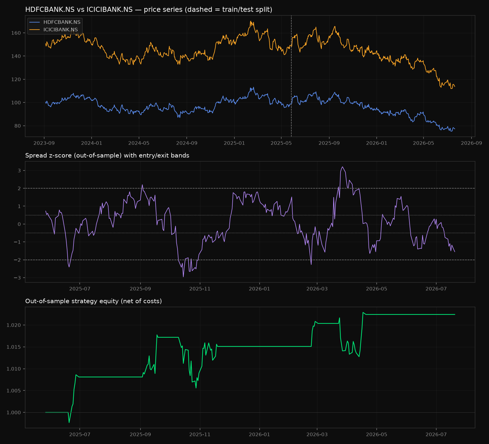

---

### AXISBANK.NS / ICICIBANK.NS

- **Latest prices:** AXISBANK.NS ₹1,256.00 · ICICIBANK.NS ₹1,460.20
- **Hedge ratio (train-fitted):** 0.8911
- **Cointegration (train):** FAIL at 5% — ADF -0.30, p=0.9260
- **Persistence:** passed 5% in 0 of 13 real-data runs (strict tier: 0/13)
- **Spread half-life:** 268.2 days
- **Current z-score:** +3.80
- **Signal today:** SHORT spread (short ICICIBANK.NS, long AXISBANK.NS)
- ⚠️ _Pair did not cointegrate on training data. Any signal here is not statistically justified — observation only._

**Out-of-sample backtest** (beta frozen from train window):

| Metric | Value |
|---|---|
| Sharpe | -0.38 |
| Sortino | -0.37 |
| Annualised return | -3.60% |
| Annualised vol | 8.59% |
| Max drawdown | -7.85% |
| Round-trip trades | 6 |

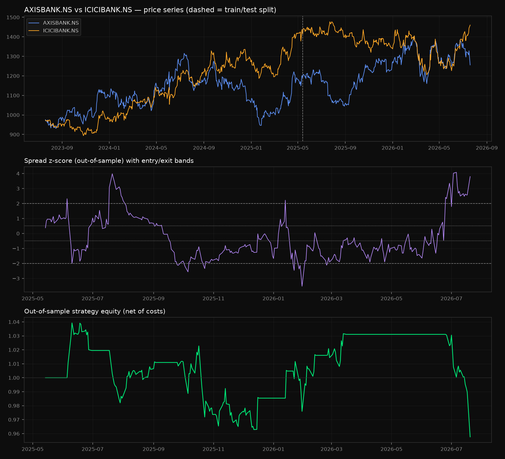

---

### KOTAKBANK.NS / HDFCBANK.NS

- **Latest prices:** KOTAKBANK.NS ₹382.05 · HDFCBANK.NS ₹777.60
- **Hedge ratio (train-fitted):** 1.8193
- **Cointegration (train):** FAIL at 5% — ADF -2.36, p=0.1524
- **Persistence:** passed 5% in 0 of 13 real-data runs (strict tier: 0/13)
- **Spread half-life:** 27.4 days
- **Current z-score:** +0.43
- **Signal today:** flat / no stretch
- ⚠️ _Pair did not cointegrate on training data. Any signal here is not statistically justified — observation only._

**Out-of-sample backtest** (beta frozen from train window):

| Metric | Value |
|---|---|
| Sharpe | 0.25 |
| Sortino | 0.22 |
| Annualised return | 1.43% |
| Annualised vol | 6.65% |
| Max drawdown | -5.75% |
| Round-trip trades | 4 |

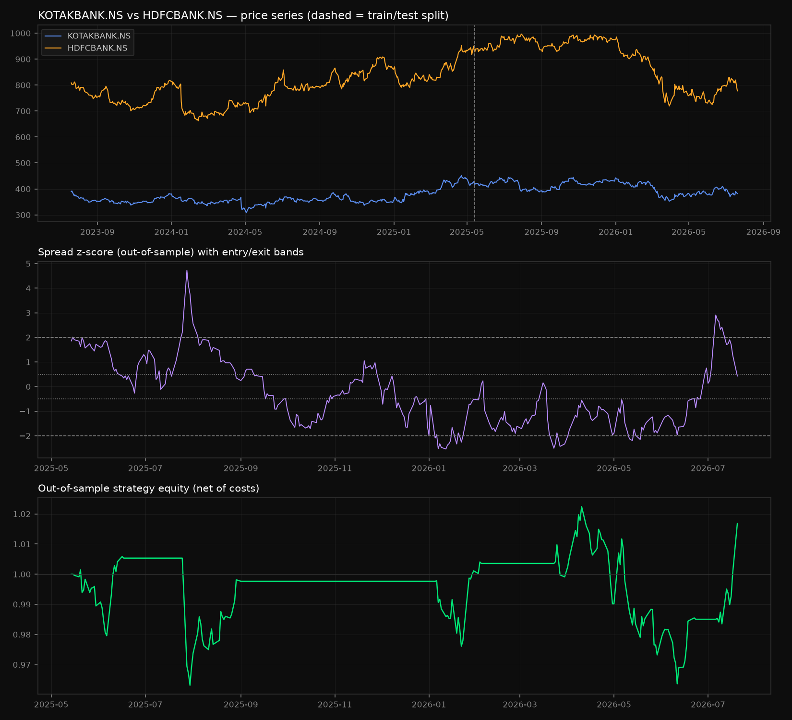

---

### SBIN.NS / BANKBARODA.NS

- **Latest prices:** SBIN.NS ₹1,060.00 · BANKBARODA.NS ₹254.85
- **Hedge ratio (train-fitted):** 0.2097
- **Cointegration (train):** FAIL at 5% — ADF -2.22, p=0.1989
- **Persistence:** passed 5% in 0 of 13 real-data runs (strict tier: 0/13)
- **Spread half-life:** 23.9 days
- **Current z-score:** -1.36
- **Signal today:** watch (approaching band)
- ⚠️ _Pair did not cointegrate on training data. Any signal here is not statistically justified — observation only._

**Out-of-sample backtest** (beta frozen from train window):

| Metric | Value |
|---|---|
| Sharpe | 0.46 |
| Sortino | 0.31 |
| Annualised return | 3.66% |
| Annualised vol | 8.69% |
| Max drawdown | -9.43% |
| Round-trip trades | 5 |

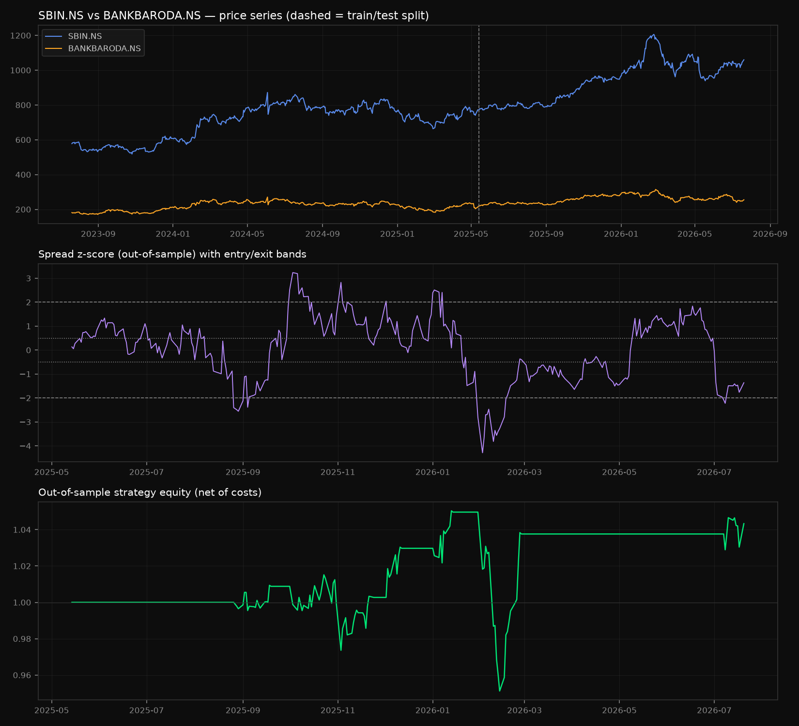

---

### TCS.NS / INFY.NS

- **Latest prices:** TCS.NS ₹2,251.10 · INFY.NS ₹1,087.10
- **Hedge ratio (train-fitted):** 0.5316
- **Cointegration (train):** FAIL at 5% — ADF -1.74, p=0.4118
- **Persistence:** passed 5% in 0 of 13 real-data runs (strict tier: 0/13)
- **Spread half-life:** 41.4 days
- **Current z-score:** -1.15
- **Signal today:** watch (approaching band)
- ⚠️ _Pair did not cointegrate on training data. Any signal here is not statistically justified — observation only._

**Out-of-sample backtest** (beta frozen from train window):

| Metric | Value |
|---|---|
| Sharpe | 0.99 |
| Sortino | 0.89 |
| Annualised return | 4.03% |
| Annualised vol | 4.09% |
| Max drawdown | -4.17% |
| Round-trip trades | 6 |

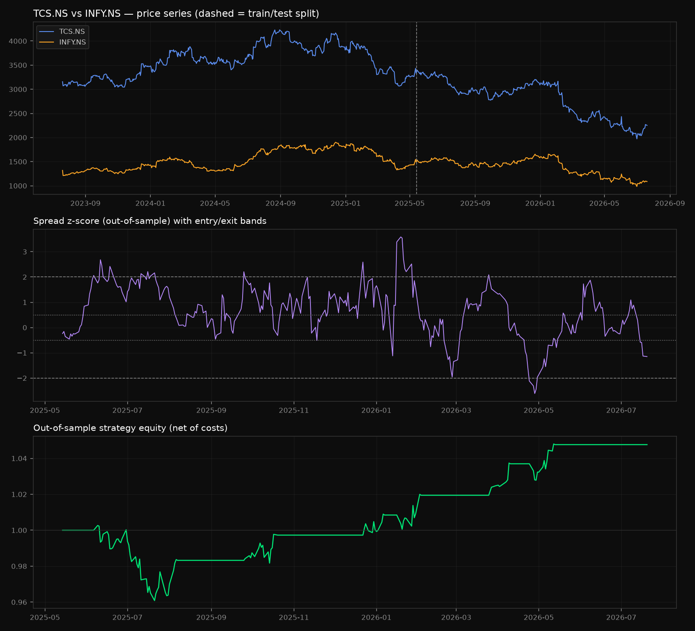

---

### INFY.NS / WIPRO.NS

- **Latest prices:** INFY.NS ₹1,087.10 · WIPRO.NS ₹176.38
- **Hedge ratio (train-fitted):** 0.1397
- **Cointegration (train):** FAIL at 5% — ADF -2.29, p=0.1749
- **Persistence:** passed 5% in 0 of 13 real-data runs (strict tier: 0/13)
- **Spread half-life:** 29.3 days
- **Current z-score:** -1.02
- **Signal today:** watch (approaching band)
- ⚠️ _Pair did not cointegrate on training data. Any signal here is not statistically justified — observation only._

**Out-of-sample backtest** (beta frozen from train window):

| Metric | Value |
|---|---|
| Sharpe | 1.74 |
| Sortino | 2.04 |
| Annualised return | 9.29% |
| Annualised vol | 5.20% |
| Max drawdown | -2.48% |
| Round-trip trades | 6 |

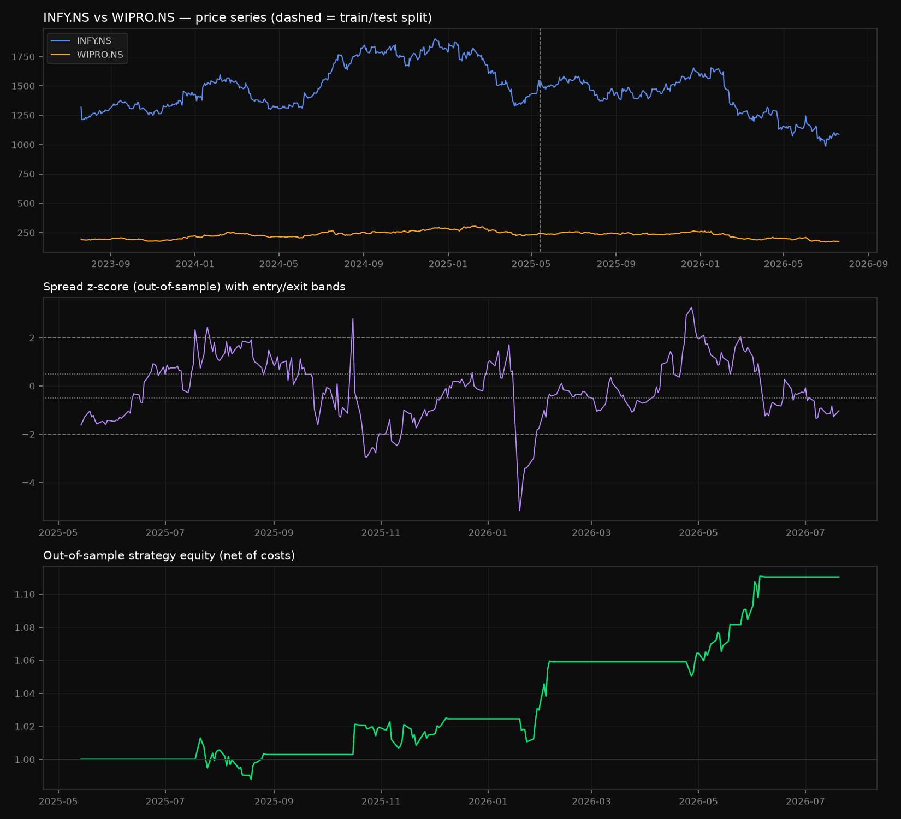

---

### HCLTECH.NS / TECHM.NS

- **Latest prices:** HCLTECH.NS ₹1,221.30 · TECHM.NS ₹1,576.40
- **Hedge ratio (train-fitted):** 0.8055
- **Cointegration (train):** FAIL at 5% — ADF -2.06, p=0.2591
- **Persistence:** passed 5% in 0 of 13 real-data runs (strict tier: 0/13)
- **Spread half-life:** 25.6 days
- **Current z-score:** +2.35
- **Signal today:** SHORT spread (short TECHM.NS, long HCLTECH.NS)
- ⚠️ _Pair did not cointegrate on training data. Any signal here is not statistically justified — observation only._

**Out-of-sample backtest** (beta frozen from train window):

| Metric | Value |
|---|---|
| Sharpe | -0.31 |
| Sortino | -0.33 |
| Annualised return | -2.64% |
| Annualised vol | 7.59% |
| Max drawdown | -8.40% |
| Round-trip trades | 4 |

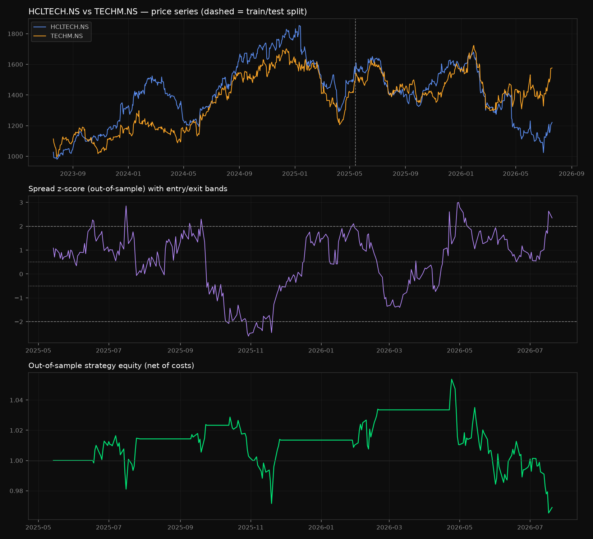

---

### ACC.NS / AMBUJACEM.NS

- **Latest prices:** ACC.NS ₹1,381.40 · AMBUJACEM.NS ₹437.80
- **Hedge ratio (train-fitted):** 0.2415
- **Cointegration (train):** FAIL at 5% — ADF -0.91, p=0.7849
- **Persistence:** passed 5% in 0 of 13 real-data runs (strict tier: 0/13)
- **Spread half-life:** 77.7 days
- **Current z-score:** +0.26
- **Signal today:** flat / no stretch
- ⚠️ _Pair did not cointegrate on training data. Any signal here is not statistically justified — observation only._

**Out-of-sample backtest** (beta frozen from train window):

| Metric | Value |
|---|---|
| Sharpe | 1.06 |
| Sortino | 0.90 |
| Annualised return | 6.07% |
| Annualised vol | 5.69% |
| Max drawdown | -4.57% |
| Round-trip trades | 5 |

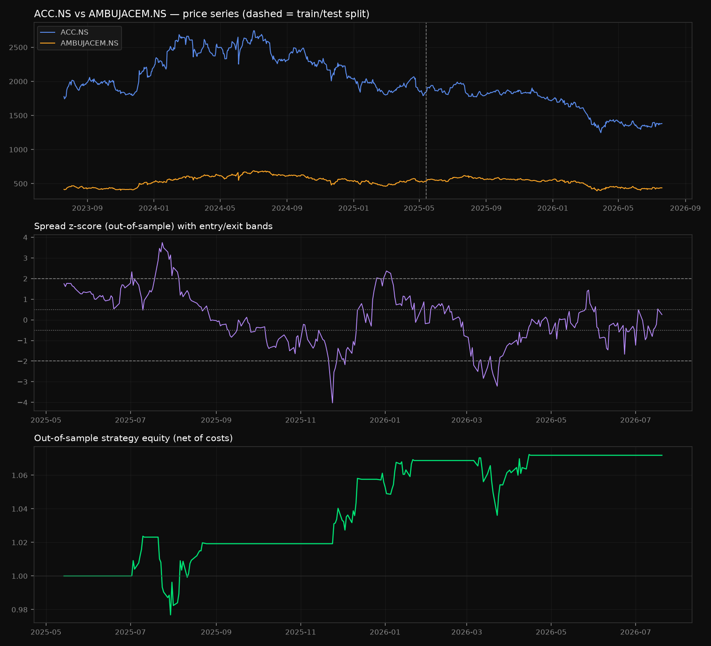

---

### ULTRACEMCO.NS / SHREECEM.NS

- **Latest prices:** ULTRACEMCO.NS ₹11,903.00 · SHREECEM.NS ₹26,850.00
- **Hedge ratio (train-fitted):** 0.6118
- **Cointegration (train):** FAIL at 5% — ADF -2.28, p=0.1793
- **Persistence:** passed 5% in 0 of 13 real-data runs (strict tier: 0/13)
- **Spread half-life:** 30.4 days
- **Current z-score:** +1.80
- **Signal today:** watch (approaching band)
- ⚠️ _Pair did not cointegrate on training data. Any signal here is not statistically justified — observation only._

**Out-of-sample backtest** (beta frozen from train window):

| Metric | Value |
|---|---|
| Sharpe | 0.23 |
| Sortino | 0.24 |
| Annualised return | 1.52% |
| Annualised vol | 7.98% |
| Max drawdown | -9.29% |
| Round-trip trades | 5 |

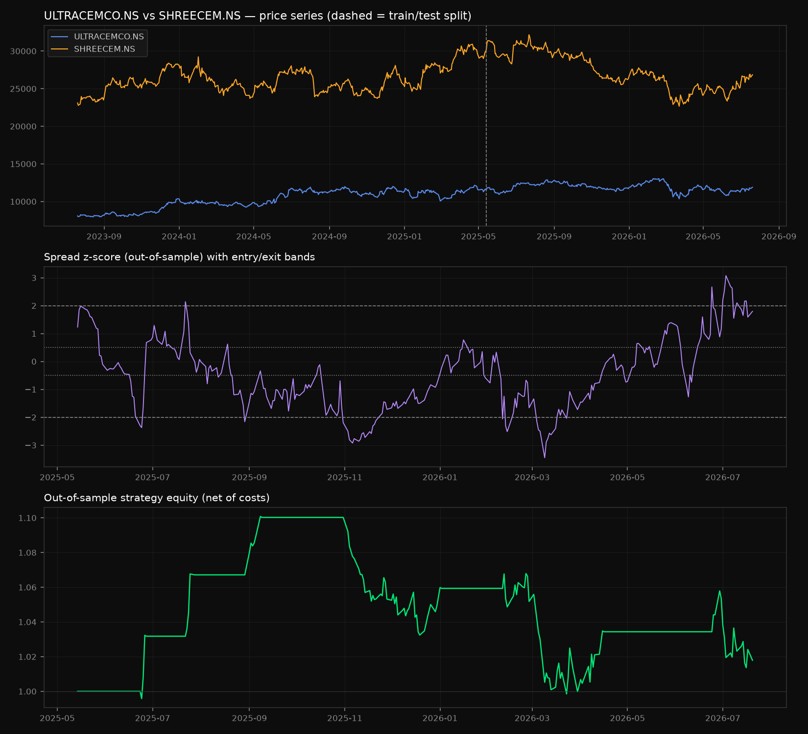

---

### IOC.NS / BPCL.NS

- **Latest prices:** IOC.NS ₹142.41 · BPCL.NS ₹317.60
- **Hedge ratio (train-fitted):** 1.7675
- **Cointegration (train):** FAIL at 5% — ADF -1.02, p=0.7477
- **Persistence:** passed 5% in 0 of 13 real-data runs (strict tier: 0/13)
- **Spread half-life:** 103.0 days
- **Current z-score:** +2.16
- **Signal today:** SHORT spread (short BPCL.NS, long IOC.NS)
- ⚠️ _Pair did not cointegrate on training data. Any signal here is not statistically justified — observation only._

**Out-of-sample backtest** (beta frozen from train window):

| Metric | Value |
|---|---|
| Sharpe | 0.59 |
| Sortino | 0.61 |
| Annualised return | 3.65% |
| Annualised vol | 6.41% |
| Max drawdown | -6.77% |
| Round-trip trades | 7 |

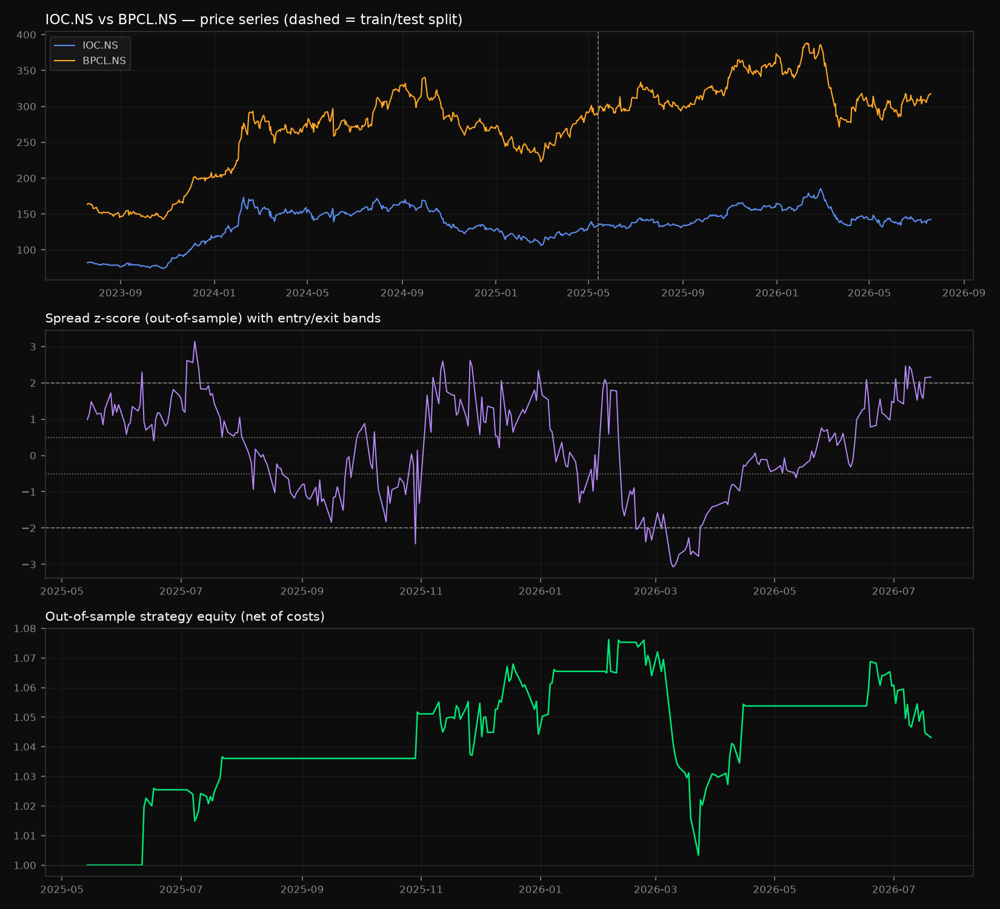

---

### BPCL.NS / HINDPETRO.NS

- **Latest prices:** BPCL.NS ₹317.60 · HINDPETRO.NS ₹405.40
- **Hedge ratio (train-fitted):** 1.4241
- **Cointegration (train):** FAIL at 5% — ADF -1.93, p=0.3159
- **Persistence:** passed 5% in 0 of 13 real-data runs (strict tier: 0/13)
- **Spread half-life:** 40.5 days
- **Current z-score:** -0.83
- **Signal today:** watch (approaching band)
- ⚠️ _Pair did not cointegrate on training data. Any signal here is not statistically justified — observation only._

**Out-of-sample backtest** (beta frozen from train window):

| Metric | Value |
|---|---|
| Sharpe | -0.07 |
| Sortino | -0.06 |
| Annualised return | -0.58% |
| Annualised vol | 5.78% |
| Max drawdown | -7.04% |
| Round-trip trades | 4 |

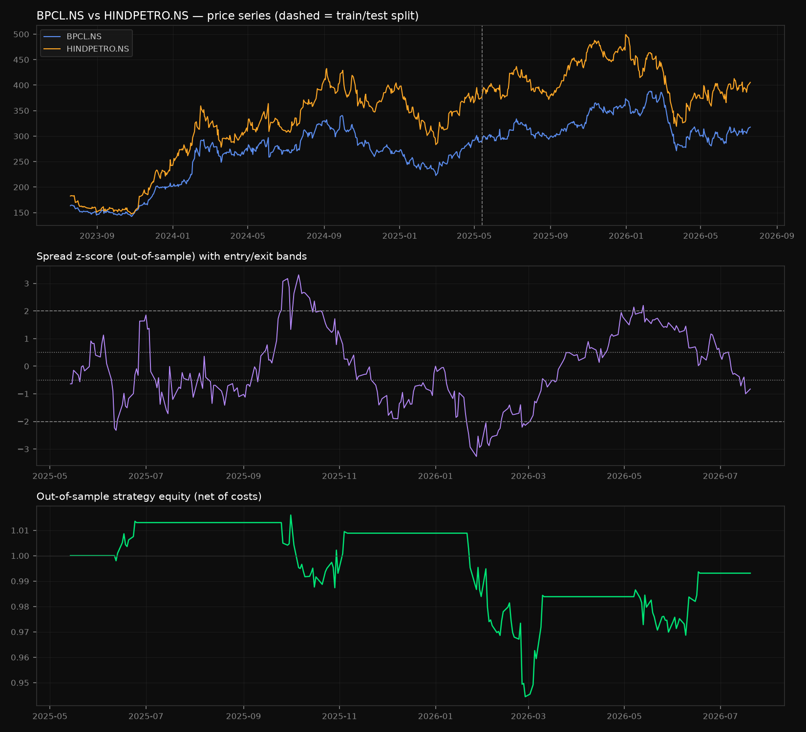

---

### ONGC.NS / COALINDIA.NS

- **Latest prices:** ONGC.NS ₹249.58 · COALINDIA.NS ₹429.40
- **Hedge ratio (train-fitted):** 1.7085
- **Cointegration (train):** PASS at 5% — ADF -2.99, p=0.0360
- **Persistence:** passed 5% in 5 of 13 real-data runs (strict tier: 0/13)
- **Spread half-life:** 16.1 days
- **Current z-score:** +0.08
- **Signal today:** flat / no stretch

**Out-of-sample backtest** (beta frozen from train window):

| Metric | Value |
|---|---|
| Sharpe | 0.84 |
| Sortino | 0.67 |
| Annualised return | 5.98% |
| Annualised vol | 7.20% |
| Max drawdown | -5.50% |
| Round-trip trades | 5 |

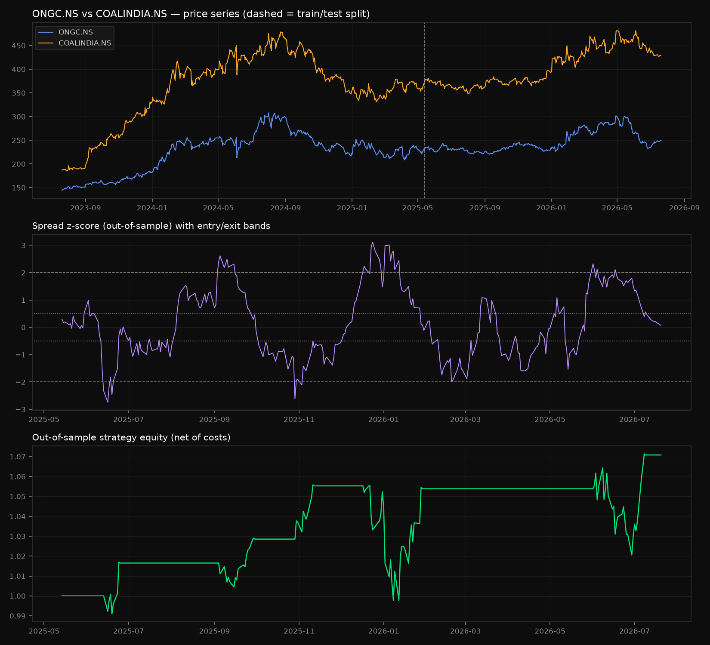

---

### NTPC.NS / POWERGRID.NS

- **Latest prices:** NTPC.NS ₹347.25 · POWERGRID.NS ₹288.70
- **Hedge ratio (train-fitted):** 0.8258
- **Cointegration (train):** FAIL at 5% — ADF -2.67, p=0.0800
- **Persistence:** passed 5% in 0 of 13 real-data runs (strict tier: 0/13)
- **Spread half-life:** 22.0 days
- **Current z-score:** +1.69
- **Signal today:** watch (approaching band)
- ⚠️ _Pair did not cointegrate on training data. Any signal here is not statistically justified — observation only._

**Out-of-sample backtest** (beta frozen from train window):

| Metric | Value |
|---|---|
| Sharpe | 0.42 |
| Sortino | 0.33 |
| Annualised return | 2.21% |
| Annualised vol | 5.51% |
| Max drawdown | -5.23% |
| Round-trip trades | 6 |

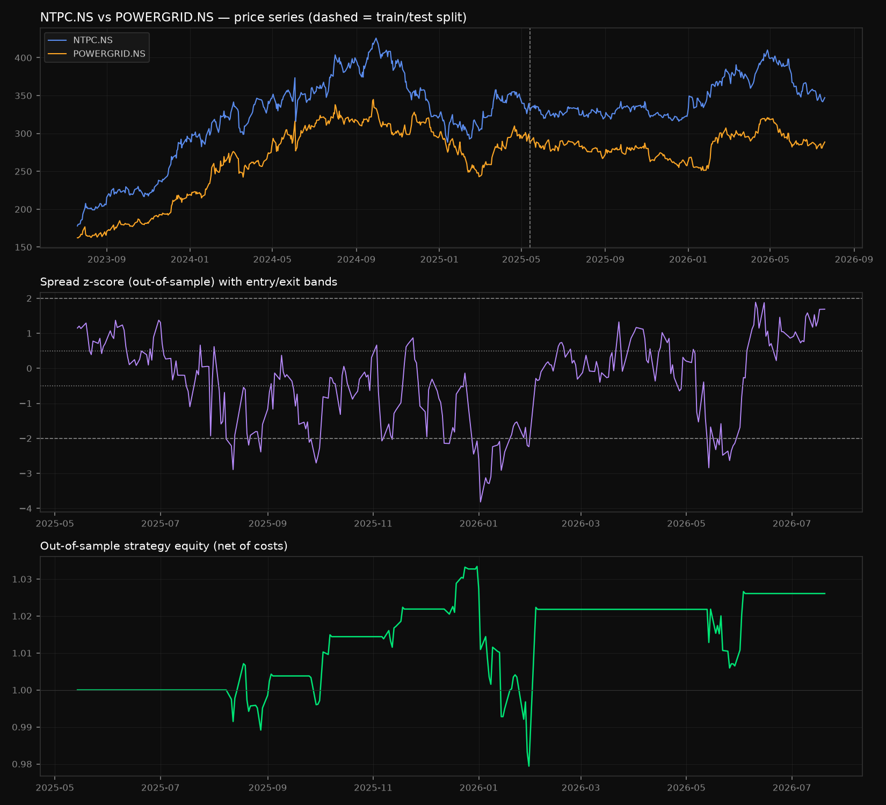

---

### BAJAJ-AUTO.NS / HEROMOTOCO.NS

- **Latest prices:** BAJAJ-AUTO.NS ₹10,522.50 · HEROMOTOCO.NS ₹4,977.70
- **Hedge ratio (train-fitted):** 0.4121
- **Cointegration (train):** FAIL at 5% — ADF -2.25, p=0.1885
- **Persistence:** passed 5% in 0 of 13 real-data runs (strict tier: 0/13)
- **Spread half-life:** 30.4 days
- **Current z-score:** -0.99
- **Signal today:** watch (approaching band)
- ⚠️ _Pair did not cointegrate on training data. Any signal here is not statistically justified — observation only._

**Out-of-sample backtest** (beta frozen from train window):

| Metric | Value |
|---|---|
| Sharpe | -1.32 |
| Sortino | -1.35 |
| Annualised return | -14.16% |
| Annualised vol | 11.07% |
| Max drawdown | -22.02% |
| Round-trip trades | 4 |

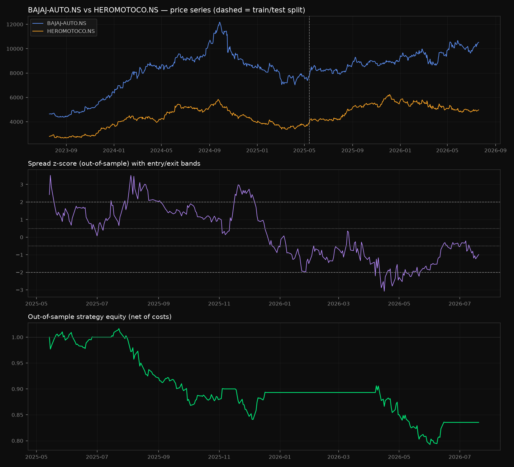

---

### TATASTEEL.NS / JSWSTEEL.NS

- **Latest prices:** TATASTEEL.NS ₹186.41 · JSWSTEEL.NS ₹1,257.00
- **Hedge ratio (train-fitted):** 2.9868
- **Cointegration (train):** FAIL at 5% — ADF -0.51, p=0.8892
- **Persistence:** passed 5% in 0 of 13 real-data runs (strict tier: 0/13)
- **Spread half-life:** 79.8 days
- **Current z-score:** +1.87
- **Signal today:** watch (approaching band)
- ⚠️ _Pair did not cointegrate on training data. Any signal here is not statistically justified — observation only._

**Out-of-sample backtest** (beta frozen from train window):

| Metric | Value |
|---|---|
| Sharpe | 0.26 |
| Sortino | 0.21 |
| Annualised return | 1.67% |
| Annualised vol | 7.46% |
| Max drawdown | -4.41% |
| Round-trip trades | 4 |

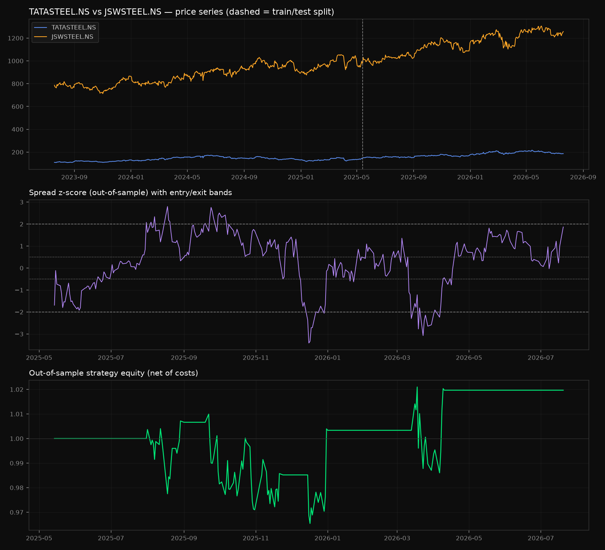

---

### SUNPHARMA.NS / CIPLA.NS

- **Latest prices:** SUNPHARMA.NS ₹1,956.40 · CIPLA.NS ₹1,441.60
- **Hedge ratio (train-fitted):** 0.5021
- **Cointegration (train):** PASS at 5% — ADF -3.88, p=0.0022 · **passes strict Bonferroni tier**
- **Persistence:** passed 5% in 13 of 13 real-data runs (strict tier: 1/13)
- **Spread half-life:** 9.9 days
- **Current z-score:** -0.11
- **Signal today:** flat / no stretch

**Out-of-sample backtest** (beta frozen from train window):

| Metric | Value |
|---|---|
| Sharpe | -0.12 |
| Sortino | -0.13 |
| Annualised return | -1.18% |
| Annualised vol | 7.63% |
| Max drawdown | -10.24% |
| Round-trip trades | 5 |

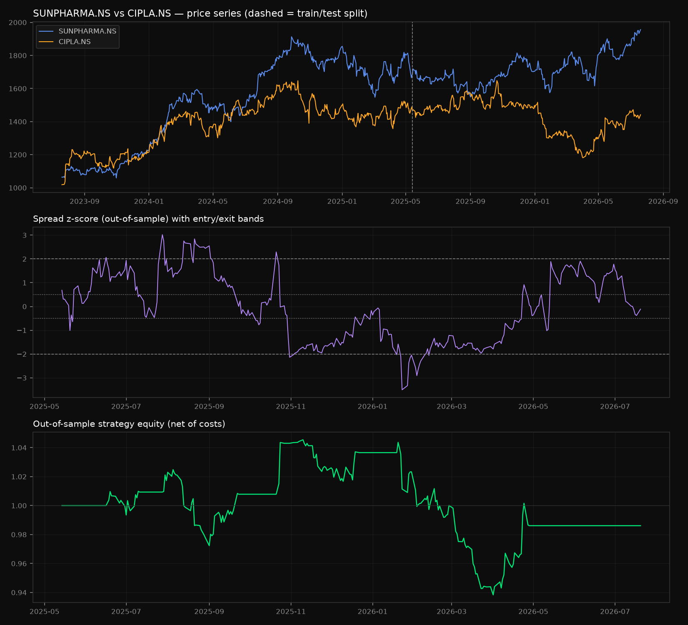

---

_Generated 2026-07-20 · pairs mean-reversion scanner · out-of-sample backtest · multiple-testing-aware · not investment advice._
