# Indian Pairs-Trading Scanner — 2026-07-21

> **What this is:** a market-neutral *pairs mean-reversion* scanner. It flags when two related NSE stocks have drifted apart far enough that their historical relationship signals a possible convergence trade. It does **not** forecast growth, rank "best" stocks, or predict company performance. A signal means the *spread between two stocks* is stretched — nothing about either stock being a good investment. Not investment advice; do your own research.

## Methodology (fixed in advance)

- **Universe:** 16 declared sector-mate pairs. Parameters (3y window, 60/40 train-test, z-entry 2.0, z-exit 0.5, 5 bps costs) are pre-registered; changes are logged in the README changelog *before* looking at results.
- **Multiple testing:** at the 5% level across 16 pairs, **≈0.8 false positives per run are expected by chance alone** even if nothing truly cointegrates. A single-day pass is a candidate, not a discovery.
- **Strict tier:** Bonferroni-corrected threshold p < 0.0031 (marked ✓✓).
- **Evidence = persistence:** the Persistence column counts how often each pair has passed the 5% test across all *real-data* daily runs recorded in `reports/history.csv`. Pairs deserve attention only when they pass persistently.

> ⚠️ **Some results use SIMULATED fallback data** (real data was unreachable this run) and are not real market results. These are marked below and are EXCLUDED from persistence counts.

## Summary

| Pair | p-value | Coint. | Persistence | Current z | Signal | OOS Sharpe |
|---|---|---|---|---|---|---|
| HDFCBANK.NS/ICICIBANK.NS *(sim)* | 0.0030 | ✓✓ | 0/11 | -1.55 | watch | 1.13 |
| AXISBANK.NS/ICICIBANK.NS | 0.9166 | ✗ | 0/14 | +3.37 | SHORT spread | -0.39 |
| KOTAKBANK.NS/HDFCBANK.NS | 0.1428 | ✗ | 0/14 | -0.28 | flat / no stretch | 0.24 |
| SBIN.NS/BANKBARODA.NS | 0.1901 | ✗ | 0/14 | -1.65 | watch | 0.36 |
| TCS.NS/INFY.NS | 0.4247 | ✗ | 0/14 | -1.14 | watch | 0.99 |
| INFY.NS/WIPRO.NS | 0.1879 | ✗ | 0/14 | -0.93 | watch | 1.74 |
| HCLTECH.NS/TECHM.NS | 0.2880 | ✗ | 0/14 | +1.91 | watch | -0.26 |
| ACC.NS/AMBUJACEM.NS | 0.8032 | ✗ | 0/14 | +0.59 | watch | 1.06 |
| ULTRACEMCO.NS/SHREECEM.NS | 0.2103 | ✗ | 0/14 | +2.03 | SHORT spread | 0.15 |
| IOC.NS/BPCL.NS | 0.7709 | ✗ | 0/14 | +2.07 | SHORT spread | 0.59 |
| BPCL.NS/HINDPETRO.NS | 0.3153 | ✗ | 0/14 | -1.04 | watch | -0.07 |
| ONGC.NS/COALINDIA.NS | 0.0355 | ✓ | 6/14 | +0.09 | flat / no stretch | 0.84 |
| NTPC.NS/POWERGRID.NS | 0.0827 | ✗ | 0/14 | +1.29 | watch | 0.42 |
| BAJAJ-AUTO.NS/HEROMOTOCO.NS | 0.1893 | ✗ | 0/14 | -0.26 | flat / no stretch | -1.17 |
| TATASTEEL.NS/JSWSTEEL.NS | 0.6949 | ✗ | 0/14 | +2.15 | SHORT spread | 0.26 |
| SUNPHARMA.NS/CIPLA.NS | 0.0017 | ✓✓ | 14/14 | -0.42 | flat / no stretch | -0.12 |

_Legend: ✓✓ passes strict Bonferroni tier · ✓ passes 5% only · ✗ fails. Persistence = 5%-passes / real-data runs recorded. \*no real-data history yet._

---

### HDFCBANK.NS / ICICIBANK.NS · _SIMULATED_

- **Latest prices:** HDFCBANK.NS ₹77.27 · ICICIBANK.NS ₹113.78
- **Hedge ratio (train-fitted):** 1.5557
- **Cointegration (train):** PASS at 5% — ADF -3.79, p=0.0030 · **passes strict Bonferroni tier**
- **Persistence:** passed 5% in 0 of 11 real-data runs (strict tier: 0/11)
- **Spread half-life:** 14.0 days
- **Current z-score:** -1.55
- **Signal today:** watch (approaching band)

**Out-of-sample backtest** (beta frozen from train window):

| Metric | Value |
|---|---|
| Sharpe | 1.13 |
| Sortino | 0.86 |
| Annualised return | 1.88% |
| Annualised vol | 1.66% |
| Max drawdown | -1.19% |
| Round-trip trades | 5 |

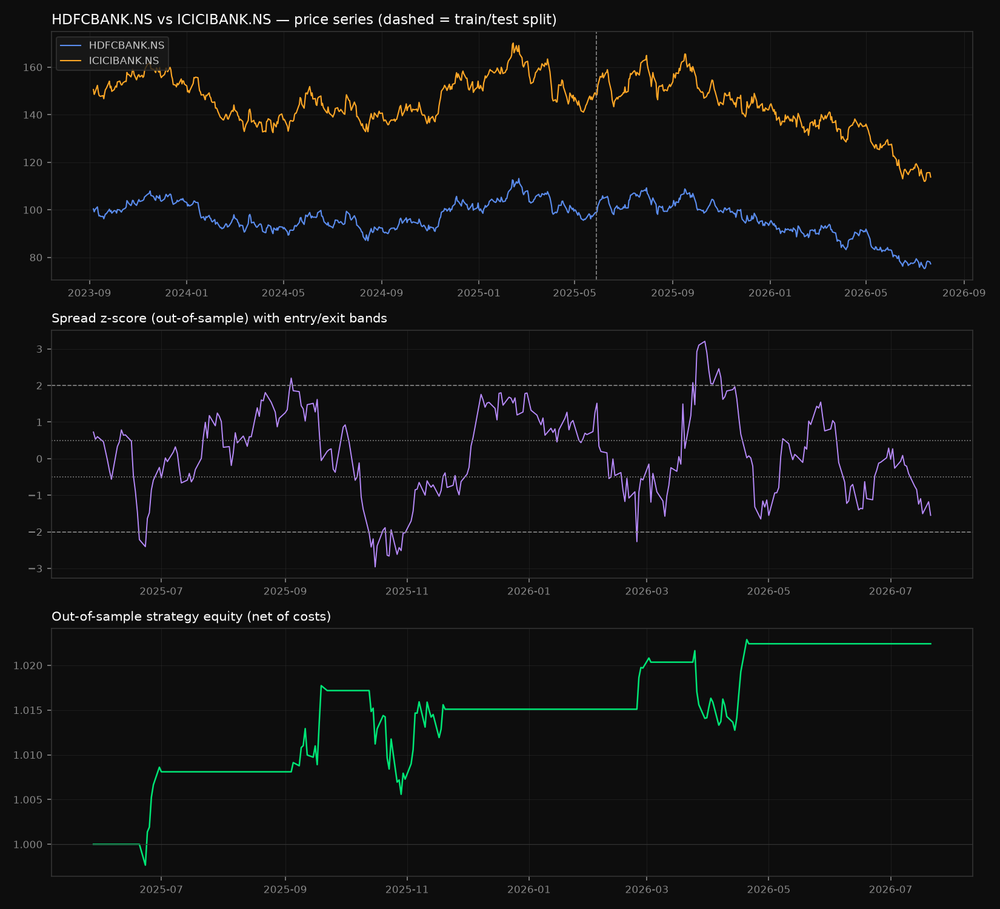

---

### AXISBANK.NS / ICICIBANK.NS

- **Latest prices:** AXISBANK.NS ₹1,258.20 · ICICIBANK.NS ₹1,463.10
- **Hedge ratio (train-fitted):** 0.8949
- **Cointegration (train):** FAIL at 5% — ADF -0.36, p=0.9166
- **Persistence:** passed 5% in 0 of 14 real-data runs (strict tier: 0/14)
- **Spread half-life:** 251.2 days
- **Current z-score:** +3.37
- **Signal today:** SHORT spread (short ICICIBANK.NS, long AXISBANK.NS)
- ⚠️ _Pair did not cointegrate on training data. Any signal here is not statistically justified — observation only._

**Out-of-sample backtest** (beta frozen from train window):

| Metric | Value |
|---|---|
| Sharpe | -0.39 |
| Sortino | -0.37 |
| Annualised return | -3.57% |
| Annualised vol | 8.47% |
| Max drawdown | -7.76% |
| Round-trip trades | 6 |

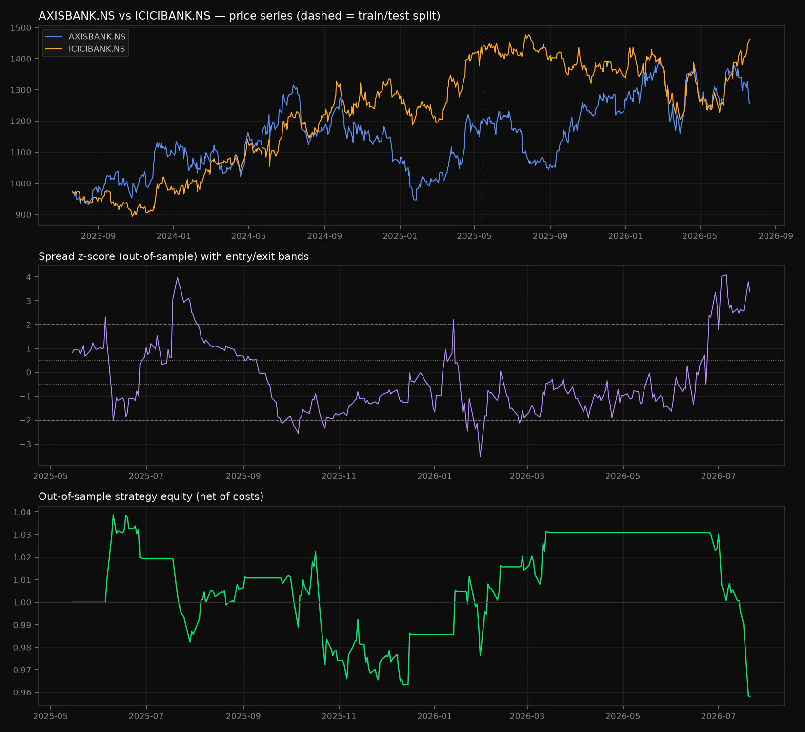

---

### KOTAKBANK.NS / HDFCBANK.NS

- **Latest prices:** KOTAKBANK.NS ₹385.95 · HDFCBANK.NS ₹761.45
- **Hedge ratio (train-fitted):** 1.8309
- **Cointegration (train):** FAIL at 5% — ADF -2.40, p=0.1428
- **Persistence:** passed 5% in 0 of 14 real-data runs (strict tier: 0/14)
- **Spread half-life:** 27.0 days
- **Current z-score:** -0.28
- **Signal today:** flat / no stretch
- ⚠️ _Pair did not cointegrate on training data. Any signal here is not statistically justified — observation only._

**Out-of-sample backtest** (beta frozen from train window):

| Metric | Value |
|---|---|
| Sharpe | 0.24 |
| Sortino | 0.21 |
| Annualised return | 1.35% |
| Annualised vol | 6.58% |
| Max drawdown | -5.69% |
| Round-trip trades | 5 |

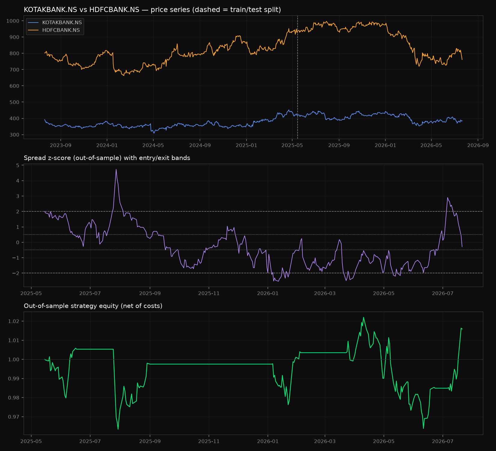

---

### SBIN.NS / BANKBARODA.NS

- **Latest prices:** SBIN.NS ₹1,044.40 · BANKBARODA.NS ₹247.70
- **Hedge ratio (train-fitted):** 0.2092
- **Cointegration (train):** FAIL at 5% — ADF -2.25, p=0.1901
- **Persistence:** passed 5% in 0 of 14 real-data runs (strict tier: 0/14)
- **Spread half-life:** 23.4 days
- **Current z-score:** -1.65
- **Signal today:** watch (approaching band)
- ⚠️ _Pair did not cointegrate on training data. Any signal here is not statistically justified — observation only._

**Out-of-sample backtest** (beta frozen from train window):

| Metric | Value |
|---|---|
| Sharpe | 0.36 |
| Sortino | 0.24 |
| Annualised return | 2.76% |
| Annualised vol | 8.70% |
| Max drawdown | -9.38% |
| Round-trip trades | 5 |

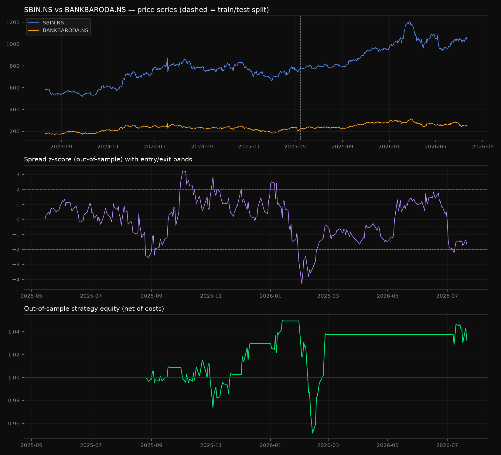

---

### TCS.NS / INFY.NS

- **Latest prices:** TCS.NS ₹2,221.10 · INFY.NS ₹1,073.50
- **Hedge ratio (train-fitted):** 0.5313
- **Cointegration (train):** FAIL at 5% — ADF -1.71, p=0.4247
- **Persistence:** passed 5% in 0 of 14 real-data runs (strict tier: 0/14)
- **Spread half-life:** 42.5 days
- **Current z-score:** -1.14
- **Signal today:** watch (approaching band)
- ⚠️ _Pair did not cointegrate on training data. Any signal here is not statistically justified — observation only._

**Out-of-sample backtest** (beta frozen from train window):

| Metric | Value |
|---|---|
| Sharpe | 0.99 |
| Sortino | 0.89 |
| Annualised return | 3.99% |
| Annualised vol | 4.05% |
| Max drawdown | -4.13% |
| Round-trip trades | 6 |

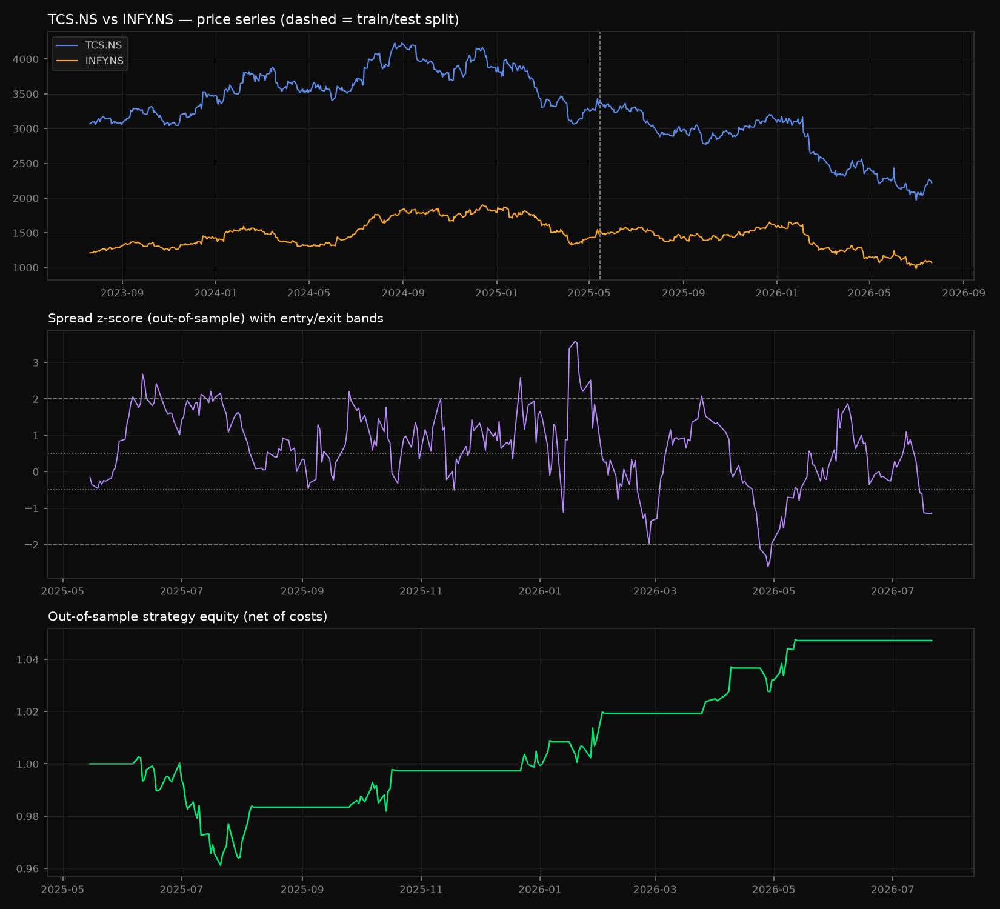

---

### INFY.NS / WIPRO.NS

- **Latest prices:** INFY.NS ₹1,073.50 · WIPRO.NS ₹174.97
- **Hedge ratio (train-fitted):** 0.1396
- **Cointegration (train):** FAIL at 5% — ADF -2.25, p=0.1879
- **Persistence:** passed 5% in 0 of 14 real-data runs (strict tier: 0/14)
- **Spread half-life:** 30.0 days
- **Current z-score:** -0.93
- **Signal today:** watch (approaching band)
- ⚠️ _Pair did not cointegrate on training data. Any signal here is not statistically justified — observation only._

**Out-of-sample backtest** (beta frozen from train window):

| Metric | Value |
|---|---|
| Sharpe | 1.74 |
| Sortino | 2.04 |
| Annualised return | 9.17% |
| Annualised vol | 5.13% |
| Max drawdown | -2.44% |
| Round-trip trades | 6 |

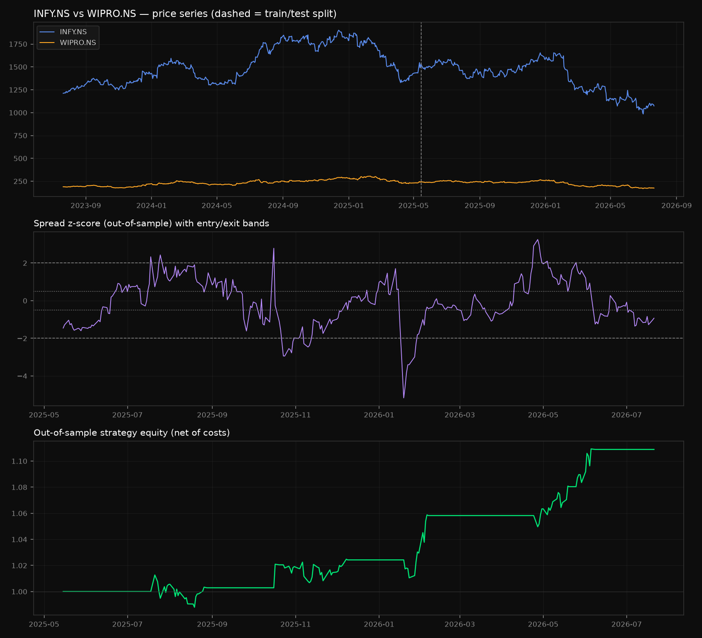

---

### HCLTECH.NS / TECHM.NS

- **Latest prices:** HCLTECH.NS ₹1,239.50 · TECHM.NS ₹1,576.30
- **Hedge ratio (train-fitted):** 0.8079
- **Cointegration (train):** FAIL at 5% — ADF -2.00, p=0.2880
- **Persistence:** passed 5% in 0 of 14 real-data runs (strict tier: 0/14)
- **Spread half-life:** 25.6 days
- **Current z-score:** +1.91
- **Signal today:** watch (approaching band)
- ⚠️ _Pair did not cointegrate on training data. Any signal here is not statistically justified — observation only._

**Out-of-sample backtest** (beta frozen from train window):

| Metric | Value |
|---|---|
| Sharpe | -0.26 |
| Sortino | -0.27 |
| Annualised return | -2.18% |
| Annualised vol | 7.41% |
| Max drawdown | -8.18% |
| Round-trip trades | 4 |

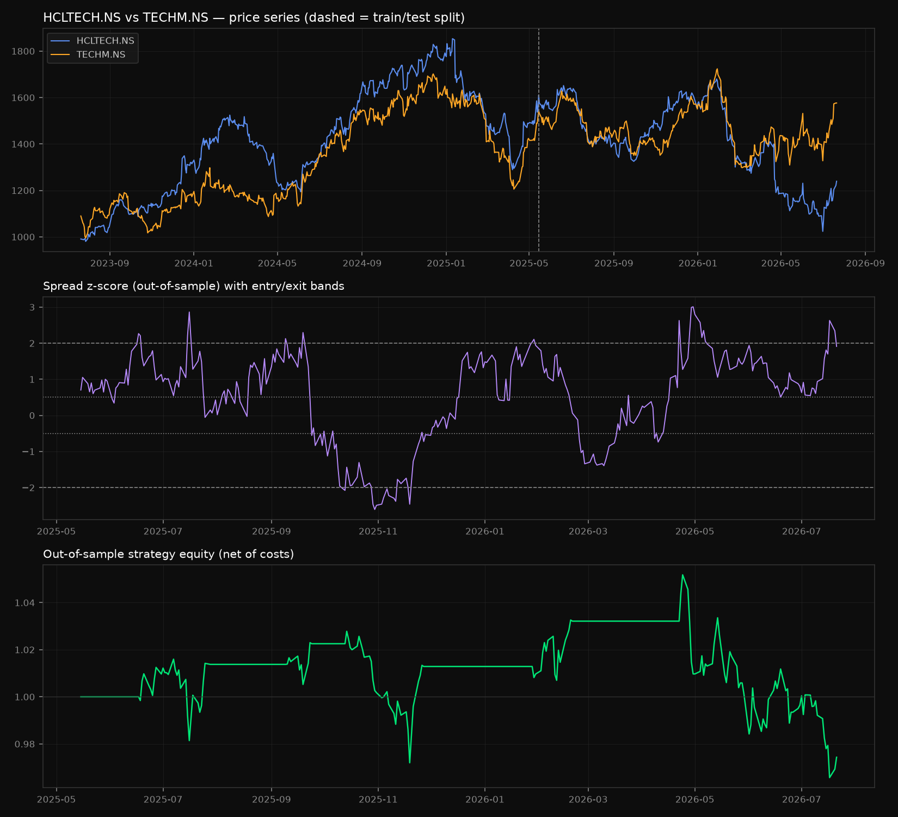

---

### ACC.NS / AMBUJACEM.NS

- **Latest prices:** ACC.NS ₹1,387.80 · AMBUJACEM.NS ₹440.85
- **Hedge ratio (train-fitted):** 0.2402
- **Cointegration (train):** FAIL at 5% — ADF -0.85, p=0.8032
- **Persistence:** passed 5% in 0 of 14 real-data runs (strict tier: 0/14)
- **Spread half-life:** 84.3 days
- **Current z-score:** +0.59
- **Signal today:** watch (approaching band)
- ⚠️ _Pair did not cointegrate on training data. Any signal here is not statistically justified — observation only._

**Out-of-sample backtest** (beta frozen from train window):

| Metric | Value |
|---|---|
| Sharpe | 1.06 |
| Sortino | 0.90 |
| Annualised return | 6.01% |
| Annualised vol | 5.66% |
| Max drawdown | -4.52% |
| Round-trip trades | 5 |

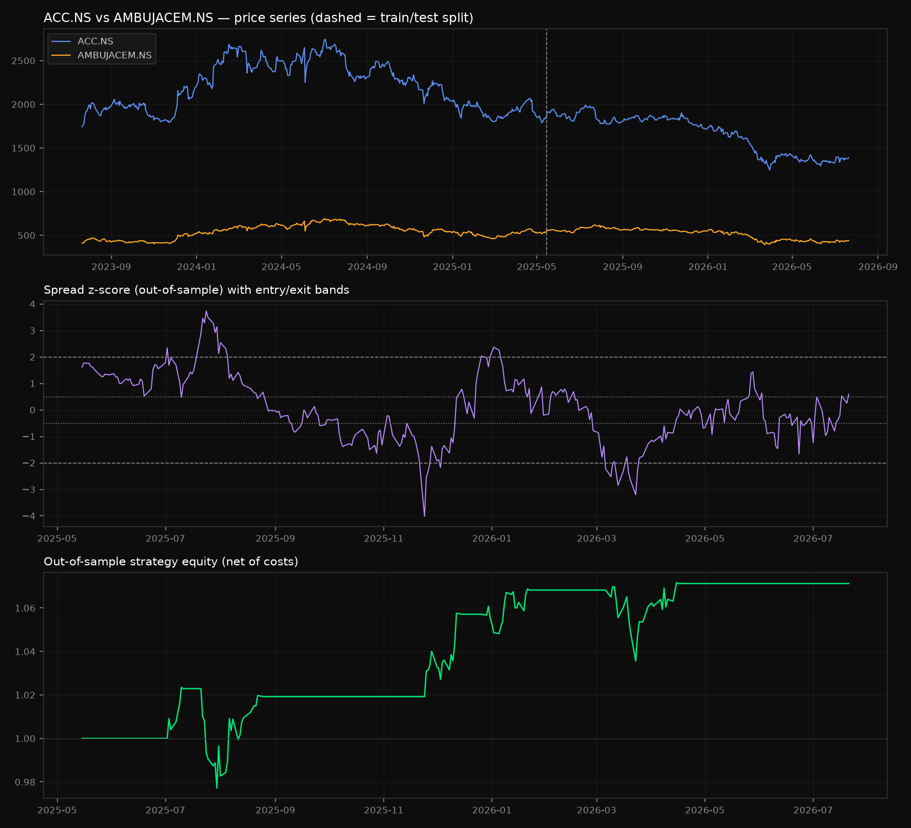

---

### ULTRACEMCO.NS / SHREECEM.NS

- **Latest prices:** ULTRACEMCO.NS ₹12,094.00 · SHREECEM.NS ₹27,245.00
- **Hedge ratio (train-fitted):** 0.6130
- **Cointegration (train):** FAIL at 5% — ADF -2.19, p=0.2103
- **Persistence:** passed 5% in 0 of 14 real-data runs (strict tier: 0/14)
- **Spread half-life:** 31.7 days
- **Current z-score:** +2.03
- **Signal today:** SHORT spread (short SHREECEM.NS, long ULTRACEMCO.NS)
- ⚠️ _Pair did not cointegrate on training data. Any signal here is not statistically justified — observation only._

**Out-of-sample backtest** (beta frozen from train window):

| Metric | Value |
|---|---|
| Sharpe | 0.15 |
| Sortino | 0.16 |
| Annualised return | 0.87% |
| Annualised vol | 7.82% |
| Max drawdown | -9.06% |
| Round-trip trades | 5 |

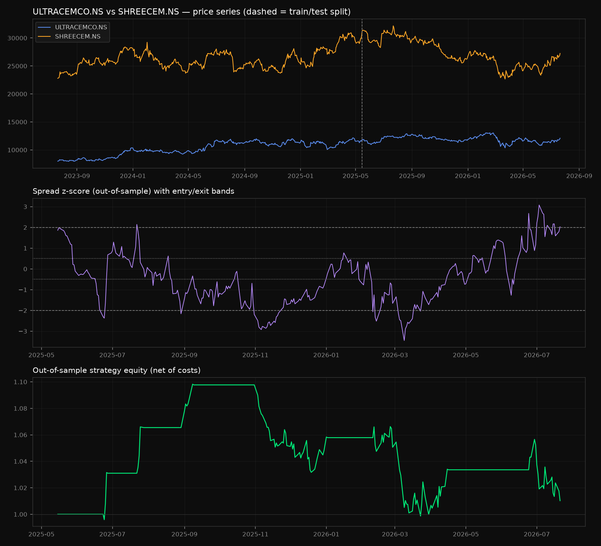

---

### IOC.NS / BPCL.NS

- **Latest prices:** IOC.NS ₹143.30 · BPCL.NS ₹319.35
- **Hedge ratio (train-fitted):** 1.7680
- **Cointegration (train):** FAIL at 5% — ADF -0.95, p=0.7709
- **Persistence:** passed 5% in 0 of 14 real-data runs (strict tier: 0/14)
- **Spread half-life:** 110.3 days
- **Current z-score:** +2.07
- **Signal today:** SHORT spread (short BPCL.NS, long IOC.NS)
- ⚠️ _Pair did not cointegrate on training data. Any signal here is not statistically justified — observation only._

**Out-of-sample backtest** (beta frozen from train window):

| Metric | Value |
|---|---|
| Sharpe | 0.59 |
| Sortino | 0.61 |
| Annualised return | 3.58% |
| Annualised vol | 6.32% |
| Max drawdown | -6.68% |
| Round-trip trades | 7 |

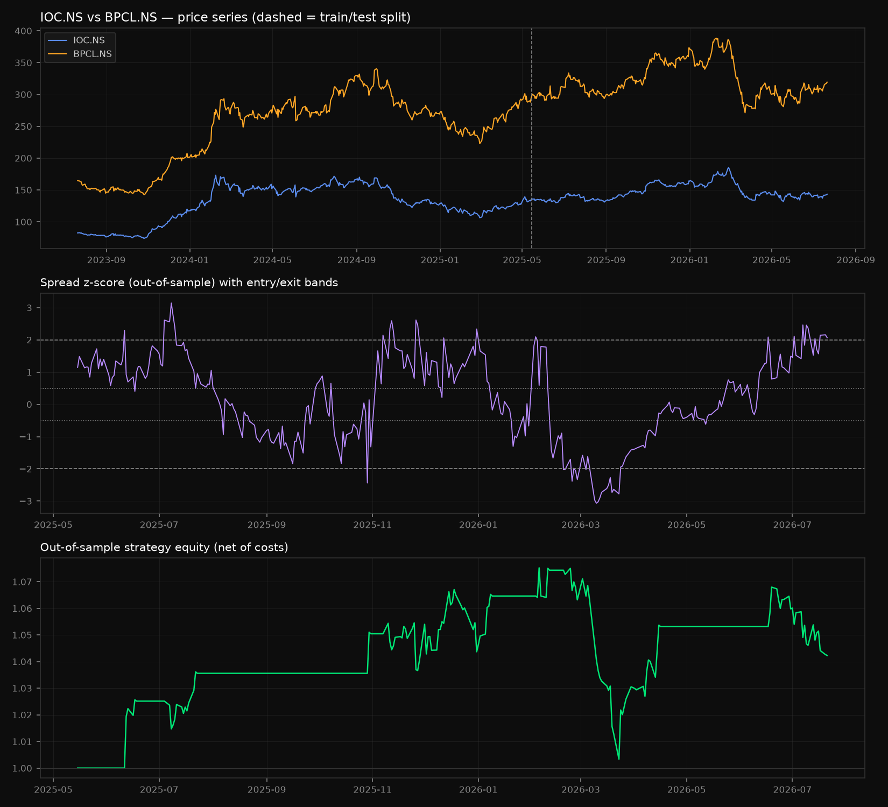

---

### BPCL.NS / HINDPETRO.NS

- **Latest prices:** BPCL.NS ₹319.35 · HINDPETRO.NS ₹406.95
- **Hedge ratio (train-fitted):** 1.4244
- **Cointegration (train):** FAIL at 5% — ADF -1.94, p=0.3153
- **Persistence:** passed 5% in 0 of 14 real-data runs (strict tier: 0/14)
- **Spread half-life:** 40.5 days
- **Current z-score:** -1.04
- **Signal today:** watch (approaching band)
- ⚠️ _Pair did not cointegrate on training data. Any signal here is not statistically justified — observation only._

**Out-of-sample backtest** (beta frozen from train window):

| Metric | Value |
|---|---|
| Sharpe | -0.07 |
| Sortino | -0.06 |
| Annualised return | -0.57% |
| Annualised vol | 5.69% |
| Max drawdown | -6.94% |
| Round-trip trades | 4 |

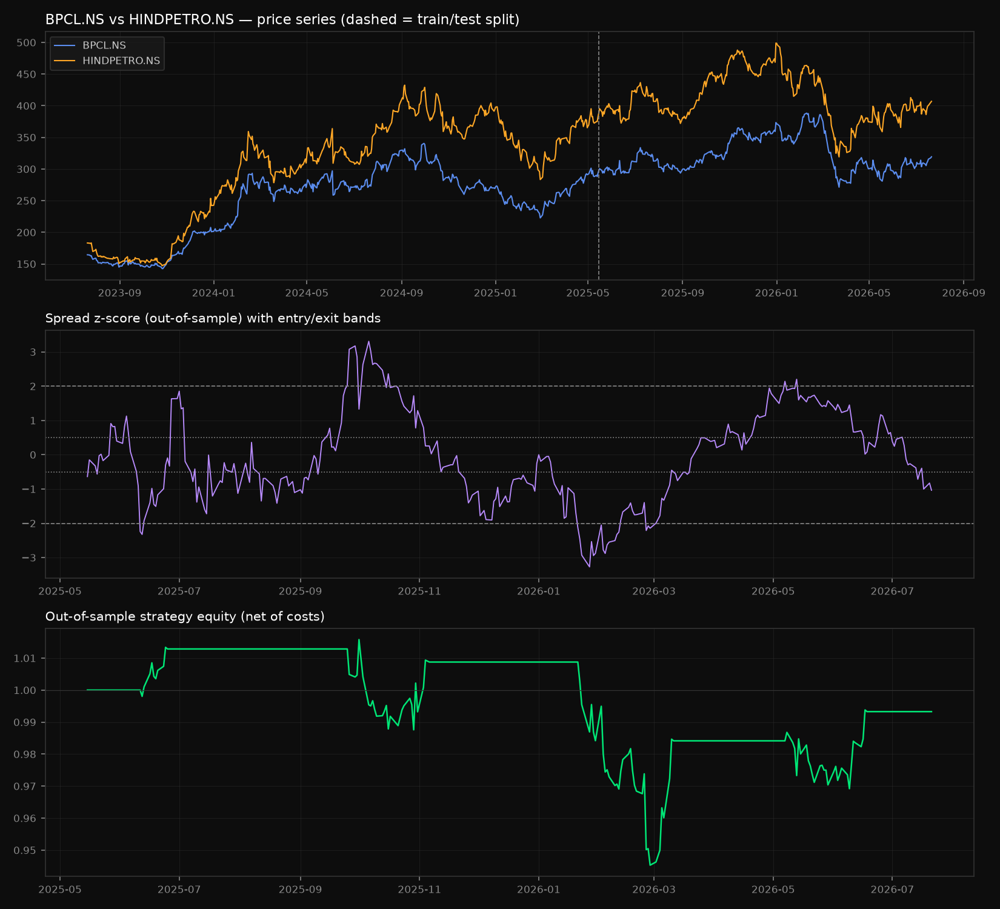

---

### ONGC.NS / COALINDIA.NS

- **Latest prices:** ONGC.NS ₹249.89 · COALINDIA.NS ₹431.25
- **Hedge ratio (train-fitted):** 1.7052
- **Cointegration (train):** PASS at 5% — ADF -2.99, p=0.0355
- **Persistence:** passed 5% in 6 of 14 real-data runs (strict tier: 0/14)
- **Spread half-life:** 15.8 days
- **Current z-score:** +0.09
- **Signal today:** flat / no stretch

**Out-of-sample backtest** (beta frozen from train window):

| Metric | Value |
|---|---|
| Sharpe | 0.84 |
| Sortino | 0.67 |
| Annualised return | 5.94% |
| Annualised vol | 7.16% |
| Max drawdown | -5.48% |
| Round-trip trades | 5 |

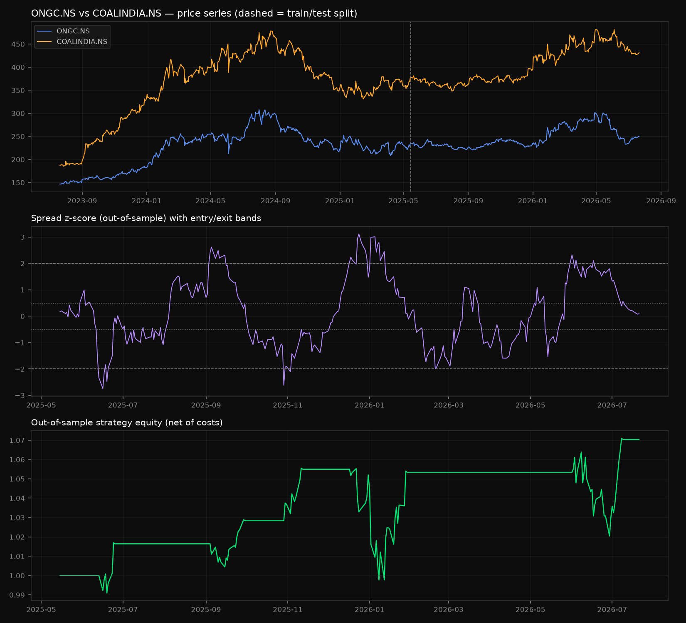

---

### NTPC.NS / POWERGRID.NS

- **Latest prices:** NTPC.NS ₹348.55 · POWERGRID.NS ₹286.70
- **Hedge ratio (train-fitted):** 0.8272
- **Cointegration (train):** FAIL at 5% — ADF -2.65, p=0.0827
- **Persistence:** passed 5% in 0 of 14 real-data runs (strict tier: 0/14)
- **Spread half-life:** 22.1 days
- **Current z-score:** +1.29
- **Signal today:** watch (approaching band)
- ⚠️ _Pair did not cointegrate on training data. Any signal here is not statistically justified — observation only._

**Out-of-sample backtest** (beta frozen from train window):

| Metric | Value |
|---|---|
| Sharpe | 0.42 |
| Sortino | 0.33 |
| Annualised return | 2.18% |
| Annualised vol | 5.44% |
| Max drawdown | -5.17% |
| Round-trip trades | 6 |

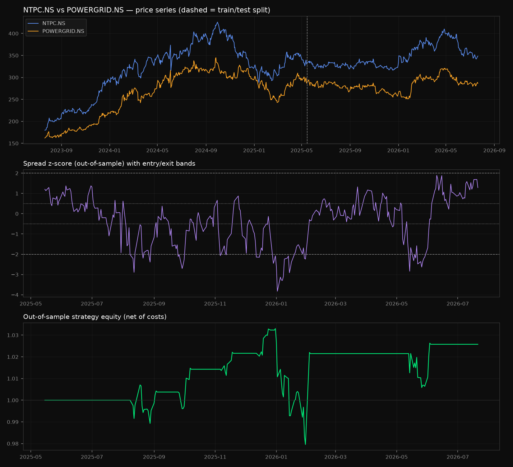

---

### BAJAJ-AUTO.NS / HEROMOTOCO.NS

- **Latest prices:** BAJAJ-AUTO.NS ₹10,403.50 · HEROMOTOCO.NS ₹5,034.10
- **Hedge ratio (train-fitted):** 0.4122
- **Cointegration (train):** FAIL at 5% — ADF -2.25, p=0.1893
- **Persistence:** passed 5% in 0 of 14 real-data runs (strict tier: 0/14)
- **Spread half-life:** 30.4 days
- **Current z-score:** -0.26
- **Signal today:** flat / no stretch
- ⚠️ _Pair did not cointegrate on training data. Any signal here is not statistically justified — observation only._

**Out-of-sample backtest** (beta frozen from train window):

| Metric | Value |
|---|---|
| Sharpe | -1.17 |
| Sortino | -1.20 |
| Annualised return | -11.93% |
| Annualised vol | 10.38% |
| Max drawdown | -21.12% |
| Round-trip trades | 4 |

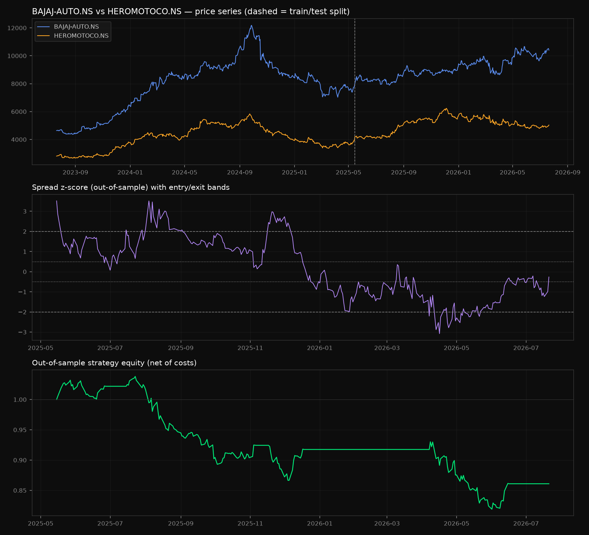

---

### TATASTEEL.NS / JSWSTEEL.NS

- **Latest prices:** TATASTEEL.NS ₹187.24 · JSWSTEEL.NS ₹1,267.40
- **Hedge ratio (train-fitted):** 2.9902
- **Cointegration (train):** FAIL at 5% — ADF -1.15, p=0.6949
- **Persistence:** passed 5% in 0 of 14 real-data runs (strict tier: 0/14)
- **Spread half-life:** 73.8 days
- **Current z-score:** +2.15
- **Signal today:** SHORT spread (short JSWSTEEL.NS, long TATASTEEL.NS)
- ⚠️ _Pair did not cointegrate on training data. Any signal here is not statistically justified — observation only._

**Out-of-sample backtest** (beta frozen from train window):

| Metric | Value |
|---|---|
| Sharpe | 0.26 |
| Sortino | 0.21 |
| Annualised return | 1.61% |
| Annualised vol | 7.18% |
| Max drawdown | -4.24% |
| Round-trip trades | 4 |

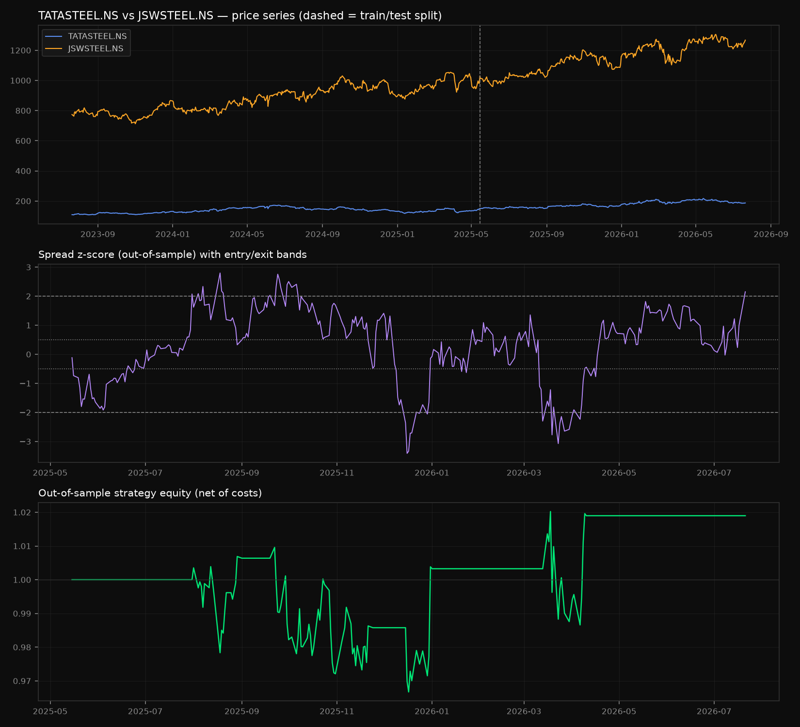

---

### SUNPHARMA.NS / CIPLA.NS

- **Latest prices:** SUNPHARMA.NS ₹1,961.90 · CIPLA.NS ₹1,432.50
- **Hedge ratio (train-fitted):** 0.5000
- **Cointegration (train):** PASS at 5% — ADF -3.95, p=0.0017 · **passes strict Bonferroni tier**
- **Persistence:** passed 5% in 14 of 14 real-data runs (strict tier: 2/14)
- **Spread half-life:** 9.7 days
- **Current z-score:** -0.42
- **Signal today:** flat / no stretch

**Out-of-sample backtest** (beta frozen from train window):

| Metric | Value |
|---|---|
| Sharpe | -0.12 |
| Sortino | -0.13 |
| Annualised return | -1.15% |
| Annualised vol | 7.56% |
| Max drawdown | -10.15% |
| Round-trip trades | 5 |

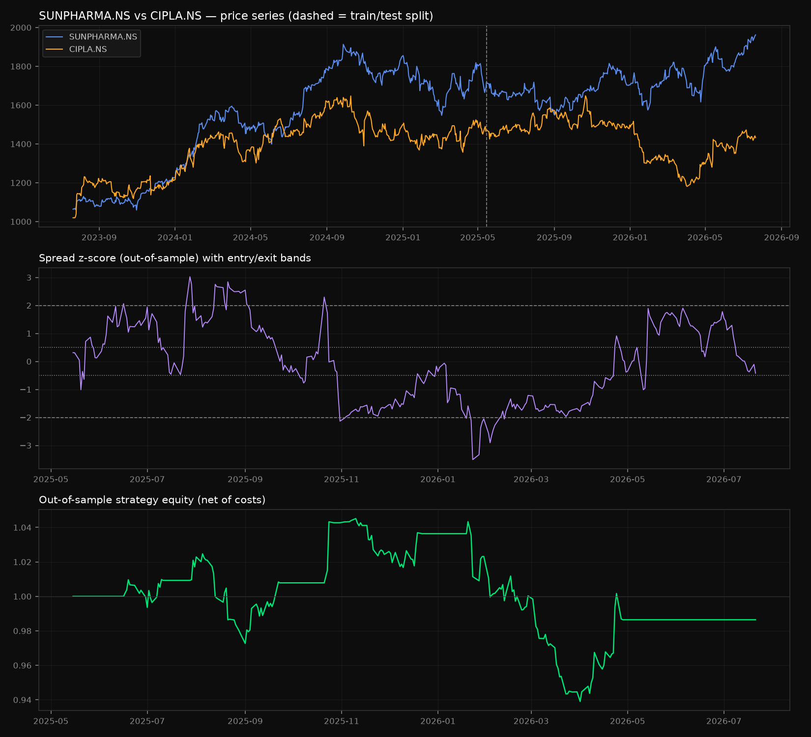

---

_Generated 2026-07-21 · pairs mean-reversion scanner · out-of-sample backtest · multiple-testing-aware · not investment advice._
