# Indian Pairs-Trading Scanner — 2026-07-22

> **What this is:** a market-neutral *pairs mean-reversion* scanner. It flags when two related NSE stocks have drifted apart far enough that their historical relationship signals a possible convergence trade. It does **not** forecast growth, rank "best" stocks, or predict company performance. A signal means the *spread between two stocks* is stretched — nothing about either stock being a good investment. Not investment advice; do your own research.

## Methodology (fixed in advance)

- **Universe:** 16 declared sector-mate pairs. Parameters (3y window, 60/40 train-test, z-entry 2.0, z-exit 0.5, 5 bps costs) are pre-registered; changes are logged in the README changelog *before* looking at results.
- **Multiple testing:** at the 5% level across 16 pairs, **≈0.8 false positives per run are expected by chance alone** even if nothing truly cointegrates. A single-day pass is a candidate, not a discovery.
- **Strict tier:** Bonferroni-corrected threshold p < 0.0031 (marked ✓✓).
- **Evidence = persistence:** the Persistence column counts how often each pair has passed the 5% test across all *real-data* daily runs recorded in `reports/history.csv`. Pairs deserve attention only when they pass persistently.

## Summary

| Pair | p-value | Coint. | Persistence | Current z | Signal | OOS Sharpe |
|---|---|---|---|---|---|---|
| HDFCBANK.NS/ICICIBANK.NS | 0.1075 | ✗ | 0/12 | +3.36 | SHORT spread | -0.41 |
| AXISBANK.NS/ICICIBANK.NS | 0.9274 | ✗ | 0/15 | +2.98 | SHORT spread | -0.37 |
| KOTAKBANK.NS/HDFCBANK.NS | 0.1711 | ✗ | 0/15 | -0.26 | flat / no stretch | 0.13 |
| SBIN.NS/BANKBARODA.NS | 0.1905 | ✗ | 0/15 | -1.46 | watch | 0.41 |
| TCS.NS/INFY.NS | 0.4293 | ✗ | 0/15 | -1.55 | watch | 0.99 |
| INFY.NS/WIPRO.NS | 0.1900 | ✗ | 0/15 | -0.58 | watch | 1.74 |
| HCLTECH.NS/TECHM.NS | 0.3231 | ✗ | 0/15 | +1.49 | watch | -0.21 |
| ACC.NS/AMBUJACEM.NS | 0.7907 | ✗ | 0/15 | -0.03 | flat / no stretch | 1.06 |
| ULTRACEMCO.NS/SHREECEM.NS | 0.2837 | ✗ | 0/15 | +1.48 | watch | 0.26 |
| IOC.NS/BPCL.NS | 0.7871 | ✗ | 0/15 | +1.49 | watch | 0.66 |
| BPCL.NS/HINDPETRO.NS | 0.3152 | ✗ | 0/15 | -1.66 | watch | -0.07 |
| ONGC.NS/COALINDIA.NS | 0.0303 | ✓ | 7/15 | -0.15 | flat / no stretch | 0.84 |
| NTPC.NS/POWERGRID.NS | 0.0803 | ✗ | 0/15 | +1.36 | watch | 0.42 |
| BAJAJ-AUTO.NS/HEROMOTOCO.NS | 0.1763 | ✗ | 0/15 | -2.33 | LONG spread | -1.22 |
| TATASTEEL.NS/JSWSTEEL.NS | 0.9387 | ✗ | 0/15 | +2.12 | SHORT spread | 0.24 |
| SUNPHARMA.NS/CIPLA.NS | 0.0017 | ✓✓ | 15/15 | -0.64 | watch | -0.11 |

_Legend: ✓✓ passes strict Bonferroni tier · ✓ passes 5% only · ✗ fails. Persistence = 5%-passes / real-data runs recorded. \*no real-data history yet._

---

### HDFCBANK.NS / ICICIBANK.NS

- **Latest prices:** HDFCBANK.NS ₹753.15 · ICICIBANK.NS ₹1,440.70
- **Hedge ratio (train-fitted):** 1.7493
- **Cointegration (train):** FAIL at 5% — ADF -2.53, p=0.1075
- **Persistence:** passed 5% in 0 of 12 real-data runs (strict tier: 0/12)
- **Spread half-life:** 30.8 days
- **Current z-score:** +3.36
- **Signal today:** SHORT spread (short ICICIBANK.NS, long HDFCBANK.NS)
- ⚠️ _Pair did not cointegrate on training data. Any signal here is not statistically justified — observation only._

**Out-of-sample backtest** (beta frozen from train window):

| Metric | Value |
|---|---|
| Sharpe | -0.41 |
| Sortino | -0.41 |
| Annualised return | -2.62% |
| Annualised vol | 6.07% |
| Max drawdown | -8.61% |
| Round-trip trades | 5 |

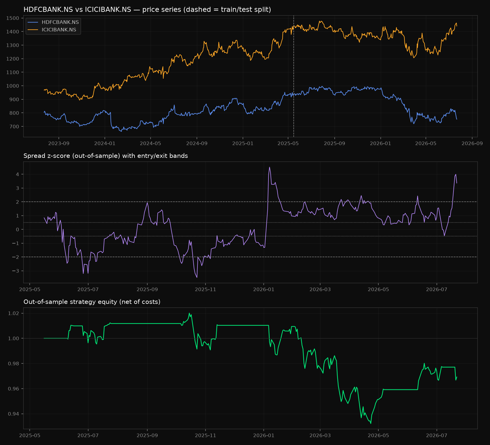

---

### AXISBANK.NS / ICICIBANK.NS

- **Latest prices:** AXISBANK.NS ₹1,238.40 · ICICIBANK.NS ₹1,440.70
- **Hedge ratio (train-fitted):** 0.9000
- **Cointegration (train):** FAIL at 5% — ADF -0.29, p=0.9274
- **Persistence:** passed 5% in 0 of 15 real-data runs (strict tier: 0/15)
- **Spread half-life:** 279.8 days
- **Current z-score:** +2.98
- **Signal today:** SHORT spread (short ICICIBANK.NS, long AXISBANK.NS)
- ⚠️ _Pair did not cointegrate on training data. Any signal here is not statistically justified — observation only._

**Out-of-sample backtest** (beta frozen from train window):

| Metric | Value |
|---|---|
| Sharpe | -0.37 |
| Sortino | -0.35 |
| Annualised return | -3.41% |
| Annualised vol | 8.47% |
| Max drawdown | -7.75% |
| Round-trip trades | 6 |

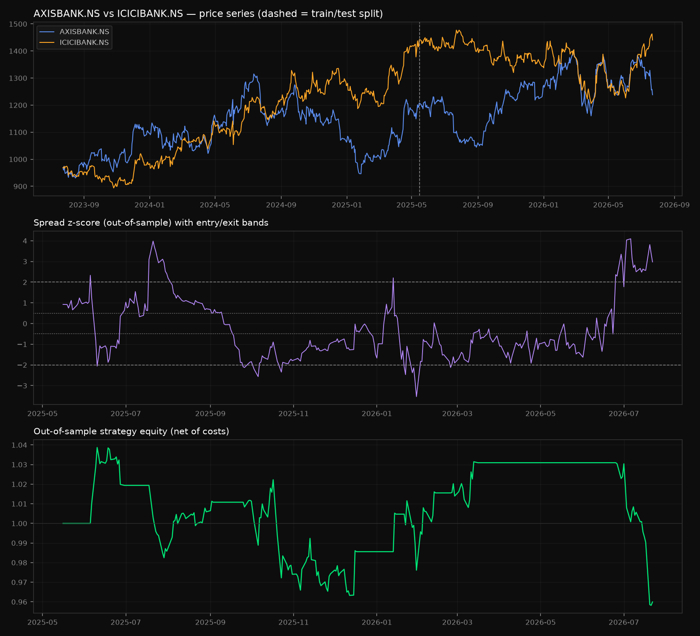

---

### KOTAKBANK.NS / HDFCBANK.NS

- **Latest prices:** KOTAKBANK.NS ₹381.15 · HDFCBANK.NS ₹753.15
- **Hedge ratio (train-fitted):** 1.8456
- **Cointegration (train):** FAIL at 5% — ADF -2.30, p=0.1711
- **Persistence:** passed 5% in 0 of 15 real-data runs (strict tier: 0/15)
- **Spread half-life:** 28.2 days
- **Current z-score:** -0.26
- **Signal today:** flat / no stretch
- ⚠️ _Pair did not cointegrate on training data. Any signal here is not statistically justified — observation only._

**Out-of-sample backtest** (beta frozen from train window):

| Metric | Value |
|---|---|
| Sharpe | 0.13 |
| Sortino | 0.10 |
| Annualised return | 0.61% |
| Annualised vol | 6.28% |
| Max drawdown | -5.68% |
| Round-trip trades | 4 |

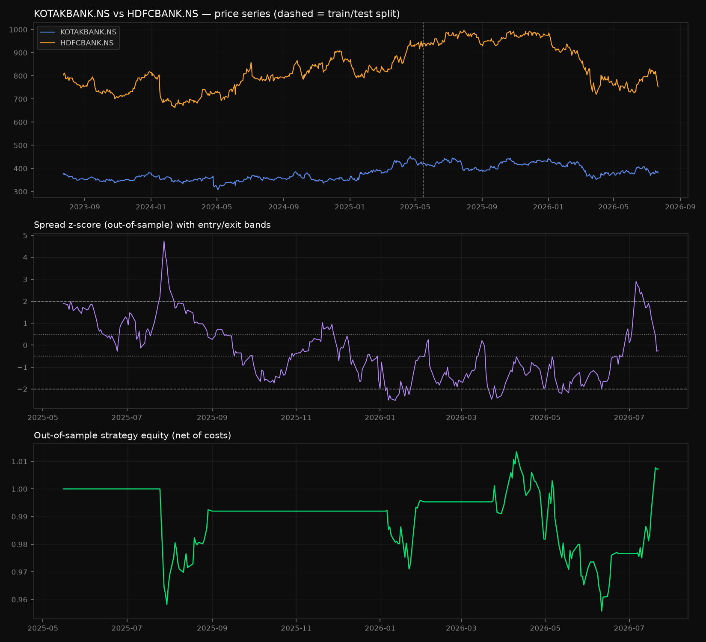

---

### SBIN.NS / BANKBARODA.NS

- **Latest prices:** SBIN.NS ₹1,025.00 · BANKBARODA.NS ₹245.75
- **Hedge ratio (train-fitted):** 0.2085
- **Cointegration (train):** FAIL at 5% — ADF -2.24, p=0.1905
- **Persistence:** passed 5% in 0 of 15 real-data runs (strict tier: 0/15)
- **Spread half-life:** 23.5 days
- **Current z-score:** -1.46
- **Signal today:** watch (approaching band)
- ⚠️ _Pair did not cointegrate on training data. Any signal here is not statistically justified — observation only._

**Out-of-sample backtest** (beta frozen from train window):

| Metric | Value |
|---|---|
| Sharpe | 0.41 |
| Sortino | 0.28 |
| Annualised return | 3.23% |
| Annualised vol | 8.66% |
| Max drawdown | -9.31% |
| Round-trip trades | 5 |

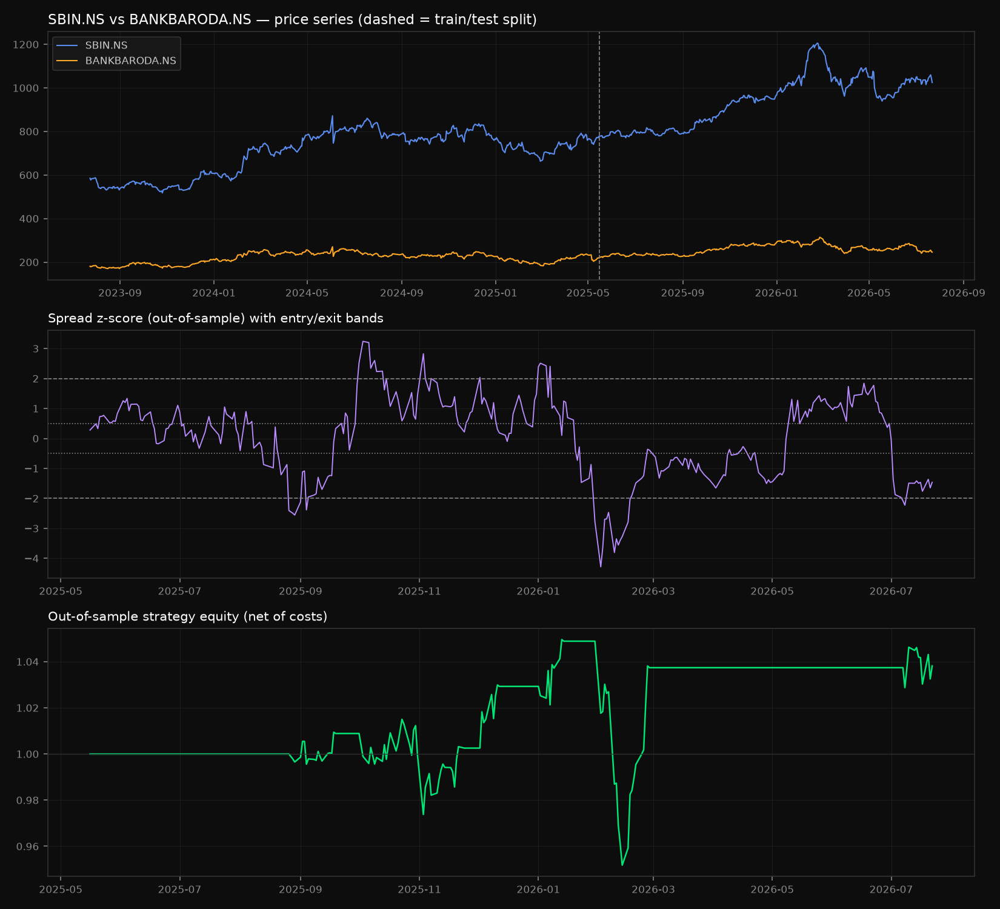

---

### TCS.NS / INFY.NS

- **Latest prices:** TCS.NS ₹2,208.30 · INFY.NS ₹1,052.10
- **Hedge ratio (train-fitted):** 0.5304
- **Cointegration (train):** FAIL at 5% — ADF -1.70, p=0.4293
- **Persistence:** passed 5% in 0 of 15 real-data runs (strict tier: 0/15)
- **Spread half-life:** 42.6 days
- **Current z-score:** -1.55
- **Signal today:** watch (approaching band)
- ⚠️ _Pair did not cointegrate on training data. Any signal here is not statistically justified — observation only._

**Out-of-sample backtest** (beta frozen from train window):

| Metric | Value |
|---|---|
| Sharpe | 0.99 |
| Sortino | 0.89 |
| Annualised return | 4.03% |
| Annualised vol | 4.09% |
| Max drawdown | -4.16% |
| Round-trip trades | 6 |

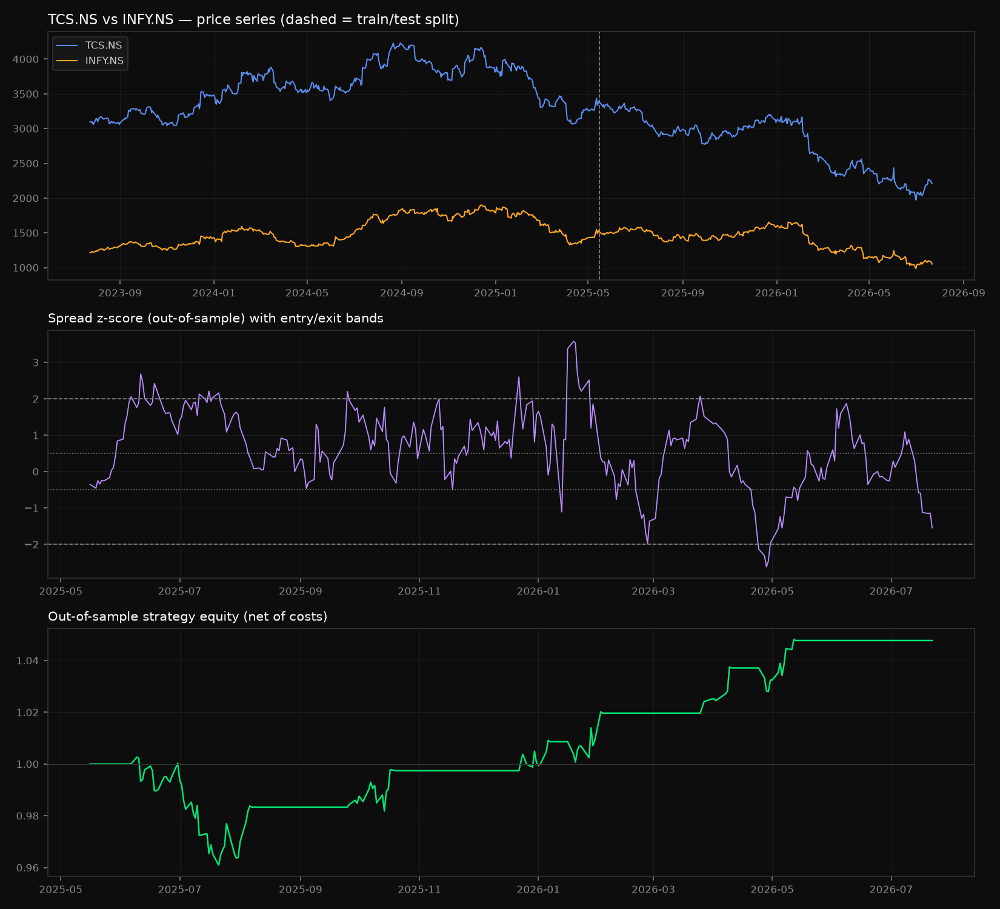

---

### INFY.NS / WIPRO.NS

- **Latest prices:** INFY.NS ₹1,052.10 · WIPRO.NS ₹174.44
- **Hedge ratio (train-fitted):** 0.1395
- **Cointegration (train):** FAIL at 5% — ADF -2.25, p=0.1900
- **Persistence:** passed 5% in 0 of 15 real-data runs (strict tier: 0/15)
- **Spread half-life:** 30.1 days
- **Current z-score:** -0.58
- **Signal today:** watch (approaching band)
- ⚠️ _Pair did not cointegrate on training data. Any signal here is not statistically justified — observation only._

**Out-of-sample backtest** (beta frozen from train window):

| Metric | Value |
|---|---|
| Sharpe | 1.74 |
| Sortino | 2.04 |
| Annualised return | 9.28% |
| Annualised vol | 5.19% |
| Max drawdown | -2.47% |
| Round-trip trades | 6 |

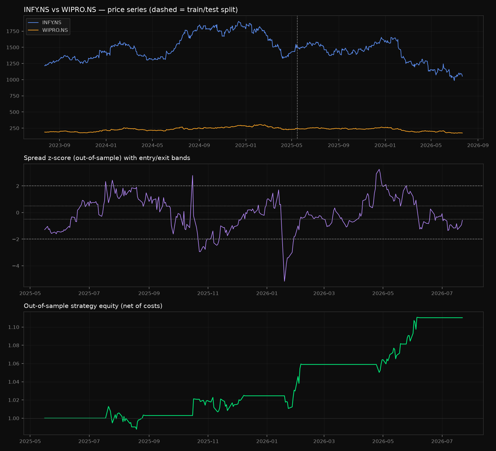

---

### HCLTECH.NS / TECHM.NS

- **Latest prices:** HCLTECH.NS ₹1,237.30 · TECHM.NS ₹1,560.60
- **Hedge ratio (train-fitted):** 0.8106
- **Cointegration (train):** FAIL at 5% — ADF -1.92, p=0.3231
- **Persistence:** passed 5% in 0 of 15 real-data runs (strict tier: 0/15)
- **Spread half-life:** 25.9 days
- **Current z-score:** +1.49
- **Signal today:** watch (approaching band)
- ⚠️ _Pair did not cointegrate on training data. Any signal here is not statistically justified — observation only._

**Out-of-sample backtest** (beta frozen from train window):

| Metric | Value |
|---|---|
| Sharpe | -0.21 |
| Sortino | -0.22 |
| Annualised return | -1.85% |
| Annualised vol | 7.52% |
| Max drawdown | -8.28% |
| Round-trip trades | 4 |

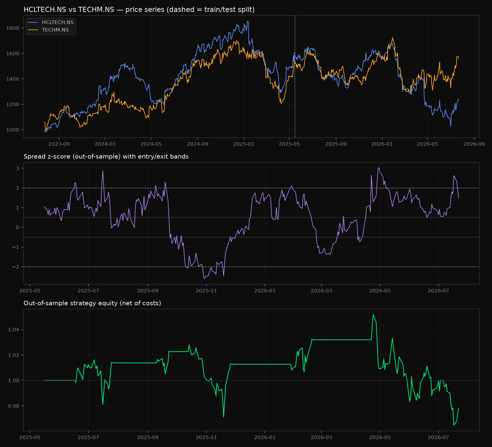

---

### ACC.NS / AMBUJACEM.NS

- **Latest prices:** ACC.NS ₹1,359.00 · AMBUJACEM.NS ₹430.80
- **Hedge ratio (train-fitted):** 0.2391
- **Cointegration (train):** FAIL at 5% — ADF -0.89, p=0.7907
- **Persistence:** passed 5% in 0 of 15 real-data runs (strict tier: 0/15)
- **Spread half-life:** 81.7 days
- **Current z-score:** -0.03
- **Signal today:** flat / no stretch
- ⚠️ _Pair did not cointegrate on training data. Any signal here is not statistically justified — observation only._

**Out-of-sample backtest** (beta frozen from train window):

| Metric | Value |
|---|---|
| Sharpe | 1.06 |
| Sortino | 0.90 |
| Annualised return | 5.86% |
| Annualised vol | 5.52% |
| Max drawdown | -4.40% |
| Round-trip trades | 5 |

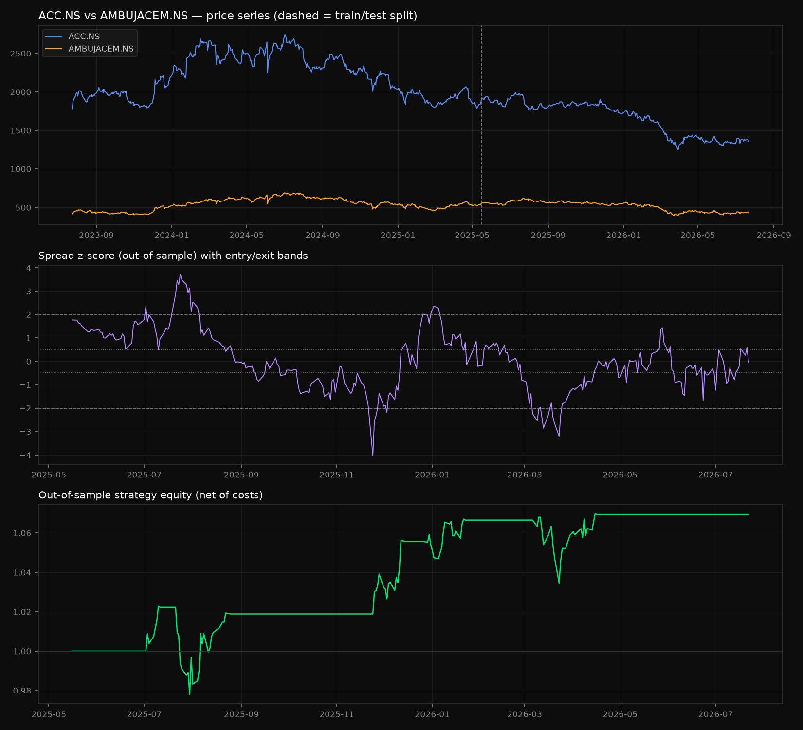

---

### ULTRACEMCO.NS / SHREECEM.NS

- **Latest prices:** ULTRACEMCO.NS ₹11,893.00 · SHREECEM.NS ₹26,720.00
- **Hedge ratio (train-fitted):** 0.6156
- **Cointegration (train):** FAIL at 5% — ADF -2.01, p=0.2837
- **Persistence:** passed 5% in 0 of 15 real-data runs (strict tier: 0/15)
- **Spread half-life:** 35.6 days
- **Current z-score:** +1.48
- **Signal today:** watch (approaching band)
- ⚠️ _Pair did not cointegrate on training data. Any signal here is not statistically justified — observation only._

**Out-of-sample backtest** (beta frozen from train window):

| Metric | Value |
|---|---|
| Sharpe | 0.26 |
| Sortino | 0.28 |
| Annualised return | 1.76% |
| Annualised vol | 7.82% |
| Max drawdown | -8.99% |
| Round-trip trades | 5 |

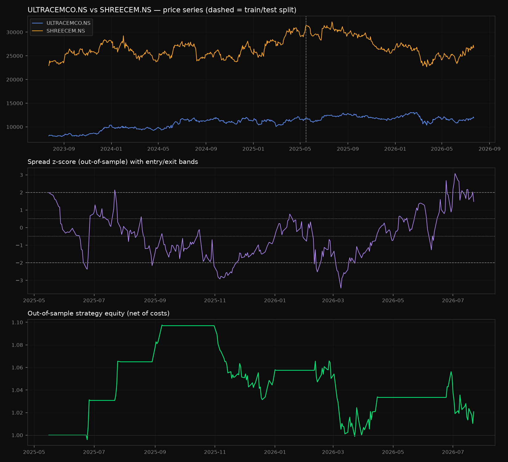

---

### IOC.NS / BPCL.NS

- **Latest prices:** IOC.NS ₹142.03 · BPCL.NS ₹314.00
- **Hedge ratio (train-fitted):** 1.7686
- **Cointegration (train):** FAIL at 5% — ADF -0.90, p=0.7871
- **Persistence:** passed 5% in 0 of 15 real-data runs (strict tier: 0/15)
- **Spread half-life:** 116.5 days
- **Current z-score:** +1.49
- **Signal today:** watch (approaching band)
- ⚠️ _Pair did not cointegrate on training data. Any signal here is not statistically justified — observation only._

**Out-of-sample backtest** (beta frozen from train window):

| Metric | Value |
|---|---|
| Sharpe | 0.66 |
| Sortino | 0.69 |
| Annualised return | 4.07% |
| Annualised vol | 6.31% |
| Max drawdown | -6.65% |
| Round-trip trades | 7 |

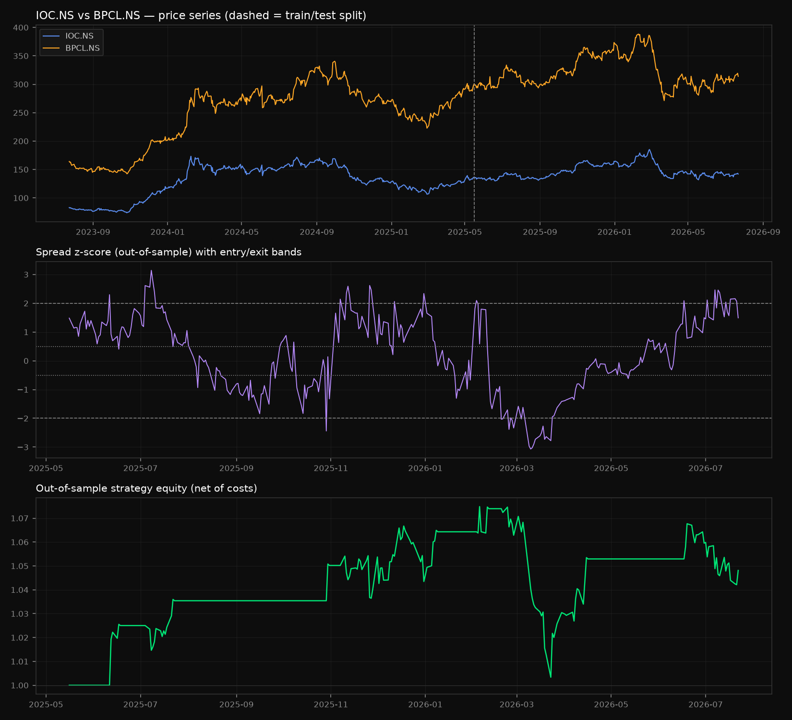

---

### BPCL.NS / HINDPETRO.NS

- **Latest prices:** BPCL.NS ₹314.00 · HINDPETRO.NS ₹395.20
- **Hedge ratio (train-fitted):** 1.4247
- **Cointegration (train):** FAIL at 5% — ADF -1.94, p=0.3152
- **Persistence:** passed 5% in 0 of 15 real-data runs (strict tier: 0/15)
- **Spread half-life:** 40.5 days
- **Current z-score:** -1.66
- **Signal today:** watch (approaching band)
- ⚠️ _Pair did not cointegrate on training data. Any signal here is not statistically justified — observation only._

**Out-of-sample backtest** (beta frozen from train window):

| Metric | Value |
|---|---|
| Sharpe | -0.07 |
| Sortino | -0.06 |
| Annualised return | -0.56% |
| Annualised vol | 5.61% |
| Max drawdown | -6.85% |
| Round-trip trades | 4 |

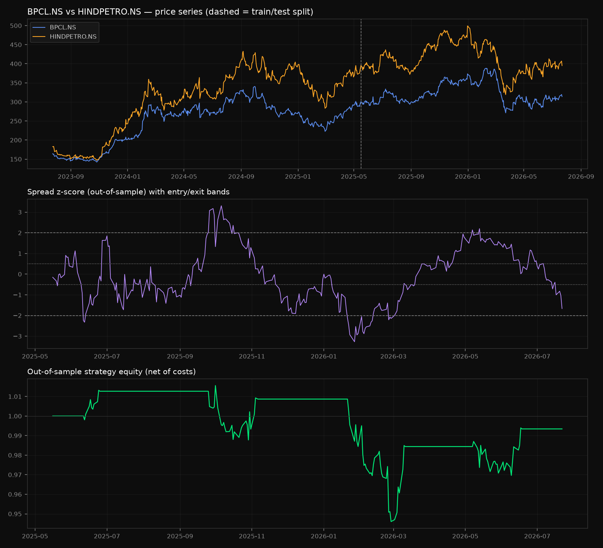

---

### ONGC.NS / COALINDIA.NS

- **Latest prices:** ONGC.NS ₹251.90 · COALINDIA.NS ₹428.40
- **Hedge ratio (train-fitted):** 1.7013
- **Cointegration (train):** PASS at 5% — ADF -3.05, p=0.0303
- **Persistence:** passed 5% in 7 of 15 real-data runs (strict tier: 0/15)
- **Spread half-life:** 15.8 days
- **Current z-score:** -0.15
- **Signal today:** flat / no stretch

**Out-of-sample backtest** (beta frozen from train window):

| Metric | Value |
|---|---|
| Sharpe | 0.84 |
| Sortino | 0.67 |
| Annualised return | 5.93% |
| Annualised vol | 7.16% |
| Max drawdown | -5.48% |
| Round-trip trades | 5 |

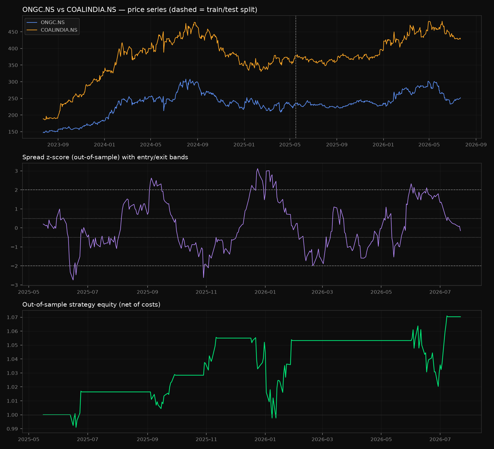

---

### NTPC.NS / POWERGRID.NS

- **Latest prices:** NTPC.NS ₹350.50 · POWERGRID.NS ₹289.30
- **Hedge ratio (train-fitted):** 0.8285
- **Cointegration (train):** FAIL at 5% — ADF -2.66, p=0.0803
- **Persistence:** passed 5% in 0 of 15 real-data runs (strict tier: 0/15)
- **Spread half-life:** 22.0 days
- **Current z-score:** +1.36
- **Signal today:** watch (approaching band)
- ⚠️ _Pair did not cointegrate on training data. Any signal here is not statistically justified — observation only._

**Out-of-sample backtest** (beta frozen from train window):

| Metric | Value |
|---|---|
| Sharpe | 0.42 |
| Sortino | 0.33 |
| Annualised return | 2.17% |
| Annualised vol | 5.43% |
| Max drawdown | -5.16% |
| Round-trip trades | 6 |

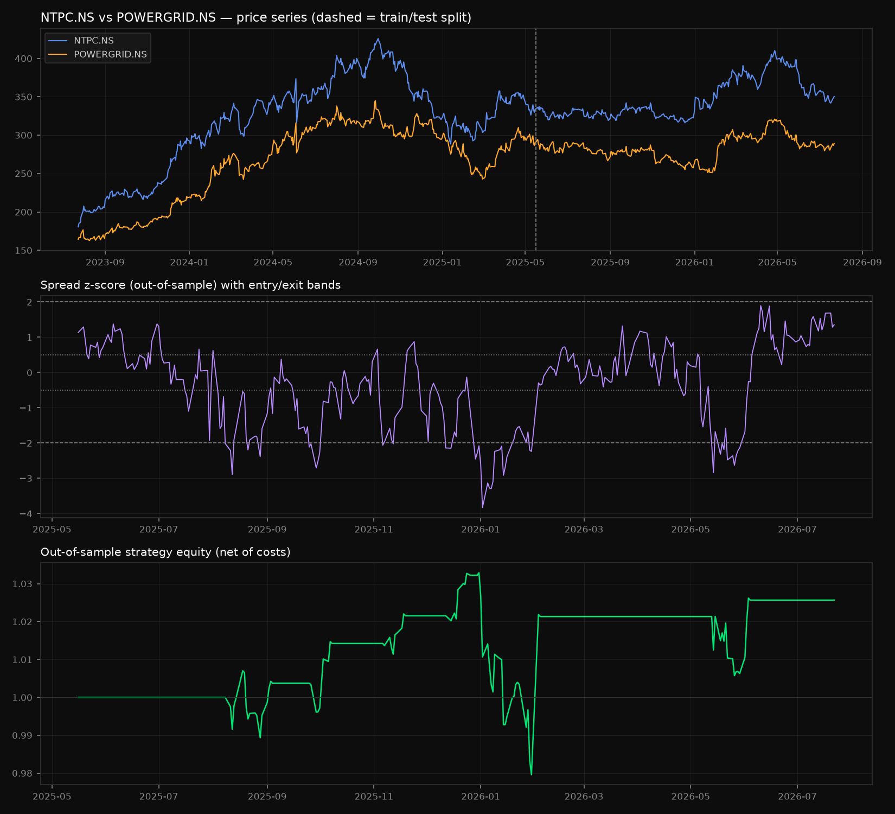

---

### BAJAJ-AUTO.NS / HEROMOTOCO.NS

- **Latest prices:** BAJAJ-AUTO.NS ₹10,998.50 · HEROMOTOCO.NS ₹4,987.10
- **Hedge ratio (train-fitted):** 0.4123
- **Cointegration (train):** FAIL at 5% — ADF -2.29, p=0.1763
- **Persistence:** passed 5% in 0 of 15 real-data runs (strict tier: 0/15)
- **Spread half-life:** 29.7 days
- **Current z-score:** -2.33
- **Signal today:** LONG spread (long HEROMOTOCO.NS, short BAJAJ-AUTO.NS)
- ⚠️ _Pair did not cointegrate on training data. Any signal here is not statistically justified — observation only._

**Out-of-sample backtest** (beta frozen from train window):

| Metric | Value |
|---|---|
| Sharpe | -1.22 |
| Sortino | -1.25 |
| Annualised return | -12.22% |
| Annualised vol | 10.25% |
| Max drawdown | -20.91% |
| Round-trip trades | 4 |

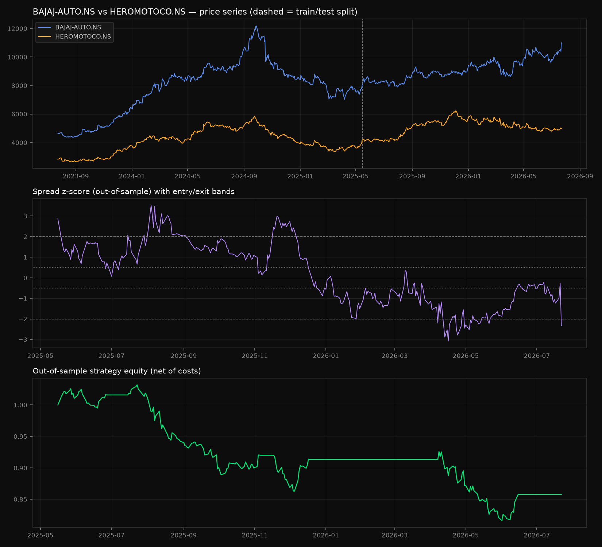

---

### TATASTEEL.NS / JSWSTEEL.NS

- **Latest prices:** TATASTEEL.NS ₹186.53 · JSWSTEEL.NS ₹1,266.90
- **Hedge ratio (train-fitted):** 2.9970
- **Cointegration (train):** FAIL at 5% — ADF -0.20, p=0.9387
- **Persistence:** passed 5% in 0 of 15 real-data runs (strict tier: 0/15)
- **Spread half-life:** 84.5 days
- **Current z-score:** +2.12
- **Signal today:** SHORT spread (short JSWSTEEL.NS, long TATASTEEL.NS)
- ⚠️ _Pair did not cointegrate on training data. Any signal here is not statistically justified — observation only._

**Out-of-sample backtest** (beta frozen from train window):

| Metric | Value |
|---|---|
| Sharpe | 0.24 |
| Sortino | 0.19 |
| Annualised return | 1.46% |
| Annualised vol | 7.25% |
| Max drawdown | -4.29% |
| Round-trip trades | 4 |

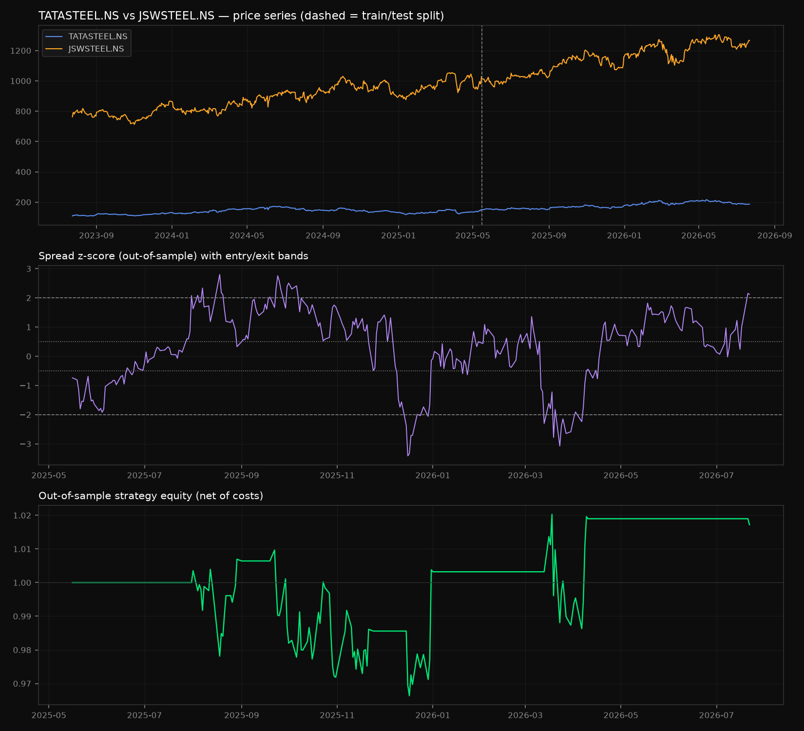

---

### SUNPHARMA.NS / CIPLA.NS

- **Latest prices:** SUNPHARMA.NS ₹1,943.00 · CIPLA.NS ₹1,415.10
- **Hedge ratio (train-fitted):** 0.4978
- **Cointegration (train):** PASS at 5% — ADF -3.94, p=0.0017 · **passes strict Bonferroni tier**
- **Persistence:** passed 5% in 15 of 15 real-data runs (strict tier: 3/15)
- **Spread half-life:** 9.5 days
- **Current z-score:** -0.64
- **Signal today:** watch (approaching band)

**Out-of-sample backtest** (beta frozen from train window):

| Metric | Value |
|---|---|
| Sharpe | -0.11 |
| Sortino | -0.12 |
| Annualised return | -1.14% |
| Annualised vol | 7.58% |
| Max drawdown | -10.18% |
| Round-trip trades | 5 |

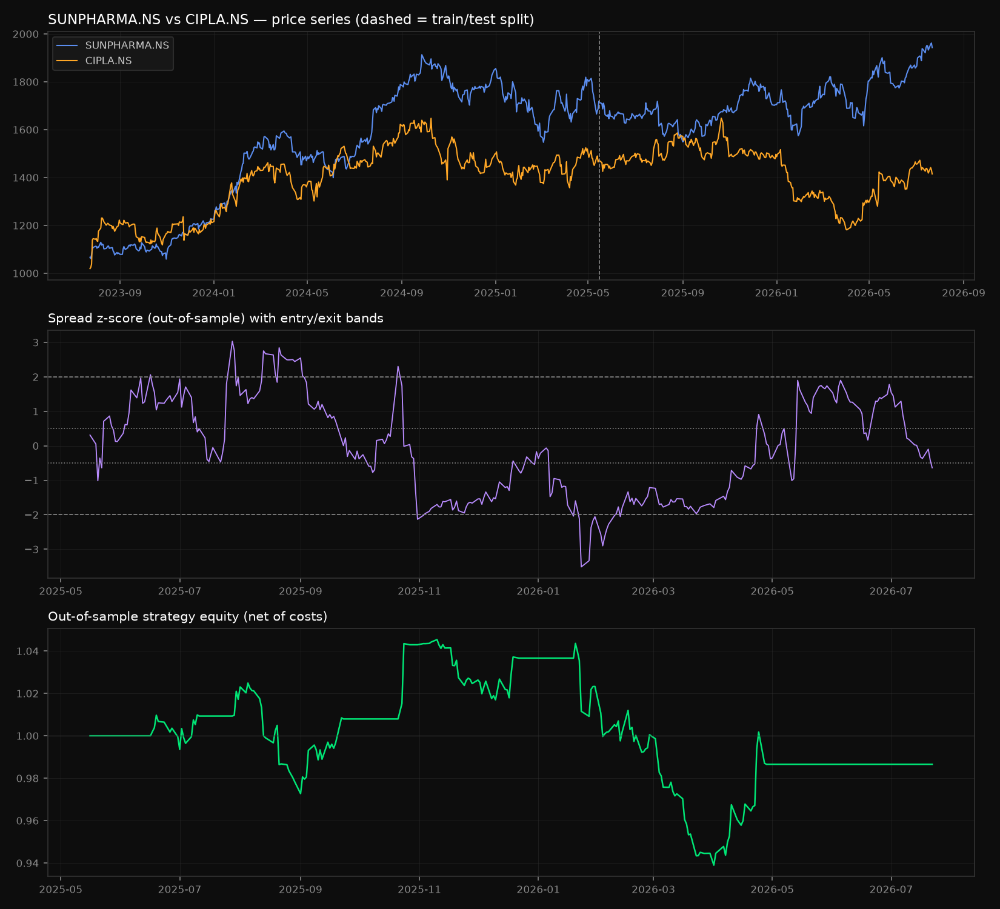

---

_Generated 2026-07-22 · pairs mean-reversion scanner · out-of-sample backtest · multiple-testing-aware · not investment advice._
