# Indian Pairs-Trading Scanner — 2026-07-23

> **What this is:** a market-neutral *pairs mean-reversion* scanner. It flags when two related NSE stocks have drifted apart far enough that their historical relationship signals a possible convergence trade. It does **not** forecast growth, rank "best" stocks, or predict company performance. A signal means the *spread between two stocks* is stretched — nothing about either stock being a good investment. Not investment advice; do your own research.

## Methodology (fixed in advance)

- **Universe:** 16 declared sector-mate pairs. Parameters (3y window, 60/40 train-test, z-entry 2.0, z-exit 0.5, 5 bps costs) are pre-registered; changes are logged in the README changelog *before* looking at results.
- **Multiple testing:** at the 5% level across 16 pairs, **≈0.8 false positives per run are expected by chance alone** even if nothing truly cointegrates. A single-day pass is a candidate, not a discovery.
- **Strict tier:** Bonferroni-corrected threshold p < 0.0031 (marked ✓✓).
- **Evidence = persistence:** the Persistence column counts how often each pair has passed the 5% test across all *real-data* daily runs recorded in `reports/history.csv`. Pairs deserve attention only when they pass persistently.

## Summary

| Pair | p-value | Coint. | Persistence | Current z | Signal | OOS Sharpe |
|---|---|---|---|---|---|---|
| HDFCBANK.NS/ICICIBANK.NS | 0.1075 | ✗ | 0/13 | +3.11 | SHORT spread | -0.43 |
| AXISBANK.NS/ICICIBANK.NS | 0.9274 | ✗ | 0/16 | +2.84 | SHORT spread | -0.40 |
| KOTAKBANK.NS/HDFCBANK.NS | 0.1711 | ✗ | 0/16 | -0.56 | watch | 0.13 |
| SBIN.NS/BANKBARODA.NS | 0.1905 | ✗ | 0/16 | -1.45 | watch | 0.41 |
| TCS.NS/INFY.NS | 0.4293 | ✗ | 0/16 | -2.11 | LONG spread | 0.99 |
| INFY.NS/WIPRO.NS | 0.1900 | ✗ | 0/16 | -0.42 | flat / no stretch | 1.73 |
| HCLTECH.NS/TECHM.NS | 0.3231 | ✗ | 0/16 | +1.17 | watch | -0.17 |
| ACC.NS/AMBUJACEM.NS | 0.7907 | ✗ | 0/16 | -0.29 | flat / no stretch | 1.06 |
| ULTRACEMCO.NS/SHREECEM.NS | 0.2837 | ✗ | 0/16 | +1.54 | watch | 0.23 |
| IOC.NS/BPCL.NS | 0.7871 | ✗ | 0/16 | +1.37 | watch | 0.67 |
| BPCL.NS/HINDPETRO.NS | 0.3152 | ✗ | 0/16 | -2.25 | LONG spread | -0.07 |
| ONGC.NS/COALINDIA.NS | 0.0303 | ✓ | 8/16 | -0.24 | flat / no stretch | 0.84 |
| NTPC.NS/POWERGRID.NS | 0.0803 | ✗ | 0/16 | +1.53 | watch | 0.42 |
| BAJAJ-AUTO.NS/HEROMOTOCO.NS | 0.1763 | ✗ | 0/16 | -1.77 | watch | -1.14 |
| TATASTEEL.NS/JSWSTEEL.NS | 0.9387 | ✗ | 0/16 | +1.43 | watch | 0.34 |
| SUNPHARMA.NS/CIPLA.NS | 0.0017 | ✓✓ | 16/16 | -1.38 | watch | -0.11 |

_Legend: ✓✓ passes strict Bonferroni tier · ✓ passes 5% only · ✗ fails. Persistence = 5%-passes / real-data runs recorded. \*no real-data history yet._

---

### HDFCBANK.NS / ICICIBANK.NS

- **Latest prices:** HDFCBANK.NS ₹747.25 · ICICIBANK.NS ₹1,434.60
- **Hedge ratio (train-fitted):** 1.7493
- **Cointegration (train):** FAIL at 5% — ADF -2.53, p=0.1075
- **Persistence:** passed 5% in 0 of 13 real-data runs (strict tier: 0/13)
- **Spread half-life:** 30.8 days
- **Current z-score:** +3.11
- **Signal today:** SHORT spread (short ICICIBANK.NS, long HDFCBANK.NS)
- ⚠️ _Pair did not cointegrate on training data. Any signal here is not statistically justified — observation only._

**Out-of-sample backtest** (beta frozen from train window):

| Metric | Value |
|---|---|
| Sharpe | -0.43 |
| Sortino | -0.43 |
| Annualised return | -2.72% |
| Annualised vol | 6.06% |
| Max drawdown | -8.61% |
| Round-trip trades | 5 |

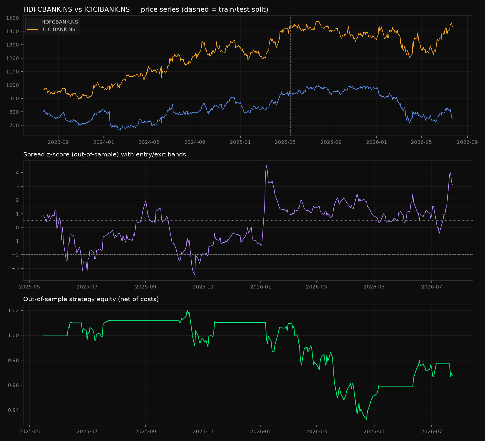

---

### AXISBANK.NS / ICICIBANK.NS

- **Latest prices:** AXISBANK.NS ₹1,223.00 · ICICIBANK.NS ₹1,434.60
- **Hedge ratio (train-fitted):** 0.9000
- **Cointegration (train):** FAIL at 5% — ADF -0.29, p=0.9274
- **Persistence:** passed 5% in 0 of 16 real-data runs (strict tier: 0/16)
- **Spread half-life:** 279.8 days
- **Current z-score:** +2.84
- **Signal today:** SHORT spread (short ICICIBANK.NS, long AXISBANK.NS)
- ⚠️ _Pair did not cointegrate on training data. Any signal here is not statistically justified — observation only._

**Out-of-sample backtest** (beta frozen from train window):

| Metric | Value |
|---|---|
| Sharpe | -0.40 |
| Sortino | -0.38 |
| Annualised return | -3.65% |
| Annualised vol | 8.46% |
| Max drawdown | -7.87% |
| Round-trip trades | 6 |

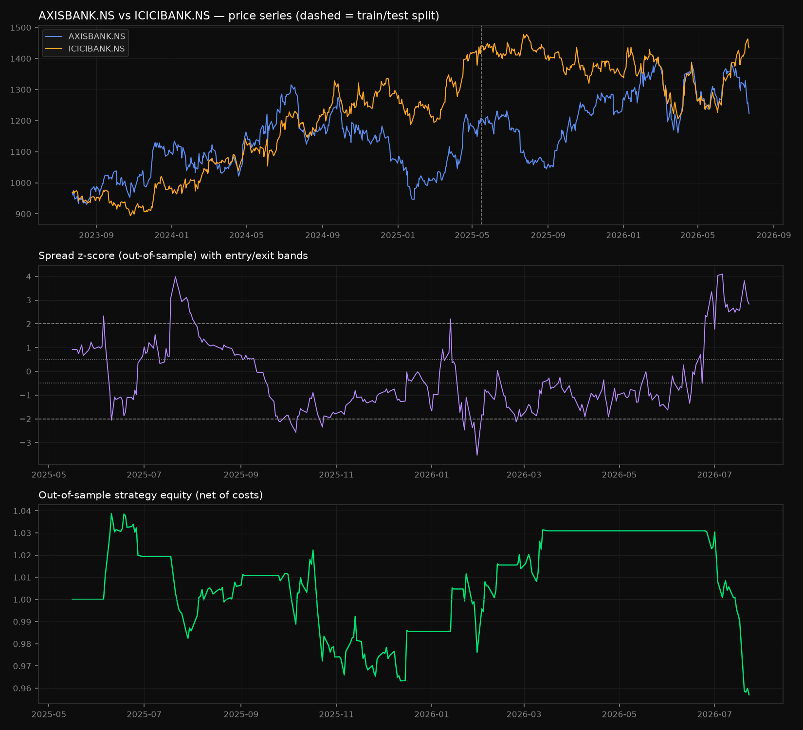

---

### KOTAKBANK.NS / HDFCBANK.NS

- **Latest prices:** KOTAKBANK.NS ₹383.35 · HDFCBANK.NS ₹747.25
- **Hedge ratio (train-fitted):** 1.8456
- **Cointegration (train):** FAIL at 5% — ADF -2.30, p=0.1711
- **Persistence:** passed 5% in 0 of 16 real-data runs (strict tier: 0/16)
- **Spread half-life:** 28.2 days
- **Current z-score:** -0.56
- **Signal today:** watch (approaching band)
- ⚠️ _Pair did not cointegrate on training data. Any signal here is not statistically justified — observation only._

**Out-of-sample backtest** (beta frozen from train window):

| Metric | Value |
|---|---|
| Sharpe | 0.13 |
| Sortino | 0.10 |
| Annualised return | 0.61% |
| Annualised vol | 6.27% |
| Max drawdown | -5.68% |
| Round-trip trades | 4 |

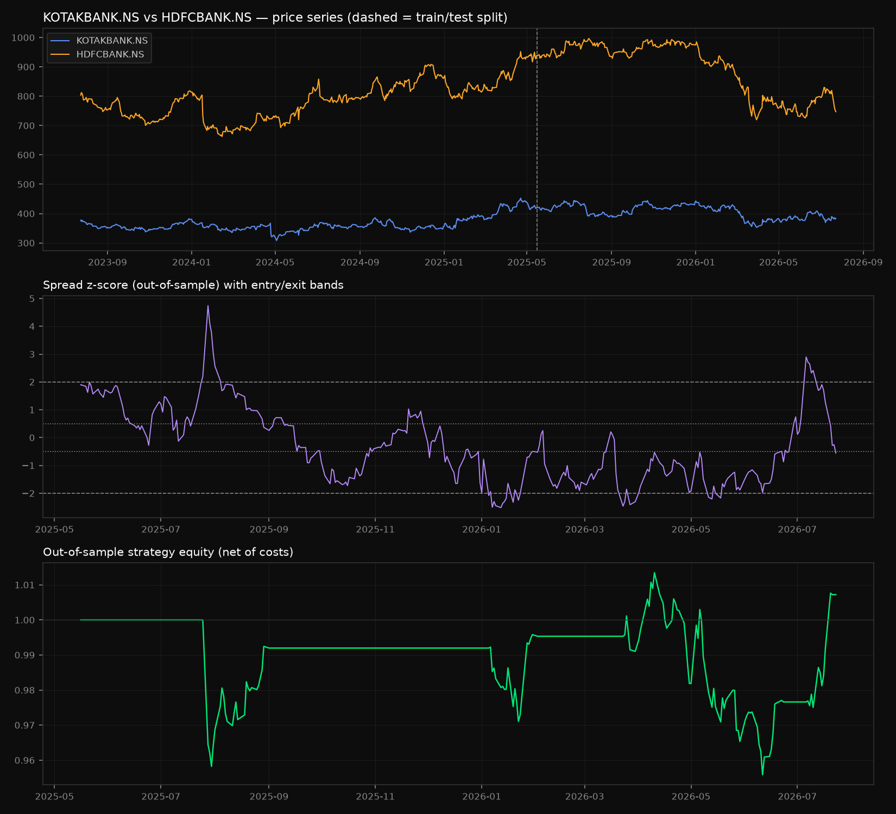

---

### SBIN.NS / BANKBARODA.NS

- **Latest prices:** SBIN.NS ₹1,012.60 · BANKBARODA.NS ₹243.15
- **Hedge ratio (train-fitted):** 0.2085
- **Cointegration (train):** FAIL at 5% — ADF -2.24, p=0.1905
- **Persistence:** passed 5% in 0 of 16 real-data runs (strict tier: 0/16)
- **Spread half-life:** 23.5 days
- **Current z-score:** -1.45
- **Signal today:** watch (approaching band)
- ⚠️ _Pair did not cointegrate on training data. Any signal here is not statistically justified — observation only._

**Out-of-sample backtest** (beta frozen from train window):

| Metric | Value |
|---|---|
| Sharpe | 0.41 |
| Sortino | 0.28 |
| Annualised return | 3.21% |
| Annualised vol | 8.65% |
| Max drawdown | -9.31% |
| Round-trip trades | 5 |

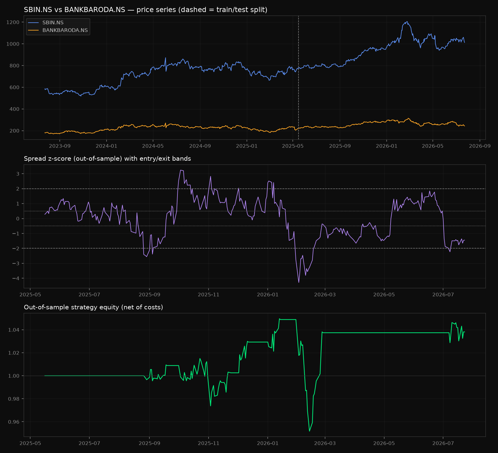

---

### TCS.NS / INFY.NS

- **Latest prices:** TCS.NS ₹2,242.90 · INFY.NS ₹1,047.40
- **Hedge ratio (train-fitted):** 0.5304
- **Cointegration (train):** FAIL at 5% — ADF -1.70, p=0.4293
- **Persistence:** passed 5% in 0 of 16 real-data runs (strict tier: 0/16)
- **Spread half-life:** 42.6 days
- **Current z-score:** -2.11
- **Signal today:** LONG spread (long INFY.NS, short TCS.NS)
- ⚠️ _Pair did not cointegrate on training data. Any signal here is not statistically justified — observation only._

**Out-of-sample backtest** (beta frozen from train window):

| Metric | Value |
|---|---|
| Sharpe | 0.99 |
| Sortino | 0.89 |
| Annualised return | 4.02% |
| Annualised vol | 4.08% |
| Max drawdown | -4.16% |
| Round-trip trades | 6 |

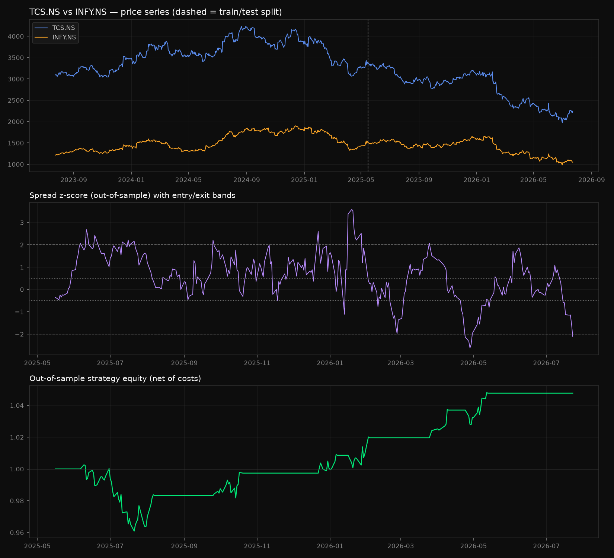

---

### INFY.NS / WIPRO.NS

- **Latest prices:** INFY.NS ₹1,047.40 · WIPRO.NS ₹174.82
- **Hedge ratio (train-fitted):** 0.1395
- **Cointegration (train):** FAIL at 5% — ADF -2.25, p=0.1900
- **Persistence:** passed 5% in 0 of 16 real-data runs (strict tier: 0/16)
- **Spread half-life:** 30.1 days
- **Current z-score:** -0.42
- **Signal today:** flat / no stretch
- ⚠️ _Pair did not cointegrate on training data. Any signal here is not statistically justified — observation only._

**Out-of-sample backtest** (beta frozen from train window):

| Metric | Value |
|---|---|
| Sharpe | 1.73 |
| Sortino | 2.03 |
| Annualised return | 9.24% |
| Annualised vol | 5.18% |
| Max drawdown | -2.47% |
| Round-trip trades | 6 |

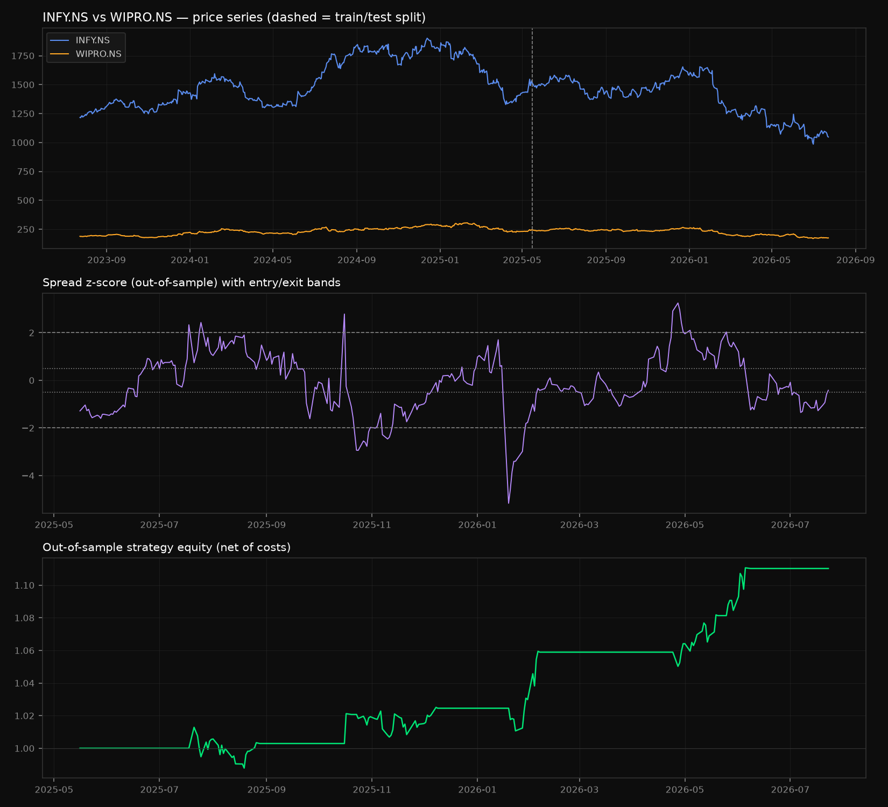

---

### HCLTECH.NS / TECHM.NS

- **Latest prices:** HCLTECH.NS ₹1,244.70 · TECHM.NS ₹1,555.80
- **Hedge ratio (train-fitted):** 0.8106
- **Cointegration (train):** FAIL at 5% — ADF -1.92, p=0.3231
- **Persistence:** passed 5% in 0 of 16 real-data runs (strict tier: 0/16)
- **Spread half-life:** 25.9 days
- **Current z-score:** +1.17
- **Signal today:** watch (approaching band)
- ⚠️ _Pair did not cointegrate on training data. Any signal here is not statistically justified — observation only._

**Out-of-sample backtest** (beta frozen from train window):

| Metric | Value |
|---|---|
| Sharpe | -0.17 |
| Sortino | -0.17 |
| Annualised return | -1.53% |
| Annualised vol | 7.51% |
| Max drawdown | -8.28% |
| Round-trip trades | 4 |

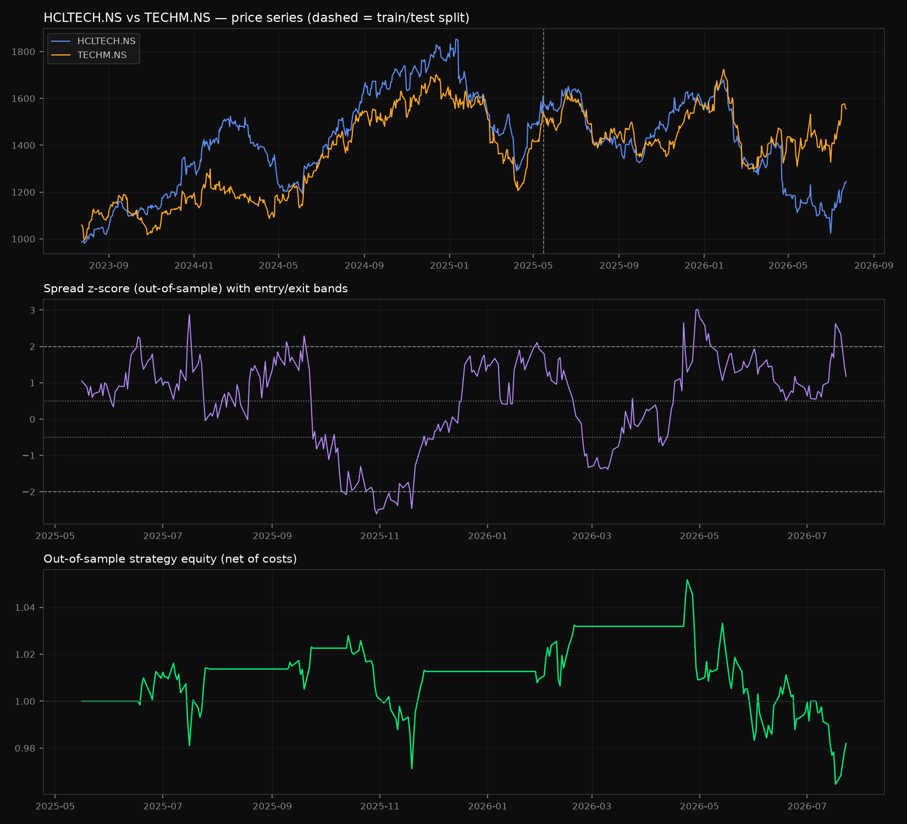

---

### ACC.NS / AMBUJACEM.NS

- **Latest prices:** ACC.NS ₹1,333.90 · AMBUJACEM.NS ₹423.55
- **Hedge ratio (train-fitted):** 0.2391
- **Cointegration (train):** FAIL at 5% — ADF -0.89, p=0.7907
- **Persistence:** passed 5% in 0 of 16 real-data runs (strict tier: 0/16)
- **Spread half-life:** 81.7 days
- **Current z-score:** -0.29
- **Signal today:** flat / no stretch
- ⚠️ _Pair did not cointegrate on training data. Any signal here is not statistically justified — observation only._

**Out-of-sample backtest** (beta frozen from train window):

| Metric | Value |
|---|---|
| Sharpe | 1.06 |
| Sortino | 0.90 |
| Annualised return | 5.84% |
| Annualised vol | 5.51% |
| Max drawdown | -4.40% |
| Round-trip trades | 5 |

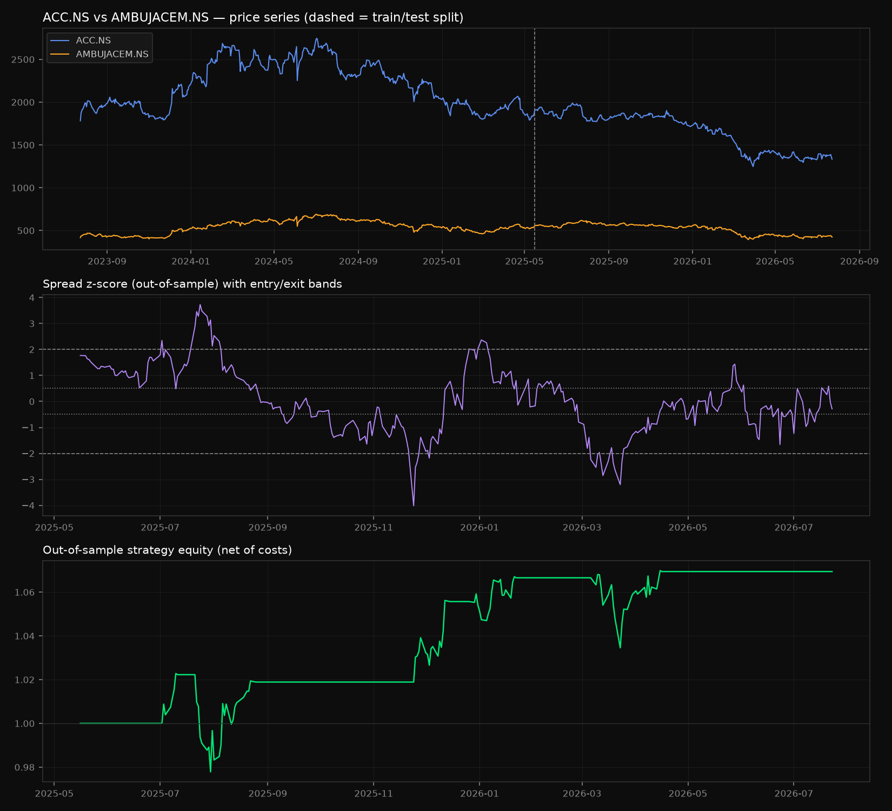

---

### ULTRACEMCO.NS / SHREECEM.NS

- **Latest prices:** ULTRACEMCO.NS ₹11,908.00 · SHREECEM.NS ₹26,825.00
- **Hedge ratio (train-fitted):** 0.6156
- **Cointegration (train):** FAIL at 5% — ADF -2.01, p=0.2837
- **Persistence:** passed 5% in 0 of 16 real-data runs (strict tier: 0/16)
- **Spread half-life:** 35.6 days
- **Current z-score:** +1.54
- **Signal today:** watch (approaching band)
- ⚠️ _Pair did not cointegrate on training data. Any signal here is not statistically justified — observation only._

**Out-of-sample backtest** (beta frozen from train window):

| Metric | Value |
|---|---|
| Sharpe | 0.23 |
| Sortino | 0.25 |
| Annualised return | 1.54% |
| Annualised vol | 7.81% |
| Max drawdown | -8.99% |
| Round-trip trades | 5 |

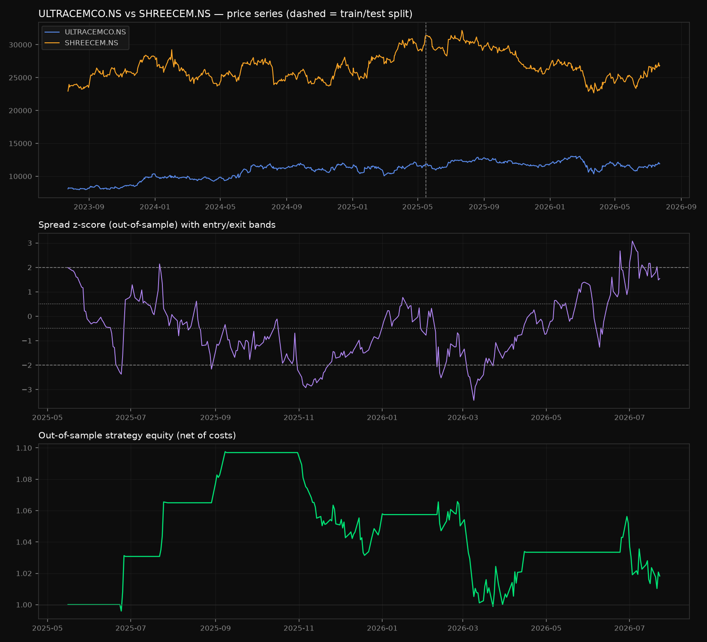

---

### IOC.NS / BPCL.NS

- **Latest prices:** IOC.NS ₹139.92 · BPCL.NS ₹309.85
- **Hedge ratio (train-fitted):** 1.7686
- **Cointegration (train):** FAIL at 5% — ADF -0.90, p=0.7871
- **Persistence:** passed 5% in 0 of 16 real-data runs (strict tier: 0/16)
- **Spread half-life:** 116.5 days
- **Current z-score:** +1.37
- **Signal today:** watch (approaching band)
- ⚠️ _Pair did not cointegrate on training data. Any signal here is not statistically justified — observation only._

**Out-of-sample backtest** (beta frozen from train window):

| Metric | Value |
|---|---|
| Sharpe | 0.67 |
| Sortino | 0.70 |
| Annualised return | 4.12% |
| Annualised vol | 6.30% |
| Max drawdown | -6.65% |
| Round-trip trades | 7 |

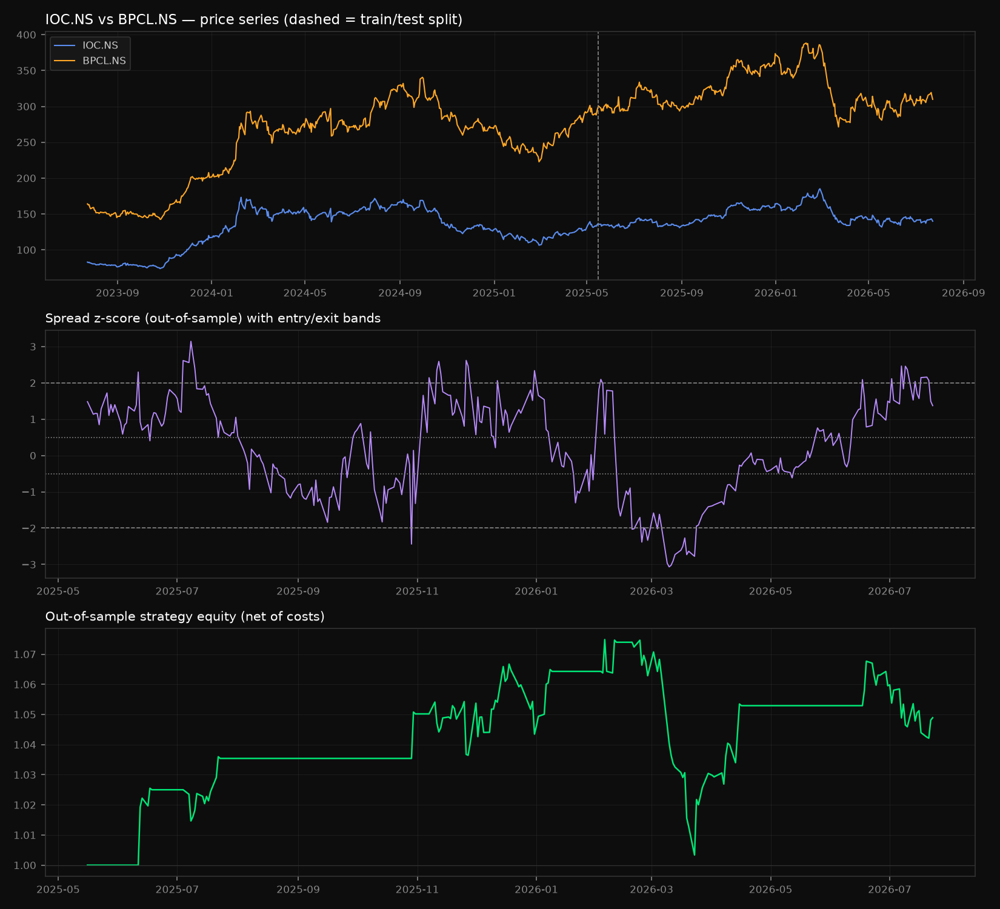

---

### BPCL.NS / HINDPETRO.NS

- **Latest prices:** BPCL.NS ₹309.85 · HINDPETRO.NS ₹385.15
- **Hedge ratio (train-fitted):** 1.4247
- **Cointegration (train):** FAIL at 5% — ADF -1.94, p=0.3152
- **Persistence:** passed 5% in 0 of 16 real-data runs (strict tier: 0/16)
- **Spread half-life:** 40.5 days
- **Current z-score:** -2.25
- **Signal today:** LONG spread (long HINDPETRO.NS, short BPCL.NS)
- ⚠️ _Pair did not cointegrate on training data. Any signal here is not statistically justified — observation only._

**Out-of-sample backtest** (beta frozen from train window):

| Metric | Value |
|---|---|
| Sharpe | -0.07 |
| Sortino | -0.06 |
| Annualised return | -0.56% |
| Annualised vol | 5.61% |
| Max drawdown | -6.85% |
| Round-trip trades | 4 |

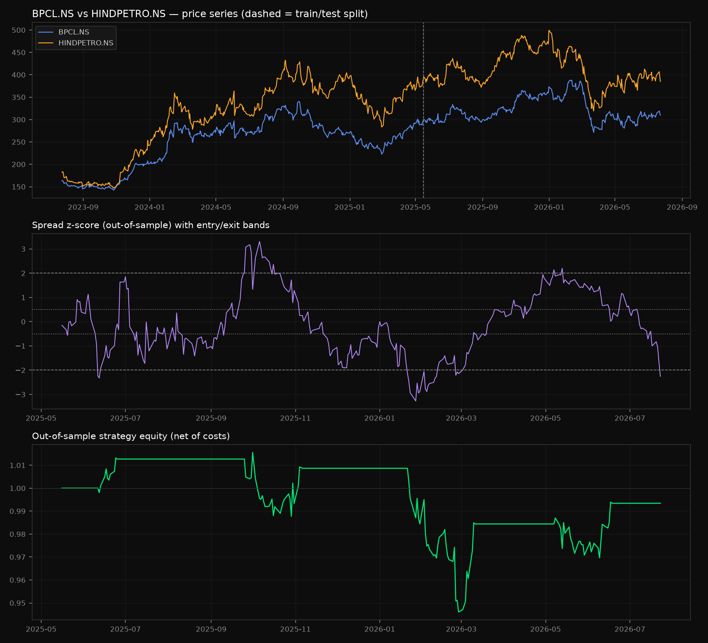

---

### ONGC.NS / COALINDIA.NS

- **Latest prices:** ONGC.NS ₹252.37 · COALINDIA.NS ₹427.05
- **Hedge ratio (train-fitted):** 1.7013
- **Cointegration (train):** PASS at 5% — ADF -3.05, p=0.0303
- **Persistence:** passed 5% in 8 of 16 real-data runs (strict tier: 0/16)
- **Spread half-life:** 15.8 days
- **Current z-score:** -0.24
- **Signal today:** flat / no stretch

**Out-of-sample backtest** (beta frozen from train window):

| Metric | Value |
|---|---|
| Sharpe | 0.84 |
| Sortino | 0.67 |
| Annualised return | 5.91% |
| Annualised vol | 7.15% |
| Max drawdown | -5.48% |
| Round-trip trades | 5 |

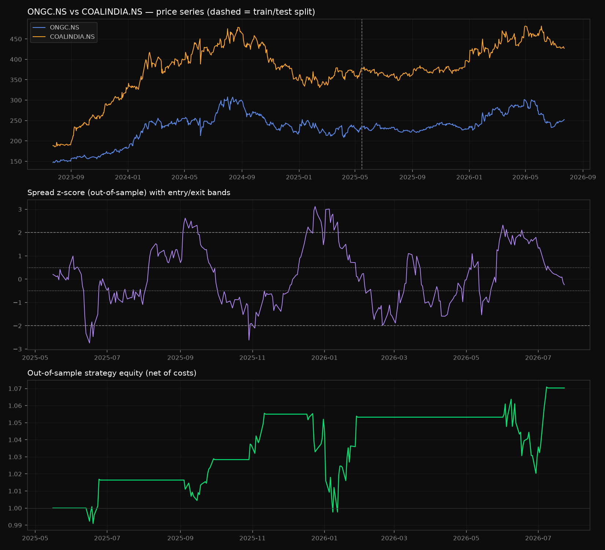

---

### NTPC.NS / POWERGRID.NS

- **Latest prices:** NTPC.NS ₹348.60 · POWERGRID.NS ₹289.80
- **Hedge ratio (train-fitted):** 0.8285
- **Cointegration (train):** FAIL at 5% — ADF -2.66, p=0.0803
- **Persistence:** passed 5% in 0 of 16 real-data runs (strict tier: 0/16)
- **Spread half-life:** 22.0 days
- **Current z-score:** +1.53
- **Signal today:** watch (approaching band)
- ⚠️ _Pair did not cointegrate on training data. Any signal here is not statistically justified — observation only._

**Out-of-sample backtest** (beta frozen from train window):

| Metric | Value |
|---|---|
| Sharpe | 0.42 |
| Sortino | 0.33 |
| Annualised return | 2.17% |
| Annualised vol | 5.42% |
| Max drawdown | -5.16% |
| Round-trip trades | 6 |

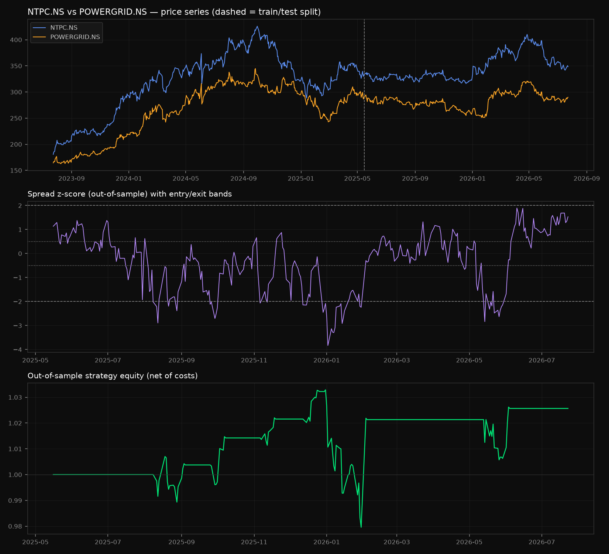

---

### BAJAJ-AUTO.NS / HEROMOTOCO.NS

- **Latest prices:** BAJAJ-AUTO.NS ₹11,283.50 · HEROMOTOCO.NS ₹5,173.80
- **Hedge ratio (train-fitted):** 0.4123
- **Cointegration (train):** FAIL at 5% — ADF -2.29, p=0.1763
- **Persistence:** passed 5% in 0 of 16 real-data runs (strict tier: 0/16)
- **Spread half-life:** 29.7 days
- **Current z-score:** -1.77
- **Signal today:** watch (approaching band)
- ⚠️ _Pair did not cointegrate on training data. Any signal here is not statistically justified — observation only._

**Out-of-sample backtest** (beta frozen from train window):

| Metric | Value |
|---|---|
| Sharpe | -1.14 |
| Sortino | -1.17 |
| Annualised return | -11.55% |
| Annualised vol | 10.26% |
| Max drawdown | -20.91% |
| Round-trip trades | 4 |

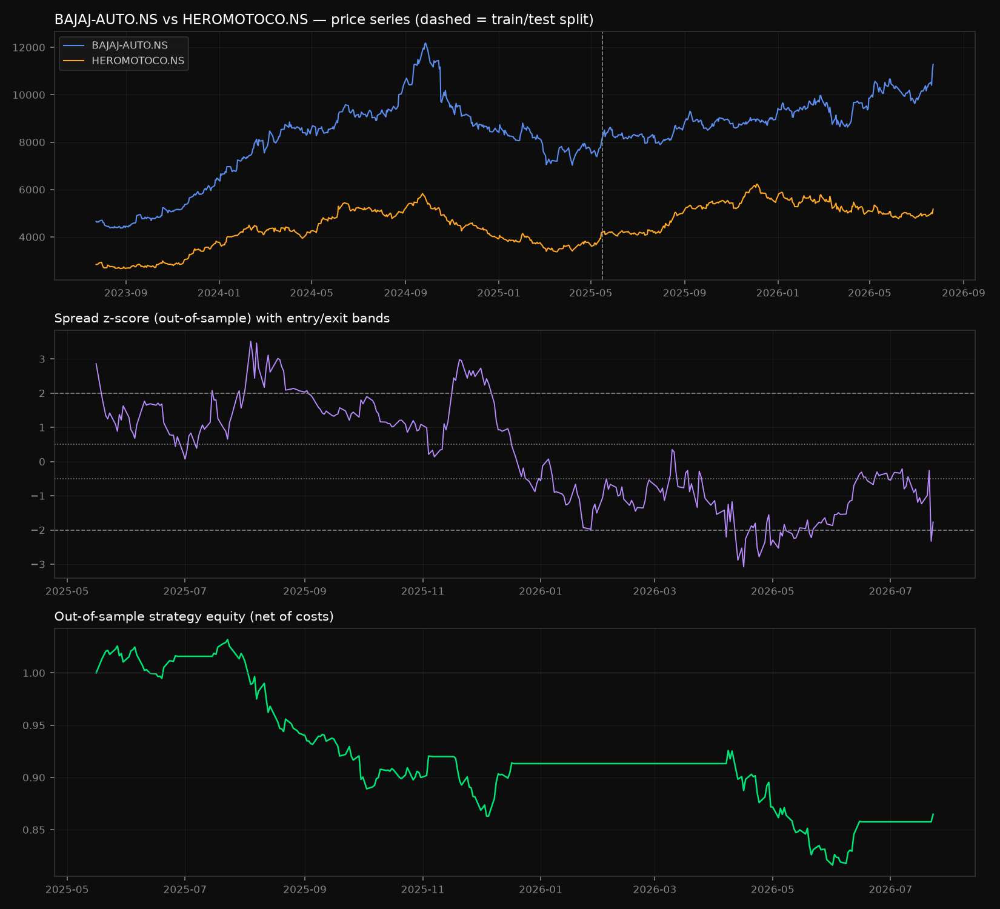

---

### TATASTEEL.NS / JSWSTEEL.NS

- **Latest prices:** TATASTEEL.NS ₹184.23 · JSWSTEEL.NS ₹1,246.80
- **Hedge ratio (train-fitted):** 2.9970
- **Cointegration (train):** FAIL at 5% — ADF -0.20, p=0.9387
- **Persistence:** passed 5% in 0 of 16 real-data runs (strict tier: 0/16)
- **Spread half-life:** 84.5 days
- **Current z-score:** +1.43
- **Signal today:** watch (approaching band)
- ⚠️ _Pair did not cointegrate on training data. Any signal here is not statistically justified — observation only._

**Out-of-sample backtest** (beta frozen from train window):

| Metric | Value |
|---|---|
| Sharpe | 0.34 |
| Sortino | 0.28 |
| Annualised return | 2.23% |
| Annualised vol | 7.28% |
| Max drawdown | -4.29% |
| Round-trip trades | 4 |

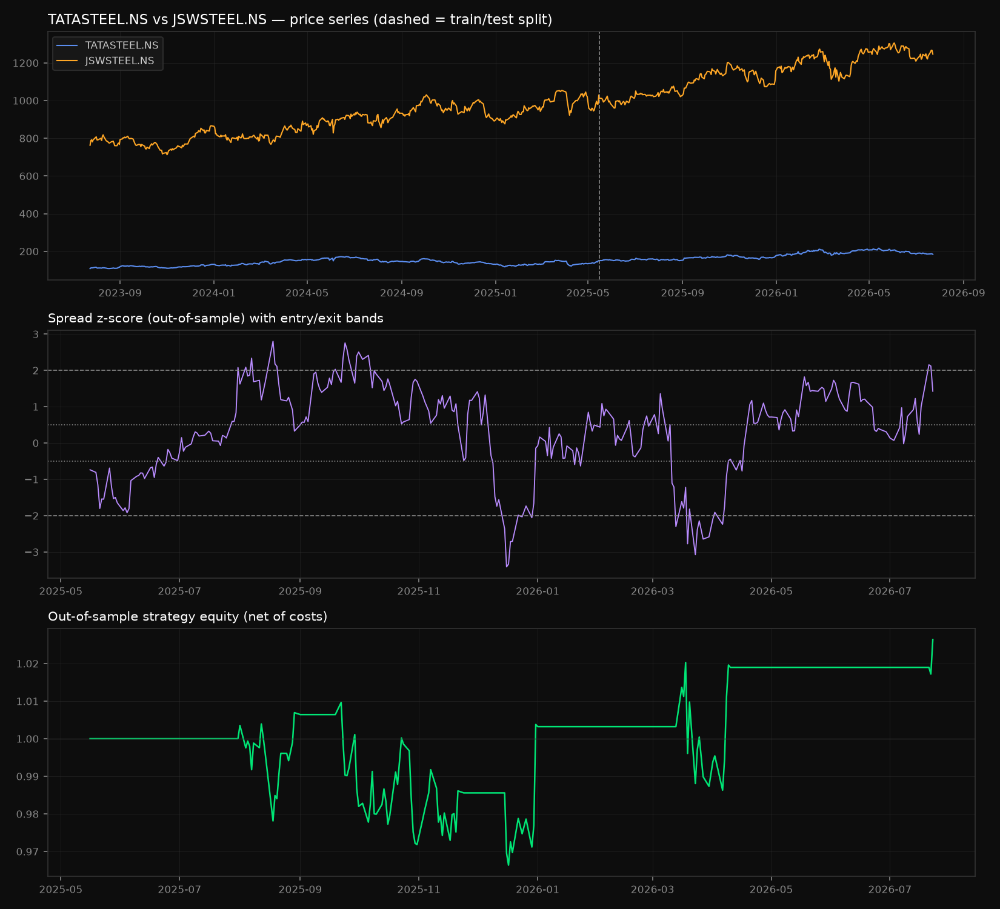

---

### SUNPHARMA.NS / CIPLA.NS

- **Latest prices:** SUNPHARMA.NS ₹1,954.00 · CIPLA.NS ₹1,393.00
- **Hedge ratio (train-fitted):** 0.4978
- **Cointegration (train):** PASS at 5% — ADF -3.94, p=0.0017 · **passes strict Bonferroni tier**
- **Persistence:** passed 5% in 16 of 16 real-data runs (strict tier: 4/16)
- **Spread half-life:** 9.5 days
- **Current z-score:** -1.38
- **Signal today:** watch (approaching band)

**Out-of-sample backtest** (beta frozen from train window):

| Metric | Value |
|---|---|
| Sharpe | -0.11 |
| Sortino | -0.12 |
| Annualised return | -1.14% |
| Annualised vol | 7.57% |
| Max drawdown | -10.18% |
| Round-trip trades | 5 |

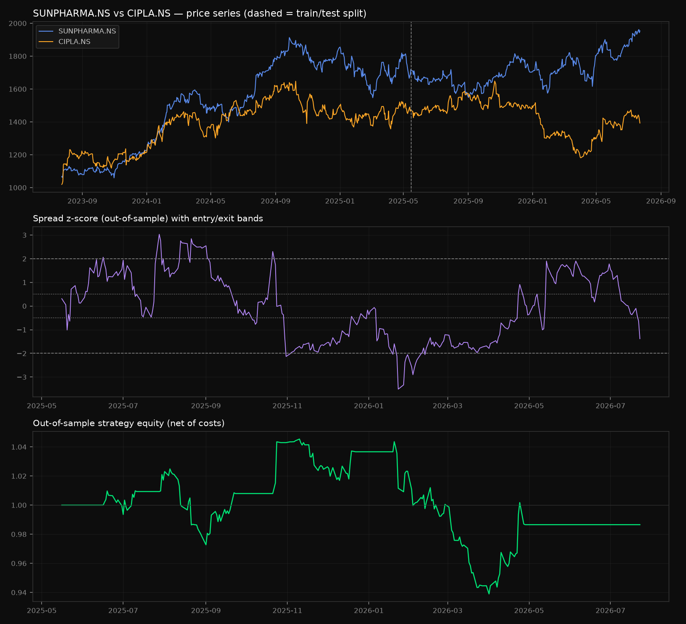

---

_Generated 2026-07-23 · pairs mean-reversion scanner · out-of-sample backtest · multiple-testing-aware · not investment advice._
